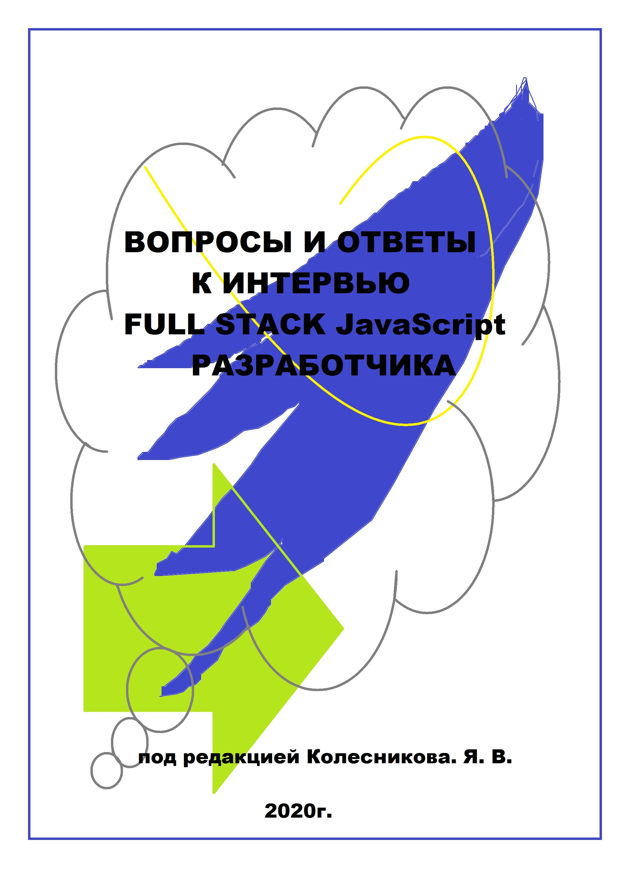
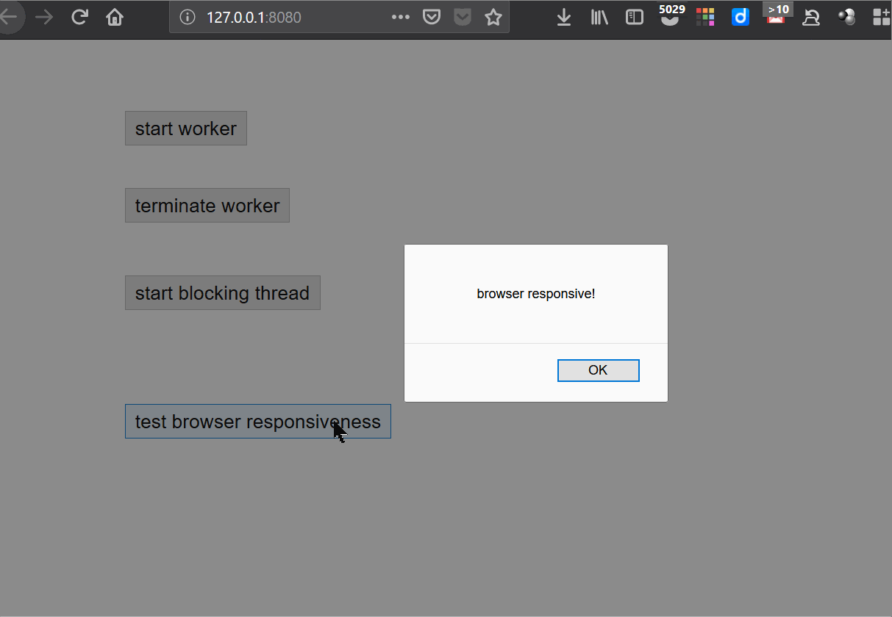
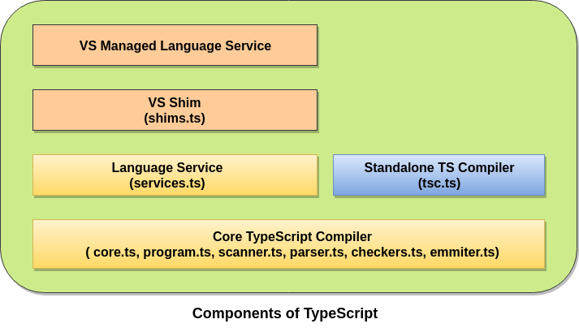
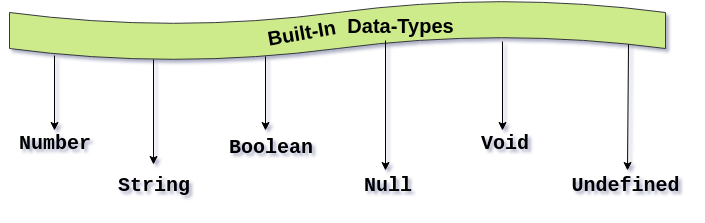

# Общие вопросы о веб-разработке


## 1. Используете вы `Perfect Pixel` или что-то аналогичное?

`Pixel Perfect` верстка — это особая техника создания структуры `html`-кода, которая позволяет сверстанному `html`-шаблону максимально точно совпадать с оригинальным PSD-макетом пиксель в пиксель. При наложении `html`-шаблона на макет PSD должно произойти полное совпадение графических элементов, изображений и текста.

Следует уточнить про допуски при верстке, `5px - 10px`

---

## 2. Можете ли пояснить разницу между `progressive enhancement` и `graceful degradation`?

`graceful degradation` будет пониматься как отказоустойчивость клиентских веб-интерфейсов. Постепенная деградация может выражаться в возможности работы при отключённом JavaScript, в достаточно аккуратном отображении интерфейса в браузере, не поддерживающем новые свойства CSS3, в адекватном отображении сайта при отключенных изображениях. В каждом из этих случаев работа пользователя с интерфейсом будет в принципе возможна, хотя и не так удобна.

Что же такое `progressive enhancement`? Чаще всего этот термин переводят, как прогрессивное улучшение. Прогрессивное улучшение предполагает, что веб-интерфейсы должны создаваться поэтапно, циклически, от простого к сложному. На каждом из этапов должен получаться законченный веб-интерфейс, который будет лучше, красивее и удобнее предыдущего. Можно сказать, что сейчас таких этапов четыре

- «Старый-добрый-HTML»
- «CSS»
- «CSS3»
- «JavaScript»

Подробнее - https://htmlacademy.ru/blog/useful/html/progressive-enhancement

---

## 3. Что такое прогрессивный `JPEG`?

Оптимизированные для веба фото — это `jpeg`, а `jpeg` делится на два типа: базовый последовательный (`baseline`) и прогрессивный (`progressive`). Последовательный `jpeg` — это один скан изображения сверху вниз в полном разрешении, а прогрессивный `jpeg` — это серия сканов улучшающегося качества. Так они и рендерятся — последовательный `jpeg` отрисовывается сверху вниз («тик, тик, тик, …»), а прогрессивный быстро размечает свою территорию и затем совершенствуется (по крайней мере так задумано).

Подробнее - https://habr.com/ru/post/165645/

---

## 4. Что такое `feature detection` (определение возможностей браузера)?

`Feature detection` определяет, поддерживает ли браузер тот или иной блок кода и запускает различный код в зависимости от того, поддерживает или нет, так чтобы браузер всегда мог показать рабочий код, вместо репортов об ошибках.

### 2 способа определения в js:

1. распарсить юзер-агент, определить версию браузера и писать в коде свитчи по версии браузера
2. Проверить наличие свойства или метода в `window`(`dom`, `bom`, `javascript`):

```js
if ("geolocation" in navigator) {
  navigator.geolocation.getCurrentPosition(function (position) {
    // show the location on a map, perhaps using the Google Maps API
  });
} else {
  // Give the user a choice of static maps instead perhaps
}
```

### 1 способ в css:

- @supports

Подробней:

- https://developer.mozilla.org/de/Learn/Tools_and_testing/Cross_browser_testing/Feature_detection
- https://habrahabr.ru/post/336466/

---

## 5. Как проверить что куки включенны?

```js
if (!navigator.cookieEnabled) {
  alert("Включите cookie для комфортной работы с этим сайтом");
}
```

---

## 6. Объясните, что означает "Семантическая разметка"

Семантическая вёрстка, или семантический HTML-код, — это подход к созданию веб-страниц на языке HTML, основанный на использовании HTML-тегов в соответствии с их семантикой (предназначением), а также предполагающий логичную и последовательную иерархию страницы. Он противопоставляется подходу, при котором написание HTML-кода определяется внешним видом веб-страницы. Для оформления веб-страниц, написанных в соответствии с семантикой, используются каскадные таблицы стилей (CSS). Стандарт HTML с самого начала включал в себя ряд семантических тегов, но большую популярность семантическая вёрстка получила после начала работ над HTML5.

Подробнее: https://ru.wikipedia.org/wiki/Семантическая_вёрстка

---

## 7. Как можно оптимизировать загрузку внешних ресурсов на странице?

1. Уменьшите количество HTTP-запросов
2. Используйте поддомены для параллельного скачивания
3. Используйте кэш браузера
4. Используйте CDN для загрузки популярных JavaScript библиотек
5. Используйте Gzip- сжатие

Подробней по каждому пункту: https://habrahabr.ru/post/137239/

---

## 8.Каково преимущество в подгрузке внешних ресурсов с нескольких доменов?

Cогласно спецификации `HTTP/1.1` на браузеры накладываются ограничения на количество одновременно загружаемых компонентов сайта, а именно не более 2-х компонентов с одного хоста. Поэтому если на Вашем сайте много графики, то ее лучше вынести на отдельный поддомен или поддомены. Для Вас это будет один и тот же сервер, а для браузера – разные. Чем больше поддоменов Вы создадите, тем больше файлов браузер сможет одновременно загрузить и тем быстрее загрузится вся страница сайта. Вам остается лишь изменить адрес картинок на новый. Очень простой, но действенный способ.

---

## 9. Назовите способы уменьшения времени загрузки страницы (воспринимаемого или реального)

1. Помещайте CSS файлы в начале страницы
2. Помещайте javascript в конец страницы
3. Минимизируйте css и javascript
4. Оптимизируйте ваши изображения
5. Не масштабируйте изображения

Подробней по каждому пункту: https://habrahabr.ru/post/137239/

---

## 10. Что такое `FOUC` (`Flash Of Unstyled Content`)? Как его избежать?

`Flash of Unstyled Content` (`FOUC`) – это кратковременное появление неоформленных HTML-элементов в некоторых версиях браузеров – сразу же после создания визуальных элементов и до полного применения стилей CSS.

- `css {display: block}` на компонент
- В обратных кавычках \` \` инлайнится код, необходимый для показа минимум `600px` высоты страницы без загрузки дополнительных стилей.

---

## 11.Что такое критический путь рендеринга веб-страниц?

Критический путь рендеринга – это набор минимально необходимых для начала отрисовки страницы действий, ресурсов и вычислений.

Критический путь можно измерять в количестве критических ресурсов, минимальном времени загрузки (измеряется в RTT) и объеме критических ресурсов (в байтах).

Для иллюстрации возьмем простейший пример: HTML страницу размером 1 кб без внешних ресурсов. Критический путь будет: 1 ресурс (HTML-документ), 1 RTT (минимально), 1 кб трафика. Однако, таких простых страниц в природе почти не встретить, поэтому покажем, как можно определять критический путь на реальных веб-страницах.

Подробней:

- https://habrahabr.ru/post/262239/

---

## 12. Что такое `WebSQL`?

`WebSQL DB` — это API для доступа к полноценному SQL-хранилищу данных, основанному на `SQLite`. Впрочем, последнее обстоятельство — скорее, особенность реализации и стандартом не оговаривается, хотя диалект `SQL` используется именно от `SQLite`.

Подробней:

- (en) https://developer.mozilla.org/en-US/docs/Mozilla/Tech/XPCOM/Storage
- https://habrahabr.ru/post/84654/
- (Раздел: За пределами пары ключ/значение: конкурентное видение) http://htmlbook.ru/html5/storage

---

## 13. Является ли `WebSQL` частью спецификации HTML 5?

Нет. Многие относят его к HTML 5, но WebSQL не является частью спецификации HTML 5. Спецификация основана на `SQLite`.

Поддержка браузерами: https://caniuse.com/#search=websql

---

## 14. Является ли, `Drag and drop` частью спецификации? Какие drag-события Вам известны?

Да, это часть спецификации

**dragstart, dragenter, dragover, dragleave, drag, drop, dragend**

Подробней: https://developer.mozilla.org/ru/docs/Web/Guide/HTML/Drag_and_drop#events

---

## 15. Является ли `Web workers` частью спецификации HTML 5?

Да. `Worker` - это объект, созданный при помощи конструктора (например, `Worker()`), который запускает JavaScript файл по имени — этот файл содержит код, который будет выполнен в потоке Worker'а; объекты Workers запускаются в другом глобальном контексте, который отличается от текущего `window`. Таким образом, использование переменной `window` для получения текущего глобального контекста (вместо `self`) внутри `Worker` вернет ошибку.

- https://developer.mozilla.org/ru/docs/DOM/Using_web_workers
- https://html.spec.whatwg.org/multipage/#toc-workers

---

## 16. Является ли `service workers` частью спецификации HTML 5?

`Service worker` запускается в контексте worker'ов, поэтому он не имеет доступа к DOM и работает в потоке отдельном от основного потока JavaScript, управляющего вашим приложением, а следовательно — не блокирует его. Он призван быть полностью асинхронным; как следствие, синхронные API, такие как `XHR` и `localStorage`, в `service worker`'е использовать нельзя.

Подробней:

- https://developer.mozilla.org/ru/docs/Web/API/Service_Worker_API
- https://html.spec.whatwg.org/multipage/#toc-workers

---

## 17. Что такое гиперссылка?

Часть гипертекстового документа, ссылающаяся на другой элемент (команда, текст, заголовок, примечание, изображение) в самом документе, на другой объект (файл, каталог, приложение), расположенный на локальном диске или в компьютерной сети, либо на элементы этого объекта.

Подробней: https://ru.wikipedia.org/wiki/Гиперссылка

---

## 18. Что такое `GraphQL`?

В двух словах, `GraphQL` это синтаксис, который описывает как запрашивать данные, и, в основном, используется клиентом для загрузки данных с сервера. `GraphQL` имеет три основные характеристики:

Позволяет клиенту точно указать, какие данные ему нужны.
Облегчает агрегацию данных из нескольких источников.
Использует систему типов для описания данных.

Подробней:

- https://habrahabr.ru/post/326986/

---

## 19. Что такое `HTTP`?

Протокол передачи гипертекста (`Hypertext Transfer Protocol - HTTP`) это прикладной протокол для передачи гипертекстовых документов, таких как HTML. Он создан для связи между веб-браузерами и веб-серверами, хотя в принципе HTTP может использоваться и для других целей. Протокол следует классической клиент-серверной модели, когда клиент открывает соединение, создаёт запрос, а затем ждет ответа.

HTTP - это `stateless`-протокол, то есть сервер не сохраняет никаких данных (состояние) между двумя парами "запрос-ответ". Несмотря на то, что HTTP основан на `TCP/IP`, он так же может использовать любой транспорт, который не теряет молча сообщения (то есть он обязан знать дошло ли сообщение до адресата).

Подробней:

- https://developer.mozilla.org/ru/docs/Web/HTTP
- https://ru.wikipedia.org/wiki/HTTP
- https://habrahabr.ru/post/215117/

---

## 20. Если через консоль, примеру curl'oм, запросить сайт, что мы увидим?

Стандартный ответ страницы, как для браузера

Еще желательно знать, как организовывается докачка файлов, после восстановления соединения.

Подробней:

- https://ru.wikipedia.org/wiki/HTTP

---

## 21. Перечислите хотя бы 4 метода `HTTP`:

`GET`, `POST`, `PUT`, `DELETE`

Подробней:

- https://developer.mozilla.org/ru/docs/Web/HTTP
- https://ru.wikipedia.org/wiki/HTTP

---

## 22. Назовите 5 классов ошибок при HTTP запросе:

1. Информирование о процессе передачи.

2. Информирование о случаях успешного принятия и обработки запроса клиента. В зависимости от статуса, сервер может ещё передать заголовки и тело сообщения.

3. Сообщает клиенту, что для успешного выполнения операции необходимо сделать другой запрос (как правило по другому URI). Из данного класса пять кодов `301`, `302`, `303`, `305` и `307` относятся непосредственно к перенаправлениям (редирект). Адрес, по которому клиенту следует произвести запрос, сервер указывает в заголовке `Location`. При этом допускается использование фрагментов в целевом URI.

4. Указание ошибок со стороны клиента. При использовании всех методов, кроме `HEAD`, сервер должен вернуть в теле сообщения гипертекстовое пояснение для пользователя.

5. Информирование о случаях неудачного выполнения операции по вине сервера. Для всех ситуаций, кроме использования метода `HEAD`, сервер должен включать в тело сообщения объяснение, которое клиент отобразит пользователю.

Подробней:

- https://developer.mozilla.org/ru/docs/Web/HTTP
- https://ru.wikipedia.org/wiki/HTTP

---

## 23. В чем отличия `HTTP/1` от `HTTP/2`?

Протокол `HTTP/2` является бинарным. По сравнению с предыдущим стандартом изменены способы разбиения данных на фрагменты и транспортирования их между сервером и клиентом.

В `HTTP/2` сервер имеет право послать то содержимое, которое ещё не было запрошено клиентом. Это позволит серверу сразу выслать дополнительные файлы, которые потребуются браузеру для отображения страниц, без необходимости анализа браузером основной страницы и запрашивания необходимых дополнений.

Также часть улучшений получена за счёт мультиплексирования запросов и ответов для преодоления проблемы «`head-of-line blocking`» протоколов `HTTP 1`; сжатия передаваемых заголовков и введения явной приоритезации запросов.

Так же поддерживает приоритетность загрузки

Подробней:

- https://ru.wikipedia.org/wiki/HTTP/2

---

## 24. Где именно хранятся данные `session` и как сервер понимает как сопоставить конкретные данные `session` конкретному `http` запросу?

Сессии могут храниться на клиенте (`signed cookie session`). При этом используется подпись куки с помощью `HMAC`, чтобы данные сессии не могли быть свободно изменены клиентом. Но обычно сессии хранятся на сервере. Тут выбор огромный: от баз данных и key-value хранилищ (Redis, например) до простых файлов. При этом, клиенту посылается кука `ID` сессии (так сервер идентифицирует юзера), которую злоумышленник может стащить.

Таким кукам, дабы защитить юзеров от `XSS`, ставится флаг `HttpOnly`, который советует браузеру не давать эту куку скриптам вроде JS. В этом случае, стащить куку получится только завладев браузером, файловой системой юзера или через багу браузера.

Подробней:

- https://developer.mozilla.org/ru/docs/Web/HTTP/Куки

---

## 25. Что такое `HTTPS`?

`HTTPS` (`HyperText Transfer Protocol Secure`) — расширение протокола HTTP для поддержки шифрования в целях повышения безопасности. Данные в протоколе `HTTPS` передаются поверх криптографических протоколов `SSL` или `TLS`. В отличие от `HTTP` с `TCP`-портом 80, для `HTTPS` по умолчанию используется `TCP-порт 443`

Подробней:

- https://yandex.ru/blog/company/77455
- https://ru.wikipedia.org/wiki/HTTPS

---

## 26. Что такое `REST`?

`REST` (`Representational State Transfer` — «передача состояния представления») — архитектурный стиль взаимодействия компонентов распределённого приложения в сети. `REST` представляет собой согласованный набор ограничений, учитываемых при проектировании распределённой гипермедиа-системы. В определённых случаях (интернет-магазины, поисковые системы, прочие системы, основанные на данных) это приводит к повышению производительности и упрощению архитектуры. В широком смысле компоненты в `REST` взаимодействуют наподобие взаимодействия клиентов и серверов во Всемирной паутине. `REST` является альтернативой `RPC`.

Подробней:

- https://ru.wikipedia.org/wiki/REST
- https://habrahabr.ru/post/38730/

---

## 27. Что такое протокол-`SOAP`?

`SOAP` (`Simple Object Access Protocol` — простой протокол доступа к объектам) — протокол обмена структурированными сообщениями в распределённой вычислительной среде. Первоначально `SOAP` предназначался в основном для реализации удалённого вызова процедур (`RPC`). Сейчас протокол используется для обмена произвольными сообщениями в формате `XML`, а не только для вызова процедур. Официальная спецификация последней версии 1.2 протокола никак не расшифровывает название `SOAP`. `SOAP` является расширением протокола `XML-RPC`.

Подробней:
https://ru.wikipedia.org/wiki/SOAP

---

## 28. Что такое нотация О-большое?

В информатике временна́я сложность алгоритма определяет время работы, используемое алгоритмом, как функции от длины строки, представляющей входные данные. Временная сложность алгоритма обычно выражается с использованием нотации «O» большое, которая исключает коэффициенты и члены меньшего порядка. Если сложность выражена таким способом, говорят об асимптотическом описании временной сложности, т.е. при стремлении размера входа к бесконечности. Например, если время, которое нужно алгоритму для выполнения работы, для всех входов длины n не превосходит `5n3 + 3n` для некоторого `n` (большего некоторого `n0`), асимптотическая временная сложность равна `O (n3)`.

Подробней:

- https://ru.wikipedia.org/wiki/Временная_сложность_алгоритма
- https://habrahabr.ru/post/195482/
- https://habrahabr.ru/post/188010/

---

## 29. Что такое `HMAC`?

`HMAC` (сокращение от англ. `hash-based message authentication code`, код аутентификации (проверки подлинности) сообщений, использующий хеш-функции) — в информатике (криптографии), один из механизмов проверки целостности информации, позволяющий гарантировать то, что данные, передаваемые или хранящиеся в ненадёжной среде, не были изменены посторонними лицами (см. человек посередине).

Механизм HMAC использует MAC, описан в `RFC 2104`, в стандартах организаций `ANSI`, `IETF`, `ISO` и `NIST`.

`MAC` — стандарт, описывающий способ обмена данными и способ проверки целостности передаваемых данных с использованием секретного ключа. Два клиента, использующие `HMAC`, как правило, разделяют общий секретный ключ.

`HMAC` — надстройка над MAC; механизм обмена данными с использованием секретного ключа (как в MAC) и хеш-функций. В зависимости от используемой хеш-функции выделяют `HMAC-MD5`, `HMAC-SHA1`, `HMAC-RIPEMD128`, `HMAC-RIPEMD160` и т. п.

Подробней:

- https://ru.wikipedia.org/wiki/HMAC

---

## 30. Что такое `CORS`?

`CORS` (`Cross-Origin Resource Sharing`,"Совместное использование ресурсов между разными источниками") - это система, состоящая из отправки `HTTP` заголовков, которые определяют: заблокировать или выполнить запрос к ограниченному ресурсу на веб-странице из другого домена, отличного от домена происхождения запрашиваемого ресурса.

`The same-origin security policy` ("правило ограничения домена") по умолчанию запрещает междоменные запросы. `CORS` предоставляет веб-серверам возможность контролировать междоменные запросы и позволяет производить безопасный обмен данными между разными доменами.

Подробней:

- https://developer.mozilla.org/ru/docs/Словарь/CORS
- https://habrahabr.ru/company/pentestit/blog/337146/
- https://developer.mozilla.org/en-US/docs/Web/Security/Same-origin_policy

---

## 31. Что такое архитектурный-паттерн MVC?

`Model-View-Controller` (MVC, «Модель-Представление-Контроллер», «Модель-Вид-Контроллер») — схема разделения данных приложения, пользовательского интерфейса и управляющей логики на три отдельных компонента: модель, представление и контроллер — таким образом, что модификация каждого компонента может осуществляться независимо

- **Модель** (Model) предоставляет данные и реагирует на команды контроллера, изменяя свое состояние.

- **Представление** (View) отвечает за отображение данных модели пользователю, реагируя на изменения модель.

- **Контроллер** (Controller) интерпретирует действия пользователя, оповещая модель о необходимости изменений.

Есть `passive model` & `active model`. Но из-за веба, этот паттер, претерпел изменения, что вносит смуту, и вряд ли получится найти 3 программиста, у которых совпадет понимание этого паттерна. Главное понимать общие черты, чтобы суметь отличить от `MVVM(bindings)` ;)

**Признаки контроллера**:

- Контроллер определяет, какие представление должно быть отображено в данный момент;
- События представления могут повлиять только на контроллер.контроллер может повлиять на модель и определить другое представление.
- Возможно несколько представлений только для одного контроллера;

Подробней:

- https://codepen.io/fikorte/pen/Rjgmqr?limit=all&page=2&q=mvc+example
- https://codepen.io/broneks/pen/RWRLRG?editors=1010
- https://codepen.io/kyliepace/pen/aNepxV?editors=1010
- https://codepen.io/bobodeity/pen/xPbwzX
- https://habrahabr.ru/company/devexpress/blog/305812/
- https://codepen.io/MrCheater/pen/GqQpYY?editors=1010

---

## 32. Что такое архитектурный-паттерн `MVP`?

Данный подход позволяет создавать абстракцию представления. Для этого необходимо выделить интерфейс представления с определенным набором свойств и методов. Презентер, в свою очередь, получает ссылку на реализацию интерфейса, подписывается на события представления и по запросу изменяет модель.

**Признаки презентера**:

- Двухсторонняя коммуникация с представлением;
- Представление взаимодействует напрямую с презентером, путем вызова соответствующих функций или событий экземпляра презентера;
- Презентер взаимодействует с View путем использования специального интерфейса, реализованного представлением;
- Один экземпляр презентера связан с одним отображением.

Подробеней:

- https://habrahabr.ru/post/215605/
- https://stackoverflow.com/questions/2056/what-are-mvp-and-mvc-and-what-is-the-difference
- https://habrahabr.ru/post/171925/
- https://habrahabr.ru/company/mobileup/blog/313538/

---

## 33. Что такое архитектурный-паттерн `MVVM`?

Данный подход позволяет связывать элементы представления со свойствами и событиями View-модели. Можно утверждать, что каждый слой этого паттерна не знает о существовании другого слоя.

**Признаки презентера**:

- Двухсторонняя коммуникация с представлением;
- View-модель — это абстракция представления. Обычно означает, что свойства представления совпадают со свойствами View-модели / модели
- View-модель не имеет ссылки на интерфейс представления (IView). Изменение состояния View-модели автоматически изменяет представление и наоборот, поскольку используется механизм связывания данных (Bindings)
- Один экземпляр View-модели связан с одним отображением.

Подробней:

- https://habrahabr.ru/post/215605/

- https://ru.wikipedia.org/wiki/Model-View-ViewModel

- https://habrahabr.ru/company/mobileup/blog/313538/

---

## 34. Что такое `DOM`?

Объектная Модель Документа (`DOM`) является программным интерфейсом для `HTML`, `XML` и `SVG` документов. Это обеспечивает структурированное представление документа (дерева), и определяет способ, по которому структура может быть доступна для программы, для изменения структуры документа, его стиля и содержания. `DOM` обеспечивает представление документа в виде структурированной группы узлов и объектов, которые имеют свойства и методы. По сути, она связывает веб -страницы со скриптами или языками программирования.

DOM (`Document Object Model` — «объектная модель документа») — это независящий от платформы и языка программный интерфейс, позволяющий программам и скриптам получить доступ к содержимому `HTML-`, `XHTML-` и `XML`-документов, а также изменять содержимое, структуру и оформление таких документов.

Подробней:

- https://developer.mozilla.org/ru/docs/DOM/DOM_Reference
- https://ru.wikipedia.org/wiki/Document_Object_Model

---

## 35. Что такое `Virtual DOM`? Как он работает?

`Virtual DOM`- это абстракция HTML DOM, которая выборочно отображает поддеревья узлов на основе изменений состояния. Он обеспечивает минимальное количество манипуляций с `DOM`, чтобы поддерживать ваши компоненты в актуальном состоянии.

Подробней:

- https://medium.com/treenodes/intro-to-react-2-41b84dd74b5d
- https://habrahabr.ru/post/256965/
- https://medium.com/devschacht/how-to-write-your-own-virtual-dom-c166b56cf01f

---

## 36. Что такое `Shadow DOM`?

Спецификация `Shadow DOM` является отдельным стандартом. Частично он уже используется для обычных DOM-элементов, но также применяется для создания веб-компонентов.

`Shadow DOM` – это внутренний DOM элемента, который существует отдельно от внешнего документа. В нём могут быть свои ID, свои стили и так далее. Причём снаружи его, без применения специальных техник, не видно, поэтому не возникает конфликтов.

Подробней:

- https://learn.javascript.ru/shadow-dom
- https://habrahabr.ru/post/180377/
- https://habrahabr.ru/post/259187/
- https://developer.mozilla.org/en-US/docs/Web/Web_Components/Using_shadow_DOM

---

## 37.Чем отличаются между собой `Shadow DOM` и `Virtual DOM` и `Regular Dom`?

`Virtual DOM` – полное представление реального DOM. Его самой важной особенностью является группировка изменений и выполнение одиночного повторного рендеринга вместо множества мелких. Если коротко, то можно сказать, что `Virtual DOM` решает проблемы, связанные с производительностью (Не буду вдаваться в подробности принципа работы `Virtual DOM`. В рамках этой статьи достаточно знать, зачем он нужен.)

`Shadow DOM`, как настоящий интроверт, надежно защищает себя от влияния окружающих элементов и не заинтересован и не интересуется изменениями снаружи. Спросите себя, какую главную UI-проблему решают фреймворки типа React и VueJS?

**Инкапсуляция**

`CSS` – сложная штука. Все становится еще сложнее, если вы соединяете стили, пытаясь повторно их использовать в различных комбинациях. Это неизбежно приводит к регрессивным ошибкам интерфейса, сложному обслуживанию и плохой масштабируемости. И все же, я считаю, что основная проблема это не CSS, а то, как мы его используем.

`Shadow DOM` – инструмент, помогающий обойти инкапсуляцию DOM на нативном уровне. Суть не просто в CSS, а в элементах.

В отличие от обычного DOM Shadow DOM идет маленькими кусочками. То есть это не полное представление всего DOM. Представьте Shadow DOM в виде лего, формирующего реальный DOM, где каждый кирпичик представляет собой отдельный DOM.

`Shadow DOM` – это инкапсуляция.

Подробней:

- https://develoger.com/shadow-dom-virtual-dom-889bf78ce701

---

## 38. Что такое ООП и на каких 4х постулатах оно стоит?

1. абстрагирование для выделения в моделируемом предмете важного для решения конкретной задачи по предмету, в конечном счете — контекстное понимание предмета, формализуемое в виде класса;

2. инкапсуляция для быстрой и безопасной организации собственно иерархической управляемости: чтобы было достаточно простой команды «что делать», без одновременного уточнения как именно делать, так как это уже другой уровень управления;

3. наследование для быстрой и безопасной организации родственных понятий: чтобы было достаточно на каждом иерархическом шаге учитывать только изменения, не дублируя все остальное, учтенное на предыдущих шагах;

4. полиморфизм для определения точки, в которой единое управление лучше распараллелить или наоборот — собрать воедино.

Подробней:

- https://ru.wikipedia.org/wiki/Объектно-ориентированное_программирование

---

## 39.Что такое инкапсуляция?

Инкапсуляция - это механизм, который объединяет данные и методы, манипулирующие этими данными, и защищает и то и другое от внешнего вмешательства или неправильного использования. Когда методы и данные объединяются таким способом, создается объект.

Подробней:

- https://ru.wikipedia.org/wiki/Инкапсуляция_(программирование)
- https://habrahabr.ru/post/87205/

---

## 40. Какие классификации паттернов проектирования Вы знаете?

**Порождающие паттерны** беспокоятся о гибком создании объектов без внесения в программу лишних зависимостей.

**Структурные паттерны** показывают различные способы построения связей между объектами.

**Поведенческие паттерны** заботятся об эффективной коммуникации между объектами.

Подробней:

- https://refactoring.guru/ru/design-patterns/classification
- https://ru.wikipedia.org/wiki/Шаблон_проектирования

---

## 41. Назовите паттерны, которые относятся к порождающим

- **Одиночка(Singleton)**:
  Одиночка — это порождающий паттерн проектирования, который гарантирует, что у класса есть только один экземпляр, и предоставляет к нему глобальную точку доступа.

- https://ru.wikipedia.org/wiki/Одиночка_(шаблон_проектирования)
- https://refactoring.guru/ru/design-patterns/singleton
- https://github.com/torokmark/design_patterns_in_typescript/tree/master/singleton

- **Абстрактная фабрика(Abstract factory)**
  Абстрактная фабрика — это порождающий паттерн проектирования, который позволяет создавать семейства связанных объектов, не привязываясь к конкретным классам создаваемых объектов.

- https://ru.wikipedia.org/wiki/Абстрактная_фабрика_(шаблон_проектирования)
- https://refactoring.guru/ru/design-patterns/abstract-factory
- https://github.com/torokmark/design_patterns_in_typescript/tree/master/abstract_factory

- **Фабричный метод(Factory method)**
  Фабричный метод — это порождающий паттерн проектирования, который определяет общий интерфейс для создания объектов в суперклассе, позволяя подклассам изменять тип создаваемых объектов.

- https://ru.wikipedia.org/wiki/Фабричный_метод_(шаблон_проектирования)
- https://refactoring.guru/ru/design-patterns/factory-method
- https://github.com/torokmark/design_patterns_in_typescript/tree/master/factory_method

- **Строитель(Builder)**
  Строитель — это порождающий паттерн проектирования, который позволяет создавать сложные объекты пошагово. Строитель даёт возможность использовать один и тот же код строительства для получения разных представлений объектов.

- https://ru.wikipedia.org/wiki/Строитель_(шаблон_проектирования)
- https://refactoring.guru/ru/design-patterns/builder
- https://github.com/torokmark/design_patterns_in_typescript/tree/master/builder

- **Прототип(Prototype)**
  Прототип — это порождающий паттерн проектирования, который позволяет копировать объекты, не вдаваясь в подробности их реализации.

- https://ru.wikipedia.org/wiki/Прототип_(шаблон_проектирования)
- https://refactoring.guru/ru/design-patterns/prototype
- https://github.com/torokmark/design_patterns_in_typescript/tree/master/prototype

- **Менее известные**: \* **Отложенная инициализация(Lazy initialization)**
  Объект, инициализируемый во время первого обращения к нему.

Подробнее:

- https://ru.wikipedia.org/wiki/Отложенная_инициализация

  - **Пул одиночек(Multiton)**
    Гарантирует, что класс имеет поименованные экземпляры объекта и обеспечивает глобальную точку доступа к ним.

    По сути данный паттерн – это реестр одиночек, каждый из которых имеет имя, по которому к нему можно получить доступ.

    Пул одиночек ( Multiton ) — Гарантирует, что класс имеет поименованные экземпляры объекта и обеспечивает глобальную точку доступа к ним.

```js
/*  
	Use, reuse but don't abuse!
	Author: Razvan Caliman (razvan.caliman@gmail.com)
	
	This is an example of a "Multiton" pattern;
	Create a fixed number of instances of a class.
	Use "lazy instantiation" to create objects only if needed.
	If the maximum number of instances has been reached, return a random one from the ones created.
*/
var Multiton = (function () {
  var inst = [],
    maxInst = 4;

  var Multiton = function () {
    this.inst = inst;
  };

  return function () {
    var p, rand;

    //Still room for instances, create
    if (inst.length < maxInst) {
      p = new Multiton();
      inst.push(p);
    }
    //Enough instances, return a random one
    else {
      rand = Math.floor(Math.random() * 4);
      p = inst[rand];
      console.log("Max instances reached, you get instance: " + rand, p);
    }

    return p;
  };
})();

var p1 = new Multiton();
var p2 = new Multiton();
var p3 = new Multiton();
var p4 = new Multiton();
var p5 = new Multiton();

console.log(p1, p2, p3, p4, p5);
```

Подробнее:

- https://urandev.com/ru/blog/view/38/%D0%A8%D0%B0%D0%B1%D0%BB%D0%BE%D0%BD+%D0%BF%D1%80%D0%BE%D0%B5%D0%BA%D1%82%D0%B8%D1%80%D0%BE%D0%B2%D0%B0%D0%BD%D0%B8%D1%8F+MVC
- (en) https://en.wikipedia.org/wiki/Multiton_pattern

---

## 42. Назовите паттерны, которые относятся к структурным

- **Адаптер(Adapter / Wrapper)**
  Адаптер — это структурный паттерн проектирования, который позволяет объектам с несовместимыми интерфейсами работать вместе.

- https://ru.wikipedia.org/wiki/Адаптер_(шаблон_проектирования)
- https://refactoring.guru/ru/design-patterns/adapter
- https://github.com/torokmark/design_patterns_in_typescript/tree/master/adapter

- **Мост(Bridge)**
  Мост — это структурный паттерн проектирования, который разделяет один или несколько классов на две отдельные иерархии — абстракцию и реализацию, позволяя изменять их независимо друг от друга.

- https://ru.wikipedia.org/wiki/Мост_(шаблон_проектирования)
- https://refactoring.guru/ru/design-patterns/bridge
- https://github.com/torokmark/design_patterns_in_typescript/tree/master/bridge

- **Компоновщик(Composite)**
  Компоновщик — это структурный паттерн проектирования, который позволяет сгруппировать объекты в древовидную структуру, а затем работать с ними так, если бы это был единичный объект.

- https://ru.wikipedia.org/wiki/Composite
- https://refactoring.guru/ru/design-patterns/composite
- https://github.com/torokmark/design_patterns_in_typescript/tree/master/composite

- **Декоратор(Decorator)**
  Декоратор — это структурный паттерн проектирования, который позволяет динамически добавлять объектам новую функциональность, оборачивая их в полезные «обёртки».

- https://ru.wikipedia.org/wiki/Декоратор_(шаблон_проектирования)
- https://refactoring.guru/ru/design-patterns/decorator
- https://github.com/torokmark/design_patterns_in_typescript/tree/master/decorator

- **Фасад(Facade)**
  Фасад — это структурный паттерн проектирования, который предоставляет простой интерфейс к сложной системе классов, библиотеке или фреймворку.

- https://ru.wikipedia.org/wiki/Фасад_(шаблон_проектирования)
- https://refactoring.guru/ru/design-patterns/facade
- https://github.com/torokmark/design_patterns_in_typescript/tree/master/facade

- **Приспособленец(Flyweight) или Легковес**
  Легковес — это структурный паттерн проектирования, который позволяет вместить бóльшее количество объектов в отведённую оперативной память за счёт экономного разделения общего состояния объектов между собой, вместо хранения одинаковых данных в каждом объекте.

- https://ru.wikipedia.org/wiki/Flyweight
- https://refactoring.guru/ru/design-patterns/flyweight
- https://github.com/torokmark/design_patterns_in_typescript/tree/master/flyweight

- **Заместитель(Proxy)**
  Заместитель — это структурный паттерн проектирования, который позволяет подставлять вместо реальных объектов специальные объекты-заменители. Эти объекты перехватывают вызовы к оригинальному объекту, позволяя сделать что-то до или после передачи вызова оригиналу.

- https://ru.wikipedia.org/wiki/Proxy_(шаблон_проектирования)
- https://refactoring.guru/ru/design-patterns/proxy
- https://github.com/torokmark/design_patterns_in_typescript/tree/master/proxy

- **Менее известные:** \* **Единая точка входа(Front controller)**
  Обеспечивает унифицированный интерфейс для интерфейсов в подсистеме. Front Controller определяет высокоуровневый интерфейс, упрощающий использование подсистемы.

- https://ru.wikipedia.org/wiki/Единая_точка_входа_(шаблон_проектирования)

---

## 43. Назовите паттерны, которые относятся к поведенческим

- **Цепочка обязанностей(Chain of responsibility)**
  Цепочка обязанностей — это поведенческий паттерн проектирования, который позволяет передавать запросы последовательно по цепочке обработчиков. Каждый последующий обработчик решает, может ли он обработать запрос сам и стоит ли передавать запрос дальше по цепи.

- https://ru.wikipedia.org/wiki/Chain_of_Responsibility
- https://refactoring.guru/ru/design-patterns/chain-of-responsibility
- https://github.com/torokmark/design_patterns_in_typescript/tree/master/chain_of_responsibility

- **Команда, Action, Transaction(Command)**
  Команда — это поведенческий паттерн проектирования, который превращает запросы в объекты, позволяя передавать их как аргументы при вызове методов, ставить запросы в очередь, логировать их, а также поддерживать отмену операций.

- https://ru.wikipedia.org/wiki/Команда_(шаблон_проектирования)
- https://refactoring.guru/ru/design-patterns/command
- https://github.com/torokmark/design_patterns_in_typescript/tree/master/command

- **Интерпретатор(Interpreter)**
  Решает часто встречающуюся, но подверженную изменениям, задачу.

- https://ru.wikipedia.org/wiki/Интерпретатор_(шаблон_проектирования)
- https://github.com/torokmark/design_patterns_in_typescript/tree/master/interpreter

- **Итератор, Cursor(Iterator)**
  Итератор — это поведенческий паттерн проектирования, который даёт возможность последовательно обходить элементы составных объектов, не раскрывая их внутреннего представления.

- https://ru.wikipedia.org/wiki/Итератор_(шаблон_проектирования)
- https://refactoring.guru/ru/design-patterns/iterator
- https://github.com/torokmark/design_patterns_in_typescript/tree/master/iterator

- **Посредник(Mediator)**
  Посредник — это поведенческий паттерн проектирования, который позволяет уменьшить связанность множества классов между собой, благодаря перемещению этих связей в один класс-посредник.

- https://ru.wikipedia.org/wiki/Mediator
- https://refactoring.guru/ru/design-patterns/mediator
- https://github.com/torokmark/design_patterns_in_typescript/tree/master/mediator

- **Хранитель(Memento)**
  Снимок — это поведенческий паттерн проектирования, который позволяет делать снимки состояния объектов, не раскрывая подробностей их реализации. Затем снимки можно использовать, чтобы восстановить прошлое состояние объектов.

- https://ru.wikipedia.org/wiki/Хранитель_(шаблон_проектирования)
- https://refactoring.guru/ru/design-patterns/memento
- https://github.com/torokmark/design_patterns_in_typescript/tree/master/memento

- **Наблюдатель(Observer)**
  Наблюдатель — это поведенческий паттерн проектирования, который создаёт механизм подписки, позволяющий одним объектам следить и реагировать на события, происходящие в других объектах.

- https://ru.wikipedia.org/wiki/Наблюдатель_(шаблон_проектирования)
- https://refactoring.guru/ru/design-patterns/observer
- https://github.com/torokmark/design_patterns_in_typescript/tree/master/observer
- https://ru.wikipedia.org/wiki/Издатель-подписчик_(шаблон_проектирования)

- **Состояние(State)**
  Состояние — это поведенческий паттерн проектирования, который позволяет объектам менять поведение в зависимости от своего состояния. Извне создаётся впечатление, что изменился класс объекта.

- https://ru.wikipedia.org/wiki/Состояние_(шаблон_проектирования)
- https://refactoring.guru/ru/design-patterns/state
- https://github.com/torokmark/design_patterns_in_typescript/tree/master/state

- **Стратегия(Strategy)**
  Стратегия — это поведенческий паттерн проектирования, который определяет семейство схожих алгоритмов и помещает каждый из них в собственный класс. После чего, алгоритмы можно взаимозаменять прямо во время исполнения программы.

- https://ru.wikipedia.org/wiki/Стратегия_(шаблон_проектирования)
- https://refactoring.guru/ru/design-patterns/strategy
- https://github.com/torokmark/design_patterns_in_typescript/tree/master/strategy

- **Шаблонный метод(Template method)**
  Шаблонный метод — это поведенческий паттерн проектирования, который определяет скелет алгоритма, перекладывая ответственность за некоторые его шаги на подклассы. Паттерн позволяет подклассам переопределять шаги алгоритма, не меняя его общей структуры.

- https://ru.wikipedia.org/wiki/Шаблонный_метод_(шаблон_проектирования)
- https://refactoring.guru/ru/design-patterns/template-method
- https://github.com/torokmark/design_patterns_in_typescript/tree/master/template_method

- **Посетитель(Visitor)**
  Посетитель — это поведенческий паттерн проектирования, который позволяет создавать новые операции, не меняя классы объектов, над которыми эти операции могут выполняться.

- https://ru.wikipedia.org/wiki/Посетитель_(шаблон_проектирования)
- https://refactoring.guru/ru/design-patterns/visitor
- https://github.com/torokmark/design_patterns_in_typescript/tree/master/visitor

---

## 44. Что такое функциональное программирование?

Функциона́льное программи́рование — раздел дискретной математики и парадигма программирования, в которой процесс вычисления трактуется как вычисление значений функций в математическом понимании последних (в отличие от функций как подпрограмм в процедурном программировании).

Противопоставляется парадигме императивного программирования, которая описывает процесс вычислений как последовательное изменение состояний (в значении, подобном таковому в теории автоматов). При необходимости, в функциональном программировании вся совокупность последовательных состояний вычислительного процесса представляется явным образом, например, как список.

Функциональное программирование предполагает обходиться вычислением результатов функций от исходных данных и результатов других функций, и не предполагает явного хранения состояния программы. Соответственно, не предполагает оно и изменяемость этого состояния (в отличие от императивного, где одной из базовых концепций является переменная, хранящая своё значение и позволяющая менять его по мере выполнения алгоритма).

Подробней:

- https://ru.wikipedia.org/wiki/Функциональное_программирование
- https://habrahabr.ru/post/142351/
- https://ru.stackoverflow.com/questions/417898/Что-такое-функциональное-программирование
- https://tproger.ru/translations/functional-programming-concepts/
- https://habrahabr.ru/post/337880/

---

## 45. В чём разница между императивным и декларативным программированием?

Также подумаем о различиях ООП и ФП с точки зрения разницы между «императивным» и «декларативным» программированием.

Это общие термины, которые описывают общие характеристики нескольких парадигм программирования. ФП – пример декларативного программирования, а ООП – пример императивного программирования.

В базовом смысле императивное программирование касается того, как делать. Эта парадигма объясняет шаги конкретным образом и характеризуется циклами `for` и `while`, операторами `if` и `switch` и так далее.

```js
const sumArray = (array) => {
  let result = 0;
  for (let i = 0; i < array.length; i++) {
    result += array[i];
  }
  return result;
};
```

Напротив, декларативное программирование сосредотачивается на том, что делать. При этом абстрагируется от описания, как делать, и опирается на выражения. Это часто приводит к получению более краткого кода, но при масштабировании его становится сложнее отлаживать из-за меньшей прозрачности.

Вот декларативный подход к функции `sumArray()`, написанной выше.

```js
const sumArray = (array) => {
  return array.reduce((x, y) => x + y);
};
```

---

## 46. Что такое прототип-ориентированное наследование?

Наконец, мы подошли к прототип-ориентированному наследованию. Стилей объектно-ориентированного программирования несколько, и JavaScript использует прототип-ориентированное наследование. Система организует повторяющееся поведение с использованием действующих объектов – «прототипов».

Даже если идея прототипов окажется новой, JavaScript-разработчик сталкивается с этой системой, когда использует встроенные методы. Например, функции для работы с массивами – `map`, `reduce`, `splice` и другие – методы объекта `Array.prototype`. На самом деле, каждый экземпляр массива (определённый с помощью квадратных скобок `[]` или, что реже, с использованием `new Array()`) наследуется от `Array.prototype`. Поэтому методы вроде `map`, `reduce` и `splice` доступны по умолчанию.

То же относится почти всем другим встроенным объектам, таким как строки и логические значения. Только у некоторых, таких как `Infinity`, `NaN`, `null` и `undefined`, отсутствуют свойства или методы.

В конце цепочки прототипов находим `Object.prototype`, и почти каждый объект в JavaScript – экземпляр `Object.prototype`. `Array.prototype` и `String.prototype`, например, оба наследуют свойства и методы от `Object.prototype`.

Чтобы добавить свойства и методы к объекту с использованием синтаксиса прототипа, инициируем объект как функцию и используем ключевое слово `prototype` для добавления свойств и методов:

```js
function Person() {}
Person.prototype.forename = "John";
Person.prototype.surname = "Smith";
```

---

## 47. Стоит ли переопределять или расширять поведение прототипов?

Изменять поведение встроенных прототипов можно так же, как и создавать и расширять собственные прототипы, но почти каждый JavaScript-разработчик и большинство компаний не рекомендуют этого.

Если хотим, чтобы объекты имели одинаковое поведение, создаём пользовательский объект (или определяем собственный «класс» или «подкласс»), который наследуется от встроенного прототипа без внесения изменений в сам прототип. Если работаем с другими разработчиками, у них отчётливые ожидания относительно поведения JavaScript по умолчанию, и редактирование этого поведения по умолчанию может легко привести к ошибкам.

Однако стоит отметить, что не все разделяют это сильное сопротивление расширению встроенных прототипов. В [статье 2005 года](https://brendaneich.com/2005/06/javascript-1-2-and-in-between/) создатель JavaScript Брендан Эйх намекнул, что прототипная система на самом деле создавалась отчасти для возможности расширения!

---

## 48. Чем отличается выражение функции (`Function Expression`) от объявления функции (`Function Declaration`)?

Объявление функции использует ключевое слово `function`, за которым следует имя функции. Напротив, выражение функции начинается с `var`, `let` или `const`, за которым следует имя функции и оператор присваивания `=`. Вот примеры:

```js
// Объявление функции
function sum(x, y) {
  return x + y;
}

// Выражение функции: ES5
var sum = function (x, y) {
  return x + y;
};
// Выражение функции: ES6+
const sum = (x, y) => {
  return x + y;
};
```

При использовании главное отличие состоит в том, что объявления функций «**поднимаются**» (`hoisted`), а выражение функций – нет. Это означает, что объявления функций перемещаются интерпретатором JavaScript в верхнюю часть области видимости. Поэтому используем объявление функции и вызываем эту функцию в любом месте кода. Напротив, выражение функции вызывается только в линейной последовательности: определяется перед вызовом.

Сегодня JavaScript-разработчик предпочитает выражения функций по двум причинам:

- В первую очередь, функциональные выражения помогают создать более предсказуемую, структурированную кодовую базу. Конечно, этого можно достичь также и с объявлениями за счёт простоты избавления от грязного кода.
- Второе, используется синтаксис ES6 для выражений функций. Как правило, получается более кратко, а `let` и `const` предоставляют больше контроля над тем, можно ли переназначить переменную или нет, как увидим в следующем вопросе.

---

## 49. Почему `Math.max()` меньше, чем `Math.min()`?

То, что `Math.max() > Math.min()` возвращает `false`, звучит неправильно, но на самом деле, в этом много смысла. Если аргументы не указаны, `Math.min()` возвращает бесконечность `infinity`, а `Math.max()` возвращает `-infinity`. Это часть спецификации для методов `max()` и `min()`, но за выбором стоит логика. Взгляните на код:

```js
Math.min(1);
// 1
Math.min(1, infinity);
// 1
Math.min(1, -infinity);
// -infinity
```

Если `-infinity` считался бы аргументом по умолчанию для `Math.min()`, то каждый результат равнялся бы `-infinity`, что бесполезно. Поскольку аргумент по умолчанию равен `infinity`, добавление другого аргумента вернёт это число – желаемое поведение.

---

## 50. Почему `0.1 + 0.2 === 0.3` возвращает `false`?

Вкратце, это связано с тем, насколько точно JavaScript хранит числа с плавающей запятой в двоичном виде. Если введём следующие уравнения в консоль Google Chrome, то получим:

```js
0.1 + 0.2;
// 0.30000000000000004
0.1 + 0.2 - 0.2;
// 0.10000000000000003
0.1 + 0.7;
// 0.7999999999999999
```

Это вряд ли вызовет проблемы при вычислении простых уравнений, где не нужна высокая степень точности. Но вызывает головную боль даже в несложных приложениях, когда выполняется проверка на равенство. Рассмотрим решения этого вопроса.

### Фиксированная точка

Например, если известна максимальная точность, которая понадобится (допустим, работаем с валютами), используем целочисленный тип для хранения значения. Таким образом, вместо `4,99` долларов, запишем `499`, и будем выполнять любые уравнения с этим значением. Затем отобразим результат конечному пользователю с использованием выражения вроде `result = (value / 100).toFixed(2)`, которое возвращает строку.

### Двоично-десятичный код

Если точность в самом деле важна, другой вариант – использовать формат двоично-десятичного кода (BCD), к которому обращаемся в JavaScript с помощью [библиотеки BCD](https://formats.kaitai.io/bcd/javascript.html). Каждое десятичное значение хранится отдельно в одном байте (8 бит). Это неэффективно, поскольку байт хранит 16 отдельных значений, а эта система использует только значения 0-9. Однако, если точность важна для приложения, то стоит пойти на компромисс.

---

---

В целом, надеюсь, что эти вопросы помогли вам лучше понять JavaScript – как основные функции, так и особенности – и что помогут вам лучше подготовиться к следующему собеседованию.

---

---

# Вопросы по HTML


## 1. Для чего нужен `doctype` и сколько разновидностей Вы можете назвать?

Элемент `DOCTYPE` предназначен для указания типа текущего документа — `DTD` (`document type definition`, описание типа документа). Это необходимо, чтобы браузер понимал, как следует интерпретировать текущую веб-страницу, поскольку HTML существует в нескольких версиях, кроме того, имеется `XHTML` (`EXtensible HyperText Markup Language`, расширенный язык разметки гипертекста), похожий на HTML, но различающийся с ним по синтаксису. Чтобы браузер «не путался» и понимал, согласно какому стандарту отображать веб-страницу и необходимо в первой строке кода задавать `DOCTYPE`.

- HTML 4.01
- HTML 5
- XHTML 1.0
- XHTML 1.1

1. Подробней про то, как указывать теги для определенного Doctype: http://htmlbook.ru/html/%21doctype
2. Хорошая полезная подробная статья: https://habrahabr.ru/post/71364/

---

## 2. Что такое режим совместимости (`Quirks Mode`) и стандартный режим (`Standards Mode`)

На сегодняшний день существует **три режима отображения**, которые используются движками разметки (_layout engines_) браузеров: режим совместимости (_quirks mode_), частично стандартный режим (_almost standards mode_) и стандартный режим (_full standards mode_).

В режиме совместимости (_quirks mode_), разметка эмулирует нестандартное поведение браузеров Navigator 4 и Internet Explorer 5. Этот режим необходим для поддержки сайтов, созданных до начала широкого применения веб стандартов.

В стандартном режиме (_full standards mode_) поведение браузера соответствует (будем надеяться) описанному в спецификациях HTML и CSS.

В частично стандартном режиме (_almost standards mode_) реализовано лишь незначительное количество так называемых "странностей" (quirks).

Если вы будете пользоваться неполным тегом `DOCTYPE`, устаревшим его видом, или вообще забудете про него, броузер перейдет в «загадочный» (_quirk_) режим и будет исходить из предположения, что вы писали код страницы с ошибками и вольно отступали от стандартов, т.е. так, как писали в конце 90-ых годов. В этом режиме броузер попытается разобрать вашу страницу по правилам обратной совместимости и выведет на экран, например, CSS так, как его вывел бы Internet Explorer 4-ой версии, а DOM будет работать так, как он работал именно в этом броузере (IE переключается в свой старый DOM, а Mozilla и Netscape 6 переключается вообще в бог знает что).

Подробней

- https://developer.mozilla.org/ru/docs/Web/HTML/Quirks_Mode_and_Standards_Mode
- https://habrahabr.ru/post/71364/

---

## 3. В чем разница между `HTML` и `XHTML`?

`XHTML` - это приложение `XML`, которое является довольно строгим языком с угловыми скобками.
`HTML` - это приложение `SGML`, которое является гораздо менее строгим языком с угловой скобкой.
(`XML` также является применением `SGML`.)
При написании кода `XHTML` придерживаются того же синтаксиса, который характерен для `HTML`. При этом разница между `HTML` и `XHTML` состоит в наборе некоторых обязательных правил.

Правила XHTML следующие.

- Все теги и их атрибуты должны быть набраны в нижнем регистре (строчными символами).
- Значения любых атрибутов необходимо заключать в кавычки.
- Требуется закрывать все теги, даже такие, которым не сопоставлен закрывающий тег.
- Должна соблюдаться правильная вложенность тегов.
- Нельзя использовать сокращенные атрибуты тегов.
- Вместо атрибута `name` следует указывать `id`.
- Следует определять DTD (_document type definition_, описание типа документа) с помощью элемента `DOCTYPE`.

Подробнее с примерами: -http://htmlbook.ru/xhtml/sintaksis-xhtml

---

## 4. Могут ли возникнуть проблемы при подаче страниц с типом `application/xhtml+xml`?

`MIME` (`Multipurpose Internet Mail Extensions`, многоцелевые расширения интернет-почты) — стандарт Интернет, является частью протокола HTTP. Задача MIME это идентификация типа содержимого документа по его заголовку. К примеру, текстовый файл имеет тип `text/plain`, а HTML-файл — `text/html`. Отправка заголовка обычно происходит на основе расширения файла веб-сервером.

Документы `XHTML` по умолчанию отправляются как `text/html`, что в действительности говорит о том, что мы имеем дело с `HTML`, а не `XHTML-файлом`. Чтобы задействовать возможности `XHTML` требуется отдавать файл с типом `application/xhtml+xml`. Если у вас установлен веб-сервер Apache, то вы можете сделать это через директиву `AddType`, добавив следующую строку в файл `.htaccess`, расположенный в корне сайта.

`AddType application/xhtml+xml .xhtml`

В данном случае мы говорим, что все файлы с расширением `.xhtml` отдавать как `application/xhtml+xml`. Если документы формируются через PHP, то можно отдавать заголовок следующим образом:

`header ("Content-type: application/xhtml+xml");`

Учтите, что эта строка должна идти до вывода любого текста на странице.

Браузер Internet Explorer до версии 8.0 включительно не поддерживает тип `application/xhtml+xml` и не сможет отобразить страницу, которая отдаётся с этим типом. Остальные браузеры, в том числе IE9, понимают этот тип как переход в стандартный режим.

Тип `application/xhtml+xml` необходим в случае, когда в документе применяется MathML (Mathematical Markup Language, язык математической разметки), предназначенный для добавления формул или `SVG` (`Scalable Vector Graphics`, масштабируемая векторная графика), язык разметки для создания на странице векторных рисунков. Если вы ничего не знаете об этих технологиях и пока не собираетесь их использовать, лучше отдавать документ как `text/html`. Это позволит охватить наибольшее количество браузеров и поисковых систем.

По сути, тип `text/html` для файлов с расширением `.html` или `.htm` настроен автоматически, поэтому не требуется предпринимать каких-либо действий для этого типа.

согласование содержимого для переключения между `application/xhtml+xml` и `text/html` так же, как вы описываете, не замечая проблем с поисковыми роботами. Строго говоря, вы должны учитывать значения `q` в заголовке `accept`, который указывает предпочтение пользовательского агента к каждому типу контента. Если пользовательский агент предпочитает принимать `text/html`, но будет принимать `application/xhtml+xml` в качестве альтернативы, то для обеспечения максимальной безопасности вы должны иметь страницу `text/html`.

---

## 5. Какая связь между `SGML`, `HTML`, `XML` и `XHTML`?

**SGML** (_Standard generalized markup language_ — стандартный обобщённый язык разметки) – это стандарт, который определяет разметку документа.

**HTML** – это язык разметки, который описывается с помощью SGML.

Итак, с помощью `SGML` было создано `DTD` (определение типа документа), на которое ссылается и которого должен придерживаться `HTML`. Поэтому вы всегда можете найти декларацию «`DOCTYPE`» в начале страницы `HTML`, которая определяет, какое `DTD` будет использовать браузер при разборе кода страницы.

```html
<!DOCTYPE html PUBLIC "-//W3C//DTD HTML 4.01//EN" "http://www.w3.org/TR/html4/strict.dtd">
```

Разбор кода по стандарту `SGML` был связан с определёнными трудностями, поэтому был создан `XML`, чтобы облегчить эту процедуру. `XML` использует `SGML`. Например, в `SGML` вы должны использовать открывающие и закрывающие теги, тогда как в `XML` вы можете использовать самозакрывающиеся теги, которые закрываются автоматически. `XHML` был создан из `XML` и использовался в `HTML 4.0`. Поэтому, например, в `HTML`, основанном на `SGML`, тег недопустим, а в `XHTML` он допускается. Вы можете использовать `XML` определение документа, как показано в следующем примере:

```html
<!DOCTYPE html PUBLIC "-//W3C//DTD XHTML 1.0 Transitional//EN" "http://www.w3.org/TR/xhtml1/DTD/xhtml1-transitional.dtd">
```

Вкратце, `SGML` стоит в основе всего. Старые версии `HTML` основаны на `SGML`, а `HTML 4.0` использует `XHTML`, построенный на основе XML.

---

## 6. Как установить язык содержимого моей HTML страницы?

Всегда используйте языковой атрибут тэга `html` для объявления языка по умолчанию на странице. Если страница содержит контент на другом языке, добавляйте языковой атрибут к элементам, окружающим этот контент.

Используйте `lang` атрибут для HTML страниц и `xml:lang` атрибут для страниц XML. Для XHTML 1.x и документов HTML5 Polyglot используйте оба атрибута вместе.

Используйте языковые тэги из _IANA Language Subtag Registry_. Вы можете найти тэги также с помощью _Language Subtag Lookup_.

Используйте вложенные элементы для того, чтобы позаботиться о контенте и значения атрибутов для одинаковых элементов на разных языках.

Подробнее:

- https://www.w3.org/International/questions/qa-html-language-declarations.ru

---

## 7. Чем полезны `data`- атрибуты?

HTML5 спроектирован с возможностью расширения данных ассоциированных с каким-либо элементом, но в то же время не обязательно имеющих определённое значение. `data-*` атрибуты позволяют хранить дополнительную информацию в стандартных элементах HTML, без хаков вроде нестандартных атрибутов, лишних DOM-свойств или `Node.setUserData()`.

Синтаксис HTML

```html
<article
  id="electriccars"
  data-columns="3"
  data-index-number="12314"
  data-parent="cars"
></article>
```

Доступ в JavaScript

```js
var article = document.getElementById("electriccars");
article.dataset.columns; // "3"
article.dataset.indexNumber; // "12314"
article.dataset.parent; // "cars"
```

Доступ в CSS

```css
article::before {
  content: attr(data-parent);
}
```

Подробнее:

- https://developer.mozilla.org/ru/docs/Web/Guide/HTML/Using_data_attributes

---

## 8. Если рассматривать HTML5 как открытую web-платформу, на чем она строится, из каких компонентов состоит?

`HTML5` (англ. _HyperText Markup Language, version 5_) — язык для структурирования и представления содержимого всемирной паутины. Это пятая версия HTML. Хотя стандарт был завершён (рекомендованная версия к использованию) только в 2014 году (предыдущая, четвёртая, версия опубликована в 1999 году), ещё с 2013 года браузерами оперативно осуществлялась поддержка, а разработчиками — использование рабочего стандарта (англ. _HTML Living Standard_). Цель разработки HTML5 — улучшение уровня поддержки мультимедиа-технологий с одновременным сохранением обратной совместимости, удобочитаемости кода для человека и простоты анализа для парсеров.

Во всемирной паутине долгое время использовались стандарты _HTML 4.01, XHTML 1.0 и XHTML 1.1._ Веб-страницы на практике оказывались свёрстаны с использованием смеси особенностей, представленных различными спецификациями, включая спецификации программных продуктов, например веб-браузеров, а также сложившихся общеупотребительных приёмов. HTML5 был создан как единый язык разметки, который мог бы сочетать синтаксические нормы HTML и XHTML. Он расширяет, улучшает и рационализирует разметку документов, а также добавляет единый API для сложных веб-приложений.

В HTML5 реализовано множество новых синтаксических особенностей. Например, элементы `video`, `audio` и `canvas`, а также возможность использования SVG и математических формул. Эти новшества разработаны для упрощения создания и управления графическими и мультимедийными объектами в сети без необходимости использования сторонних API и плагинов. Другие новые элементы, такие как `section`, `article`, `header` и `nav`, разработаны для того, чтобы обогащать семантическое содержимое документа (страницы). Новые атрибуты были введены с той же целью, хотя ряд элементов и атрибутов был удалён. Некоторые элементы, например a, `menu` и `cite`, были изменены, переопределены или стандартизированы. API и DOM стали основными частями спецификации HTML5. HTML5 также определяет некоторые особенности обработки ошибок вёрстки, поэтому синтаксические ошибки должны рассматриваться одинаково всеми совместимыми браузерами.

Подробнее:

- https://ru.wikipedia.org/wiki/HTML5

---

## 9. В чем отличия `HTML5` от `HTML4.01` и `XHTML1.0`

Ниже представлен список отличий(не все):

Изменён синтаксис

Встраивание SVG и MathML в text/html

Новые элементы:

```html
<article>
  ,
  <aside>
    ,
    <audio>
      ,
      <canvas
        >,
        <command
          >,
          <datalist>
            ,
            <details
              >, <embed />,
              <figcaption>
                ,
                <figure>
                  ,
                  <footer>
                    ,
                    <header>
                      ,
                      <hgroup>
                        ,
                        <keygen
                          >,
                          <main>
                            ,
                            <mark
                              >,
                              <meter
                                >,
                                <nav>
                                  ,
                                  <output
                                    >,
                                    <progress
                                      >, <rp>,</rp
                                      ><rt
                                        >,
                                        <ruby
                                          >,
                                          <section>
                                            ,
                                            <source />
                                            ,
                                            <summary
                                              >,
                                              <time
                                                >,
                                                <video>, <wbr /></video></time
                                            ></summary></section></ruby></rt></progress
                                  ></output></nav></meter
                            ></mark></main
                        ></keygen>
                      </hgroup>
                    </header>
                  </footer>
                </figure></figcaption
            ></details></datalist></command
      ></canvas>
    </audio>
  </aside>
</article>
```

Новые компоненты ввода:

```html
date/time, email, url, search, number, range, tel, color
```

Новые атрибуты: `charset` (в meta), `async` (в script)

Глобальные атрибуты, которые могут быть применены ко всем элементам: `id`, `tabindex`, `hidden`, `data-*` (пользовательские атрибуты данных)

Элементы, которые будут исключены:

```html
<acronym
  >,
  <applet
    >,
    <basefont>
      ,
      <big
        >,
        <center>
          ,
          <dir>
            ,
            <font
              >,
              <frame
                >,
                <frameset
                  >,
                  <isindex
                    >,
                    <noframes>
                      ,
                      <strike
                        >, <tt></tt
                      ></strike></noframes></isindex></frameset></frame
            ></font>
          </dir></center
      ></big></basefont></applet
></acronym>
```

Подробнее: https://ru.wikipedia.org/wiki/HTML5

---

## 10. Что такое `HTTP cookie`?

`HTTP cookie` (`web cookie`, `cookie браузера`) - это небольшой фрагмент данных, отправляемый сервером на браузер пользователя, который тот может сохранить и отсылать обратно с новым запросом к данному серверу. Это, в частности, позволяет узнать, с одного ли браузера пришли оба запроса (например, для аутентификации пользователя). Они запоминают информацию о состоянии для протокола HTTP, который сам по себе этого делать не умеет.

Получив HTTP-запрос, вместе с откликом сервер может отправить заголовок Set-Cookie с ответом. Cookie обычно запоминаются браузером и посылаются в значении заголовка HTTP Cookie с каждым новым запросом к одному и тому же серверу. Можно задать срок действия cookie, а также срок его жизни, после которого cookie не будет отправляться. Также можно указать ограничения на путь и домен, то есть указать, в течении какого времени и к какому сайту оно отсылается.

Подробней:

- https://developer.mozilla.org/ru/docs/Web/HTTP/Куки

---

## 11.Что такое `Secure` ("безопасные") и `HttpOnly cookies`?

"Безопасные" (`secure`) `cookie` отсылаются на сервер только если запрос выполняется по протоколу `SSL` и `HTTPS`. Однако важные данные никогда не следует передавать или хранить в cookies, поскольку сам их механизм весьма уязвим в отношении безопасности, а флаг secure никакого дополнительного шифрования или средств защиты не обеспечивает. Начиная с Chrome 52 and Firefox 52, незащищенные сайты (`http:`) не могут создавать куки с флагом secure.

Куки `HTTPonly` не доступны из JavaScript через свойства `Document.cookie`, и через `XMLHttpRequest` и `Request API`, что помогает избежать межсайтового скриптинга (`XSS`). Устанавливайте этот флаг для тех cookie, к которым не требуется обращаться через JavaScript. В частности, если куки используются только для поддержки сеанса, то в JavaScript они не нужны, так что в этом случае следует устанавливать флаг `HttpOnly`.

`Set-Cookie: id=a3fWa; Expires=Wed, 21 Oct 2015 07:28:00 GMT; Secure; HttpOnly`

Подробней:

- https://developer.mozilla.org/ru/docs/Web/HTTP/Куки

---

## 12. Объясните разницу между `cookies`, `sessionStorage` и `localStorage`.

- LocalStorage

  **Плюсы**:

  - Веб-хранилище можно рассматривать упрощенно как усовершенствование файлов cookie, обеспечивая гораздо большую емкость хранилища. Если вы посмотрите исходный код Mozilla, мы увидим, что 5120KB (5 МБ), равный 2,5 миллионам символов в Chrome), является размером хранилища по умолчанию для весь домен. Это дает вам значительно больше возможностей для работы, чем обычный cookie 4 КБ.

  - Данные не отправляются обратно на сервер для каждого HTTP-запроса (HTML, изображения, JavaScript, CSS и т.д.) - уменьшение количества трафика между клиентом и сервером.

  - Данные, хранящиеся в localStorage, сохраняются до явного удаления. Сделанные изменения сохраняются и доступны для всех текущих и будущих посещений сайта.

  **Минусы**:

  - Он работает в политике одного и того же происхождения. Таким образом, сохраненные данные будут доступны только в том же месте.

- Cookies

  **Плюсы**:

  - По сравнению с другими, ничего.

  **Минусы**:

  - Предел 4Kб предназначен для всего файла cookie, включая имя, значение, дату истечения срока годности и т.д. Чтобы поддерживать большинство браузеров, держите имя менее 4000 байт и общий размер файла cookie под 4093 байтами.

  - Данные отправляются обратно на сервер для каждого HTTP-запроса (HTML, изображения, JavaScript, CSS и т.д.) - увеличение количества трафика между клиентом и сервером.

  **Обычно допустимы следующие действия:**

  - 300 файлов cookie
  - 4096 байт для каждого файла cookie
  - 20 файлов cookie для каждого домена
  - 81920 байт для каждого домена (задано 20 файлов cookie максимального размера 4096 = 81920 байт.)

- sessionStorage
  **Плюсы**:

  - Он похож на localStorage.
  - Изменения доступны только для каждого окна (или вкладки в браузерах, таких как Chrome и Firefox). Сделанные изменения сохраняются и доступны для текущей страницы, а также для будущих посещений сайта в том же окне. Когда окно закрыто, хранилище удаляется.

  **Минусы**:

  - Данные доступны только внутри окна/вкладки, в котором он был установлен.
  - Данные не сохраняются, т.е. будут потеряны после закрытия окна/вкладки.
  - Подобно localStorage, работает в политике одинакового происхождения. Таким образом, сохраненные данные будут доступны только в том же месте.

Подробней:

- LocalStorage: https://developer.mozilla.org/ru/docs/Web/API/Window/localStorage
- Cookies: https://developer.mozilla.org/ru/docs/Web/HTTP/Куки
- SessionStorage: https://developer.mozilla.org/ru/docs/Web/API/Window/sessionStorage

---

## 13. Каким способом, возможно вложить js-объект в `localstorage`?

`localStorage.setItem(‘Object’, JSON.stringify(Object))`

---

## 14. Нужно ли в 5-м `ХТМL` закрывать `/>` одиночные теги ?

По спецификации - не нужно. Закрывающие слэши предполагаются в XHTML, а в HTML (любой версии) они не нужны.

По здравому смыслу - тоже не нужно. Валидатор w3c так же не ругается.

---

## 15.Что такое кэш приложения в HTML5?

Доступность в оффлайне становится всё более важной для веб-приложений. Да, все браузеры имеют механизмы кэширования, но они ненадежны и работают не всегда ожидаемо. HTML5 устраняет некоторые из этих неприятностей с помощью интерфейса `ApplicationCache`.

Использование интерфейса кэша даёт вашему приложению три преимущества:

- автономный просмотр — пользователи могут исследовать ваш сайт целиком, когда они находятся в оффлайне;
- скорость — ресурсы кэшируются локально, поэтому загружаются быстрее;
- снижение нагрузки на сервер — браузер загружает с сервера только изменённые ресурсы.
- Кэш приложения (или AppCache) позволяет разработчику указать, какие файлы браузер должен кэшировать и сделать доступными для оффлайновых пользователей. Ваше приложение будет работать корректно, даже если пользователь нажимает кнопку «Обновить», находясь в автономном режиме.

Подробней, как настроить и обновлять:

- http://htmlbook.ru/blog/rukovodstvo-po-ispolzovaniyu-kesha-prilozheniya

---

## 16. Дайте описание след. разделам в файле манифеста кеша: `CACHE`, `NETWORK` и `FALLBACK`.

- `CACHE` - Это стандартный раздел для записи. Файлы, перечисленные в этом блоке (или сразу после `CACHE MANIFEST`) будут явно кэшированы после того как они скачаны в первый раз.
- `NETWORK` - Файлы, перечисленные в этом разделе, это ресурсы, которые требуют подключения к серверу. Все запросы к этим ресурсам идут в обход кэша, даже если пользователь находится в оффлайне. Можно использовать \* для задания шаблона.
- `FALLBACK` Дополнительный раздел указывает резервные страницы, если ресурс недоступен. Первый URL является ресурсом, второй резервом. Оба адреса должны быть относительны и быть в том же месте, что и файл манифеста. Можно использовать \* для задания шаблона.

Подробней, как настроить и обновлять:

- http://htmlbook.ru/blog/rukovodstvo-po-ispolzovaniyu-kesha-prilozheniya

---

## 17. Объясните разницу между `<script>`, `<script async>` и `<script defer>`

**Просто `script` с `src`:**

- Получить страницу HTML (например, `index.html`)
- Начните синтаксический анализ HTML
- Парсер встречает тег `<script>`, ссылающийся на внешний файл `script`.
- Браузер запрашивает файл `script`. Между тем, синтаксический анализатор блокирует и останавливает анализ другого HTML на вашей странице.
- Через некоторое время загрузится и затем выполняется `script`.
- Парсер продолжает анализировать остальную часть HTML-документа.

**async**: Поддерживается всеми браузерами, кроме IE9-. Скрипт выполняется полностью асинхронно. То есть, при обнаружении `<script async src="...">` браузер не останавливает обработку страницы, а спокойно работает дальше. Когда скрипт будет загружен – он выполнится.

**defer**: Поддерживается всеми браузерами, включая самые старые IE. Скрипт также выполняется асинхронно, не заставляет ждать страницу, но есть два отличия от `async`.

_Первое_ – браузер гарантирует, что относительный порядок скриптов с `defer` будет сохранён.

_Второе отличие_ – скрипт с `defer` сработает, когда **_весь HTML-документ_** будет обработан браузером.

Подробнее:

- https://learn.javascript.ru/external-script#асинхронные-скрипты-defer-async

---

## 18. Какое будет поведение `<script async defer>`?

При одновременном указании `async` и `defer` в современных браузерах будет использован **только** `async`, в IE9- – **только** `defer` (не понимает `async`).

Подробнее:

- https://learn.javascript.ru/external-script#асинхронные-скрипты-defer-async

---

## 19. Что такое прогрессивный рендеринг?

Прогрессивное рендеринг - это имя, данное методам, используемым для рендеринга содержимого для отображения как можно быстрее. Раньше он был гораздо более распространенным в дни перед широкополосным доступом в Интернет, но он по-прежнему полезен в современном развитии, поскольку мобильные соединения данных становятся все более популярными (и ненадежными!)

**Примеры таких методов**:

- Ленивая загрузка изображений, где (как правило) некоторые javascript загружают изображение, когда оно попадает в окно просмотра браузеров, вместо загрузки всех изображений при загрузке страницы.
- Приоритет видимого содержимого (или выше рендеринга сложения), где вы включаете только минимальные css/content/скрипты, необходимые для количества страницы, которая будет отображаться в чтобы браузер отображался как можно быстрее, вы можете использовать отложенный javascript (domready/load) для загрузки других ресурсов и контента.

Подробнее:

- Совсем глубоко: https://habrahabr.ru/post/210558/
- Как рендерит: https://habrahabr.ru/post/224187/
- https://habrahabr.ru/post/320430/
- https://stackoverflow.com/questions/33651166/what-is-progressive-rendering

---

## 20. Что такое `meta` теги?

Мета теги — часть программного HTML кода, заключенная между тегом `<head>...</head>` (заголовок страницы). Эти атрибуты не являются обязательными: они не видны пользователю, но сообщают определенную информацию поисковой системе (описание, заголовок, ключевые слова и т.д.).. Как правило, атрибуты любого метатега сводятся к парам «имя=значение», которые определяются ключевыми словами `content`, `name` или `http-equiv`.

**Аттрибуты**:

- `charset`: Задает кодировку документа.
- `content`: Устанавливает значение атрибута, заданного с помощью `name` или `http-equiv`.
- `http-equiv`: Предназначен для конвертирования метатега в заголовок HTTP.
- `name`: Имя метатега, также косвенно устанавливает его предназначение.

Подробнее об аттрибутах:

- http://htmlbook.ru/html/META
- https://www.ashmanov.com/education/articles/meta-tegi/

---

## 21. Как можно с помощью `meta-тега`, указать `HTTP - заголовок`?

`<meta http-equiv="Content-Type" content="text/html" />`

Много подброней:

- https://ru.wikipedia.org/wiki/Метатеги

---

## 22. Расскажите о `meta`-теге с `name=viewport`

Типичный сайт, оптимизированный для мобильных устройств, содержит следующий мета-тег:

```html
<meta name="viewport" content="width=device-width, initial-scale=1" />
```

Свойство `width` определяет размер окна просмотра. Он может быть установлен на определенное количество пикселей, скажем,`width=600` или на специальное значение `device-width`, которое означает ширину экрана в пикселях CSS в масштабе `100%`. (Есть также соответствующие значения `height` и `device-height`, которые могут быть полезны для страниц с элементами, которые изменяют размер или положение на основе высоты окна просмотра).

Свойство `initial-scale` контролирует уровень масштабирования при первой загрузке страницы. Свойства `maximum-scale`, `minimum-scale` и `user-scalable` определяют, как пользователям разрешено увеличивать или уменьшать страницу.

`"user-scalable=no"` запрещается любое масштабирование

Подброней:

- https://developer.mozilla.org/ru/docs/Mozilla/Mobile/Viewport_meta_tag

---

## 23. Какие теги практически обязательно должны быть в `head`?

```html
<meta charset="utf-8" /> <meta http-equiv="x-ua-compatible" content="ie=edge" />
<!-- Use the content="ie-edge" tag if your project
    supports Internet Explorer prior to version 11. -->
<meta
  name="viewport"
  content="width=device-width, initial-scale=1, shrink-to-fit=no"
/>
<title>Page Title</title>
```

Много больше информации о том, что должно быть в head:

- https://gethead.info/

---

## 24. Есть ли разница: `meta charset="utf-8"` и `meta http-equiv="Content-Type" content="text/html; charset=utf-8"`?

В HTML5 они эквивалентны

Используйте `meta charset="utf-8"` для веб-браузеров при использовании HTML5.

Используйте `meta http-equiv="Content-Type" content="text/html; charset=utf-8"` при использовании HTML4 или XHTML или для устаревших парсеров dom, например DOMDocument в php

---

## 25. Как сделать чтобы все гиперссылки сайта открывались в новом окне, т.е чтобы по умолчанию использовался `target="_blank"`?

Нужно в области `head` прописать тег `base` с атрибутом `target="_blank"`:

```html
<head>
  <base target="”_blank”" />
</head>
```

---

## 26. А как теперь быть, если какую-то из гиперссылок я захочу открыть в этом же окне, т.е. не создавая новое?

В тег `a` этой ссылки вам уже нужно будет добавить атрибут `target="_self"`, ибо по умолчанию сейчас у нас используется `target="_blank"`

---

## 27. Что такое аттрибут `target` и какие значения он принимает и что делает?

По умолчанию, при переходе по ссылке документ открывается в текущем окне или фрейме. При необходимости, это условие может быть изменено атрибутом `target` тега `a`. В XHTML применение этого атрибута запрещено. Все значения аттрибуты начинаются с `_`

- `blank` - Загружает страницу в новое окно браузера.
- `self` - Загружает страницу в текущее окно.
- `parent` - Загружает страницу во фрейм-родитель, если фреймов нет, то это значение работает как self.
- `top` - Отменяет все фреймы и загружает страницу в полном окне браузера, если фреймов нет, то это значение работает как `self`.

Подробней:

- http://htmlbook.ru/html/a/target

---

## 28. Что такое абсолютная и относительная ссылка?

```html
<a href=”http://google.com/example.html”>Абсолютная ссылка</a>

<a href=”../../example.html”>Относительная ссылка</a>
```

---

## 29. Какие новые элементы форм введены в HTML 5?

**В HTML 5 введены десять новых важных элементов форм**:

- Color;
- Date;
- Datetime-local;
- Email;
- Time;
- Url;
- Range;
- Telephone;
- Number;
- Search;

---

## 30. Что такое элемент `datalist` в HTML 5?

Элемент `datalist` в HTML 5 помогает реализовать функцию автозаполнения в поле для ввода.

```html
<input list="Country" />
<datalist id="Country">
  <option value="India"> </option>
  <option value="Italy"> </option>
  <option value="Iran"> </option>
  <option value="Israel"> </option>
  <option value="Indonesia"> </option>
</datalist>
```

Подробней:

- https://developer.mozilla.org/en-US/docs/Web/HTML/Element/datalist

---

## 31. Что такое элемент `output` в HTML 5?

Элемент `output` требуется, когда вы хотите отобразить сумму двух введённых чисел в виде текста. Например, у вас есть два поля для ввода и вы хотите сложить числа из этих двух полей и отобразить их сумму в виде текста. Ниже приведён пример использования элемента `output` в HTML 5:

```html
<form
  onsubmit="return false"
  oninput="o.value = parseInt(a.value) + parseInt(b.value)"
>
  <input name="a" type="number" /> + <input name="b" type="number" /> =
  <output name="o" />
</form>
```

Вы можете заменить «`parseInt`» на «`valueAsNumber`» для простоты. Также вы можете использовать атрибут «`for`» элемента `output` для повышения читаемости.

```html
<output name="o" for="a b"></output>
```

Подробней:

- http://htmlbook.ru/blog/element-output

---

## 32. Что такое свойство `valueAsNumber`?

В HTML5 представлено свойство JavaScript `valueAsNumber` для полей формы (в частности: `number`, `date`, `range`). Оно возвращает значение в виде числа, а не строки, то есть нам больше не нужно использовать `parseInt` или `parseFloat`, и оператор `+` складывает, а не склеивает.

```html
<form
  onsubmit="return false"
  oninput="o.value = a.valueAsNumber + b.valueAsNumber"
>
  <input name="a" id="a" type="number" step="any" /> +
  <input name="b" id="b" type="number" step="any" /> =
  <output name="o" for="a b"></output>
</form>
```

Подробней:

- http://htmlbook.ru/blog/element-output

---

## 33. Для чего нужен атрибут `autocomplete`? Какие параметры принимает?

Этот атрибут помогает заполнять поля форм текстом, который был введён в них ранее. Значения сохраняет и подставляет браузер, при этом автозаполнение по соображениям безопасности может отключаться пользователем в настройках и не может в таком случае управляться атрибутом `autocomplete`.

- `on` - Включает автозаполнение текста.
- `off` - Отключает автозаполнение. Это значение обычно используется для отмены сохранения в браузере важных данных (паролей, номеров банковских карт), а также редко вводимых или уникальных данных (капча).

Подробней:

- http://htmlbook.ru/html/input/autocomplete

---

## 34. Какой формат у `input type="date"` в HTML5

`YYYY-MM-DD`

---

## 35. Какой метод запускает проигрывание аудио-файла?

`var sound = new Audio(«file.wav»);`

`sound.play();`

---

## 36. Какой формат видео файлов сейчас поддерживается html5?

`MPEG 4`

---

## 37. Какие элементы в HTML5 могут иметь `aria` атрибут?

Любой элемент

---

## 38. Знаете ли вы тег `dfn` и за что он отвечает?

Как правило, в документе, когда упоминается новый термин, он выделяется _курсивом_ и дается его определение. При использовании этого термина в дальнейшем, он считается уже известным читателю. Тег `dfn` применяется для выделения таких терминов при их первом появлении в тексте.

Браузеры отображают содержимое контейнера с помощью курсивного начертания.

Подробней:

- http://htmlbook.ru/html/DFN

---

## 39. Что такое SVG?

язык разметки масштабируемой векторной графики, созданный Консорциумом Всемирной паутины (W3C) и входящий в подмножество расширяемого языка разметки XML, предназначен для описания двумерной векторной и смешанной векторно/растровой графики в формате XML. Поддерживает как неподвижную, так и анимированную интерактивную графику — или, в иных терминах, декларативную и скриптовую.

Подробней:

- https://ru.wikipedia.org/wiki/SVG

---

## 40. Что такое `canvas` в HTML 5?

Это HTML элемент, использующийся для рисования графики средствами языков программирования (обычно это JavaScript). Он может, к примеру, использоваться для рисования графов, создания коллажей или простой (и не очень) анимации. Изображения в правой части статьи являются примерами использования , примеры их создания приводятся в этой статье.

Подробней:

- https://developer.mozilla.org/ru/docs/Web/API/Canvas_API/Tutorial

---

## 41. В чём разница между `canvas` и `SVG`?

### `SVG`

- Плюсы:
  - Нет зависимости от разрешения — SVG лучше подходит для кроссплатформенных пользовательских интерфейсов, так как позволяет масштабировать изображение при различных разрешениях экрана.
  - SVG очень хорошо поддерживает анимацию. Элементы могут быть анимированы с использованием описательного синтаксиса или с помощью JavaScript.
  - Можно получить полный контроль над каждым элементом, используя `SVG DOM API` в JavaScript.
  - SVG хранится в формате `XML`, что предоставляет больше возможностей браузерам по обеспечению доступности SVG документов по сравнению с элементом canvas. Таким образом, `SVG` выглядит лучшим решением для пользовательских интерфейсов веб-приложений.
- Минусы:
  - Низкая скорость рендеринга при увеличении сложности документа (рисунка), так как используется модель `DOM`
  - Скорее всего, SVG не подходит для таких приложений как игры. Возможно лучшим выбором будет комбинация `HTML Canvas + SVG`.

### Canvas

- Плюсы:
  - Высокая производительность при отрисовке любых 2D объектов.
  - Стабильная производительность — всё есть пиксель. Производительность падает только при увеличении разрешения изображения.
  - Можно сохранить полученное изображение в `PNG` или `JPG` файл.
  - Лучше всего подходит для создания растровой графики (например, в играх, фракталов и т.п.), редактирования изображений и операций, требующих манипулирования на уровне пикселей.
- Минусы:

  - Отрисовка основана на пикселях.
  - Не существует API для анимации. Вам придется прибегать к использованию таймеров и других событий для обновления канвы.
  - Слабые возможности по рендерингу текста.
  - Возможно, не самый лучший выбор, когда доступность имеет решающее значение. Канва предоставляет вам поверхность для рисования в выбранном контексте (2D и 3D). Можно указать альтернативный контент внутри элемента canvas, который будет показан браузером при невозможности отображения графики. Кроме того, вы можете выполнить проверку доступности выбранного Canvas API с помощью JavaScript. На основе этого вы можете обеспечить различную функциональность для пользователей браузеров с разной поддержкой `HTML 5 Canvas`.
  - `HTML 5 Canvas` не подходит для создания веб-сайтов или интерфейсов веб-приложений, так как пользовательские интерфейсы обычно должны быть динамическими и интерактивными, а Canvas требует от вас постоянной перерисовки каждого элемента в интерфейсе.

Подробней:

- https://habrahabr.ru/company/simbirsoft/blog/332750/
- https://developer.mozilla.org/ru/docs/Web/API/Canvas_API/Tutorial

---

## 42. В каких случаях лучше выбрать `canvas`, а в каких `svg`?

### `HTML 5 Canvas` следует использовать для:

- Редактирования изображений: обрезки, изменения размеров, фильтров (удаления эффекта красных глаз, создания эффекта сепии, изменения цветности или яркости)
- Создания растровой графики: визуализации данных, создания фракталов и графиков функций.
- Анализа изображений: создания гистограмм и т.п.
- Создания игровой графики, такой как спрайты и фоны.

### `SVG` следует использовать для:

- Создания пользовательских интерфейсов веб-приложений, независимых от разрешения экрана.
- Высокоинтерактивных анимированных пользовательских интерфейсов.
- Графиков и диаграмм.
- Редактирования векторных изображений.

## 43. Что такое `WebGL`?

`WebGL` (`Web-based Graphics Library`) — программная библиотека для языка программирования JavaScript, позволяющая создавать на JavaScript интерактивную 3D-графику, функционирующую в широком спектре совместимых с ней веб-браузеров. За счёт использования низкоуровневых средств поддержки `OpenGL`, часть кода на `WebGL` может выполняться непосредственно на видеокартах. WebGL — это контекст элемента canvas HTML, который обеспечивает API 3D графики без использования плагинов. Спецификация версии 1.0 была выпущена 3 марта 2011 года. Проект по созданию библиотеки управляется некоммерческой организацией Khronos Group.

Подробней:

- https://ru.wikipedia.org/wiki/WebGL

---

## 44. Перечислите блочные элементы, которые Вам известны(хотя бы 5).

```html
<address>
  ,
  <article>
    ,
    <aside>
      ,
      <audio>
        ,
        <blockquote>
          ,
          <canvas
            >,
            <dd>
              ,
              <div>
                ,
                <dl>
                  ,
                  <fieldset>
                    ,
                    <figcaption>
                      ,
                      <figure>
                        ,
                        <footer>
                          ,
                          <form>
                            ,
                            <h1>
                              ,
                              <h2>
                                ,
                                <h3>
                                  ,
                                  <h4>
                                    ,
                                    <h5>
                                      ,
                                      <h6>
                                        ,
                                        <header>
                                          ,
                                          <hgroup>
                                            ,
                                            <hr />
                                            ,
                                            <li>
                                              ,
                                              <main>
                                                ,
                                                <nav>
                                                  ,
                                                  <noscript
                                                    >,
                                                    <ol>
                                                      ,
                                                      <output
                                                        >,
                                                        <p>,</p>
                                                        <pre>
, <section>
                                                            ,
                                                            <table>
                                                              ,
                                                              <tfoot>
                                                                ,
                                                                <ul>
                                                                  ,
                                                                  <video></video>
                                                                </ul>
                                                              </tfoot>
                                                            </table></section
                                                        ></pre>
                                                      </output></ol
                                                  ></noscript>
                                                </nav>
                                              </main>
                                            </li>
                                          </hgroup>
                                        </header>
                                      </h6>
                                    </h5>
                                  </h4>
                                </h3>
                              </h2>
                            </h1>
                          </form>
                        </footer>
                      </figure>
                    </figcaption>
                  </fieldset>
                </dl>
              </div></dd
          ></canvas>
        </blockquote>
      </audio>
    </aside>
  </article>
</address>
```

Подробней:

- https://developer.mozilla.org/ru/docs/Web/HTML/Block-level_elements

---

## 45. Перечислите строчные элементы, которые Вам известны(хотя бы 5).

```html
b, big, i, small, tt abbr, acronym, cite, code, dfn, em, kbd, strong, samp,
time, var a, bdo, br, img, map, object, q, script, span, sub, sup button, input,
label, select, textarea
```

Подробней:
--https://developer.mozilla.org/ru/docs/Web/HTML/Строчные_Элементы

---

## 46 Дайте пояснения, для какой цели добавленны след. элементы: `article`, `aside`, `audio`,`canvas`, `figcaption`, `figure`, `footer`, `header`, `hgroup`, `output`, `section`, `video`. (Кратко)

- _article_: Тег `article` задает содержание сайта вроде новости, статьи, записи блога, форума или др. Элемент должен содержать часть самодостаточной информации, которая может быть вырвана из контекста всей страницы без потери смысла.
- _aside_: Определяет блок сбоку от контента для размещения рубрик, ссылок на архив, меток и другой информации. Такой блок, как правило, называется «сайдбар» или «боковая панель».
- _audio_: Добавляет, воспроизводит и управляет настройками аудиозаписи на веб-странице. Путь к файлу задается через атрибут src или вложенный тег source. Внутри контейнера audio можно написать текст, который будет выводиться в браузерах, не работающих с этим тегом.
- _canvas_: Это HTML элемент, использующийся для рисования графики средствами языков программирования (обычно это JavaScript).
- _figcaption_: Содержит описание для тега figure. Тег figcaption должен быть первым или последним элементом в группе.
- _figure_ : Используется для группирования любых элементов, например, изображений и подписей к ним.
- _footer_: Тег `footer` задаёт «подвал» сайта или раздела, в нём может располагаться имя автора, дата документа, контактная и правовая информация.
- _header_: Тег `header` задает «шапку» сайта или раздела, в которой обычно располагается заголовок.
- _hgroup_: Используется для группирования заголовков веб-страницы или раздела. Внутри располагаются теги заголовков от `h1` до `h6`. Данный тег исключён из версии HTML от W3C, но остался в версии WHATWG, будущее элемента пока не определено.
- _output_: Определяет область в которую выводится информация, преимущественно с помощью скриптов.
- _section_: Задаёт раздел документа, может применяться для блока новостей, контактной информации, глав текста, вкладок в диалоговом окне и др. Раздел обычно содержит заголовок. Допускается вкладывать один тег `section` внутрь другого.
- _video_: Добавляет, воспроизводит и управляет настройками видеоролика на веб-странице. Путь к файлу задается через атрибут `src` или вложенный тег `source`.

Подробней:

- https://developer.mozilla.org/ru/docs/Web/HTML/Element/article
- https://developer.mozilla.org/ru/docs/Web/HTML/Element/aside
- https://developer.mozilla.org/ru/docs/Web/HTML/Element/audio
- https://developer.mozilla.org/ru/docs/Web/HTML/Element/canvas
- https://developer.mozilla.org/ru/docs/Web/HTML/Element/figure
- https://developer.mozilla.org/ru/docs/Web/HTML/Element/footer
- https://developer.mozilla.org/ru/docs/Web/HTML/Element/header
- https://developer.mozilla.org/ru/docs/Web/HTML/Element/hgroup
- https://developer.mozilla.org/ru/docs/Web/HTML/Element/section
- https://developer.mozilla.org/ru/docs/Web/HTML/Element/video

---

## 47. На какие события `video` или `audio` можно подписаться?(Кандидат может не знать ни одного. Это легко гуглится в работе)

_abort, canplay, ended, loadstart, pause, play, playing_

Подробней:

- https://developer.mozilla.org/en-US/docs/Web/Guide/Events/Media_events

---

## 48 Чем отличается `article` от `section`?

Чтобы не было путаницы, разберём где и когда использовать разные контейнеры:

- `div` — контейнер общего назначения, не обязательно смысловой. Дивы используются для разметки мелких блоков, создания сетки и декоративных эффектов.
- `section` — более крупный логический контейнер, объединяющий содержание по смыслу. Например, блок «О компании», список товаров, раздел личной информации в профиле и так далее.
- `article` — самостоятельный, цельный и независимый раздел документа. Этот раздел можно в неизменном виде использовать в различных местах, в том числе и на других сайтах. Примеры: статья, пост в блоге, сообщение на форуме и так далее.

Подробней:

- https://habrahabr.ru/post/214407/

---

## 49. Для чего нужен тег `noscript`?

Элемент HTML `noscript` определяет секцию html кода, которая будет вставлена, если в браузере пользователя нет либо отключена поддержка JavaScript'а.

Подробней:

- https://developer.mozilla.org/ru/docs/Web/HTML/Element/noscript

---

## 50. Что такое категории контента в HTML5, cколько их, расскажите о них.

Каждый элемент HTML принадлежит некоторому количеству категорий контента, которые объединяют элементы с общим набором характеристик. Такая группировка является свободной, то есть не задает на самом деле отношение между элементами таких типов, но помогает определить и описать их поведение и правила, которым они должны следовать, особенно когда дело доходит до сложных деталей. Также возможна ситуация, когда элемент не входит ни в одну из этих категорий.

**Существует три типа категорий контента:**

- Основные категории контента, описывающие общие для многих элементов правила;
- Категории контента для элементов форм, описывающие общие правила для элементов форм;
- Особые категории контента, описывающие редкие категории, актуальные только для нескольких элементов, возможно, лишь в особом контексте.

Подробней:

- https://developer.mozilla.org/ru/docs/Web/Guide/HTML/Content_categories

---

## 51. Какие категории считаются основными категориями контента?

- _Метаданные_: Элементы, принадлежащие к категории метаданных, изменяют отображение или поведение HTML-документа, связывают его с другими документами и предоставляют другую дополнительную информацию о документе.
- _Потоковый контент_: Элементы основного потока обычно содержат текст и встроенный контент.
- _Секционный контент_: Подобные элементы создают секции (блоки) в текущей структуре документа, определяющие область действия заголовочного контента и элементов `header` и `footer`
- _Заголовочный контент_: Заголовочный контент задает заголовок секции, явно отмеченной структурным элементом или неявно – самим заголовочным.
- _Фразовый контент_: Фразовый контент определяет текст и его формат. Серии фразового контента образуют параграфы.
- _Встроенный контент_: Встроенный контент импортирует в документ другой ресурс или вставляет содержимое на другом языке разметки или принадлежащее другому пространству имен.
- _Интерактивный контент_: К интерактивному контенту относятся элементы, который специально разработаны для взаимодействия с пользователем.
- _Явный контент_: Контент считается явным, когда он не скрыт и не является пустым, это контент, который отображен и предметен. У элементов потокового или фразового контента должен быть хотя бы один явный узел.
- _Контент форм_: Контент форм включает в себя элементы, у которых есть владелец формы, обозначенный атрибутом `form`. Владелецем формы является либо элемент `form` либо элемент, id которого указан в атрибуте `form`.

Подробней:

- https://developer.mozilla.org/ru/docs/Web/Guide/HTML/Content_categories

---

## 52. Отличие `i` от `em` и `strong` от `b` т. д.?

Следует отметить, что теги `b` и `strong`, также как `i` и `em`, несмотря на сходный результат, не совсем эквивалентны и заменяемы. Первый тег `b` — относится к тегам физической разметки и устанавливает жирный текст, а тег `strong` — является тегом логической разметки и определяет важность помеченного текста. Такое разделение тегов на _логическое_ и _физическое_ форматирование изначально предназначалось, чтобы сделать HTML универсальным, в том числе не зависящим от устройства вывода информации. Теоретически, если воспользоваться, например, речевым браузером, то текст, оформленный с помощью тегов `b` и `strong`, будет отмечен по-разному. Однако получилось так, что в популярных браузерах результат использования этих тегов равнозначен.

---

## 53. Можно ли вложить `p` в другой такой же `p`? Можно ли вложить `div` в `p`?

Синтаксически `div` и `p` внутри `p` является **недопустимым** во всех стандартах HTML. Более того, при использовании соответствующего парсера HTML невозможно разместить элемент `div` внутри `p` в DOM, потому что открывающий тег `div` автоматически закрывает элемент `p`.

---

## 54. Какие теги запрещены в html5? (хотя бы 3, не страшно если ни одного)

```html
<applet>
  <ins>
    <col />
    ,
    <colgroup>
      <area />
      <basefont />
      <center>
        <bdo>
          <dir>
            <font>
              <frame />
              <frameset>
                <iframe>
                  <isindex>
                    <noframes>
                      <strike>
                        <u>
                          <tbody></tbody>
                          <tfoot>
                            <thead></thead>
                          </tfoot>
                        </u>
                      </strike>
                    </noframes>
                  </isindex>
                </iframe>
              </frameset>
            </font>
          </dir>
        </bdo>
      </center>
    </colgroup>
  </ins>
</applet>
```

Подробнее:

- https://html5book.ru/html-tags/
- https://html5book.ru/neobyazatelnye-tegi-html5/

---

## 55. Чем отличается класс (`class`) от идентификатора (`id`) в HTML?

**Идентификаторы**:

- В коде документа каждый идентификатор уникален и должен быть включён лишь один раз.
- Имя идентификатора чувствительно к регистру.
- Через метод `getElementById` можно получить доступ к элементу по его идентификатору и изменить свойства элемента.
- Стиль для идентификатора имеет приоритет выше, чем у классов.

**Классы**:

- Классы могут использоваться в коде неоднократно.
- Имена классов чувствительны к регистру.
- Классы можно комбинировать между собой, добавляя несколько классов к одному тегу.

---

## 56. Какое событие сработает при потери фокуса элементом формы?

Событие `onblur` возникает при потере элемента фокуса. Это обычно происходит, если щелкнуть на другой элемент текущего документа. Событие `onblur` противоположно по своему действию событию `onfocus`.

Подробенй:

- http://htmlbook.ru/html/attr/onBlur
- https://developer.mozilla.org/ru/docs/Web/Events/blur

---

## 57. Для чего существует тег `q`?

Тег `q` используется для выделения в тексте цитат. Содержимое контейнера автоматически отображается в браузере в кавычках.

Подробней:

- http://htmlbook.ru/html/Q

---

## 58. Что такое "Якорь"?

Якорем называется закладка с уникальным именем на определенном месте веб-страницы, предназначенная для создания перехода к ней по ссылке. Якоря удобно применять в документах большого объема, чтобы можно было быстро переходить к нужному разделу.

Подробней:

- http://htmlbook.ru/samhtml/yakorya

---

## 59. Расскажите про тег `keygen`

Используется для генерации пары ключей — закрытого и открытого. Когда форма отправляется на сервер, закрытый ключ сохраняется на локальном компьютере, а открытый ключ передается вместе с формой. Сами ключи необходимы для шифрования и расшифровки данных, создания и проверки цифровой подписи.

Подробней:

- http://htmlbook.ru/html/KEYGEN
- https://developer.mozilla.org/en-US/docs/Web/HTML/Element/keygen

---

## 60. Для олдскульных ребят, существует ли тег `basefont` и за что он отвечает?

Не существует, ни за что не отвечает

Существовал, убран из html5

Тег `basefont` предназначен для задания шрифта, размера и цвета текста по умолчанию. Указанные значения будут использоваться во всем документе за исключением тега `font`, в котором можно переопределить параметры оформления текста. Допускается использование тега в контейнере `head` или `body`, причем несколько раз. Это позволяет изменять вид шрифта для части документа.

Подробней:

- http://htmlbook.ru/html/basefont

---

---

# Часть 2

## Вопросы по CSS

## 

## 1. Расскажите о блочной модели CSS

Блочная модель CSS – это прямоугольное пространство вокруг элемента HTML, в котором определяются границы, поля и отступы.

Границы – определяют максимальную область, в которой будет содержаться элемент. Мы можем сделать границу видимой, невидимой, определить высоту и ширину элемента и т.п. Поля – определяют расстояния между границами и элементом.

Отступы – определяют расстояния между границами и соседними элементами.

---

## 2. Что такое `reset` CSS и для чего он нужен?

Каждый браузер устанавливает свои значения стилей по умолчанию для различных HTML-элементов. С помощью CSS Reset мы можем нивелировать эту разницу для обеспечения кроссбраузерности стилей.

Например, вы используете элемент a в вашем документе. Большинство браузеров, как Internet Explorer и Firefox, добавляют ссылке синий цвет и подчёркивание. Однако представьте, что через пять лет кто-то решил создать новый браузер (назовём его UltraBrowser). Разработчикам браузера не нравился синий цвет и раздражало подчёркивание, поэтому они решили выделять ссылки красным цветом и полужирным шрифтом. Именно исходя из этого, если вы установите базовое значение стилей для элемента a, то он гарантированно будет таким, каким вы хотите его видеть, а не как предпочитают его отображать разработчики UltraBrowser.

Подробней:

- https://habrahabr.ru/post/45296/

---

## 3. Что такое `normalize CSS` и для чего он нужен?

`Normalize.css` является альтернативой `CSS Reset`. Проект является продуктом сотен часов глубокого исследования различий между изначальными стилями браузера. Это исследование провели Николас Галахер и Джонатан Нил.

**Цели normalize.css**:

- сохранять полезные настройки браузера, а не стирать их;
- нормализовать стили для широкого круга HTML-элементов;
- корректировать ошибки и основные несоответствия браузера;
- совершенствовать юзабилити незаметными улучшениями;
- объяснять код, используя комментарии и детальную документацию.
  Он поддерживает широкий диапазон браузеров (в том числе мобильных) и включает в себя CSS, который нормализует HTML5-элементы, типографику, списки, встраиваемый контент, формы и таблицы.

Несмотря на то, что проект основан на принципе нормализации, он использует стандартные настройки там, где они предпочтительны.

Подробней:

- https://htmlacademy.ru/blog/64-about-normalize-css
- https://habrahabr.ru/company/htmlacademy/blog/342052/

---

## 4. Чем отличается `reset.css` от `normalize.css`?

`Reset.css` накладывает однородный визуальный стиль, выравнивая стили по умолчанию почти для всех элементов. В отличие от этого, `normalize.css` сохраняет многие полезные стили браузеров по умолчанию. Это значит, что не требуется повторно объявлять стили для всех стандартных элементов типографики.

Когда элемент имеет различные стили по умолчанию в разных браузерах, `normalize.css` там, где это возможно, стремится сделать эти стили совместимыми и соответствующими современными стандартам.

Подробней:

- https://htmlacademy.ru/blog/64-about-normalize-css

---

## 5. Объясните, что такое плавающие элементы (`floats`) и как они работают?

- `Float` определяет, по какой стороне будет выравниваться элемент, при этом остальные элементы будут обтекать его с других сторон. Плавающие (обтекающие) элементы сначала выстраиваются в нормальном потоке, затем образуется новый поток, и они сдвигаются либо вправо, либо влево (в зависимости от выбранного значения) в родительском контейнере. Иными словами, они идут по порядку друг за другом. Учитывая, что в родительском контейнере есть достаточно свободного места, эти плавающие элементы не подстраиваются и не выравниваются для распределения пространства между этими самыми элементами.
- Как правило, плавающий элемент обязательно должен иметь фиксированную ширину. Это гарантирует, что `float` ведет себя так как и ожидалось, избегая проблем в некоторых браузерах.
- Используя свойство `clear`, вы можете указать пять значений: `left`, `right`, `both`, `inherit`, и `none`. Это свойство определяет, по какой стороне будет выравниваться элемент, при этом остальные элементы будут обтекать его с других сторон. Например, если вы укажите «`left»`, элемент задействует отмену обтекания с левого края плавающего элемента. При этом все другие элементы на этой стороне будут опущены вниз, и располагаться под текущим элементом.
- Правило, которое я обнаружил для себя, прекрасно работает для моих float-макетов.В своем HTML коде, я почти всегда сначала создаю плавающие элементы во время разметки, прежде чем добавлять простые элементы, которые могут взаимодействовать с ними. Вы экономите большую часть времени, и это дает желаемый результат.
- Но и тут бывают проблемы, когда вы помещаете в родительский блок плавающие элементы, родительский контейнер не может определить динамически высоту своих дочерних элементов, поэтому родительский контейнер будет иметь высоту равную нулю. Это может поломать вашу верстку. Существует метод, который позволяет родительскому элементу, определить свое пространство с учетом каких-либо плавающих элементов внутри. Можно использовать CSS свойство `overflow` (переполнение) со значением `hidden` (скрыть). Обратите внимание, что значение свойства `overflow` не предназначено для такого рода использования, и может вызывать некоторые проблемы, такие как скрытие нужного контента в данный момент или появление нежелательных полос прокрутки.
- Хак: для очистки плавающих элементов лучше применять ‘`overflow:auto`’ к родительскому элементу.
- Обратите внимание, что данный трюк не очищает плавающие элементы — он просто растягивает родительский контейнер. Вы можете принудительно очистить `float`, если вы добавите очищающий элемент после последнего плавающего элемента, или вы можете добавить в любом нужном вам месте, создав тем самым новый поток. Родительский элемент не умеет очищать дочерние плавающие элементы.
  **9 правил**:

1. Плавающие элементы прижимаются к границам своих контейнеров, но не дальше.
2. Любой плавающий элемент будет находится либо рядом, либо ниже предыдущего элемента. Если элементы прижаты влево, второй элемент появится точно справа от первого. Если они прижаты вправо, второй элемент появится слева от первого (`reverse`).
3. Элемент с левым обтеканием, не может быть правее, чем элемент с правым обтеканием.
4. Плавающие элементы не могут подняться выше верхнего края родительского контейнера (однако становится еще сложнее, когда задействованы отступы).
5. Плавающий элемент не может быть выше своего соседа плавающего элемента.
6. Плавающий элемент не может быть выше своего соседа строчного элемента.
7. Плавающий элемент совместно со своим таким же соседом элементом, не могут выходить за края родительского контейнера.
8. Плавающий элемент должен быть помещен как можно выше.
9. Элемент с левым обтеканием должен быть помещен как можно дальше влево, как это возможно, элемент с правым обтеканием должен быть помещен как можно дальше вправо, как это возможно.

Подробней:

- https://habrahabr.ru/post/273471/

---

## 6. Какие вы знаете методы запрета обтекания (`clearing`) и какие где применяются?

Хак: для очистки плавающих элементов лучше применять ‘`overflow:auto`’ к родительскому элементу.

```css
.clearfix:after {
  content: "";
  display: table;
  clear: both;
}
```

---

## 7. Что такое CSS спрайты? Как они реализуются на странице или сайте?

CSS спрайт — это техника оптимизации производительности, которая сочетает в себе несколько изображений в одном изображении, называемом спрайт-лист (`sprite sheet`) или набор плиток (`tile set`). Спрайты уменьшают нагрузку на сеть за счет сокращения количества загрузок с сервера, необходимых для отображения веб-страницы.

Подробней:

- https://habrahabr.ru/post/159027/

---

## 8. Как Вы обеспечиваете отображение страниц в старых/ограниченных браузерах?

- Полифилы, кроссбраузерные решения
- Проверка нужной версии на спец. сервисах
- Скачивание старые версий браузеров(хард метод)

Подробнее:

- https://caniuse.com/ (софт метод)
  Предупреждение о устаревшем браузере

---

## 9. Какими способами можно визуально скрыть элемент (оставив его доступным для экранного диктора, `screen reader`)?

```css
position: relative;
left: -5000px;
```

---

## 10. Вы когда-нибудь использовали сеточную верстку (`grid system`, `grid design`)? Если да, какая Ваша любимая?

- grid design: https://habrahabr.ru/post/23792/

- grid system: http://htmlbook.ru/blog/css-grid-i-flexbox-sravnenie-na-praktike

---

## 11. Что такое `flexbox`?

Направлена на предоставление более эффективного способа выравнивания и распределения места между элементами в контейнере (родительском блоке), даже если их размер неизвестен или динамический.

Основная идея _flex-блоков_, обладать способностью изменять свою ширина/высота (и другое), чтобы наилучшим образом заполнять свободное место (в основном, для поддержки адаптивности на всех видах устройств и размеров экрана).

В основном элементы будут распределяться либо вдоль главной оси, либо вдоль поперечной оси контейнера.

_Flex-блоки_ лучше всего подходят для составных частей приложения и мелкомасштабных компонентов на странице, в то время как _grid-блоки_ больше используется для компонентов на странице большого масштаба.

Также как существует `inline-block`, `inline-table`, существует и `inline-flex`.

Подробней:

- https://habrahabr.ru/post/273471/#display

---

## 12. Как задать `flexbox`?

Для начала нам нужно выбрать, какие элементы следует выкладывать в виде flex блоков. Для этого мы устанавливаем специальное значение `display` в родительском элементе тех элементов, которые вы хотите оформить. `display: flex;`

**Примечание**: Вы также можете установить значение `display inline-flex`, если хотите расставить `inline` элементы как flex блоки.

Подробней:

- https://developer.mozilla.org/ru/docs/Learn/CSS/CSS_layout/Flexbox

---

## 13. Какие оси есть в `flexbox`?

Главная ось (`main axis`) проходит в том направлении, вдоль которого расположены Flex элемнеты (например, в строку слева направо или вдоль колонок вниз.) Начало и конец этой оси называются `main start` и `main end`.

Поперечная ось (`сross axis`) проходит перпендикулярно Flex элементам. Начало и конец этой оси называются `cross start` and `cross end`.

Родительский элемент, на который назначено свойство `display: flex` называется **flex container**.

Элементы, размещённые в нём как Flex блоки называются **flex items**

Подробней:

- https://developer.mozilla.org/ru/docs/Learn/CSS/CSS_layout/Flexbox

---

## 14. Какое свойство `flexbox` отвечает за направление `flex items`?

В Flexbox есть свойство под названием `flex-direction`, которое определяет направление главной оси (в каком направлении располагаются flexbox дети) — по умолчанию ему присваивается значение `row`, т.е. располагать дочерние элементы в ряд слева направо (для большинства языков) или справа налево (для арабских языков).

- `row` | `row-reverse` | `column` | `column-reverse`
- **row** Главная ось - `main-axis` гибкого контейнера определяется как направление текста. Точки `main-start` и `main-end` совпадают с направлением содержимого.
- **row-reverse** Ведет себя так же, как `row`, но главные и конечные точки переставляются.
- **column** Главная ось flex containera такая же, как ось блока. Точки `main-start` и `main-end` совпадают с точками до и после writing-mode.
- **column-reverse** Ведет себя так же, как `column`, но `main-start` и `main-end` переставляются.

Подробней:

- https://developer.mozilla.org/ru/docs/Learn/CSS/CSS_layout/Flexbox

---

## 15. Какое правило `flexbox` задает вывод `flex items` в одну строку или в несколько строк?

Свойство CSS `flex-wrap`

`nowrap` | `wrap` | `wrap-reverse`

Подробней:

- https://developer.mozilla.org/ru/docs/Learn/CSS/CSS_layout/Flexbox

---

## 16. `flex-flow` сокращение, расскажите?

На этом этапе нужно заметить, что сществует сокращение для свойств `flex-direction` и `flex-wrap` — `flex-flow`.

Например, вы можете заменить

`flex-direction: row;`

`flex-wrap: wrap;`

`flex-flow: row wrap;`

Подробней:

- https://developer.mozilla.org/ru/docs/Learn/CSS/CSS_layout/Flexbox

---

## 17. Как можно гибко изменять размеры `flex` элементов?

```css
article {
  flex: 1 200px;
}

article:nth-of-type(3) {
  flex: 2 200px;
}
```

Это просто означает, что каждому `flex` элементу сначала будет дано `200px` от свободного места. Потом оставшееся место будет поделено в соответствии с частями пропорций.

Подробней:

- https://developer.mozilla.org/ru/docs/Learn/CSS/CSS_layout/Flexbox

---

## 18. сокращённое свойство `flex`

`flex` это сокращённое свойство, в которым можно задать до трёх разных свойств:

- Значение пропорции. Оно может быть установлено отдельно с помощью свойства `flex-grow`.
- Следующее значение пропорции — `flex-shrink` — вступает в роль, когда flex элементы переполняют контейнер. Оно указывает, сколько забирается от размера каждого flex элемента, чтобы он перестал переполнять контейнер. Это продвинутая функция flexbox.
- Значение минимального размера, как мы обсуждали ранее. Оно может быть установлено отдельно с помощью свойства `flex-basis`.

Подробней:

- https://developer.mozilla.org/ru/docs/Learn/CSS/CSS_layout/Flexbox

---

## 19. Расскажите про `flex-grow`, `flex-shrink`, `flex-basis`?

Свойство CSS `flex-grow` определяет, какую часть свободного пространства может занять контейнер, в соотношении с другими контейнерами.

`flex-shrink` — свойство CSS, которое определяет фактор сжатия flex-элемента. Flex-элементы будут заполнять контейнер в зависимости от значения `flex-shrink`, когда стандартная ширина flex-элементов шире, чем flex-контейнер.

`flex-basis` CSS свойство задает базовые размеры флекс элемента, а именно ширину. Это свойство определяет размер содержимого контента, если оно не было заданно свойством `box-sizing`.

Подробней:

- https://developer.mozilla.org/ru/docs/Web/CSS/flex-shrink
- https://developer.mozilla.org/ru/docs/Web/CSS/flex-grow
- https://developer.mozilla.org/ru/docs/Web/CSS/flex-basis

---

## 20. Что такое css grid?

Значение `grid` позволяет нам создавать макет сетки. Она направлена на решении проблем со старыми методами компоновки блоков, имеющих `float` и `inline-block`, которые в свою очередь имеют недостатки, и действительно не предназначались для макета страницы.

Основная идея `grid`-концепции, управлять содержимым, обеспечивая механизм распределения имеющегося пространство блоков в столбцы и строки, с помощью набора заранее установленных размеров.

Вместе с этим фактом мы можем устранить проблемы, которые появляются при разработке, опираясь на старую технику разработки сайтов, теперь вы тратите меньше усилий.
Не поддерживается. Только в IE10+.

Также как существует `inline-block`, `inline-table`, `inline-flex`, существует и `inline-grid`

Подробней:

- https://habrahabr.ru/post/273471/#display
- https://habrahabr.ru/post/325760/
- https://developer.mozilla.org/ru/docs/Web/CSS/CSS_Grid_Layout

---

## 21. Можно ли использовать `css grid` и `flexbox` вместе?

`Flexbox` и `Grid` это не два противоборствующих свойства, они наоборот дополняют друг друга.

`Grid` - инструмент позиционирования основных блоков страницы.

`Flexbox` - инструмент позиционирования элементов внутри блоков, спозиционированных с помощью `Grid`.

---

## 22. Как оптимизировать страницы для печати?

Оптимизация с помощью CSS:

1. Встраиваем стили для печати
   Лучший способ встроить стили для печати — описать директиву `@media` в своем CSS.

```css
body {
  font-size: 18px;
}
@media print {
  /* print styles go here */
  body {
    font-size: 28px;
  }
}
```

Также вы можете встроить стили для печати в HTML, но для этого потребуется дополнительный запрос.

```html
<link media="print" href="print.css" />
```

2. Тестирование
   Не нужно печатать страницу каждый раз, когда вы вносите небольшое изменение. В зависимости от браузера можно экспортировать страницу как файл PDF, сделать предпросмотр страницы или даже вносить корректировки в самом браузере.

Чтобы откорректировать стили для печати в Firefox, откройте Панель разработчика (`Shift` + `F2` или `Разработка` → `Веб-разработка` → `Панель разработчика`), введите `media emulate print` в строчке ввода внизу окна браузера и нажмите `Enter`. Активная вкладка будет вести себя, как если бы тип медиа был `print` до тех пор, пока вы не закроете или не обновите страницу.

В браузере Chrome откройте Инструменты разработчика (`CMD` + `Opt` + `I` (для macOS) или `Ctrl` + `Shift` + `I` (для Windows) или `View` → `Developer` → `Developer Tools`), отразите `Console drawer` (`Esc`), откройте панель `Rendering`, поставьте галочку в пункте `Emulate CSS Media` и выберите `Print`.

3. Абсолютные единицы
   Абсолютные единицы не годятся для экранов, но хорошо работают для печати. В стилях для печати совершенно безопасно и даже рекомендуется использование таких абсолютных единиц как `cm`, `mm`, `in`, `pt` или `pc`.

```css
section {
  margin-bottom: 2cm;
}
```

4. Отдельные правила для страницы
   Можно также определить параметры, действующие на этой странице: размеры, ориентация и поля, — с помощью директивы `@page`. Это очень удобно, если вы хотите, чтобы у всех страниц были определенные поля.

```css
@media print {
  @page {
    margin: 1cm;
  }
}
```

Директива `@page` — это часть модуля `Paged Media`, в которой есть много всего нужного, например, можно выбрать первую страницу печати или пустые страницы, позиционировать элементы в углах страницы и другое. Вы можете даже пользоваться ей для создания книг.

5. Управление разрывами страниц
   Так как печатные страницы, в отличие от интернет-страниц, не могут быть бесконечными, в конце концов, контент прервется на одной странице и продолжится на следующей. В таком случае, есть пять свойств, которые нужно проконтролировать.

**Разрыв страницы перед элементом**
Чтобы элемент всегда был в начале страницы, можно принудительно разрывать страницу с помощью правила `page-break-before`.

```css
section {
  page-break-before: always;
}
```

page-break-before на портале Mozilla Developer Network

- https://developer.mozilla.org/en-US/docs/Web/CSS/page-break-before

**Разрыв страницы после элемента**
С помощью правила `page-break-after` можно принудительно разорвать или, наоборот, избежать разрыва страницы после элемента.

```css
h2 {
  page-break-after: always;
}
```

Правило `page-break-after` на портале Mozilla Developer Network.

- https://developer.mozilla.org/en-US/docs/Web/CSS/page-break-after

**Разрыв страницы внутри элемента**
Это правило поможет избежать разделения элемента на две страницы.

```css
ul { page-break-inside: avoid;}​
```

Правило `page-break-inside` на портале Mozilla Developer Network.

- https://developer.mozilla.org/en-US/docs/Web/CSS/page-break-inside

**Вдовы и сироты**
Иногда не нужно принудительно разрывать страницу, но нужно проконтролировать, сколько строчек отражается на текущей или следующей странице. Например, если последняя строчка целого параграфа не помещается на текущей странице, то на следующей странице напечатаются две последние строчки из параграфа, даже несмотря на то, что не вошла только одна строчка. Так происходит потому, что свойство, ответственное за подобные ситуации, — `widows` — по умолчанию настроено на два. Это можно поменять.

```css
p {
  widows: 4;
}
```

Если ситуация противоположна, и из всего параграфа только первая строка помещается на странице, остальная часть параграфа будет напечатана на следующей странице. Свойство, ответственное за это поведение, — orphans, и его значение по умолчанию также равняется двум.

```css
p {
  orphans: 3;
}
```

Код выше показывает, что по крайней мере три строчки должны поместиться на текущей странице, иначе весь параграф будет перенесен на следующую страницу. На [CodePen](https://codepen.io/matuzo/pen/oYvBjN) есть несколько примеров. А [здесь](https://cdpn.io/matuzo/debug/oYvBjN) — отладочная версия, чтобы было легче протестировать. Не все свойства и значения работают во всех браузерах одинаково, стили для печати надо проверять в каждом браузере.

6. Сброс стилей
   Стоит сбросить некоторые стили для печати, например `background-color`, `box-shadow` или `color`.

Вот фрагмент стандартной заготовки стилей для печати для HTML5:

- https://github.com/h5bp/html5-boilerplate/blob/master/dist/css/main.css

```css
*,
*:before,
*:after,
*:first-letter,
p:first-line,
div:first-line,
blockquote:first-line,
li:first-line {
  background: transparent !important;
  color: #000 !important;
  box-shadow: none !important;
  text-shadow: none !important;
}
```

Стили для печати являются исключением из правил, в них можно использовать ключевое слово `!important`.

7. Удаление ненужного контента
   Чтобы чернила не тратились зря, лучше удалить ненужный материал, например, presentational content, рекламу, навигацию и прочие с помощью свойства `display: none`.

Возможно, будет лучше вообще показать только основной контент, а все остальное спрятать.

```css
body > *:not(main) {
  display: none;
}
```

8. Отражение URL в ссылках
   Печать ссылок совершенно бесполезна, если не известно, куда они ведут.

Можно легко сделать так, чтобы цель ссылки отражалась рядом с ее текстом.

```css
a[href]:after {
  content: " (" attr(href) ")";
}
```

Предыдущая команда отразит и относительные, и абсолютные ссылки на ваш сайт, якоря и многое другое. А вот эта команда может быть лучше:

```css
a[href^="http"]:not([href*="mywebsite.com"]):after {
  content: " (" attr(href) ")";
}
```

Выглядит безумно, я знаю. Эти строчки означают следующее: отразить значение атрибута `hrefattribute`рядом с каждой ссылкой, у которой есть атрибут `href`, который начинается с `http`, но в значении которого не стоит `mywebsite.com`.

9. Отражение расшифровок абревиатур
   Аббревиатура должна заключаться в элементы `<abbr>`, а её расшифровка включается в атрибут `title`. Вполне логично выводить их на печать.

```css
abbr[title]:after {
  content: " (" attr(title) ")";
}
```

10. Принудительная печать фона
    По умолчанию браузеры не печатают цвет фона и фоновые изображения, но иногда их можно пустить на печать принудительно. Нестандартизированное свойство `print-color-adjust` позволит переписать настройки по умолчанию в некоторых браузерах.

```css
header {
  -webkit-print-color-adjust: exact;
  print-color-adjust: exact;
}
```

11. Мультимедийный запрос
    Если вы пишете свои мультимедийные запросы как в приведенном ниже примере, следует помнить, что правила CSS в этом запросе не будут применяться к стилям для печати

```css
@media screen and (min-width: 48em) {
  /* screen only */
}
```

Почему? Потому что правила CSS применяются только в случае, если параметр `min-width` равняется `48em`, а тип медиа — `screen`. Если избавиться от ключевого слова `screen`, то мультимедийный запрос будет ограничиваться только параметром `min-width`.

```css
@media (min-width: 48em) {
  /* all media types */
}
```

12. Печать карт
    Текущие версии Firefox и Chrome могут печатать карты, но, например, Safari — не может. В таком случае можно воспользоваться статическими картами, которые предоставляются некоторыми сервисами.

```css
.map {
  width: 400px;
  height: 300px;
  background-image: url("http://maps.googleapis.com/maps/api/staticmap?center=Wien+Floridsdorf&zoom=13 &scale=false&size=400x300&maptype=roadmap&format =png&visual_refresh=true");
  -webkit-print-color-adjust: exact;
  print-color-adjust: exact;
}
```

13. QR-коды
    Некоторые советы вы [найдете в статье журнала Smashing Magazine](https://www.smashingmagazine.com/2013/03/tips-and-tricks-for-print-style-sheets/#print-qr-codes-for-easy-url-references). Один из них заключается в том, что в страницах для печати лучше размещать QR-коды, чтобы пользователю не пришлось печатать URL полностью для перехода на актуальную страницу сайта.

Бонус: печать неоптимизированных страниц
Проводя исследование, я обнаружил инструмент, который поможет печатать неоптимизированные страницы. С помощью инструмента Printliminator [можно](https://css-tricks.github.io/The-Printliminator/) удалять элементы просто кликнув на них. Можно [посмотреть демо на Youtube](https://www.youtube.com/watch?v=Dt8hpqEIL1c) и прочитать о [проекте на Github](https://github.com/CSS-Tricks/The-Printliminator).

Второй бонус: [Gutenberg](https://github.com/BafS/Gutenberg)
Если вы ищете фреймворк, присмотритесь к инструменту Gutenberg. С ним оптимизация страниц для печати становится немного легче.

Третий бонус: Hartija
Есть еще один фреймворк, который называется [Hartija](https://github.com/vladocar/Hartija---CSS-Print-Framework).

Подробнее:

- https://habrahabr.ru/company/ruvds/blog/317776/
- https://habrahabr.ru/post/160997/

---

## 23.Какие есть подводные камни в оптимизации производительности CSS?

- **Переотрисовка (repaint)**:
  Также известное, как redraw — это событие, которое происходит всякий раз, когда что-то делается видимым на странице, если ранее оно было скрыто (`visibility:hidden`, `overflow:hidden`, `display:none`, и др), или наоборот (`visibility:visible`, `overflow:auto`, `display:static`, и др), когда происходят какие-то изменения в макете.

  Примером может быть что угодно: добавление к элементу рамки, изменение цвета фона, изменение видимости стилей — все это приводит к переотрисовке страницы. Тем самым данное событие может дорого вам обойтись в плане производительности, так как нагружает браузерный движок поиском, проходами по всем элементам, чтобы определить, что является видимым уже, а что должно отобразиться.

- **Перерасчет (reflow)**:
  Перерасчет (или перекомпоновка) носит более значительный характер. Это событие будет происходить всякий раз, когда происходят манипуляции с DOM-деревом HTML документа, или когда стиль, который влияет на расположение, изменяется у элемента, это событие будет происходит всякий раз, когда атрибут `class` у элемента изменяется, или всякий раз, когда изменяется размер окна браузера.

  Цель перерасчета в том, чтобы определить, где различные части сайты теперь должны отображаться. Если вы измените родительские свойства, тогда его потомки также будут пересчитаны. Элементы, которые появляются после того, как DOM было сформировано, будут сформированы заново. Если изменяется дочерний элемент, тогда будет пересчитан и родительский элемент, чтобы учесть изменения своих потомков. Затем, происходит переотрисовка.

  Перерасчет также очень дорого обходится в плане производительности, и является одной из главных причин медленной работы скриптов, особенно на устройствах с низкой вычислительной мощности, таких как телефоны

- **Минимальный перерасчет (minimal reflow)**:
  Долгий перерасчет может повлиять на весь документ, всю веб-страницу. Чем больше документ, тем дольше перерасчет. Меньше HTML-кода лучше производительность. Элементы с абсолютным позиционирование или фиксированным, не влияют на структуру главного документа, так как они находятся в отдельном потоке, если в них произошли изменения, только они будут подвержены перерасчету. Конечно, документ, в котором произойдут изменения, все равно будут полностью переотрисованы, но эта проблема имеет слабый характер, чем перерасчет всего DOM-дерева.

  Так что анимация не должны быть применена ко всему документу, было бы лучшим, если бы анимации применялись только для позиционированных элементов. Для большинства случаев, это очень важно.

- **Что вызывает перерасчет**:

  - Изменение размера окна
  - Изменение шрифта
  - Добавлении или удалении стилей
  - Динамическое изменение, пользователь вводит текст в поле ввода
  - Активация CSS псевдо-классов, к примеру, событие `:hover`
  - Манипулирования с атрибутом `class`
  - Сценарии манипулирования с DOM-деревом
  - Расчет значений `offsetWidth` и `offsetHeight`
  - Задание свойств в атрибут `style`

- **Как свести к минимуму влияние перерасчета на производительность**:
  Изменение атрибутов класса у элементов, делайте как можно реже (минимум манипуляций в DOM-дереве).

  Избегайте установки нескольких встроенных стилей.

  Применяйте анимацию к элементам, которые имеют фиксированное или абсолютное позиционирование.

  Избегайте табличной разметки. Даже незначительные изменения в ячейке таблицы вызовут перерасчет на всех остальных узлах таблицы.

  Не используйте «CSS expressions» (также известное, как «IE expressions»)

- **Примечание**:
  Потеть над селекторами, используемых в современных браузерах, бесполезно. Большинство методов выборки сейчас настолько быстрые и эффективные, что на это действительно не стоит тратить много времени. Кроме того, есть различия в различных браузерах, и у каждого есть свои медленные селекторы.

  Чрезмерные неиспользуемые стили, скорее всего, они будут бить по производительность, чем любые селекторы, которые вы добавили в свой документ. Следует прибираться в своих css-стилях. 3000 строк неиспользуемых или избыточных на странице стилей, в наше время, это не редкость. Если разные стили используются на разных страницах вашего сайта, разбейте ваш один и единственный `styles.css` на несколько дополнительных, это будет лучшим вариантом.

Подробней:

- https://habrahabr.ru/post/273471/#repaints_and_reflows

---

## 24. Объясните, как браузер определяет, на какие элементы накладывать CSS стили?

`CSSOM` (объектная модель CSS) — это объект, представляющий стили, связанные с DOM. Он выглядит так же как DOM, но с соответствующими стилями для каждого узла. Не имеет значения были ли стили объявлены явно или наследуются.

Подробней: https://habrahabr.ru/post/320430/

---

## 25. Слышали ли о системе БЭМ (Блок-Элемент-Модификатор)?

БЭМ (Блок, Элемент, Модификатор) — компонентный подход к веб-разработке. В его основе лежит принцип разделения интерфейса на независимые блоки. Он позволяет легко и быстро разрабатывать интерфейсы любой сложности и повторно использовать существующий код, избегая «Copy-Paste».

БЭМ расшифровывается как «Блок, Элемент, Модификатор». Это методология разработки web-проектов, способ удобно делить интерфейс на отдельные штучки, применимый для любой технологии. Кроме того, БЭМ — это набор инструментов для автоматизации работы. И наконец, БЭМ — это возможность создания интерфейсных библиотек для быстрой и эффективной разработки.

https://ru.bem.info/methodology/quick-start/
https://habrahabr.ru/post/162385/
https://habrahabr.ru/post/203440/
https://medium.com/@dedguran/введение-в-методологию-бэм-e6b156e1f795

---

## 26. Какие еще методологии верстки вы знаете?

- БЭМ
- OOCSS
- SMACSS
- Atomic CSS
- MCSS
- AMCSS
- FUN

### 1. БЭМ Название означает «Блок, элемент, модификатор».

Эти категории играют следующие роли в коде:

- **блоки** могут использоваться в нескольких местах сайта;
- **элементы** являются частью блока и не имеют функционального смысла вне блока;
- **модификаторы** представляют собой свойства блока или элемента, которые меняют его внешний вид или поведение.

Из этих категорий строятся классы для непосредственного использования в CSS. При этом не следует использовать селекторы тэгов (это потенциально может помешать использовать блок/элемент в каком-то нестандартном месте на сайте, т.е. привязывает сущность к контексту); рекомендуется также избегать каскадных селекторов, т.к. получившийся класс сам по себе достаточно точно (специфично) выбирает соответствующий элемент.

Такой подход позволяет избавиться от непредсказуемых последствий каскада и изолирует отдельные модули друг от друга.

Пример кода в стиле БЭМ:

```css
.block_element {
  ...;
}
.block_element-modifier {
  ...;
}
```

- Хорошо: изолированность модулей друг от друга и отсутствие непредсказуемых каскадов селекторов.
- Плохо: не всегда длинные названия классов удобны для использования (для крупных проектов есть смысл использовать инструменты, автоматизирующие работу с БЭМ-разметкой).

### 2. OOCSS

OOCSS означает объектно-ориентированный CSS (`Object-Oriented CSS`). В этот подход заложены две основные идеи:

- Разделение структуры и оформления
- Разделение контейнера и контента (содержимого)

Итак, «разделяй и властвуй». С помощью такой структуры разработчик получает общие классы, которые можно использовать в разных местах.

А теперь — две новости (как водится, хорошая и плохая):

- Хорошая: уменьшение количества кода за счет повторного его использования (принцип DRY).
- Плохая: достаточно сложная поддержка: при изменении стиля конкретного элемента скорее всего придется менять не только CSS (т.к. большинство классов общие), но и добавлять классы в разметку.

Кроме того, сам подход OOCSS предлагает не конкретные правила, а абстрактные рекомендации, поэтому метод достаточно сложен для применения на практике.

Зато, как это иногда случается, некоторые идеи OOCSS вдохновили авторов на создание своих, более конкретных, способов структурирования кода — своеобразных форков OOCSS.

### 3. SMACSS

SMACSS расшифровывается как «масштабируемая и модульная архитектура для CSS» (`Scalable and Modular Architecture for CSS`).

Основная цель подхода — уменьшение количества кода и на упрощение поддержки кода.

Итак, Джонатан предложил разделить стили на 5 частей (в порядке включения их в документ):

**Base rules** — базовые стили. Это стили основных элементов сайта — `body`, `input`, `button`, `ul`, `ol` и т.п. В этой секции используются в основном селекторы тэгов и атрибутов, классы — в исключительных случаях (например, если у вас стилизованные JavaScript’ом селекты);

**Layout rules** — стили макета. Здесь находятся стили глобальных элементов размеры шапки, футера, сайдбара и т.п. Джонатан предлагает использовать здесь `id` в селекторах, так как эти элементы не будут встречаться более 1 раза на странице. Однако многие разработчики считают это плохой практикой (каждый раз, когда в стилях появляется `id` селектор, где-то в мире грустит котенок). Используйте классы и будет вам счастье.

**Modules rules** — стили модулей, то есть блоков, которые могут использоваться несколько раз на одной странице. Для классов модулей не рекомендуется использовать `id` и селекторы тэгов (для многократного использования и независимости от контекста соответственно).

**State rules** — стили состояния. В этом разделе прописываются различные состояния модулей и скелета сайта. Это единственный раздел, в котором допустимо использование ключевого слова «`!important`».

**Theme rules** — оформление. Здесь описываются стили оформлений, которые со временем, возможно, нужно будет заменить (так удобно делать, например, новогоднее оформление; для html-тем, выставленных на продажу такие стили позволяют переключать цветовую гамму и т.п.).

Также рекомендуется вводить неймспейсы для классов, принадлежащих к определенной группе, а также использовать отдельный неймспейс для классов, используемых в JavaScript.

Этот подход действительно позволяет упростить написание и поддержку кода и в последнее время привлекает достаточно большое количество разработчиков.

### 4. Atomic CSS

Atomic CSS, редко также ACSS — атомарный CSS. В некотором роде этот подход представляет собой OOCSS, возведенный в абсолют.

При использовании такого подхода для каждого повторно используемого свойства должен быть сформирован отдельный класс. Пример: стиль `margin-top: 1px` предполагает создание класса `mt-1`, стиль `width: 200px` создание класса `w-200`.

Такой стиль позволяет минимизировать объем CSS-кода за счет повторного использования деклараций, а также сравнительно легко вводить изменения в модули, к примеру, при изменении технического задания.

Однако у этого подхода есть существенные недостатки! Вот они:

- наименования классов представляют собой описательные названия свойств, не описывая семантическую сущность элемента, что иногда может усложнить разработку;

- настройки отображения элементов переносятся непосредственно в HTML (это не то, для чего были придуманы таблицы стилей, не так ли?).

В связи с этими недостатками, подход был встречен существенным объемом критики. Тем не менее, подход может оказаться эффективным для очень больших проектов — кажется, Yahoo! вполне довольны использованием ACSS.

Кроме того, атомарный CSS используется в различных фреймворках для задания корректирующих стилей элементов и в некоторых слоях других методологий.

### 5. MCSS

MCSS — многослойный CSS (`Multilayer CSS`). Этот стиль написания кода, зародившийся в компании «Одноклассники», предлагает разделить стили на несколько частей, называемых слоями.

- **Нулевой слой** или фундамент — здесь содержится код, отвечающий за сброс стилей браузера (`reset.css/normalize.css`);
- **Базовый слой** — включает в себя стили многократно используемых на сайте элементов: кнопок, полей ввода для текста, подсказок и т.п.;
- **Проектный слой** — включает в себя отдельные модули, а также т.н. «контекст» — модификации элементов в зависимости от браузера клиента, устройства, на котором просматривается сайт/приложение, роли пользователя и т.п.;
- **Косметический слой** — в этом разделе находится код, написанный в стиле OOCSS, осуществляющий мелкие изменения в внешнем виде элементов. Здесь рекомендуется оставлять только стили, влияющие на внешний вид и не способные поломать верстку сайта — цвета, некоторые некритичные отступы.

Очень важна иерархия взаимодействия слоев:

Слой фундамента задает нейтральные стили и не влияет на другие слои.

Элементы базового слоя могут влиять только на классы своего же слоя. Пример: иконки на сайте могут иметь размеры 25x25, но иконки в кнопках — 16x16.

Элементы проектного слоя могут влиять на базовый и проектный слой. Примеры: иконки в форме логина имеют особый размер 20x20; модуль «Покупка» может включать в себя форму логина, стили которой несколько модифицированы.

Косметический слой оформлен в виде описательных OOCSS-классов («атомарные» классы) и не влияет на другой CSS-код, избирательно применяясь в разметке.

Рекомендую также просмотреть [отличную презентацию](http://rhr.me/pres/mcss/), посвященную MCSS — там вы сможете узнать больше о MCSS и не только.

### 6. AMCSS

Название подхода означает «Модули атрибутов для CSS» (Attribute Modules for CSS). Это достаточно необычный подход, упоминания которого, тем не менее, все чаще встречаются в блогах гуру разработки.

Если обобщить, этот способ является несколько более человеко-читаемым представлением БЭМ-структуры. Давайте рассмотрим пример:

```html
<div class="button button--large button--blue">Кнопка</div>
```

Такая цепочка классов не очень приятна для глаз, поэтому давайте сгруппируем эти значения по атрибутам.

Вот что получится:

```html
<div button="large blue">Кнопка</div>
```

Во избежание коллизий имен неплохо бы добавить атрибутам неймспейсы, не так ли? Тогда код нашей кнопки примет следующий вид:

```html
<div am-button="large blue">Кнопка</div>
```

Если вы используете валидатор для проверки кода на корректность, не забывайте также добавить приставку «data-» перед названием атрибута.

Для записи CSS-кода используется малоизвестный селектор «`~=`» (IE7+), который работает как атрибут класса: выбирает элементы, значения атрибутов которых содержат указанные слова, разделенные пробелами. Так, селектор вида ` a[class~=«link»]``[class~=«button»] ` аналогичен селектору `a.class.button` (даже по специфичности, так как специфичности селекторов по классу и по атрибуту равны друг другу!).

Соответственно, CSS-код

```css
.button {
  ...;
}
.button--large {
  ...;
}
.button--blue {
  ...;
}
```

Преобразуется в

```css
[am-button] {
  ...;
}
[am-button~="large"] {
  ...;
}
[am-button~="blue"] {
  ...;
}
```

Ну как? Если вы считаете такой код слишком оригинальным, для вас существует менее радикальная форма использования AMCSS:

```html
<div am-button am-button-large am-button-blue></div>
```

### 7. FUN

FUN означает «плоская иерархия селекторов, служебные стили, компоненты с неймспейсами» (`Flat hierarchy of selectors`, `Utility styles`, `Name-spaced components`). Ну или веселье =)

За каждой буквой названия стоит определенный принцип:

- `F`, плоская иерархия селекторов: в стилях рекомендуется использовать классы для выбора элементов, не вкладывать селекторы (избегать каскада без необходимости), а также не использовать id (если вы читали раздел БЭМ, вспомните про котят);
- `U`, служебные классы: поощряется создание служебных атомарных стилей для решения типовых задач верстки, например, `w100` для «`width: 100%`» или `fr` для «`float: right`»;
- `N`, компоненты с неймспейсами: Бен рекомендует добавлять неймспейсы для задания стилей элементов конкретных модулей; такой подход позволит избежать совпадений в названиях классов.

Некоторые разработчики отмечают, что код, написанный с использованием этих принципов достаточно удобно писать и поддерживать; в некотором роде автор взял лучшее от БЭМ и SMACSS и изложил эти техники в простой и лаконичной форме.

Такой подход накладывает достаточно мало требований по структуре кода и проекта, он лишь устанавливает предпочтительную форму записи селекторов и способ их использования в разметке. Но в небольших проектах этих правил может быть вполне достаточно для создания качественного кода.

PS. Как видите, среди этих подходов нет идеального — все они обладают своими плюсами и минусами.

Поэтому мне остается лишь напомнить вам, что ни один из этих подходов не является абсолютной догмой — вы можете взять подход из начать творить что-то свое, или создать новый подход с нуля. И, может быть, именно этот метод позволит вебу подняться на следующую ступень.

Подробнее:

- https://habrahabr.ru/post/256109/
- https://operatino.github.io/MCSS/

---

---

# Часто задаваемые вопросы на интервью по JavaScript | Часть 1

<!--  -->
<p align="center">

</p>

## 1. Что такое JavaScript (JS)?

- JavaScript - это легкий интерпретируемый язык программирования с объектно-ориентированными возможностями, который позволяет встроить интерактивность в статические HTML-страницы.

---

## 2. Каковы основные особенности JavaScript?

- JavaScript - это легкий интерпретируемый язык программирования.
- JavaScript предназначен для создания сетевых приложений.
- JavaScript дополняет и интегрируется с Java.
- JavaScript дополняет и интегрируется с HTML.
- JavaScript открыт и кроссплатформенен.

---

## 3. Каковы преимущества JavaScript?

- Меньше взаимодействия с сервером. Вы можете проверить ввод пользователя перед отправкой страницы на сервер.
- Немедленная обратная связь с посетителями. Им не нужно ждать перезагрузки страницы, чтобы узнать, забыли ли они что-то ввести.
- Повышенная интерактивность. Вы можете создавать интерфейсы, которые реагируют, когда пользователь наводит на них курсор мыши или активирует их с помощью клавиатуры.

---

## 4. Почему javascript называется `Richer Interface` - (более богатый интерфейс)?

- Вы можете использовать JavaScript, чтобы включать такие элементы, как компоненты перетаскивания и ползунки, чтобы предоставить богатый интерфейс посетителям вашего сайта.

---

## 5. Является ли JavaScript чувствительным к регистру?

- Да, JavaScript - это **регистрозависимый язык**. Это означает, что ключевые слова языка, переменные, имена функций и любые другие идентификаторы всегда должны вводиться с одинаковой заглавной буквой.

---

## 6. Как мы можем создать объект в JS?

Например так:

```js
let object = {
  name: "obj",
  age: 10,
};
```

пустой объект можно создать:

1. синтаксис "конструктор объекта"

```js
let object = new Object();
```

2. синтаксис "литерал объекта"

```js
let obj = {};
```

---

## 7. Как мы можем прочитать свойства объекта в js?

- Можем записать и прочитать свойства объекта, используя точку (`.`).
- Для свойств, имена которых состоят из нескольких слов, доступ к значению «через точку» не работает. Для этого нужно использовать квадратные скобки `[name prop]`

```js
obj["big user"] = true;
```

или так:

```js
let key = "big user";
obj[key] = true;
```

Квадратные скобки в литеральной нотации можно использовать для создания _ввычисляемого свойства_.

```js
let car = prompt("Which car to buy?", "BMW");

let purchases = {
  [car]: 1, // имя свойства будет взято из переменной car
};

alert(purchases.BMW); // 1, если car="BMW"
```

Это точно тоже, как записать так:

```js
let car = prompt("Which car to buy?", "BMW");
let purchases = {};

// имя свойства будет взято из переменной car
purchases[car] = 1;
```

Первая фотрма записи более лаконична, понятна и предпочтительна!

---

## 8. Как создать массив в js и как читать элементы массива?

Мы можем определить пустые массивы с помощью литерала массива и конструктор следующим образом.

- `let x = [];`
- `let y = new Array;`

Можно объявить массив и так:

```js
let array = [1, "car", true, 55, NaN, { name: "Yaroslav" }];
```

Элемент массива можно получить указав в квадратных скобках его номер в массиве.

```js
console.log(array[1]); // car
```

Отсчет начинается с ноля!

Массив имеет свойство длины, которое полезно для итерации. Мы можем прочитать элементы массива следующим образом.

Самый старый цикл `for`

```js
for (var i = 0; i < x.length; i++)
```

Другой вариант цикла - `for..of`
Без доступа к ключам, но это бывает не так и важно.

```js
let cars = ["Mersedes", "Jaguar", "BMW", "Volvo"];
for (let car of cars) {
  console.log(car);
}
```

Так как массив является объектом, то можно и циклом `for..in`
Самый плохой подход использовать этот метод. Он затратный, медленный и переберет все что похоже на массив (псевдомасивы браузера и пр.)

```js
let cars = ["Mersedes", "Jaguar", "BMW", "Volvo"];
for (let key in cars) {
  console.log(cars[key]);
}
```

## 9. Сколько типов функций поддерживает JS?

- Функция в JavaScript может быть как именованной, так и анонимной. Может быть создана конструктором только в глобальной области видимости. Каждая функция JavaScript на самом деле является объектом функции.

```js
const sum = new Function("a", "b", "return a + b");
```

---

## 10. Как определить анонимную функцию?

- Анонимная функция может быть определена так же, как и обычная функция, но у нее не будет никакого имени.

---

## 11. Какой встроенный метод вызывает функцию для каждого элемента в массиве?

- Метод `forEach` вызывает функцию для каждого элемента в массиве.

```js
const array1 = ["a", "b", "c"];

array1.forEach((element) => console.log(element));
```

---

## 12. Какой тип переменной объявленной глобально или локально имеет приоритет над другими, если их имена совпадают?

- Локальная переменная имеет приоритет над глобальной переменной с тем же именем.

---

## 13. Разница между «`var`» и «`let`» ключевыми словами?

- `var` был в JS с самого начала, а `let` был представлен в ES2015 / ES6. `let` имеет область действия блока ограниченного скобками `{}`, а `var` имеет область действия функции.

---

## 14. Разница между «`==`» и «`===`»?

- «`==`» сравнивает только значения «`===`» сравнивает и значения, и типы.

---

## 15. Разница между «`undefined`» и «`null`» ключевыми словами?

- Когда вы определяете переменную, но не присваиваете ей никакого значения. `typeof (undefine) => undefine`
- Null- изночально присвоенное пустое значение переменной. `typeof(null)=> object`

---

## 16. Что такое прототипное наследование?

- Каждый объект имеет свойство, называемое прототипом, в которое мы можем добавлять методы, и когда вы создаете другой объект из него, то вновь созданный объект автоматически наследует свойство своего родителя.

---

## 17. Какой встроенный метод сортирует элементы массива?

- Метод сортировки - `sort()` сортирует элементы массива.

---

## 18. Какой встроенный метод меняет порядок элементов массива?

- Меняет порядок элементов массива - `reverse()` метод. Первый элемент становится последним, а последний становится первым элементом массива.

---

## 19. Что такое `SetTimeout()`?

- Когда вы устанавливаете время задержки выполнения функции, то она становится асинхронной, и ей приходится ждать в стеке, чтобы завершить выполнение.

---

## 20. Как добавить один новый элемент в конце массива в JavaScript?

- Метод `push()` добавляет один или несколько элементов в конец массива и возвращает новую длину массива.

---

## 21. Что такое замыкание и как вы его используете?

- Когда функция возвращает другую функцию, возвращающая функция сохраняет свою среду, и это называется замыканием.

Самый простой пример - счетчик:

```js
function makeCounter() {
  let count = 0;
  return function () {
    return count++;
  };
}

let counter1 = makeCounter();
let counter2 = makeCounter();

alert(counter1()); // 0
alert(counter1()); // 1
```

Внутренняя функция изменяет переменную во внешней функции, доступ к которой извне получить нельзя (сбросить счетчик извне).

---

## 22. Что выведит на страницу приведенный ниже код?

```html
<script>
  document.write({});
</script>
```

- `[object Object]`

---

## 23. Как вы можете перевести элемент в нижнем регистре в верхний регистр?

- Метод `toUpperCase()` возвращает значение вызывающей строки, преобразованное в верхний регистр.

---

## 24. Почему вызов `а()` проходит успешно, а вызов `b()` выдает ошибку?

```javascript
a(); //OK
b(); //error

var b = function () {
  alert("function b");
};

function a() {
  alert("function a");
}
```

- Функция `а()` инициализируется на этапе загрузки скрипта, она как бы "вслывает вверх" - **bubbling**, а функция `b()` инициализируется когда объявляется переменная `b`

---

## 25. Вывести алертом сообщение через три секунды после загрузки скрипта

- Два варианта:

```javascript
//---<<< 1 >>>
setTimeout(alert("Message", 3000));
// ---<<< 2 >>>
setTimeout(function () {
  alert("Message");
}, 3000);
```

---

---

# Часто задаваемые вопросы на интервью по JavaScript | Часть 2

## 26. Каковы все циклические структуры в JavaScript?

- Цикл `while`: Цикл `while` - это оператор потока управления, который позволяет повторно выполнять код в зависимости от заданного логического условия. Цикл `while` можно рассматривать как повторяющийся оператор `if`.

- цикл `for`: цикл `for` обеспечивает краткий способ записи структуры цикла. В отличие от цикла `while`, оператор `for` предоставляет инициализацию, условие и приращение / уменьшение в одной строке, обеспечивая тем самым более короткую и простую в отладке структуру цикла.

- `do while`: цикл `do-while` похож на цикл `while` с той лишь разницей, что он проверяет условие **после** выполнения операторов и, следовательно, является примером цикла управления выходом - Exit Control Loop.

- Метка (`label`) : Метка представляет собой оператор с индентификатором, который позволяет вам ссылаться на какое-то место в вашей программе. Например, вы можете использовать метку, чтобы обозначить цикл, а затем использовать операторы `break` или `continue`, чтобы указать, должна ли программа прерывать цикл или продолжать его выполнение.

  Инструкция метки (`label`) используется вместе с `break` или `continue` для альтернативного выхода из цикла. Оно добавляется перед блочным выражением в качестве ссылки, которая может быть использована в дальнейшем.

  Синтаксис метки следующий:

```js
let str = "";

loop1: for (let i = 0; i < 5; i++) {
  if (i === 1) {
    continue loop1;
  }
  str = str + i;
}

console.log(str);
// expected output: "0234"
```

- `break` : Используйте оператор `break`, чтобы прерывать цикл, переключать управление или в сочетании с оператором метка.

  Когда вы используете `break` без метки, он прерывает циклы `while`, `do-while` и `for` или сразу переключает управление к следующему выражению.
  Когда вы используете `break` с меткой, он прерывает специально отмеченное выражение.
  Синтаксис оператора может быть таким:

1. break;

Пример:

```js
for (i = 0; i < a.length; i++) {
  if (a[i] == theValue) {
    break;
  }
}
```

2. break Метка;
   Пример:

```js
var x = 0;
var z = 0;
labelCancelLoops: while (true) {
  console.log("Внешний цикл: " + x);
  x += 1;
  z = 1;
  while (true) {
    console.log("Внутренний цикл: " + z);
    z += 1;
    if (z === 10 && x === 10) {
      break labelCancelLoops;
    } else if (z === 10) {
      break;
    }
  }
}
```

- `continue` Оператор `continue` используется, чтобы шагнуть на шаг вперёд в циклах `while`, `do-while`, `for` или перейти к метке.

  Когда вы используете `continue` без метки, он прерывает текущую итерацию циклов `while`, `do-while` и `for` и продолжает выполнение цикла со следующей итерации. В отличие от `break`, `continue` не прерывает выполнение цикла полностью. В цикле `while` он прыгает к условию. А в `for` увеличивает шаг.
  Когда вы используете `continue` с меткой, он применяется к циклу с этой меткой.
  Синтаксис `continue` может выглядеть так:

1. continue;

```js
var i = 0;
var n = 0;
while (i < 5) {
  i++;
  if (i == 3) {
    continue;
  }
  n += i;
}
```

2. continue Метка;

```js
checkiandj: while (i < 4) {
  console.log(i);
  i += 1;
  checkj: while (j > 4) {
    console.log(j);
    j -= 1;
    if (j % 2 != 0) {
      continue checkj;
    }
    console.log(j + " чётное.");
  }
  console.log("i = " + i);
  console.log("j = " + j);
}
```

- `for...in` .Оператор `for...in` проходит по всем перечислимым свойствам объекта. JavaScript выполнит указанные выражения для каждого отдельного свойства. Цикл `for...in` выглядит так:

Пример:

```js
let arr = ["AUDI A8", "2019", "brown"];
arr.cost = "$100.000";

for (key in arr) {
  console.log(`${key} = ${arr[key]}`);
}

// 0 = AUDI A8
// 1 = 2019
// 2 = brown
// cost = $100.000
```

- `for...of` Оператор `for...of` создаёт цикл, проходящий по перечислимым объектам (включая `Array`, `Map`, `Set`, объект `arguments` и так далее), вызывая на каждой итерации функцию с выражениями, которые надо выполнить для получения значения каждого отдельного свойства.

Пример:

```js
let arr = [3, 5, 7];
arr.foo = "hello";

for (let i in arr) {
  console.log(i); // выводит "0", "1", "2", "foo"
}

for (let i of arr) {
  console.log(i); // выводит "3", "5", "7"
}
```

---

## 27. Как изменить стиль / класс элемента?

Изменить стиль / класс элемента можно двумя способами.

- `document.getElementById("myText").style.fontSize = "16px;`

- `document.getElementById("myText").className = "class";`

---

## 28. Объясните, как читать и писать файл с помощью JavaScript?

- Функции [readFile()](https://ru.code-maven.com/reading-a-file-with-nodejs) используются для операции чтения.

```js
readFile(Path, Options, Callback);
```

Развернутое объяснение:

### Чтение файла с Node.js - блокирующее и неблокирующее

Node предоставляет библиотеку `fs` для работы с файловой системой. К примеру, для чтения файлов.

#### Асинхронное чтение файла (неблокирующее)

"Нормальный" способ чтения файлов в Node.js это чтение асинхронным способом. Это значит, что вы вызываете команду чтения файла и передаете `callback`, который будет вызван при завершении чтения. Это позволяет работать с несколькими запросами чтения параллельно.

Для этого мы можем использовать метод [readFile](https://nodejs.org/api/fs.html#fs_fs_readfile_path_options_callback) из класса `fs`.

Пример:

```js
var fs = require("fs");

fs.readFile("DATA", "utf8", function (err, contents) {
  console.log(contents);
});

console.log("after calling readFile");
```

Для начала мы загружаем класс `fs` с помощью команды `require`. Затем вызываем метод `readFile`, который получает 3 параметра: имя файла ('DATA' в нашем случае), кодировку файла ('utf8' в примере) и функцию. Эта функция будет вызывана, когда завершится операция чтения файла. Функция получит два параметра. Первый - информация о каких-либо ошибках, второй - содержимое файла.

Как только программа будет запущена, Node начнет читать файл в фоновом режиме, но продолжит выполнение. Таким образом, сначала будет выполнен вызов `console.log('after calling readFile');`, который выведет этот текст в консоль. Затем, когда содержимое файла будет загружено в память, Node вызовет функцию, которую мы передали в метод `readFile`, и она выведет в консоль содержимое файла.

#### Синхронное чтение файла (блокирующее)

Люди, пришедшие из других языков программирования (из большинства), считают синхронное чтение файлов более очевидным. Я не знаю в какой ситуации вы захотите использовать синхронные операции в Node.js, но я вижу, что много асинхронных функций имеют синхронный вариант, наверное, этим кто-то пользуется.

Для чтения файлов вы можете использовать метод [readFileSync](https://nodejs.org/api/fs.html#fs_fs_readfilesync_path_options) из класса `fs`:

```js
var fs = require("fs");

var contents = fs.readFileSync("DATA", "utf8");
console.log(contents);
```

- Функции `writeFile()` используются для операции записи.

```js
writeFile(Path, Data, Callback);
```

Подробно:
Для записи файла в синхронном варианте используется функция `fs.writeFileSync()`, которая в качестве параметра принимает путь к файлу и записываемые данные:

```js
fs.writeFileSync("hello.txt", "Текст для записи в файл");
```

Также для записи файла можно использовать асинхронную функцию `fs.writeFile()`, которая принимает те же параметры:

```js
fs.writeFile("hello.txt", "Текст для записи в файл");
```

В качестве вспомогательного параметра в функцию может передаваться функция обратного вызова, которая выполняется после завершения записи:

```js
const fs = require("fs");

fs.writeFile("hello.txt", "Hello мир!", function (error) {
  if (error) throw error; // если возникла ошибка
  console.log("Асинхронная запись файла завершена. Содержимое файла:");
  let data = fs.readFileSync("hello.txt", "utf8");
  console.log(data); // выводим считанные данные
});
```

Следует отметить, что эти методы полностью перезаписывают файл. Если надо дозаписать файл, то применяются методы `fs.appendFile()/fs.appendFileSync()`:

```js
const fs = require("fs");

fs.appendFileSync("hello.txt", "Текст для записи в файл");

fs.appendFile("hello.txt", "Привет МИР!", function (error) {
  if (error) throw error; // если возникла ошибка

  console.log("Запись файла завершена. Содержимое файла:");
  let data = fs.readFileSync("hello.txt", "utf8");
  console.log(data); // выводим считанные данные
});
```

---

## 29. Что называется типизацией переменных в JavaScript?

- Возможность хранения в одной переменной разных типов данных.

```js
Geeks = 42;
Geeks = "GeeksforGeeks";
```

---

## 30. Как преобразовать строку любого формата в целое число в JavaScript?

- В JavaScript функция [parseInt()](https://developer.mozilla.org/ru/docs/Web/JavaScript/Reference/Global_Objects/parseInt) используется для преобразования строки в целое число. Эта функция возвращает целое число base, которое указано во втором аргументе функции `parseInt()`. Функция `parseInt()` возвращает `NaN` (не число), если строка не содержит число.

```js
console.log(parseInt("6", 10)); // 6
```

```js
console.log(parseInt("es6", 10)); //NaN
```

---

## 31. Объясните, как обнаружить операционную систему на клиентском компьютере?

- Чтобы обнаружить операционную систему на клиентском компьютере, можно просто использовать свойство `navigator.appVersion` или `navigator.userAgent`. Свойство `Navigator.appVersion` является свойством только для чтения и возвращает строку, представляющую информацию о версии браузера.

---

## 32. Какие типы всплывающих окон доступны в JavaScript?

- Существует три типа всплывающих окон, доступных в JavaScript.

1. Alert
2. Confirm
3. Prompt

---

## 33. В чем разница между окном предупреждения - `alert` и окном подтверждения - `confirmation`?

- В окне предупреждения - `alert` будет отображаться только одна кнопка, которая является кнопкой **«ОК»**. Он используется для информирования пользователя о соглашении, которое необходимо согласовать. Но в окне подтверждения - `confirmation` отображаются две кнопки **«ОК»** и **«Отмена»**, где пользователь может принять решение, соглашаться или нет.

---

## 34. В чем недостаток использования `innerHTML` в JavaScript?

- Использование `innerHTML` в JavaScript имеет много недостатков, поскольку контент будет заменён везде. Если вы используете `+= like “innerHTML = innerHTML + ‘html'”`, все равно старый контент заменяется HTML. Он сохраняет обработчики событий, прикрепленные к любым элементам DOM.

---

## 35. Какая польза от `void(0)`?

- [Void(0)](https://developer.mozilla.org/ru/docs/Web/JavaScript/Reference/Operators/void) используется для вызова другого метода без обновления страницы во время передачи параметра времени «ноль».

> Этот оператор позволяет вставлять выражения, которые производят дополнительные действия, в места, где ожидается undefined.

> Оператор void часто используется для получения примитивного значения undefined, используя "void(0)" (что эквивалентно "void 0"). В подобных случаях можно просто использовать глобальную переменную undefined (предполагая, что её значение по умолчанию не было изменено).

Когда браузер переходит по `javascript: URI`, он вычисляет код в URI и заменяет содержание страницы возвращенным значением, если оно не равно `undefined`. Можно воспользоваться оператором `void` для возврата `undefined`. Например:

```html
<a href="javascript:void(0);">
  Click here to do nothing
</a>

<a href="javascript:void(document.body.style.backgroundColor='green');">
  Click here for green background
</a>
```

Однако заметим, что не рекомендуется использовать псевдо-протокол `javascript:`. Лучше прибегнуть к другим альтернативам, таким, как обработчики событий.

---

## 36. Что такое `JavaScript Cookies`?

- Файлы `cookie` - это небольшие файлы, которые хранятся на компьютере пользователя. Они используются для хранения скромного объема данных, специфичных для конкретного клиента и веб-сайта, и могут быть доступны как веб-сервером, так и клиентским компьютером. Когда были изобретены файлы `cookie`, это были небольшие документы, содержащие информацию о вас и ваших предпочтениях. Например, когда вы выбираете язык, на котором вы хотите просматривать свой веб-сайт, веб-сайт будет сохранять информацию в документе, называемом `cookie`, на вашем компьютере, и в следующий раз, когда вы посетите веб-сайт, он сможет прочитать cookie сохраненные ранее.

---

## 37. Как создать `cookie` с помощью JavaScript?

- Чтобы создать `cookie` с помощью JavaScript, вам просто нужно присвоить строковое значение объекту `document.cookie`.

```js
document.cookie = "key1 = value1; key2 = value2; expires = date";
```

---

## 38. Как читать куки с помощью JavaScript?

- Значение `document.cookie` используется для создания файла `cookie`. Всякий раз, когда вы хотите получить доступ к `cookie`, вы можете использовать строку. Строка `document.cookie` содержит список пар **имя = значение**, разделенных точками с запятой, где **имя** - это имя файла `cookie`, а **значение** - его строковое значение.

---

## 39. Как удалить куки с помощью JavaScript?

- Удалить `cookie` гораздо проще, чем создать или прочитать `cookie`, вам просто нужно установить значение expires = «прошлое время» - `expires = “past time”` и убедиться, что определен правильный путь к `cookie`, только это не позволяет вам удалить `cookie`. :-)

---

## 40. Что такое escape-символы - `escape characters` и escape-функция - `escape() function`?

- Escape-символ `escape characters`: этот символ необходим, если вы хотите работать с некоторыми специальными символами, такими как одинарные и двойные кавычки, апострофы и амперсанды. Все специальные символы играют важную роль в JavaScript, чтобы проигнорировать это или напечатать этот специальный символ, вы можете использовать обратную косую черту escape-символа «`\`».

```javascript
// Need escape character
document.write("GeeksforGeeks: A Computer Science Portal "for Geeks" ")
document.write("GeeksforGeeks: A Computer Science Portal \"for Geeks\" ")
```

- Функция escape() - `escape() function`: функция escape () принимает строку в качестве параметра и кодирует ее, чтобы ее можно было передать на любой компьютер в любой сети, поддерживающей символы ASCII.

---

## 41. Имеет ли JavaScript область действия концептуального уровня - `concept level scope`?

- JavaScript не имеет области действия концептуального уровня, его объявленная переменная внутри любой функции имеет область действия внутри функции.

---

## 42. Как общие объекты могут быть созданы в JavaScript?

Для создания универсального объекта в JavaScript используйте:

```js
var I = new object();
```

---

## 43. Какие ключевые слова используются для обработки исключений?

- При выполнении кода JavaScript ошибки почти наверняка возникнут. Эти ошибки могут возникать из-за ошибки со стороны программиста из-за неправильного ввода или даже если есть проблемы с логикой программы. Но все ошибки могут быть решены с помощью приведенных ниже команд.

1. Оператор `try` позволяет вам протестировать блок кода на наличие ошибок.
2. Оператор `catch` позволяет вам обработать ошибку, если она есть.
3. Оператор `throw` позволяет вам создавать свои собственные ошибки.

---

## 44. Какая польза от `blur function`?

`blur function` используется для удаления фокуса с выбранного элемента. Этот метод запускает событие размытия - `blur event` или к нему можно прикрепить функцию, запускаемую при возникновении `blur event` - события размытия.

---

## 45. Что такое метод `unshift` в JavaScript?

Он используется для вставки элементов в начало массива. Это как метод `push`, но он вставляет элементы в начало массива.

---

## 46. В чем заключается разница между классовым и прототипным наследованием?

- **Классовое наследование**: экземпляры наследуются от классов, создаются подклассовые отношения (иерархическая систематизация классов). Экземпляры реализуются через конструктор функции, через дескриптор `new`. Экземпляр класса может не содержать дескриптор `class` начиная с ES6.

- **Прототипное наследование**: экземпляры наследуются напрямую от других объектов, реализуются через фабрики или `Object.create()` и экземпляры могут быть составлены из множества различных объектов для упрощения выборочного наследования. Прототипное наследование более простое и гибкое, нежели классовое.

---

## 47. Что такое двусторонняя связь данных и однонаправленный поток данных и в чем разница между ними?

- Двусторонняя связь данных подразумевает, что поля интерфейса связаны с моделью данных динамически, то есть при изменении полей интерфейса меняется модель, и наоборот.

- Однонаправленный поток данных означает, что только модель – источник истины. Изменения в интерфейсе запускают сообщения, которые сигнализируют пользователю о намерении модели (или "`store`" в терминах React). Смысл в том, что данные всегда идут в одном направлении, что облегчает понимание.

- Односторонние потоки данных детерминированы, тогда как двусторонняя привязка может вызывать нежелательные эффекты, которые труднее отследить и понять.

---

## 48. Каковы плюсы и минусы функционального и объектно-ориентированного программирования?

- Плюсы ООП: простая для понимания концепция объектов и методов вызова. ООП стремится использовать _императивный_ стиль, нежели _декларативный_, который читается как прямой набор машинных инструкций.

- Минусы ООП: как правило, присутствует зависимость от общих состояний. Объекты и их поведение связаны одной сущностью, к которой случайно может быть получен доступ любым количеством функций в неопределенном порядке, что может привести к непредсказуемому поведению, например, состоянию гонки.

- Плюсы ФП: используется функциональная парадигма, позволяющая избежать общих состояний и нежелательных эффектов, исключаются ошибки, возможные из-за конкурирования функций. Благодаря таким фичам, как неявное программирование, функции, как правило, радикально упрощаются и легко перестраиваются для более легкого, по сравнению с ООП, повторного использования кода.

- Вычисления, использующие чистые функции легко масштабируются на несколько процессоров или распределенных вычислительных кластеров без опасения возникновения борьбы за ресурсы.

- Минусы ФП: чрезмерная эксплуатация функциональных подходов, вроде неявного программирования, может привести к снижению читабельности кода, так как конечный код получается более абстрактным, кратким и менее конкретным.

- Чаще люди больше знакомы с ООП и императивным подходом, так что некоторые общие идиомы функционального программирования могут вызывать трудности у новичков.

- Функциональное программирование имеет более крутую кривую обучения, нежели ООП, имеющего большую популярность и более понятного для изучения. Концепции ФП часто описываются идиомами и обозначениями из лямбда-исчислений, алгебры и теории категорий, требующих знаний основ в этих областях для понимания.

---

## 49. Когда классовое наследование – подходящий выбор?

- Вопрос с подвохом. Правильный ответ – никогда. Композиция – более простой и гибкий подход, чем наследование классов.

---

## 50 Что значит "композиция объектов лучше, чем наследование классов"?

- Это цитата из книги “Design Patterns: Elements of Reusable Object-Oriented Software”. Повторное использование кода должно достигаться за счет сборки малых единиц функциональности в новый объект, а не наследованием классов и созданием иерархий.

---

---

# Часто задаваемые вопросы на интервью по JavaScript | Часть 3

## 51. Что-такое хэш-таблица?

Хэш-табли́ца или хеш-табли́ца — это структура данных, реализующая интерфейс ассоциативного массива, а именно, она позволяет хранить пары (ключ, значение) и выполнять три операции:

- операцию добавления новой пары,
- операцию поиска и
- операцию удаления пары по ключу.

Подробней: https://ru.wikipedia.org/wiki/Хеш-таблица

---

## 52. Что такое `web workers` и зачем они нужны?

`Web Workers` предоставляют простое средство для запуска скриптов в фоновом потоке. Поток Worker'а может выполнять задачи без вмешательства в пользовательский интерфейс. К тому же, они могут осуществлять ввод/вывод, используя `XMLHttpRequest` (хотя атрибуты `responseXML` и `channel` всегда будут равны `null`). Существующий Worker может отсылать сообщения в JavaScript код, который его создал, отправляя сообщения в обработчик событий, указанный этим кодом (и наоборот).

`Web worker` – это асинхронная система или протокол, позволяющий веб-страницам выполнять задачи в фоновом режиме независимо от основного потока и пользовательского интерфейса веб-сайта. Это изолированная среда, которая изолирована от объекта `window`, объекта `document`, прямого доступа в Интернет и лучше всего подходит для длительных или сложных вычислительных задач.

Помимо `web worker` – системы, предназначенной для многопоточности, – существуют и другие способы выполнения асинхронной обработки в JavaScript, такие как асинхронные вызовы Ajax и цикл обработки событий (`event loop`).

Подробней: https://developer.mozilla.org/ru/docs/DOM/Using_web_workers

---

## 53. Какие ограничения накладываются на поток `Web Worker`?

Потоки `web worker` не могут изменять HTML элементы, глобальные переменные и некоторые свойства окон, такие как `window.location`. Вы можете использовать типы данных javascript, вызовы `XMLHttpRequest` и прочее.

Сценарий должен обслуживаться с того же хоста или домена из соображений безопасности, и это также будет причиной того, что web worker не будут работать, если мы откроем файл локально с помощью схемы `file://`.

#### Разделение потоков

Здесь важно отметить разделение область видимости `window` и `document` в потоке основного окна браузера и `worker`.

Чтобы использовать поток `worker`, эти две области должны иметь возможность обмениваться данными. Для этого мы используем функцию `postMessage()` в файле `worker.js` – для отправки сообщений в основной поток браузера – и `listener` (слушиватель) `worker.onmessage` в главном потоке для получения сообщений от `worker`.

Мы также можем отправлять сообщения из основного потока браузера в поток `worker`. Единственное отличие состоит в том, что мы вызываем `worker.postMessage()` в главном потоке, а `onmessage` в потоке `worker`.

Мы можем использовать метод `terminate()`, чтобы завершить выполнение `worker`.

Имея все это в виду, мы подходим к этому примеру:

```html
<!DOCTYPE html>
<html>
  <head>
    <meta charset="utf-8" />
    <meta name="viewport" content="width=device-width" />
    <title>Web Workers Example</title>

    <style type="text/css">
      body {
        padding-top: 28px;
      }
      .output-cont {
        margin-left: 12%;
        margin-top: 28px;
      }

      .output-cont h3 {
        width: 200px;
        height: 100%;
      }
      .output-cont button {
        padding: 4px 8px;
        font-size: 1.1rem;
        font-family: sans-serif;
      }
    </style>
  </head>

  <body>
    <div class="output-cont">
      <button onclick="testWorker()">start worker</button>
      <h3 id="workerOutput"></h3>
      <button onclick="terminateWorker()">terminate worker</button>
    </div>
    <br />
    <div class="output-cont">
      <button onclick="testMainThread()">start blocking thread</button>
      <h3 id="mainThreadOutput"></h3>
    </div>
    <br />
    <div class="output-cont">
      <button onclick="alert('browser responsive!')">
        test browser responsiveness
      </button>
    </div>

    <script>
      var worker;

      function testWorker() {
        if (typeof Worker !== "undefined") {
          if (typeof worker == "undefined") {
            worker = new Worker("worker.js");
          }
          worker.onmessage = function (event) {
            document.getElementById("workerOutput").innerHTML = event.data;
          };
        } else {
          document.getElementById("workerOutput").innerHTML =
            "Web Workers are not supported in your browser";
        }
      }
      function terminateWorker() {
        worker.terminate();
        worker = undefined;
      }

      function testMainThread() {
        for (var i = 0; i < 200000; i++) {
          document.getElementById("mainThreadOutput").innerHTML =
            "Main Thread Counter: " + i;
        }
      }
    </script>
  </body>
</html>
```

и worker.js:

```js
i = 0;
while (i < 200000) {
  postMessage("Web Worker Counter: " + i);
  i++;
}
```



Теперь мы можем видеть, что рабочий поток не блокирует интерактивность основного процесса браузера, а циклический вывод 200 000 номеров не влияет на основной поток. Числа в элементе `#workerOutput` обновляются на каждой итерации.

Блокирующий поток, или основной поток, когда задействован в цикле, блокирует всю интерактивность (здесь мы установили число итераций 200 000, но это будет еще более очевидно, если мы увеличим его до 2 000 000).

Еще одна вещь, которая указывает нам на заблокированный основной поток, заключается в том, что рабочий процесс обновляет страницу на каждой итерации, а цикл в главном потоке (определенный в `index.html`) обновляет только элемент `#mainThreadOutput` на последней итерации.

Это связано с тем, что браузер слишком занят подсчетом (`цикл for`), чтобы иметь возможность перерисовывать DOM, поэтому он делает это только после того, как его работа с циклом `for` полностью завершена (в конце цикла)

---

## 54. Как создать поток `web worker` в JavaScript?

Мы используем их следующим образом: мы проверяем наличие конструктора `Worker()` в браузере, и, если он доступен, мы создаем экземпляр рабочего объекта с URL-адресом сценария в качестве аргумента. Этот скрипт будет выполняться в отдельном потоке.

```js
if (typeof Worker !== "undefined") {
  worker = new Worker("worker.js");
}
```

Подробней:

- https://developer.mozilla.org/ru/docs/DOM/Using_web_workers
- https://habrahabr.ru/post/132785/
- https://webdevblog.ru/javascript-web-workers-rukovodstvo-dlya-nachinajushhih/

---

## 55. Как уничтожить объект web worker?

`w.terminate();`

---

## 56. Зачем в HTML 5 введены события `server-sent`?

Разрабатывать web-приложения, использующие Server-Sent Events намного проще, чем с использованием websockets. Нужно всего лишь немного кода на стороне сервере, чтобы переправлять события web-приложению, но клиентская часть кода для обработки этих событий работает почти точно так же, как и для любых других событий.

Подробней:

- https://ru.wikipedia.org/wiki/Server-sent_events
- https://habrahabr.ru/post/120429/
- https://developer.mozilla.org/ru/docs/Web/API/Server-sent_events/Using_server-sent_events

---

## 57. Что такое неопределенные (`undefined`) и необъявленные (`undeclared`) переменные?

- `undefined` - значение
- `undeclared`- ошибка ReferenceError

Пример:

```js
typeof a; //'undefined'
a; //ReferenceError: a is not defined
```

_Проблема_: оператор `typeof` говорит нам, что тип необъявленной переменной — `undefined`, но при обращении к ней происходит ошибка.
_Объяснение_: на самом деле, есть 2 понятия — `Undefined` и `Undeclared`. Так вот, необъявленная переменная является `Undeclared`-переменной и обращение к ней вызывает ошибку. Объявленная, но не инициализированная переменная принимает значение `undefined` и при обращении к ней ошибок не возникает.
_Совет_: перед обращением к переменной, вы должны быть уверенны, что она объявлена. Если вы обратитесь к `Undeclared`-переменной, то код, следующий за обращением, не будет выполнен.

Подробней: https://habrahabr.ru/post/159313/

---

## 58. Замыкания — это функции, ссылающиеся на независимые (свободные) переменные. Другими словами, функция, определённая в замыкании, «запоминает» окружение, в котором она была создана.

```js
function numberGenerator() {
  // Локальная «свободная» переменная, которая доступна только в замыкании
  var num = 1;
  function checkNumber() {
    console.log(num);
  }
  num++;
  return checkNumber;
}

var number = numberGenerator();
number(); // 2
```

В примере функция `numberGenerator` создаёт локальную «свободную» переменную `num` (число) и `checkNumber` (функция, которая выводит число в консоль). Функция `checkNumber` не содержит собственной локальной переменной, но благодаря замыканию она имеет доступ к переменным внутри внешней функции, `numberGenerator`. Поэтому объявленная в `numberGenerator` переменная `num` будет успешно выведена в консоль, даже после того, как `numberGenerator` вернёт результат выполнения.

Подробней

- https://htmlacademy.ru/blog/195-lets-learn-javascript-closures
- https://habrahabr.ru/post/38642/

---

## 59.Объясните "JavaScript module pattern" и где он (паттерн) применяется?

Первостепенная задача не засорять пространство имен, но с модульностью ES2015 как таковая необходимость отпала.

«Модуль», позволяет скрывать приватную информацию в замыканиях, давая доступ лишь к тому, что решил сделать общедоступным разработчик.

Благодаря этому мы можем защищать код от несанкционированного вмешательства и защищать глобальную область видимости от загрязнения. Если этого не делать, то, с одной стороны, работа внутренних механизмов модулей может быть случайно или целенаправленно нарушена, из-за того, что внешний код обращается к функциям или переменным, к которым он обращаться не должен. С другой стороны, если не пользоваться описанным здесь подходом, в глобальную область видимости попадает много ненужного, что может, например, привести к конфликтам имён.

Этот шаблон позволяет скрывать детали реализации модулей, защищая их от случайных или намеренных изменений, и помогает поддерживать в чистоте глобальную область видимости.

Подробнее

- https://habr.com/ru/company/ruvds/blog/419997/

---

## 60. Как Вы организуете свой код? (`module pattern`, наследование)?

Теперь пришло время поговорить о приватных переменных и функциях. Например, это могут быть некие вспомогательные функции, обеспечивающие работу внутренних механизмов модуля.

Это могут быть временные переменные, или переменные, играющие роль хранилищ неких данных, доступ к которым мы хотим жёстко контролировать. Нас интересует такое устройство модуля, когда внешнему миру доступно лишь то, что должно быть доступно, а всё остальное оказывается скрытым. Собственно говоря, приватным станет всё то, что, в нашем примере, будет объявлено за пределами объекта, возвращаемого из IIFE.

```js
  var privateMethod = function () {

  };
  return {
    publicMethod: function () {

    }
  };
})();
```

Метод `publicMethod` из этого примера можно вызвать извне, а функцию `privateMethod` — нет, так как она находится в приватной области видимости, в замыкании. Именно подобные функции, недоступные извне, могут выполнять роль вспомогательных механизмов модулей. Они могут использоваться для управления внутренними структурами данных, для выполнения каких-то вызовов к неким сервисам, и в других ситуациях.

При работе с подобными функциями нужно учитывать, что к ним можно обращаться из других функций, объявленных в той же области видимости, в том числе — и из методов возвращённого из IIFE объекта, причём, даже после того, как выполнена команда `return`, возвращающая этот объект. То есть, общедоступные методы имеют доступ к приватным функциям, они могут с ними взаимодействовать, но в глобальной области видимости эти приватные функции недоступны.

```js
var Module = (function () {
  var privateMethod = function () {};
  return {
    publicMethod: function () {
      // у этого метода есть доступ к privateMethod, мы можем вызвать его здесь так:
      // privateMethod();
    },
  };
})();
```

Благодаря этому мы можем защищать код от несанкционированного вмешательства и защищать глобальную область видимости от загрязнения. Если этого не делать, то, с одной стороны, работа внутренних механизмов модулей может быть случайно или целенаправленно нарушена, из-за того, что внешний код обращается к функциям или переменным, к которым он обращаться не должен. С другой стороны, если не пользоваться описанным здесь подходом, в глобальную область видимости попадает много ненужного, что может, например, привести к конфликтам имён.

Вот пример объекта, возвращаемого из IIFE, который содержит общедоступные методы и может обращаться к приватным функциям:

```js
var Module = (function () {
  var myModule = {};
  var privateMethod = function () {};
  myModule.publicMethod = function () {};
  myModule.anotherPublicMethod = function () {};
  return myModule; // возвращает объект с общедоступными методами
})();

// использование модуля
Module.publicMethod();
```

#### Именование приватных и общедоступных функций

Существует одно соглашение, в соответствии с которым в начале имён приватных функций ставят знак подчёркивания. Это позволяет, лишь взглянув на код, понять, какие функции являются внутренними, а какие — общедоступными. Например, выглядеть это может так:

```js
var Module = (function () {
  var _privateMethod = function () {};
  var publicMethod = function () {};
  return {
    publicMethod: publicMethod,
  };
})();
```

Подробней:

- https://habr.com/ru/company/ruvds/blog/419997/
- https://habrahabr.ru/post/131714/

---

## 61. В чем разница между `host`-объектами и нативными объектами?

_Встроенные объекты_: `String`, `Math`, `RegExp`, `Object`, `Function` и т.д. - основные предопределенные объекты, всегда доступные в JavaScript. Определено в спецификации ECMAScript.

_Объекты хоста_: объекты типа `window`, `XmlHttpRequest`, узлы `DOM` и т.д., которые предоставляются средой браузера. Они отличаются от встроенных объектов, потому что не все окружения будут иметь одни и те же объекты хоста. Если JavaScript работает за пределами браузера, например, на языке сценариев на стороне сервера, например, в Node.js, будут доступны разные объекты хоста.

_Объекты пользователя_: объекты, определенные в JavaScript-коде.

---

## 62.В чем разница между `.call` и `.apply`?

- `.call()` - вызывает ту же функцию с указанными аргументами

* `.apply()` - вызывает ту же функцию с аргументами, указанными в массиве

* `.bind()` - создает новую функцию с тем же самым телом функции с заданным значением `this` (первый аргумент) и возвращает эту функцию.

Во всех случаях первый аргумент используется как значение `this` внутри функции.

Подробней:

- https://learn.javascript.ru/call-apply
- https://habrahabr.ru/sandbox/33838/

---

## 63.Что делает и для чего нужна функци `Function.prototype.bind`?

Метод `bind()` создаёт новую функцию, которая при вызове устанавливает в качестве контекста выполнения `this` предоставленное значение. В метод также передаётся набор аргументов, которые будут установлены перед переданными в привязанную функцию аргументами при её вызове.

Подробней: https://developer.mozilla.org/ru/docs/Web/JavaScript/Reference/Global_Objects/Function/bind

---

## 64. Объясните, как работает наследование в JavaScript?

Модель наследования в JavaScript может озадачить опытных разработчиков на высокоуровневых объектно-ориентированных языках (таких, например, как Java или C++), поскольку она динамическая и не включает в себя реализацию понятия `class` (хотя ключевое слово `class`, бывшее долгие годы зарезервированным, и приобрело практическое значение в стандарте ES2015, однако, `class` в JavaScript ES>=6 представляет собой лишь "синтаксический сахар" поверх прототипно-ориентированной модели наследования).

В плане наследования JavaScript работает лишь с одной сущностью: объектами. Каждый объект имеет внутреннюю ссылку на другой объект, называемый его прототипом. У объекта-прототипа также есть свой собственный прототип и так далее до тех пор, пока цепочка не завершится объектом, у которого свойство `prototype` равно `null`. По определению, `null` не имеет прототипа и является завершающим звеном в цепочке прототипов.

Хотя прототипную модель наследования некоторые относят к недостаткам JavaScript, на самом деле она мощнее классической. К примеру, поверх неё можно предельно просто реализовать классическое наследование, а вот попытки совершить обратное непременно вынудят вас попотеть.

Подробней:

- https://developer.mozilla.org/ru/docs/Web/JavaScript/Inheritance_and_the_prototype_chain
- https://learn.javascript.ru/class-inheritance
- https://habrahabr.ru/post/131714/

---

## 65. Расскажите, как работает прототипное наследование

Этот вопрос очень часто задают на собеседованиях. Все объекты в JavaScript имеют свойство `prototype`, которое является ссылкой на другой объект. Когда происходит обращение к свойству объекта, и если свойство не найдено в этом объекте, то механизм JavaScript просматривает прототип объекта, затем прототип прототипа и т.д. До тех пор, пока не найдет определенное свойство на одном из прототипов или до тех пор, пока он не достигнет конца цепочки прототипов. Такое поведение имитирует классическое наследование, но на самом деле это скорее [делегирование, чем наследование](https://davidwalsh.name/javascript-objects).

Ссылки

- https://www.quora.com/What-is-prototypal-inheritance/answer/Kyle-Simpson
- https://davidwalsh.name/javascript-objects

---

## 66.Что вы думаете о `AMD` против `CommonJS`?

Оба являются способами реализации системы модулей, которая изначально не присутствовала в JavaScript до появления ES2015. `CommonJS` является синхронным, в то время как `AMD` (Asynchronous Module Definition, асинхронное определение модуля) — соответственно, асинхронным. `CommonJS` разработан с учетом разработки на стороне сервера, в то время как `AMD` с поддержкой асинхронной загрузки модулей больше предназначена для браузеров.

Я считаю синтаксис `AMD` довольно многословным, а `CommonJS` ближе к стилю, который используется в выражениях импорта в других языках. В большинстве случаев я считаю `AMD` ненужным, потому что если вы разместите весь свой код в одном объединенном файле, то вы не сможете воспользоваться свойствами асинхронной загрузки. Кроме того, синтаксис `CommonJS` ближе к стилю написания модулей Node, и поэтому происходит меньше путаницы при переключении между клиентской и серверной разработкой на JavaScript.

Я рад, что с появлением модулей ES2015, которые поддерживают как синхронную, так и асинхронную загрузку, мы, наконец, можем придерживаться одного подхода. Несмотря на то, что они не полностью поддерживаются во всех браузерах и Node, мы можем использовать транспайлеры для преобразования нашего кода.

Ссылки

- https://auth0.com/blog/javascript-module-systems-showdown/
- https://stackoverflow.com/questions/16521471/relation-between-commonjs-amd-and-requirejs

---

## 67.Объясните, почему это не является IIFE: `function foo(){ }();`. Что необходимо изменить, чтобы это стало IIFE??

`IIFE` расшифровывается как `Immediately Invoked Function Expression` — немедленно вызываемое функциональное выражение. Синтаксический анализатор JavaScript читает `function foo(){ }();` как `function foo(){ }` и `();`, где первое выражение — это объявление функции, а второе (пара скобок) — попытка вызова функции, но так как имя не указано, он выдает ошибку `Uncaught SyntaxError: Unexpected token`.

Вот два способа исправить это, которые заключаются добавление дополнительных скобок: `(function foo(){ })()` и `(function foo(){ }())`. Выражения, начинающиеся с `function`, считаются **объявлениями функций**. Оборачивая эту функцию внутри`()`, она становится **функциональным выражением**, которое затем может быть выполнено с последующим `()`. Подобные функции не отображаются в глобальной области видимости, и вы можете даже не указывать им имя, если вы не будете на них ссылаться.

Вы также можете использовать оператор `void` — `void function foo(){ }()`. К сожалению, с таким подходом есть одна проблема. Выполнение данного выражения всегда возвращает `undefined`, поэтому, если ваше `IIFE` возвращает что-либо, вы не можете его использовать. Пример:

```js
const foo = void function bar() { return ‘foo’; }();
console.log(foo); // undefined
```

Ссылки

- http://lucybain.com/blog/2014/immediately-invoked-function-expression/
- https://developer.mozilla.org/en-US/docs/Web/JavaScript/Reference/Operators/void

---

## 68.В чем различие между переменными, значение которых: `null`, `undefined` и не объявлено? Как бы вы проверили их на каждое из этих значений?

**Необъявленные** переменные создаются, когда вы присваиваете значение идентификатору, который не был ранее создан при помощи `var`, `let` или `const`. Необъявленные переменные будут определены глобально, вне текущей области видимости. В строгом режиме, будет ошибка `ReferenceError`, когда вы попытаетесь назначить значение необъявленной переменной. Необъявленные переменные плохи так же, как и глобальные переменные. Избегайте их любой ценой! Чтобы проверить на их наличие, оберните код в блок`try/catch`.

```js
function foo() {
  x = 1; // ReferenceError в строгом режиме
}
foo();
console.log(x); // 1
```

Переменная `undefined` — это переменная, которая была объявлена, но ей не было присвоено значение. Ее тип `undefined`. Если переменной присвоить функцию, которая не возвращает никакого значения, то переменная также будет иметь значение `undefined`. Чтобы проверить это, сравните, используя оператор строгого равенства (`===`) или `typeof`, который вернет строку `undefined`. Обратите внимание, что вам не следует использовать оператор абстрактного сравнения для проверки, так как он также вернет `true`, если значение равно `null`.

```js
var foo;
console.log(foo); // undefined
console.log(foo === undefined); // true
console.log(typeof foo === ‘undefined’); // true
console.log(foo == null); // true. Неправильно, не используйте это для проверки!
function bar() {}
var baz = bar();
console.log(baz); // undefined
```

Переменной со значением `null` было явно присвоено значение `null`. Она отличается от `undefined` тем, что она была назначена явно. Чтобы проверить на `null`, просто сравните, используя оператор строгого равенства. Обратите внимание, что, как и выше, вы не должны использовать оператор абстрактного равенства (`==`) для проверки, так как он также вернет `true`, если значение равно `undefined`.

```js
var foo = null;
console.log(foo === null); // true
console.log(typeof foo === ‘object’); // true
console.log(foo == undefined); // true. Неправильно, не используйте это для проверки!
```

Личная привычка — я никогда не оставляю свои переменные необъявленными или неприсвоенными. Я явно назначаю им null после объявления, если я не собираюсь их пока использовать. Если вы используете линтер в своем рабочем процессе, он обычно также проверяет, что вы не ссылаетесь на необъявленные переменные.

Ссылки

- https://stackoverflow.com/questions/15985875/effect-of-declared-and-undeclared-variables
- https://developer.mozilla.org/en/docs/Web/JavaScript/Reference/Global_Objects/undefined
- https://developer.mozilla.org/ru/docs/Web/JavaScript/Reference/Statements/var

---

## 69.Что такое замыкание и как/для чего его используют?

Замыкание — это комбинация функции и лексического окружения, в которой эта функция была объявлена. Слово “лексический” относится к тому факту, что лексическая область видимости использует место, где переменная объявлена в исходном коде, чтобы определить, где эта переменная доступна. Замыкания — это функции, которые имеют доступ к переменным внешней (замыкающей) функции — цепочке областей видимости даже после того, как внешняя функция вернулась.

### Для чего его используют?

- Конфиденциальность данных / эмуляция скрытых методов при помощи замыканий. Обычно используется в [модульном паттерне](https://addyosmani.com/resources/essentialjsdesignpatterns/book/#modulepatternjavascript).

- [Частичное применение функций или каррирование.](https://medium.com/javascript-scene/curry-or-partial-application-8150044c78b8)

Ссылки

- https://developer.mozilla.org/en-US/docs/Web/JavaScript/Closures
- https://medium.com/javascript-scene/master-the-javascript-interview-what-is-a-closure-b2f0d2152b36

---

## 70. Можете ли вы описать основное различие между циклом `.forEach` и циклом `.map()`? И в каких случаях каждый из них используется?

Чтобы понять разницу между ними, давайте посмотрим, что делает каждая функция.

### forEach

- Перебирает элементы в массиве.
- Вызывает `callback-функцию` для каждого элемента.
- Не возвращает значение.

```js
const a = [1, 2, 3];
const doubled = a.forEach((num, index) => {
  // Делаем что-либо с num и/или index.
});
// doubled = undefined
```

### map

- Перебирает элементы в массиве.
- “Сопоставляет” каждый элемент с новым элементом, вызывая функцию для каждого элемента, создавая в результате новый массив.

```js
const a = [1, 2, 3];
const doubled = a.map((num) => {
  return num * 2;
});
// doubled = [2, 4, 6]
```

Основное различие между `.forEach` и `.map()` состоит в том, что `.map()` возвращает новый массив. Если вам нужен результат, но вы не хотите изменять исходный массив, `.map()` — очевидный выбор. Если вам просто нужно перебрать массив, то стоит воспользоваться `forEach`.

Ссылки

- https://codeburst.io/javascript-map-vs-foreach-f38111822c0f

---

## 71. В каких случаях обычно используются анонимные функции?

Они могут использоваться в `IIFE` для инкапсуляции кода в локальную область видимости, чтобы объявленные в ней переменные не попадали в глобальную область видимости.

```js
(function () {
  // Здесь код функции.
})();
```

Как `callback`-функция, которая используется один раз и не должна использоваться где-либо еще. Код будет казаться более автономным и читаемым, когда обработчики будут определены прямо внутри вызывающего их кода, а не искать в другом месте, чтобы найти тело функции.

```js
setTimeout(function () {
  console.log("Hello world!");
}, 1000);
```

Аргументы в конструкциях функционального программирования или `Lodash` (аналогично `callback`-функциям).

```js
const arr = [1, 2, 3];
const double = arr.map(function (el) {
  return el * 2;
});
console.log(double); // [2, 4, 6]
```

Ссылки

- https://www.quora.com/What-is-a-typical-usecase-for-anonymous-functions
- https://stackoverflow.com/questions/10273185/what-are-the-benefits-to-using-anonymous-functions-instead-of-named-functions-fo

---

## 72.Как вы организуете свой код? (module pattern, classical inheritance)

В прошлом я использовал `Backbone`, который поощряет ООП подход, создавая Backbone модели и добавляя к ним методы.

Модульный паттерн до сих пор хорош, но в настоящее время я использую `React/Redux`, который использует однонаправленный поток данных на основе архитектуры `Flux`. Я создаю модели своего приложения при помощи простых объектов и пишу чистые функции для управления этими объектами. Состояние управляется при помощью экшенов и редьюсеров, как в любом другом приложении `Redux`.

Я избегаю использования наследования классов, где это возможно. Если же мне это необходимо сделать, то я придерживаюсь [этих правил](https://medium.com/@dan_abramov/how-to-use-classes-and-sleep-at-night-9af8de78ccb4).

---

## 73. Что такое объект `arguments`?

`Arguments` — это коллекция аргументов, передаваемых функции. Это объект, подобный массиву, у него есть свойство `length`, мы можем получить доступ к определенному значению с помощью `arguments[i]`, но у него отсутствуют методы `forEach`, `reduce`, `filter` и `map`. Он позволяет узнать количество параметров функции.

Преобразовать `arguments` в массив можно с помощью `Array.prototype.slice`:

`Array.prototype.slice.call(arguments)`

Запомните: в стрелочных функциях объект `arguments` **не работает**.

```js
function one() {
    return arguments
}
const two = function() {
    return arguments
}
const three = function three({
    return arguments
})
const four = () => arguments

four() // arguments is not defined
```

Вызов функции `four` приводит к ошибке `ReferenceError: arguments is not defined`. Эту проблему можно решить с помощью оператора `rest`:

```js
const four = (...args) => args;
```

Это автоматически поместит все параметры в массив.

---

## 74. В чем разница между: `function Person(){}`, `var person = Person()`, и `var person = new Person()`?

Этот вопрос не совсем понятен. Я полагаю, что суть вопроса о конструкторах в JavaScript. Строго говоря, `function Person(){}` — это обычное объявление функции. Принято называть с заглавной буквы функции, которые предназначены для использования в качестве конструкторов.

`var person = Person()` вызывает `Person` как функцию, а не как конструктор. Вызов как таковой является распространенной ошибкой, если функция предназначена для использования в качестве конструктора. Как правило, конструктор ничего не возвращает, поэтому при вызове конструктора как обычной функции возвращается `undefined`, и это присваивается переменной, предназначенной в качестве экземпляра.

`var person = new Person()` создает экземпляр объекта `Person` с помощью оператора `new`, который наследуется от `Person.prototype`. Альтернативой может быть использование `Object.create`, например: `Object.create(Person.prototype)`.

```js
function Person(name) {
  this.name = name;
}
var person = Person(‘John’);
console.log(person); // undefined
console.log(person.name); // Uncaught TypeError: Cannot read property ‘name’ of undefined
var person = new Person(‘John’);
console.log(person); // Person { name: “John” }
console.log(person.name); // “john”
```

Ссылки

- https://developer.mozilla.org/en-US/docs/Web/JavaScript/Reference/Operators/new

---

## 75. В чем разница между `.call` и `.apply`?

Сходство заключается в том, что и `.call`, и `.apply` используются для вызова функций, а также первый параметр будет использоваться как значение `this` внутри функции. А разница в том, что `.call` в качестве следующих аргументов принимает аргументы, разделенные запятыми, в то время как `.apply` в качестве следующих аргументов принимает массив аргументов.

```js
function add(a, b) {
  return a + b;
}
console.log(add.call(null, 1, 2)); // 3
console.log(add.apply(null, [1, 2])); // 3
```

---

## 76. Что делает и для чего нужна функция `Function.prototype.bind`?

Взято дословно с MDN:

> Метод `bind()` создаёт новую функцию, которая при вызове устанавливает в качестве контекста выполнения `this` предоставленное значение. В метод также передаётся набор аргументов, которые будут установлены перед переданными в привязанную функцию аргументами при её вызове.
> По моему опыту, это наиболее полезно для привязки значения `this` в методах классов, которые вы хотите передать в другие функции. Это часто делается в компонентах React.

Ссылки

- https://developer.mozilla.org/en/docs/Web/JavaScript/Reference/Global_objects/Function/bind

---

## 77. В каких случаях используется `document.write()`?

`document.write()` записывает строку текста в поток документа, открытого при помощи `document.open()`. Когда `document.write()` выполняется после загрузки страницы, он вызывает `document.open`, который очищает весь документ (`<head>`и `<body>` будут удалены!) и заменяет содержимое на заданное значение параметра. Подобный подход считается опасным и не рекомендуется его использовать.

В Интернете есть несколько ответов, которые объясняют, что `document.write()` используется в коде отслеживания или когда вы хотите добавить стили, которые должны работать только при включенном JavaScript. Он даже используется в шаблоне HTML5 для параллельной загрузки скриптов и сохранения порядка выполнения! Тем не менее, я подозреваю, что эти причины могут быть устаревшими, и в наши дни они могут быть достигнуты без использования `document.write()`. Пожалуйста, поправьте меня, если я ошибаюсь по этому поводу.

Ссылки

- https://www.quirksmode.org/blog/archives/2005/06/three_javascrip_1.html
- https://github.com/h5bp/html5-boilerplate/wiki/Script-Loading-Techniques#documentwrite-script-tag

---

## 78.В чем разница между `feature detection` (определение возможностей браузера), `feature inference` (предположение возможностей) и анализом строки `user-agent`?

### `Feature detection` (определение возможностей браузера)

Определение возможностей браузера заключается в определении, поддерживает ли браузер определенный блок кода - и если нет, то будет выполняться другой код, так что браузер всегда сможет обеспечить работоспособность и предотвратить сбои/ошибки в некоторых браузерах. Например:

```js
if ("geolocation" in navigator) {
  // Можно использовать navigator.geolocation
} else {
  // Обработка отсутствия возможности
}
```

`Modernizr` - отличная библиотека для обработки таких функций.

### `Feature inference` (предположение возможностей)

Предположение возможностей проверяет на наличие определенных возможностей, как и предыдущий подход, но использует другую функцию, которая предполагает, что определенная возможность уже существует, например:

```js
if (document.getElementsByTagName) {
  element = document.getElementById(id);
}
```

Этот подход не рекомендуется. Первый подход более надежен.

### Строка `User Agent`

Это строка, сообщаемая браузером, которая позволяет узлам сетевого протокола определить тип приложения, операционную систему, поставщика программного обеспечения или версию программного обеспечения пользователя от которого исходит запрос. Доступ к ней можно получить через `navigator.userAgent`. Тем не менее, строка `User Agent` сложна для обработки и может быть подделана. Например, браузер Chrome идентифицируется как Chrome, так и Safari. Таким образом, чтобы обнаружить браузер Safari, вы должны проверить на наличие строки Safari и отсутствие строки Chrome. Избегайте этого метода.

Ссылки

- https://developer.mozilla.org/en-US/docs/Learn/Tools_and_testing/Cross_browser_testing/Feature_detection
- https://stackoverflow.com/questions/20104930/whats-the-difference-between-feature-detection-feature-inference-and-using-th
- https://developer.mozilla.org/en-US/docs/Web/HTTP/Browser_detection_using_the_user_agent

---

## 79. Расскажите об `Ajax` как можно более подробно

`Ajax` (асинхронный JavaScript и XML) - это набор методов веб-разработки, использующих множество веб-технологий на стороне клиента для создания асинхронных веб-приложений. С помощью `Ajax` веб-приложения могут отправлять данные на сервер и получать их с сервера асинхронно (в фоновом режиме), не влияя на отображение и поведение открытой страницы. Отделяя уровень обмена данными от уровня представления, `Ajax` позволяет веб-страницам и, в частности, веб-приложениям динамически изменять содержимое без необходимости перезагрузки всей страницы. На практике для получения/передачи данных используется формат данных `JSON` вместо `XML` из-за того, что `JSON` основан на JavaScript.

Раньше для асинхронного взаимодействия использовали `XMLHttpRequest API`, а сейчас принято использовать `fetch API`.

Ссылки

- https://en.wikipedia.org/wiki/Ajax_(programming)
- https://developer.mozilla.org/en-US/docs/AJAX

---

## 80. Какие преимущества и недостатки в использовании `Ajax`?

### Преимущества

- Повышение интерактивности. Новые данные с сервера могут быть добавлены динамически без перезагрузки всей страницы.

- Сокращение количества подключений к серверу, поскольку скрипты и таблицы стилей нужно запрашивать только один раз.

- Состояние может быть сохранено на странице. Переменные JavaScript и состояние DOM сохраняется, поскольку главная страница контейнера не перезагружается.

- Большая часть преимуществ SPA.

### Недостатки

- Сложнее реализовать добавление динамической веб-страницы в закладки.
- Не работает, если в браузере отключен JavaScript.
- Некоторые поисковые роботы не выполняют JavaScript и не видят данные, загружаемые при помощи JavaScript.
- Большая часть недостатков SPA.

### Объясните, как работает `JSONP` (и почему это не совсем AJAX)

- `JSONP` (`JSON` с набивкой) - это способ, часто используемый для обхода политики ограничения домена в браузерах, потому что `Ajax`-запросы с текущей страницы к серверу, находящемуся в другом домене, запрещены.
- `JSONP` работает, отправляя запрос к серверу в другом домене через тег `script` и обычно с параметром запроса `callback`, например:https://example.com?callback=printData. Затем сервер обернет данные внутри функции с именем `printData` и вернет их клиенту.

**HTML**:

```html
<!-- https://mydomain.com -->
<script>
  function printData(data) {
    console.log(`My name is ${data.name}!`);
  }
</script>
<script src="https://example.com?callback=printData"></script>
```

**JS**:

// Файл загружен с `https://example.com?callback=printData printData({ name: 'Yang Shun' });`

У клиента должна быть функция `printData` в своей глобальной области видимости, и эта функция будет выполнена клиентом, когда будет получен ответ с сервера из другого домена.

`JSONP` может быть небезопасным и иметь повышенный риск. Поскольку `JSONP` - это действительно JavaScript, и он может делать все остальное, что может делать JavaScript, то вы должны быть уверены в надежности поставщика данных `JSONP`.
В наши дни, CORS является рекомендуемым подходом и `JSONP` является способом для его обхода.

Ссылки

- https://stackoverflow.com/a/2067584/1751946

---

## 81.Вы когда-нибудь использовали шаблонизацию на JavaScript? Если да, то какие библиотеки вы использовали?

Да. Handlebars, Underscore, Lodash, AngularJS, и JSX. Мне не нравилась шаблонизация в AngularJS, потому что там активно использовались строки в директивах и легко допустить ошибку при опечатке. JSX - мой новый фаворит, так как он ближе к JavaScript и почти не имеет дополнительного синтаксиса. В настоящее время вы даже можете использовать строковые литералы шаблонов ES2015 в качестве быстрого способа создания шаблонов, не полагаясь на сторонний код.

```js
const template = `<div>My name is: \${name}</div>`;
```

Однако следует помнить о возможном XSS в вышеприведенном подходе, поскольку содержимое не экранируется, в отличие от библиотек шаблонизации.

---

## 82 Расскажите, что такое поднятие (`hoisting`)

Поднятие (`hoisting`) - это термин, используемый для объяснения поведения объявлений переменных в вашем коде. Переменные, объявленные или инициализированные при помощи ключевого слова `var`, будут перемещены в верхнюю часть текущей области, что мы называем "поднятием". Однако, "поднимается" только объявление переменной, присвоение значения (если оно имеется) останется на прежнем месте.

Обратите внимание, что объявление фактически не перемещается - движок JavaScript анализирует объявления во время компиляции и узнает о объявлениях и их областях видимости. Просто легче понять подобное поведение, представляя объявления как перемещение наверх своей области видимости. Давайте рассмотрим несколько примеров.

// объявления переменных через `var` поднимаются.

```js
console.log(foo); // undefined
var foo = 1;
console.log(foo); // 1
// объявления переменных через let/const НЕ поднимаются.
console.log(bar); // ReferenceError: bar is not defined
let bar = 2;
console.log(bar); // 2
```

При объявлении функции ее тело поднимается наверх, в то время как у функциональных выражений (когда переменной присваивается функция) поднимается только переменная.

// Объявление функции

```js
console.log(foo); // [Function: foo]
foo(); // 'FOOOOO'
function foo() {
  console.log("FOOOOO");
}
console.log(foo); // [Function: foo]
// Функциональное выражение
console.log(bar); // undefined
bar(); // Uncaught TypeError: bar is not a function
var bar = function () {
  console.log("BARRRR");
};
console.log(bar); // [Function: bar]
```

---

## 83.Объясните, что такое всплытие событий (`event bubbling`)

Когда событие срабатывает на элементе DOM, оно попытается обработать событие (если привязан обработчик), затем событие всплывет вверх к своему родителю и это повторится снова. Подобное всплытие проходит по всем предкам элемента вплоть до `document`. Всплытие событий является механизмом, на котором основано делегирование событий.

---

## 84. В чем разница между "атрибутом" (`attribute`) и "свойством" (`property`)?

Атрибуты определены в разметке HTML, а свойства определены в DOM. Чтобы проиллюстрировать разницу, представьте, что у нас есть это текстовое поле в HTML:

```html
<input type="text" value="Hello" />. const input =
document.querySelector('input'); console.log(input.getAttribute('value')); //
Hello console.log(input.value); // Hello
```

Но после того, как вы измените значение текстового поля, добавив к нему "`World!`", будет:

```js
`console.log(input.getAttribute('value')); // Hello
console.log(input.value); // Hello World!
```

Ссылки

- https://stackoverflow.com/questions/6003819/properties-and-attributes-in-html

---

## 84. Почему не следует расширять нативные JavaScript-объекты?

Расширение встроенного/нативног объекта JavaScript означает добавление свойств/функций к его прототипу. Хотя на первый взгляд это может показаться хорошей идеей, на практике это опасно. Представьте, что ваш код использует несколько библиотек, которые расширяют `Array.prototype`, добавляя один и тот же метод `contains`. В результате код будет работать неверно, если поведение этих двух методов не будет одинаковым.

Единственный случай, при котором можно расширить нативный объект — это при создании полифила, создав собственную реализацию метода, который является частью спецификации JavaScript, но может отсутствовать в устаревших браузерах.

Ссылки

- http://lucybain.com/blog/2014/js-extending-built-in-objects/

---

## 85. В чем разница между событием `load` и событием `DOMContentLoaded`?

Событие `DOMContentLoaded` вызывается, когда исходный HTML-документ полностью загружен и обработан, не дожидаясь окончания загрузки таблиц стилей, изображений и скриптов.
Событие `load` происходит только после загрузки DOM и всех зависимых ресурсов.

Ссылки

- https://developer.mozilla.org/en-US/docs/Web/Events/DOMContentLoaded
- https://developer.mozilla.org/en-US/docs/Web/Events/load

---

## 86. В чем разница между `==` и `===`?

`==` — это оператор абстрактного сравнения, а `===` — оператор строгого сравнения.

Оператор `==` будет сравнивать на равенство после выполнения любых необходимых преобразований типов.

Оператор `===` не будет выполнять преобразование типов, поэтому, если два значения не одного типа, `===` просто вернет `false`. При использовании `==` могут происходить такие странные вещи, как:

```js
1 == "1"; // true
1 == [1]; // true
1 == true; // true
0 == ""; // true
0 == "0"; // true
0 == false; // true
```

А если сравнить null и undefined с другими ложными значениями при помощи оператора нестрогого сравнения (`==`), то окажется, что они не равны ничему, кроме самих себя:

```js
null == 0; // false
undefined == ""; // false
null == false; // false
undefined == false; // false
null == undefined; // true
```

Мой совет — никогда не используйте оператор `==`, за исключением удобного сравнения с `null` или `undefined`, где выражение `a == null` вернет `true`, если `a` принимает значение `null` или `undefined` .

```js
var a = null;
console.log(a == null); // true
console.log(a == undefined); // true
```

Ссылки

- https://stackoverflow.com/questions/359494/which-equals-operator-vs-should-be-used-in-javascript-comparisons
- https://frontender.info/exploring-the-abyss-of-null-and-undefined-in-javascript/

---

## 87. Объясните `same-origin policy` в контексте JavaScript

`Same-origin policy` (принцип одинакового источника) не позволяет JavaScript выполнять запросы за границы домена. Источник определяется как комбинация схемы URI, имени хоста и номера порта. Этот принцип не позволяет вредоносному сценарию на одной странице получить доступ к конфиденциальным данным на другой через объектную модель документа `DOM` этой страницы.

Ссылки

- https://en.wikipedia.org/wiki/Same-origin_policy

---

## 88. Сделайте так, чтобы этот код работал:

```js
duplicate([1, 2, 3, 4, 5]); // [1,2,3,4,5,1,2,3,4,5]
```

Решение:

```js
function duplicate(arr) {
  return arr.concat(arr);
}
duplicate([1, 2, 3, 4, 5]); // [1,2,3,4,5,1,2,3,4,5]
```

---

## 89. Почему тернарный оператор так называется?

“Тернарный” означает три. Троичное выражение принимает три операнда: условие, выражение “`then`” и выражение “`else`”. Тернарные операторы не являются исключительными для JavaScript, и я не знаю, почему подобный вопрос был добавлен в этот список.

Ссылки

- https://developer.mozilla.org/en/docs/Web/JavaScript/Reference/Operators/Conditional_Operat

---

## 90. Что делает строчка “`use strict`”;? Какие достоинства и недостатки от ее использования?

`use strict` это директива, используемая для включения строгого режима во всем скрипте или отдельных функциях.

**Преимущества**:

- Не позволяет случайно создавать глобальные переменные.
- Любое присваивание, которое в обычном режиме завершается неудачей, в строгом режиме выдаст исключение.
- При попытке удалить неудаляемые свойства, выдаст исключение (в то время как в нестрогом режиме никакого действия бы не произошло).
- Требует, чтобы имена параметров функции были уникальными.
- `this` в глобальной области видимости равно `undefined`.
- Перехватывает распространенные ошибки, выдавая исключения.
- Исключает неочевидные особенности языка.

**Недостатки**:

- Нельзя использовать некоторые особенности языка, к которым привыкли некоторые разработчики.
- Нет доступа к `function.caller` и `function.arguments`.
- Объединение скриптов, написанных в строгом режиме может вызвать проблемы.

В целом, я думаю, что преимущества перевешивают недостатки, и мне никогда не приходилось полагаться на функции, которые заблокированы в строгом режиме. Я бы порекомендовал использовать строгий режим.

Ссылки

- http://2ality.com/2011/10/strict-mode-hatred.html
- http://lucybain.com/blog/2014/js-use-strict/

---

## 91. Напишите цикл, который перебирает числа до `100`, возвращая ”`fizz`” на числа кратные`3`, ”`buzz`” на числа кратные `5` и ”`fizzbuzz`” на числа кратные `3` и `5`.

```js
for (let i = 1; i <= 100; i++) {
  let f = i % 3 == 0,
    b = i % 5 == 0;
  console.log(f ? (b ? "FizzBuzz" : "Fizz") : b ? "Buzz" : i);
}
```

Хотя я бы не советовал вам использовать этот код во время интервью. Просто придерживайтесь длинного, но ясного подхода. Также можете взглянуть на разные безумные реализации FizzBuzz, по ссылке ниже.

Ссылки

- https://gist.github.com/jaysonrowe/1592432

---

## 92. Почему считается хорошим тоном оставить глобальную область видимости (`global scope`) в нетронутом состоянии?

Каждый скрипт имеет доступ к глобальной области видимости, и если каждый будет использовать глобальное пространство имен для определения своих переменных, то могут возникнуть конфликты. Используйте модульный паттерн (используя IIFE) для инкапсуляции ваших переменных в локальное пространство имен.

---

## 93. Для чего используют событие `load`? Есть ли у этого события недостатки? Знаете ли вы какие-либо альтернативы, и в каких случаях бы стали их использовать?

Событие `load` происходит в конце процесса загрузки документа. На этом этапе все объекты в документе находятся в DOM, и все изображения, скрипты и ссылки загрузились.
Событие DOM `DOMContentLoaded` будет запущено после создания DOM для страницы, но не будет ждать окончания загрузки других ресурсов. Оно предпочтительно в тех случаях, когда вам не нужно загружать страницу целиком перед инициализацией.

Ссылки:

- https://developer.mozilla.org/en-US/docs/Web/API/GlobalEventHandlers/onload

---

## 94. Расскажите, что такое одностраничное приложение, и как сделать его SEO-оптимизированным.

Текст ниже взят из замечательного [руководства по фронтенду от Grab](https://github.com/grab/front-end-guide).

В наши дни веб-разработчики называют свои продукты веб-приложениями, а не веб-сайтами. Хотя между этими двумя терминами нет строгой разницы, веб-приложения, как правило, очень интерактивны и динамичны, что позволяет пользователю выполнять действия и получать мгновенный ответ.

Традиционно браузер получает HTML с сервера и отображает его. Когда пользователь переходит на другой URL-адрес, требуется полное обновление страницы, и сервер отправляет свежий HTML-код на новую страницу. Это называется рендерингом на стороне сервера.

Однако в современных SPA вместо этого используется рендеринг на стороне клиента.

Браузер загружает начальную страницу с сервера вместе со скриптами (фреймворками, библиотеками, кодом приложения) и таблицами стилей, необходимыми для всего приложения. Когда пользователь переходит на другие страницы, обновление страницы не происходит. URL-адрес страницы обновляется при помощи [HTML5 History API](https://developer.mozilla.org/en-US/docs/Web/API/History_API).

Новые данные, необходимые для страницы (обычно в формате JSON), извлекаются браузером посредством запросов [AJAX](https://developer.mozilla.org/en-US/docs/Web/Guide/AJAX/Getting_Started) к серверу. Затем SPA динамически обновляет страницу данными через JavaScript, которые были получены при начальной загрузке страницы. Эта модель похожа на работу нативных мобильных приложений.

### Преимущества:

- Приложение становится более отзывчивым, и пользователи не видят мерцание при навигации, т.к. страница не обновляется целиком.
- На сервер поступает меньше HTTP-запросов, так как одни и те же ресурсы не нужно загружать снова для каждой загрузки страницы.
- Четкое разделение на клиент и сервер. Вы можете легко создавать новые клиентские приложения для разных платформ (например, для мобильных устройств, чат-ботов, умных часов) без необходимости изменять код сервера. Вы также можете изменить технологический стек на клиенте и сервере независимо, пока между ними существует интерфейс.

### Недостатки:

- Более тяжелая первоначальная загрузка страницы из-за загрузки кода фреймворка, самого приложения и ресурсов.
- Ваш сервер должен быть сконфигурирован так, чтобы он направлял все запросы к единой точке входа, и переложил обязанности по навигации на сторону клиента.
- Для отображения содержимого SPA полагается на JavaScript, но не все поисковые системы выполняют JavaScript во время индексации, и они могут не увидеть содержимое страницы. Это вредит поисковой оптимизации (SEO) вашего приложения. Тем не менее, в большинстве случаев, когда вы создаете приложения, SEO не является наиболее важным фактором, так как не весь контент должен индексироваться поисковыми системами. Чтобы преодолеть это, вы можете либо рендерить свое приложение на стороне сервера, либо использовать такие сервисы, как Prerender, чтобы “рендерить ваш javascript в браузере, сохранять статический HTML и передавать его поисковым роботам”.

Ссылки

- https://github.com/grab/front-end-guide#single-page-apps-spas
- http://stackoverflow.com/questions/21862054/single-page-app-advantages-and-disadvantages
- http://blog.isquaredsoftware.com/presentations/2016-10-revolution-of-web-dev/
- https://medium.freecodecamp.com/heres-why-client-side-rendering-won-46a349fadb52

---

## 95. Насколько вы опытны в работе с промисами (`promises`) и/или их полифилами?

Обладаю практическими знаниями о них. Промис — это объект, который может вернуть одно значение в будущем: либо выполненное значение, либо причина, по которой оно не было выполнено (например, произошла ошибка сети).

Промис может находиться в одном из 3 возможных состояний: выполнено, отклонено или ожидает выполнения. При использовании промисов можно добавлять `callback`-функции для обработки выполненного значения или причины отказа.

Некоторыми распространенными полифилами являются `$.deferred`,`Q` и `Bluebird`, но не все они соответствуют спецификации. ES2015 поддерживает промисы “из коробки”, и в настоящее время полифилы обычно не нужны.

Ссылки

- https://medium.com/javascript-scene/master-the-javascript-interview-what-is-a-promise-27fc71e77261

---

## 96. Какие преимущества и недостатки при использовании промисов вместо колбэков (`callbacks`)?

### Преимущества:

- Помогает избежать “callback hell”, который может быть нечитаемым.
- Упрощает написание последовательного удобочитаемого асинхронного кода с помощью `.then()`.
- Упрощает написание параллельного асинхронного кода с помощью `Promise.all()`.
- С использованием промисов можно избежать следующих проблем, которые возникают при использовании `callback`-функций:
- Колбэк-функция была вызвана слишком рано
- Колбэк-функция была вызвана слишком поздно (или вовсе не была вызвана)
- Колбэк-функция была вызвана слишком мало или слишком много раз
- Не удалось передать необходимую среду/параметры
- Были пропущены ошибки/исключения

Недостатки

- Чуть более сложный код (спорно).
- В старых браузерах, где не поддерживается ES2015, вам нужно загрузить полифил, чтобы их использовать.

Ссылки

- https://github.com/getify/You-Dont-Know-JS/blob/master/async%20%26%20performance/ch3.md

---

## 97.Каковы преимущества и недостатки написания JavaScript-кода на языке, который компилируется в JavaScript?

Вот несколько языков, которые компилируются в JavaScript: CoffeeScript, Elm, ClojureScript, PureScript и TypeScript.

Преимущества:

- Исправляют некоторые давние проблемы в JavaScript и препятствует использованию анти-паттернов в JavaScript.
- Позволяют писать более короткий код, предоставляя синтаксический сахар поверх JavaScript, которого, как мне кажется, не хватало в ES5, но с приходом ES2015 все изменилось.
- Статическая типизация идеальна (в случае TypeScript) для больших проектов, которые необходимо поддерживать с течением времени.

Недостатки:

- Необходима сборка/компиляция кода, так как браузеры запускают только JavaScript, и ваш код должен быть скомпилирован в JavaScript перед тем, как он будет передан в браузеры.
- Отладка может быть трудной, если карты кода (source maps) плохо сопоставляются с исходным кодом.
- Большинство разработчиков не знакомы с этими языками и должны будут изучить их. Если ваша команда будет использовать их для своих проектов, это приведет к увеличению затрат.
- Меньшее сообщество (зависит от языка), что означает, что будет труднее найти ресурсы, учебные пособия, библиотеки и инструменты.
- Может отсутствовать поддержка в IDE/редакторе.
- Эти языки всегда будут позади последнего стандарта JavaScript.
- Разработчики должны знать, во что компилируется их код — потому что это то, что будет запускаться в браузере, и это наиболее важно.
  По большому счету, ES2015 значительно улучшил JavaScript и сделал разработку на нем намного удобнее. Я не вижу причин использовать CoffeeScript в наши дни.

Ссылки

- https://softwareengineering.stackexchange.com/questions/72569/what-are-the-pros-and-cons-of-coffeescript

---

## 98. Какие инструменты и методы вы используете при отладке кода?

### React и Redux:

- [React Devtools](https://github.com/facebook/react-devtools)
- [Redux Devtools](https://github.com/reduxjs/redux-devtools)

### Vue:

- [Vue Devtools](https://github.com/vuejs/vue-devtools)

### JavaScript:

- [Chrome Devtools](https://medium.com/hackernoon/twelve-fancy-chrome-devtools-tips-dc1e39d10d9d)
- Выражение `debugger`
- Отладка при помощи старого доброго `console.log`

Ссылки

- https://hackernoon.com/twelve-fancy-chrome-devtools-tips-dc1e39d10d9d
- https://raygun.com/blog/javascript-debugging/

---

## 99. Какие языковые конструкции вы используете для итерации по свойствам объекта и элементам массива?

### Для объектов:

- `for-in` циклы — `for (var property in obj) { console.log(property); }`. Тем не менее, он также будет перебирать его унаследованные свойства, и вам нужно добавить проверку `obj.hasOwnProperty(property)` перед его использованием.
- `Object.keys() — Object.keys(obj).forEach(function (property) { … }). Object.keys()`- это статический метод, который возвращает все перечисляемые свойства объекта.
- `Object.getOwnPropertyNames() — Object.getOwnPropertyNames(obj).forEach(function (property) { … }). Object.getOwnPropertyNames()` — это статический метод, который возвращает все перечисляемые и неперечисляемые свойства объекта.

### Для массивов:

- Циклы `for — for (var i = 0; i < arr.length; i++)`. Распространенной ошибкой здесь является то, что `var` находится в области видимости функции, а не в блочной области видимости, и в большинстве случаев нам нужна переменная-итератор блочной области. ES2015 позволяет использовать `let`, который имеет блочную область видимости, и рекомендуется использовать его вместо `var`. В итоге: `for (let i = 0; i < arr.length; i++)`.
- `forEach — arr.forEach(function (el, index) { … })`. Эта конструкция иногда может быть более удобной, потому что вам не нужно использовать `inde`, если все, что вам нужно, это элементы массива. Существуют также методы `every и some`, которые позволят вам досрочно завершить итерацию.
- `for-of циклы — for (let elem of arr) { … }`. ES6 представил новый цикл `for-of`, который позволяет перебирать объекты, которые соответствуют [итерируемому протоколу](https://developer.mozilla.org/ru/docs/Web/JavaScript/Reference/Iteration_protocols) такие как `String`, `Array`, `Map`, `Set`, и т.д. Он сочетает в себе преимущества цикла`for`и метода `forEach()`. Преимущество цикла`for` заключается в том, что его можно преждевременно завершить, а преимущество `forEach()` заключается в том, что он более лаконичен, чем цикл `for`, поскольку вам не нужна переменная счетчика. С циклом `for-of` вы получаете возможность выхода из цикла и более сжатый синтаксис.

В большинстве случаев я бы предпочел метод `.forEach`, но он зависит от того, что вы пытаетесь сделать. До ES6 мы использовали циклы `for`, если нам нужно было преждевременно завершить цикл при помощи `break`. Но теперь с ES6 мы можем сделать это с помощью циклов `for-of`. Я использую циклы `for`, когда мне нужно еще больше гибкости, например, в случае увеличения итератора более одного раза за цикл.
Кроме того, при использовании цикла `for-of`, если вам нужен доступ как к индексу, так и к значению каждого элемента массива, вы можете сделать это с помощью метода ES6 `entries()` и деструктуризации:

```js
const arr = ["a", "b", "c"];
for (let [index, elem] of arr.entries()) {
  console.log(index, ": ", elem);
}
```

Ссылки

- http://2ality.com/2015/08/getting-started-es6.html#from-for-to-foreach-to-for-of
- https://developer.mozilla.org/en-US/docs/Web/JavaScript/Reference/Global_Objects/Array/entries

---

## 100. Объясните разницу между синхронными и асинхронными функциями

Синхронные функции являются блокирующими, а асинхронные — нет. В синхронных функциях одна операция должна завершиться, прежде чем будет запущена следующая операция. В этом случае скрипт выполняется строго по порядку операций, и выполнение скрипта приостанавливается, если одна из операций занимает очень много времени.

Асинхронные функции обычно принимают `callback`-функцию в качестве параметра, и выполнение продолжается на следующей строке сразу после вызова асинхронной функции. Callback-функция вызывается только тогда, когда асинхронная операция завершена и стек вызовов пуст. Ресурсоемкие операции, такие как загрузка данных с веб-сервера или запросы к базе данных, должны выполняться асинхронно, чтобы основной поток мог продолжать выполнять другие операции вместо блокировки до завершения этой долгой операции (в случае браузеров пользовательский интерфейс будет зависать).

---

## 101. Что такое цикл событий (`event loop`)? В чем разница между стеком вызовов (`call stack`) и очередью событий (`task queue`)?

Цикл событий — это однопоточный цикл, который контролирует стек вызовов и проверяет, есть ли какая-либо работа, которую необходимо выполнить в очереди задач. Если стек вызовов пуст и в очереди задач есть `callback`-функции, то функция удаляется из очереди и помещается в стек вызовов для выполнения.

Рекомендую ознакомиться с [докладом о цикле событий от Philip Robert](https://2014.jsconf.eu/speakers/philip-roberts-what-the-heck-is-the-event-loop-anyway.html). Это одно из самых популярных видео о JavaScript.

Ссылки

- https://2014.jsconf.eu/speakers/philip-roberts-what-the-heck-is-the-event-loop-anyway.html
- http://theproactiveprogrammer.com/javascript/the-javascript-event-loop-a-stack-and-a-queue/

---

## 102.Объясните разницу при использовании `foo` в `function foo() {}` и `var foo = function() {}`

Первое — объявление функции, а второе — функциональное выражение. Ключевое отличие состоит в том, что тело функции при объявлении поднимается наверх, а тело функциональных выражений — нет (они имеют такое же поведение поднятия, что и переменные).

Для получения более подробной информации, обратитесь к вопросу выше о поднятии. Если вы попытаетесь вызвать выражение функции до того, как оно будет определено, вы получите ошибку `Uncaught TypeError: XXX is not a function`.

#### Объявление функции

```js
foo(); // 'FOOOOO'
function foo() {
  console.log("FOOOOO");
}
```

#### Функциональное выражение

```js
foo(); // Uncaught TypeError: foo is not a function
var foo = function () {
  console.log("FOOOOO");
};
```

Ссылки

- https://developer.mozilla.org/en-US/docs/Web/JavaScript/Reference/Statements/function

---

## 103. В чем различие между переменными, созданными при помощи `let`, `var` и `const`?

Переменные, объявленные при помощи ключевого слова `var`, относятся к области видимости функции, в которой они созданы. Или, если они созданы вне какой-либо функции — к глобальному объекту. `let` и `const` относятся к блочной области видимости — это означает, что они доступны только в пределах ближайшего набора фигурных скобок (функция, блок `if-else` или цикл `for`).

```js
function foo() {
  // Все переменные доступны внутри функции.
  var bar = "bar";
  let baz = "baz";
  const qux = "qux";
  console.log(bar); // bar
  console.log(baz); // baz
  console.log(qux); // qux
}
console.log(bar); // ReferenceError: bar is not defined
console.log(baz); // ReferenceError: baz is not defined
console.log(qux); // ReferenceError: qux is not defined
if (true) {
  var bar = "bar";
  let baz = "baz";
  const qux = "qux";
}
// переменные, объявленные при помощи var, доступны в любом месте функции.
console.log(bar); // bar
// переменные, объявленные при помощи let и const не доступны вне блока, в котором были определены.
console.log(baz); // ReferenceError: baz is not defined
console.log(qux); // ReferenceError: qux is not defined
```

`var` позволяет поднимать переменные, что означает, что на них можно ссылаться в коде до их объявления. `let` и `const` не позволяют этого, и выдают ошибку.

```js
console.log(foo); // undefined
var foo = "foo";
console.log(baz); // ReferenceError: can’t access lexical declaration 'baz' before initialization
let baz = "baz";
console.log(bar); // ReferenceError: can’t access lexical declaration 'bar' before initialization
const bar = "bar";
```

Переопределение переменной с помощью `var` не вызовет ошибку, в отличие от `let` и `const`.

```js
var foo = "foo";
var foo = "bar";
console.log(foo); // “bar”
let baz = "baz";
let baz = "qux"; // Uncaught SyntaxError: Identifier ‘baz’ has already been declared
```

`let` отличается от const тем, что изменять значение `const` нельзя.

```js
// Это нормально.
let foo = "foo";
foo = "bar";
// Это вызывает исключение.
const baz = "baz";
baz = "qux";
```

Ссылки

- https://developer.mozilla.org/en-US/docs/Web/JavaScript/Reference/Statements/let
- https://developer.mozilla.org/en-US/docs/Web/JavaScript/Reference/Statements/var
- https://developer.mozilla.org/en-US/docs/Web/JavaScript/Reference/Statements/const

## 104. В чем разница между классом в ES6 и функцией-конструктором в ES5?

Для начала посмотрим на примеры:

```js
// ES5 функция-конструктор
function Person(name) {
  this.name = name;
}
// ES6 класс
class Person {
  constructor(name) {
    this.name = name;
  }
}
```

Они выглядят довольно похоже, если рассматривать простые конструкторы.
Основное отличие в конструкторе возникает при использовании наследования. Если мы хотим создать класс `Student` (который будет являться подклассом класса `Person`) и добавить поле `studentId`, то, в дополнение к вышеописанному, мы должны сделать следующее:

```js
// ES5 функция-конструктор
function Student(name, studentId) {
  // Вызов конструктора суперкласса для инициализации производных от суперкласса членов.
  Person.call(this, name);
  // Инициализация собственных членов подкласса.
  this.studentId = studentId;
}
Student.prototype = Object.create(Person.prototype);
Student.prototype.constructor = Student;
// ES6 класс
class Student extends Person {
  constructor(name, studentId) {
    super(name);
    this.studentId = studentId;
  }
}
```

Наследование в синтаксисе ES5 является намного более многословным, а в ES6 более понятное и усваиваемое.

Ссылки

- https://developer.mozilla.org/en-US/docs/Learn/JavaScript/Objects/Inheritance
- https://eli.thegreenplace.net/2013/10/22/classical-inheritance-in-javascript-es5

---

## 105.Можете ли вы привести пример использования стрелочных функции `=>`? Чем они отличаются от других функций?

Одним очевидным преимуществом стрелочных функций является упрощение синтаксиса, необходимого для создания функций, без необходимости использования ключевого слова `function`. `this` внутри стрелочных функций также привязано к замыкающей области видимости, в отличие от обычных функций, где `this` определяется контекстом, в котором они вызываются. Лексически привязанное `this` полезно при вызове `callback`-функций, особенно в компонентах React.

---

## 106. В чем преимущество использования стрелочных функций для метода в конструкторе?

Основным преимуществом использования стрелочной функции в качестве метода внутри конструктора является то, что значение `this` устанавливается во время создания функции и не может измениться после этого. Таким образом, когда конструктор используется для создания нового объекта, `this` всегда будет ссылаться на этот объект. Например, допустим, у нас есть конструктор `Person`, который принимает имя - `name` в качестве аргумента, имеет два метода для вывода в консоль этого имени, один в качестве обычной функции, а другой в качестве стрелочной:

```js
const Person = function(firstName) {
  this.firstName = firstName;
  this.sayName1 = function() { console.log(this.firstName); };
  this.sayName2 = () => { console.log(this.firstName); };
};
const john = new Person(‘John’);
const dave = new Person(‘Dave’);
john.sayName1(); // John
john.sayName2(); // John
// У обычной функции значение `this` может быть изменено, но у стрелочной функции нет
john.sayName1.call(dave); // Dave (потому что ‘this’ сейчас ссылается на объект dave)
john.sayName2.call(dave); // John
john.sayName1.apply(dave); // Dave (потому что ‘this’ сейчас ссылается на объект dave)
john.sayName2.apply(dave); // John
john.sayName1.bind(dave)(); // Dave (потому что ‘this’ сейчас ссылается на объект dave)
john.sayName2.bind(dave)(); // John
var sayNameFromWindow1 = john.sayName1;
sayNameFromWindow1(); // undefined (потому что ‘this’ сейчас ссылается на объект window)
var sayNameFromWindow2 = john.sayName2;
sayNameFromWindow2(); // John
```

Смысл заключается в том, что `this` можно изменить для обычной функции, но для стрелочных функций контекст всегда остается неизменным. Поэтому, даже если вы передаете стрелочную функцию в разные части вашего приложения, вам не нужно беспокоиться об изменении контекста.

Это может быть особенно полезно в классовых React-компонентах. Если вы определяете метод класса для чего-то такого, как обработчик клика, используя обычную функцию, а затем передаете этот обработчик в дочерний компонент в качестве `prop`, вам также необходимо привязать `this` в конструкторе родительского компонента , Если вместо этого вы используете стрелочную функцию, то нет необходимости привязывать `this`, так как метод автоматически получит свое значение `this` из замыкающего лексического контекста. (Прочитайте эту статью о стрелочных функциях: [https://medium.com/@machnicki/handle-events-in-react-with-arrow-functions-ede88184bbb](https://medium.com/@machnicki/handle-events-in-react-with-arrow-functions-ede88184bbb))

Ссылки

- https://developer.mozilla.org/en-US/docs/Web/JavaScript/Reference/Functions/Arrow_functions
- https://medium.com/@machnicki/handle-events-in-react-with-arrow-functions-ede88184bbb

---

## 107.Дайте определение функции высшего порядка

Функция высшего порядка — это любая функция, которая принимает одну или несколько функций в качестве аргументов, которые она использует для работы с данными и/или возвращает функцию в качестве результата.

Функции высшего порядка предназначены для абстрагирования некоторой операции, которая выполняется повторно. Классическим примером является метод `map`, который принимает массив и функцию в качестве аргументов.

Затем `map` использует эту функцию для преобразования каждого элемента в массиве, возвращая новый массив с преобразованными данными.

Другими популярными примерами в JavaScript являются `forEach`, `filter` и `reduce`. Функции высшего порядка используют не только для манипуляций с массивами, но также и для возврата функции из другой функции, например при использовании `Function.prototype.bind`.

#### Map

Допустим, у нас есть массив с именами, которые нам нужны о преобразовать в верхний регистр.

```js
const names = ["irish", "daisy", "anna"];
```

Императивное решение будет выглядеть так:

```js
const transformNamesToUppercase = function (names) {
  const results = [];
  for (let i = 0; i < names.length; i++) {
    results.push(names[i].toUpperCase());
  }
  return results;
};
transformNamesToUppercase(names); // ['IRISH', 'DAISY', 'ANNA']
```

Воспользууемся `.map(transformerFn)`, чтобы сделать код декларативным и более коротким:

```js
const transformNamesToUppercase = function (names) {
  return names.map((name) => name.toUpperCase());
};
transformNamesToUppercase(names); // ['IRISH', 'DAISY', 'ANNA']
```

Ссылки

- https://medium.com/javascript-scene/higher-order-functions-composing-software-5365cf2cbe99
- https://hackernoon.com/effective-functional-javascript-first-class-and-higher-order-functions-713fde8df50a
- https://eloquentjavascript.net/05_higher_order.html

---

## 108. Можете ли вы привести пример деструктуризации объекта или массива?

Деструктуризация — это выражение, доступное в ES6, которое предоставляет краткий и удобный способ извлекать значения из объектов или массивов и помещать их в отдельные переменные.

#### Деструктуризация массива

```js
// Присваивание переменной
const foo = [‘one’, ‘two’, ‘three’];
const [one, two, three] = foo;
console.log(one); // “one”
console.log(two); // “two”
console.log(three); // “three”
// Перестановка переменных местами
let a = 1;
let b = 3;
[a, b] = [b, a];
console.log(a); // 3
console.log(b); // 1
```

#### Деструктуризация объекта

```js
// Присваивание переменной
const o = { p: 42, q: true };
const { p, q } = o;
console.log(p); // 42
console.log(q); // true
```

Ссылки

- https://developer.mozilla.org/en-US/docs/Web/JavaScript/Reference/Operators/Destructuring_assignment
- https://ponyfoo.com/articles/es6-destructuring-in-depth

---

## 109. Шаблонные строки в ES6 намного упрощают создание строк, можете ли вы привести пример их использования?

Шаблонные строки помогают упростить написание строк и делают возможным включение переменных в строку. До ES2015 писали так:

```js
var person = { name: ‘Tyler’, age: 28 };
console.log('Hi, my name is ' + person.name + ' and I am ' + person.age + ' years old!');
// ‘Hi, my name is Tyler and I am 28 years old!’
```

С приходом шаблонных строк в ES6 стало намного проще:

```js
const person = { name: ‘Tyler’, age: 28 };
console.log(`Hi, my name is ${person.name} and I am ${person.age} years old!`);
// ‘Hi, my name is Tyler and I am 28 years old!’
```

Обратите внимание, что для шаблонных строк используются обратные кавычки, а не простые. Переменные добавляются в подстановки `${}`, обозначаемые знаком доллара и фигурными скобками.

Второй пример использования заключается в создании многострочных литералов. До ES2015 перенос осуществлялся следующим образом:

```js
console.log("This is line one.\nThis is line two.");
// This is line one.
// This is line two.
```

Или же, чтобы не приходилось прокручивать длинную строку в текстовом редакторе, можно было разбить код на несколько строк в коде, таким образом:

```js
console.log("This is line one.\n" + "This is line two.");
// This is line one.
// This is line two.
```

Однако шаблонные строки сохраняют любой интервал, который вы добавляете к ним. Например, чтобы создать тот же многострочный литерал, который мы создали выше, вы можете просто написать:

```js
console.log(`This is line one.
This is line two.`);
// This is line one.
// This is line two.
```

Еще одним вариантом использования шаблонных строк будет использование в качестве замены библиотек шаблонизации для интерполяции переменных:

```js
const person = { name: "Tyler", age: 28 };
document.body.innerHTML = `
  <div>
    <p>Name: ${person.name}</p>
    <p>Name: ${person.age}</p>
  </div>`;
```

**Обратите внимание, что ваш код может быть восприимчив к XSS при использовании `.innerHTML`. Очищайте ваши данные перед отображением, если они получены от пользователя!**

Ссылки

- https://developer.mozilla.org/en-US/docs/Web/JavaScript/Reference/Template_literals

---

## 110. Можете ли вы привести пример каррированной функции (`curry function`) и в чем их преимущество?

Каррирование — это паттерн, где функция с более чем одним параметром разбивается на несколько функций, которые при последовательном вызове будут накапливать все необходимые параметры по одному. Этот метод может быть полезен для облегчения чтения и написания кода, написанного в функциональном стиле. Важно отметить, что каррированная функция должна начинаться как одна функция, а затем разбиваться на последовательность функций, каждая из которых принимает один параметр.

```js
function curry(fn) {
  if (fn.length === 0) {
    return fn;
  }
  function _curried(depth, args) {
    return function(newArgument) {
      if (depth — 1 === 0) {
        return fn(…args, newArgument);
      }
      return _curried(depth — 1, […args, newArgument]);
    };
  }
  return _curried(fn.length, []);
}
function add(a, b) {
  return a + b;
}
var curriedAdd = curry(add);
var addFive = curriedAdd(5);
var result = [0, 1, 2, 3, 4, 5].map(addFive); // [5, 6, 7, 8, 9, 10]
```

Ссылки

- https://hackernoon.com/currying-in-js-d9ddc64f162e

---

## 111. В чем преимущества использования `spread` оператора и чем он отличается от `rest` оператора?

`Spread` оператор синтаксиса ES6 очень полезен при написании кода в функциональном стиле, поскольку мы можем легко создавать копии массивов или объектов, не прибегая к `Object.create`, `slice` или функции библиотеки. Эта языковая функция часто используется в проектах с Redux и rx.js.

```js
function putDookieInAnyArray(arr) {
  return […arr, ‘dookie’];
}
const result = putDookieInAnyArray([‘I’, ‘really’, “don’t”, ‘like’]); // [“I”, “really”, “don’t”, “like”, “dookie”]
const person = {
  name: ‘Todd’,
  age: 29,
};
const copyOfTodd = { …person };
```

В свою очередь, `rest` оператор синтаксиса ES6 позволяет в сокращенном виде указывать неопределенное количество аргументов, передаваемых в функцию. Можно сказать, что он противоположен `spread` оператору: собирает данные и добавляет их в массив, вместо разделения массива данных. Он используется в аргументах функций, а также при деструктуризации массивов и объектов.

```js
function addFiveToABunchOfNumbers(…numbers) {
  return numbers.map(x => x + 5);
}
const result = addFiveToABunchOfNumbers(4, 5, 6, 7, 8, 9, 10); // [9, 10, 11, 12, 13, 14, 15]
const [a, b, …rest] = [1, 2, 3, 4]; // a: 1, b: 2, rest: [3, 4]
const { e, f, …others } = {
  e: 1,
  f: 2,
  g: 3,
  h: 4,
}; // e: 1, f: 2, others: { g: 3, h: 4 }
```

Ссылки

- https://developer.mozilla.org/en-US/docs/Web/JavaScript/Reference/Operators/Spread_syntax
- https://developer.mozilla.org/en-US/docs/Web/JavaScript/Reference/Functions/rest_parameters
- https://developer.mozilla.org/en-US/docs/Web/JavaScript/Reference/Operators/Destructuring_assignment

---

## 112.Каким образом можно обмениваться кодом между файлами?

Это зависит от среды выполнения JavaScript.

На клиенте (в среде браузера), пока переменные/функции объявлены в глобальной области видимости (`window`), все скрипты могут на них ссылаться. В качестве альтернативы, используйте `Asynchronous Module Definition` (AMD) через `RequireJS` для модульного подхода.

На сервере (Node.js) обычно используется `CommonJS`. Каждый файл считается модулем, и он может экспортировать переменные и функции, добавляя их к объекту `module.exports`.

ES2015 позволяет использовать модульный синтаксис, который призван заменить как `AMD`, так и `CommonJS`. В конечном итоге он будет поддерживаться как в браузере, так и в Node.

Ссылки

- http://requirejs.org/docs/whyamd.html
- https://nodejs.org/docs/latest/api/modules.html
- http://2ality.com/2014/09/es6-modules-final.html

---

## 113. Для чего используются статические члены класса?

Члены статических классов (свойства/методы) не привязаны к конкретному экземпляру класса и имеют одинаковое значение вне зависимости от того, какой экземпляр ссылается на них. Статические свойства обычно являются конфигурационными переменными, а статические методы обычно являются чисто служебными функциями, которые не зависят от состояния экземпляра.

Ссылки

- https://stackoverflow.com/questions/21155438/when-to-use-static-variables-methods-and-when-to-use-instance-variables-methods

---

---

# Часто задаваемые вопросы на интервью по ES6

<p align="center">

</p>

## 1. Что такое ES6?

- ES6 также известен как ECMAScript 2015.
- ES6 или ECMAScript 2015 является 6-ым основным выпуском ECMAScript.
- Если ваш браузер не поддерживает ES6, вы можете написать совместимый код ES6, используя Babel и Webpack.
- ES10 (ECMAScript 2019) - это последняя версия ECMAScript.

---

## 2. Что такое ECMAScript?

ECMAScript - это спецификация, определенная в стандарте ECMA-262 для создания языка сценариев общего назначения.

---

## 3. Что такое JavaScript?

Язык сценариев общего назначения, соответствующий спецификации ECMAScript.

---

## 4. Что такое JavaScript Engine?

Программа или интерпретатор, который понимает и выполняет код JavaScript.

Самый популярный движок JavaScript:

- Google Chrome - V8 // Fastest JavaScript Engine
- Mozilla FireFox - SpiderMonkey
- Microsoft Edge - Chakra

---

## 5. Что такое Babel?

- Babel - один из самых популярных javascript-транспортеров.
- Babel в основном используется для преобразования кода ES6 + (ECMAScript 2015+) в обратно совместимую версию JavaScript, которая может быть запущена старыми механизмами JavaScript.

Подробнее:

- https://abcinblog.blogspot.com/2018/09/es6.html

---

## 6. Что такое Webpack?

- Webpack позволяет запускать среду, в которой работает Babel.
- Webpack - это пакет модулей javascript с открытым исходным кодом, который принимает модули с зависимостями и генерирует статические ресурсы, представляющие эти модули.

**Преимущества использования Webpack:**

1. Он объединяет несколько ваших модулей и упаковывает их в один файл `.js`.
2. Он поставляется с интегрированным сервером разработки. Небольшое экспресс-приложение для локальной разработки. Вы просто включаете один тег Javascript, указывающий на сервер, например `localhost: 8080 / assets / bundle.js`, и получаете бесплатное обновление кода и управление ресурсами.

---

## 7. Перечислите некоторые новые функции в ES6?

**Новые функции в ES6:**
Лучшие 10 функций ES6, которые должен знать каждый разработчик JavaScript.

- а). `Let` и `Const` ключевые слова
- b). `Arrow functions` - стрелочные функции
- c). `Template Literals` - шаблонные литералы
- d). `Object Literals` - литералы объекта
- e). `Default Parameters` - параметры по умолчанию
- f). `Destructuring Assignment` - деструктурирующее присваивание
- g). `Rest and Spread Operators` - операторы rest и spread
- h). `Modules`, `Classes`, `Iterators`, `Generators` in ES6 - Модули, классы, итераторы и генераторы
- i). `Promises` in ES6 -Обещания
- j). `Support for Map/Set & WeakMap/WeakSet`

---

## a). `let` и `const`:

**`Const` Ключевое слово**:

- Ключевое слово `const` используется для определения констант в ES6.
  это также известно как неизменяемые переменные.
- Значение константы **не может** быть изменено путем переназначения, и оно **не может** быть повторно объявлено.

```js
const MY_CONST = "Javascript ES6 Interview Questions";
console.log(MY_CONST);
//Javascript ES6 Interview Questions
MY_CONST = "ES6 Interview Questions";
console.log(MY_CONST);
// Uncaught TypeError: Присвоение постоянной переменной,
// потому что мы не можем переназначить новое значение константе
```

В случае `Object` и `Array` мы можем добавить в него новые элементы

```js
const myObject = { name: "Full Stack Tutorials" };
// Если вы попытаетесь
// перезаписать / переназначить / переопределить объект,
//  выдается ошибка.

myObject = { name: "Full Stack Tutorials" };
//Uncaught TypeError: Присвоение постоянной переменной.
myObject = { fullname: "Full Stack Tutorials" };
//Uncaught TypeError: Присвоение постоянной переменной..

// Поскольку ключи объектов не защищены,
//  приведенный ниже код будет успешно выполнен.
myObject.name = "Anonymous User";
// Вы можете использовать Object.freeze (),
// чтобы сделать объект неизменным

const myArray = ["Javascript", "Node.js", "React.js"];
// Можно помещать элементы в массив
myArray.push("jQuery");
// Но присвоение нового массива той же переменной
// приведет к ошибке.

myArray = ["jQuery"];
//Uncaught TypeError: Присвоение постоянной переменной.
```

Подробнее:

- https://abcinblog.blogspot.com/2018/09/es6-let-ii.html
- https://abcinblog.blogspot.com/2018/09/es6-const-let-variii.html
- https://github.com/YaroslavW/trening-js/blob/master/Texts/ES6/es6-part1.md
- https://abcinblog.blogspot.com/2018/05/es6-1.html

`Object.freeze()`

> `Object.freeze` работает со значениями и делает объект неизменным.

_`Object.freeze ()` принимает объект в качестве аргумента и возвращает тот же объект, что и неизменный объект_

Как только вы заморозили объект, вы не можете изменять, добавлять или удалять свойства объекта, но вы можете назначить другой экземпляр.

```js
const myObject = { name: "Full Stack Tutorials" };
Object.freeze(myObject);
myObject.name = "Anonymous User";
// выдает ошибку в строгом режиме
console.log(myObject.name);
// Выведет: Full Stack Tutorials
```

**`let` ключевое слово**:
ES6 представляет новое ключевое слово `let`, которое позволяет нам объявлять локальные переменные в области видимости блока.

Позволяет вам объявлять переменные, которые ограничены по видимости блоком, оператором или выражением, в котором они используются.

```js
let a = 10;
funtion testMe(){
	let a = 20;
	console.log(a); // 20
}
console.log(a); // 10

```

Подробнее:

- https://abcinblog.blogspot.com/2018/09/es6-let-ii.html
- https://abcinblog.blogspot.com/2018/09/es6-const-let-variii.html

---

## b). Функции стрелки:

- Функция стрелки имеет более короткий синтаксис, чем обычная функция.
- Можно считать, что в функции Arrow `this` ключевого слова не существует. Более подробно - см. "Общие вопросы по JS"

```js
(param1, param2, …, paramN) => {
//statements or code
}
```

```js
//in ES5
var sum = function(a, b) {
return a + b;
};
console.log(sum(10,40)); // 50

----------------------------
//in ES6
var total = (x, y) => {
	return (x + y);
}
console.log(total(20,30)); // 50
```

Подробнее:

- https://abcinblog.blogspot.com/2018/09/es6-xi.html
- https://abcinblog.blogspot.com/2018/05/es6-1.html
- https://github.com/YaroslavW/trening-js/blob/master/Texts/ES6/es6-part1.md

---

## c). `Template literals` - Шаблонные литералы:

ES6 представляет новые и простые в использовании строковые шаблоны с заполнителями для переменных.

- Шаблонные литералы заключены в обратную кавычку (русская буква "ё" в английской раскладке) (``).
- Вы можете использовать многострочные строки.
- Вы можете использовать новый синтаксис `$ {variable_name}` внутри строки, помеченной галочкой.
- До ES6 это называлось `Template Strings`.

```js
//Пример-1

var num1 = 10;
var num2 = 20;
console.log(`The sum of ${num1} and ${num2} is ${num1 + num2}.`);

//Выведет: The sum of 10 and 20 is 30

//Пример-2

var TempBody = `Hello Users! Your are reading about ES6 Features,
    In ES6, you are implementing Template Literals.
    Let me show you the sum of ${num1} and ${num2} is ${num1 + num2}. 
	Hope you have understood the concept of Template Literals.`;

console.log(TempBody);
```

Подробнее:

- https://abcinblog.blogspot.com/2018/09/es6-template-strings-v.html
- https://abcinblog.blogspot.com/2018/05/es6-1.html
- https://github.com/YaroslavW/trening-js/blob/master/Texts/ES6/es6-part1.md

---

## d). `Object literals`:

Объектный литерал JavaScript представляет собой разделенный запятыми список пар имя-значение, заключенных в фигурные скобки.

```js
var myObject = {
  title: "ES6 Interview Questions and Answers",
  topic: "Object Literals",
  status: true,
  myFunction: () => {
    // Блок кода
  },
};
```

Подробнее:

- https://abcinblog.blogspot.com/2018/09/es6-viii.html
- https://github.com/YaroslavW/trening-js/blob/master/Texts/ES6/es6-part2.md

---

## e). `Default Parameters`:

Параметры функции по умолчанию позволяют инициализировать именованные параметры с некоторыми значениями по умолчанию, если значение не передано или не определено.

```js
//3-й параметр имеет значение по умолчанию ноль.

let addNumbers = (a, b, c = 0) => {
  return a + b + c;
};

console.log(addNumbers(1, 2, 2)); //5
console.log(addNumbers(5, 20)); //25
```

Подробнее:

- https://abcinblog.blogspot.com/2018/09/es6-vi.html

---

## f). `Destructuring Assignment`:

Деструктурирующее присваивание - это специальный синтаксис, который позволяет вам «распаковывать» массивы или объекты в кучу переменных, так как иногда они более удобны.

```js
// у нас есть массив с именем, отчеством и фамилией
let arr = ["Full", "Stack", "Tutorials"];

// destructuring assignment
let [first_name, middle_name, last_name] = arr;

console.log(first_name); // Full
console.log(middle_name); // Stack
console.log(last_name); // Tutorials
```

Подробнее:

- https://abcinblog.blogspot.com/2018/09/es6-xii.html
- https://abcinblog.blogspot.com/2018/09/es6-xiii.html
- https://github.com/YaroslavW/trening-js/blob/master/Texts/ES6/es6-part1.md

---

## g).`REST` and `Spread` operator:

Оператор спреда, или три точки, (`…`) - это новый оператор, введенный в ES6. Это позволяет расширять итерируемый объект (например, Array) на составляющие его элементы.

```js
const t = [1, 2, 3];

const s = [...t, 4, 5, 6];

console.log(s);
// [1, 2, 3, 4, 5, 6];
```

Подробне:

- https://abcinblog.blogspot.com/2018/05/es6-1.html
- https://abcinblog.blogspot.com/2018/09/es6-spread-operator-iv.html

**Пример: - Удалить дубликаты элементов из массива с помощью ES6 `Set`?**

> Объект `Set` позволяет хранить уникальные значения любого типа, будь то примитивные значения или объект

Вот одна строка для удаления дубликатов из массива. (ES6, конечно!)

```js
const numbers = [1, 2, 3, 4, 5, 5, 5, 5, 5, 5];

function removeDuplicates(array) {
  return [...new Set(array)];
}
console.log(removeDuplicates(numbers));
// [1, 2, 3, 4, 5]
```

Набор - `Set` был введен в ES6 и похож на наборы, с которыми мы сталкиваемся в математике: они не могут иметь дубликаты. После этого мы просто конвертируем `Set` обратно в массив, используя оператор распространения - `...`.

Подробне:

- https://abcinblog.blogspot.com/2018/05/es6-1.html

---

## h). `Class` In ES6:

```js
class User {
  constructor(name, age) {
    this.name = name;
    this.age = age;
  }
  getUserDetails() {
    console.log(this.name + " is " + this.age + " years old!");
  }
}

var userObj = new User("Full Stack Tutorials", 5);
console.log(userObj.getUserDetails());

//Вывод: Full Stack Tutorials is 5 years old!
```

Подробнее:

- https://abcinblog.blogspot.com/2018/09/es6-ix.html
- https://abcinblog.blogspot.com/p/blog-page_15.html#jsphp
- https://github.com/YaroslavW/trening-js/blob/master/Texts/ES6/es6-part1.md

---

**Генераторы**

Генератор - это функция, которая может остановиться на полпути, а затем продолжить с того места, где остановилась. Короче говоря, генератор выглядит как функция, но ведет себя как итератор.

```js
function* process() {
  console.log("Start process 1");
  console.log("Pause process2 until call next()");

  yield;

  console.log("Resumed process2");
  console.log("Pause process3 until call next()");

  yield;

  console.log("Resumed process3");
  console.log("End of the process function");
}

let _process = process();
```

**yield**:

- Ключевое слово `yield` просто помогает приостановить и возобновить функцию в любое время асинхронно.
- Кроме того, это помогает вернуть значение из функции генератора.

**в использовании**

- Ленивая оценка -`Lazy evaluation`
- Бесконечные последовательности - `Infinite sequences`
- Асинхронные потоки управления - `Asynchronous control flows`

---

## i). `Promise`:

> Обещания используются для обработки асинхронных операций в JavaScript.

Обещание - это объект, который может быть возвращен синхронно из асинхронной функции.

Обещание преодолеть проблему ада обратного вызова - **callback hell**.

**Promise States**:

- `Fulfilled`:будет вызвано `onFulfilled ()` (например, `resolve()` - разрешено был вызван)
- `Rejected`: отклонено - вызывается `onRejected ()` (например, вызывается `reject ()`).
- `Pending`: ожидание - исходное состояние, не выполнено и не отклонено.

Promise Consumers: `then`, `catch`, `finally`

```js
var promise = new Promise(function (resolve, reject) {
  const A = "fullstacktutorials";
  const B = "fullstacktutorials";
  if (A === B) {
    resolve();
  } else {
    reject();
  }
});

promise
  .then(function () {
    console.log("Success, Your promise has been resolved successfully");
  })
  .catch(function () {
    console.log("Something went wrong!");
  });
```

Подробнее:

- https://abcinblog.blogspot.com/2018/09/es6-promise-xiv-1.html
- https://abcinblog.blogspot.com/2018/09/es6-promisesxiv-2.html
- https://github.com/YaroslavW/trening-js/blob/master/Texts/ES6/es6-part3.md

---

## j). Map:

Объект Map представляет собой простую карту - ключ / значение.

Любое значение (как объекты, так и примитивные значения) может использоваться в качестве ключа или значения. Синтаксис [ключ, значение].

```js
hash = new Map();
hash.set(
  "FullStackTutorials",
  "Learn Full Stack Tutorials free Online, Javascript ES6 Interview Questions"
);
hash.set(1, 200);

console.log(hash);
//Output: Map(2) {"FullStackTutorials" =>
// "Learn Full Stack Tutorials free Online, Javascript ES6 Interview Questions",
//  1 => 200}
```

Подробнее:

- https://abcinblog.blogspot.com/2018/05/es6-3.html

---

## 8. Разница между функцией стрелки и обычной функцией в JavaScript?

Существуют следующие различия между функцией стрелки и обычной (обычной) функцией:

**1. Syntax:**
И Стрелка, и Нормальная (Обычная) функция имеют разный синтаксис.

```js
//Normal Function:

let func = function myFunc(params) {
  // body of the function
};

OR;

function myFunc(params) {
  // body of the function
}
```

```js
//Arrow Function:

let func = (params) => {
  // body of the function
};
```

**2. Использование `this` ключевого слова:**

> В функциях Arrow нет привязки `this`

В отличие от обычных функций, функции стрелок не имеют своего собственного `this`.

```js
let myFunc = {
  name: "Full Stack Tutorials",
  arrowFunc: () => {
    console.log(`Welcome to, ${this.name}`);
    // no 'this' binding
  },
  regFunc() {
    console.log(`Welcome to, ${this.name}`);
    // 'this' binding works
  },
};
myFunc.arrowFunc();
myFunc.regFunc();
```

**3. Используя `new` ключевое слово:**
Функции со стрелками нельзя использовать как конструктор с `new`, это вызовет ошибку.

```js
let myFunc = () => {};
let func = new myFunc();
// Uncaught TypeError: myFunc is not a constructor
```

**4. Наличие объекта аргументов:**
Функции стрелок не имеют своих собственных объектов аргументов. Следовательно, arguments - это просто ссылка на аргументы внутренней области.

**5. Использование свойства прототипа:**
Функции стрелок не имеют свойства прототипа.

```js
let myFunc = () => {};
console.log(myFunc.prototype);
// undefined
```

Подробнее:

- https://abcinblog.blogspot.com/2018/05/es6-1.html
- https://github.com/YaroslavW/trening-js/blob/master/Texts/ES6/es6-part1.md
- https://abcinblog.blogspot.com/2018/09/es6-xi.html

---

## 9. Как бы вы фильтровали массив объектов в ES6?

```javascript
var testArray = [
  { name: "Jai", age: 26 },
  { name: "Shiv", age: 22 },
  { name: "Anuj", age: 5 },
  { name: "Jenny", age: 20 },
];
var data = testArray.filter((person) => person.age > 18);
//Filters the Array of Objects to condition set
console.log(data);
/*
0:{name: "Jai", age: 26}
1:{name: "Shiv", age: 22}
2:{name: "Jenny", age: 20}
length:3
*/
```

Подробнее:

- https://abcinblog.blogspot.com/2018/05/es6-3.html
- https://abcinblog.blogspot.com/2019/01/js-es6-arrays.html

---

## 10. Что вы подразумеваете под IIFE - `Immediately Invoked Function Expressions`(выражениями с немедленным вызовом функций)?

Выражения IIFE или немедленно вызванные функции - это выражения, которые выполняются сразу же после его создания. IIFEs используются, чтобы избежать чрезмерного использования глобального пространства имен, потому что все переменные, которые используются внутри IIFE, не могут быть просмотрены вне его области. Другими словами, IIFE - это шаблоны проектирования, также известные как самоисполняющиеся анонимные функции (Self Executing Anonymous Functions), поскольку они выполняются самостоятельно.

Подробнее:

- https://github.com/YaroslavW/trening-js/blob/master/Texts/ES6/es6-part3.md

---

## 11. Объясните, почему следующее не работает как `IIFE`. Что нужно изменить, чтобы правильно сделать его `IIFE`?

```js
function foo(){ }();
```

IIFE расшифровывается как выражения для немедленного вызова функций (Immediately Invoked Function Expressions). Парсер JavaScript читает `function foo () {} ();` as `function foo () {}` и `();` где первая часть - это объявление функции, а вторая (пара скобок) - попытка вызова функции, но имя функции не указано, поэтому он выбрасывает `Uncaught SyntaxError: Unexpected token` Неожиданный токен ).

Вот два способа исправить это, которые включают добавление дополнительных скобок: `(function foo () {}) ()` и `(function foo () {} ())`. Эти функции не отображаются в глобальной области видимости, и вы можете даже опустить ее имя, если вам не нужно, чтобы она ссылалась на саму себя внутри тела.

Вы также можете использовать оператор `void`: `void function foo () {} ();`. К сожалению, с таким подходом есть одна проблема. Оценка данного выражения всегда не определена - `undefined`, поэтому, если ваша функция IIFE возвращает что-либо, вы не можете ее использовать. Пример:

```js
// Don't add JS syntax to this code block to prevent Prettier from formatting it.
const foo = void (function bar() {
  return "foo";
})();

console.log(foo); // undefined
```

Подробнее:

- https://github.com/YaroslavW/trening-js/blob/master/Texts/ES6/es6-part3.md

---

## 12. Объясните мотивацию использования `Simbols` в ES6.

Символы - `Simbols` представляют собой особый вид объекта, недавно добавленный в шестую версию ECMAScript, который можно использовать в качестве уникального имени свойства в объектах. Использование Symbol вместо String (как это было в предыдущих версиях) позволяет программисту использовать разные модули, которые могут создавать свойства, которые не будут проблематичными друг для друга. Другим огромным преимуществом Символов является то, что они могут быть приватными, и к определенным свойствам не может получить доступ ни один пользователь или разработчик, не имеющий прямого доступа к `Simbols`. Они состоят из функции, которую можно использовать для создания разных символов, которые могут работать по-разному. Но у них нет буквального синтаксиса, в отличие от других примитивов JavaScript.

Подробнее:

- https://abcinblog.blogspot.com/2018/09/es6-symbols-xv.html

---

## 13. Объясните преимущества использования `spread` syntax (синтаксиса распространения) в ES6. Чем он отличается от остального синтаксиса?

Что касается кодирования в функциональной парадигме, использование spread syntax в ES6 может оказаться весьма полезным. Spread syntax может быть легко использован для создания копий массивов или объектов. Использование распространенного синтаксиса в программе не требует использования `Object.create`, `slice` или какой-либо библиотечной функции. Spread syntax широко используется в проектах Redux и rx.js.

С другой стороны, функция синтаксиса `rest` в ES6 используется для передачи произвольного числа аргументов функции. Это также можно рассматривать как сокращение в программировании на JavaScript. Rest syntax может рассматриваться как противоположность Spread syntax. Он берет данные и помещает их в массив вместо распаковки данных. В дополнение к этому, он работает подходящим образом в аргументах функций, массивах, а также в назначениях деструктурирования объектов.

> Примечание. Этот вопрос задается почти во всех интервью ES6.

Подробнее:

- https://abcinblog.blogspot.com/2018/05/es6-1.html
- https://abcinblog.blogspot.com/2018/09/es6-spread-operator-iv.html

---

## 14. Какая разница между ES6 class ES5 function constructors?

| ES6 class                                                                                                                                                                  | ES5 Function Constructors                                                                                                                                          |
| :------------------------------------------------------------------------------------------------------------------------------------------------------------------------- | :----------------------------------------------------------------------------------------------------------------------------------------------------------------- |
| Класс ES6 в основном выполняет работу по определению нового объекта и добавлению функций к его прототипу.                                                                  | ES5 Конструкторы функций работают и выглядят одинаково, но основное различие наблюдается, когда разработчик использует свойство `Inheritance`.                     |
| Их можно рассматривать как основу синтаксиса для функций конструктора.                                                                                                     | Они могут быть выполнены только с помощью нового оператора.                                                                                                        |
| Класс ES6 позволяет разработчикам создавать объекты с помощью оператора `new`.                                                                                             | Конструкторы функций ES5 фокусируются на том, как создаются объекты.                                                                                               |
| Они также гарантируют разработчику, что `this` ключевое слово, которое в основном используется внутри класса, относится только к объекту, который создается разработчиком. | Конструктор функций ES5 фокусируется на реализации кода создания многократно используемых объектов. Любая функция может быть использована в качестве конструктора. |

---

## 15. Разница между `.call` и `.apply`?

| .call                                                                                                                          | .apply                                                                                                                                                            |
| :----------------------------------------------------------------------------------------------------------------------------- | :---------------------------------------------------------------------------------------------------------------------------------------------------------------- |
| `.call` используется для вызова функций, и первый параметр станет значением этого значения в функции, созданной разработчиком. | `.apply` также используется для вызова функций, но он принимает массив аргументов. Этот массив работает как следующий аргумент, и функция работает таким образом. |
| `.call` используется для вызова метода, который принимает объект-владелец в качестве аргумента.                                | Метод `.apply` используется для написания методов. Эти методы могут быть использованы для нескольких объектов.                                                    |
| Он принимает два параметра, а именно `objectInstance` и `arguments`.                                                           | Он принимает два параметра, а именно `objectInstance` и `arrayofArguments`.                                                                                       |
| `.call` принимает несколько аргументов, разделенных запятыми.                                                                  | `.apply` принимает несколько аргументов с помощью массива аргументов.                                                                                             |

---

## 16. Объясните причину использования классов ES6.

Классы ES6 оказались очень полезными для разработчиков. Некоторые из основных видов использования классов ES6:

- Классы ES6 имеют более простой и менее подверженный ошибкам синтаксис.
- Что касается настройки иерархий наследования, то ES6 считается наилучшим вариантом, поскольку он использует новый синтаксис со старым синтаксисом, который минимизирует ошибки и облегчает процесс.
- Классы ES6 помогают защитить разработчиков от неправильного использования новых функций с помощью функции конструктора. Это одна из самых распространенных ошибок, возникающих у разработчиков при использовании нового оператора. Классы устраняют эту ошибку, заставляя конструктор генерировать исключение, если это оказывается недопустимым объектом для конструктора.
- Классы также помогают вызывать метод, имеющий версию прототипа. Эта версия намного проще с новым синтаксисом ES6, чем старые версии.

Подробнее:

- https://abcinblog.blogspot.com/2018/09/es6-ix.html
- https://github.com/YaroslavW/trening-js/blob/master/Texts/ES6/es6-part1.md

---

## 17. Что такое `generator` (генератор) в JavaScript?

С запуском ES6 появился новый способ работы с функциями и итераторами. Они называются генераторами. Генератор - это не что иное, как функция, которая может остановиться в тот момент, когда пользователь прикажет ему сделать это, а затем продолжить работу только с того места, где он остановился. Другими словами, генератор имеет свойства функции, но также работает как итератор. Он не работает как другие строки кода, которые необходимо заполнить для выполнения.

Генераторы работают по модели «от завершения к завершению», которая облегчает разработчикам компиляцию программы. Генераторы также могут быть определены как специальный класс функций, которые работают для упрощения задачи кодирования итераторов в программе. Это производит последовательность результатов, а не производит единственное значение. Это позволяет разработчику создавать серию значений одновременно.

> Это очень важный вопрос интервью для javascript ES6.

Подробнее:

- https://developer.mozilla.org/uk/docs/Web/JavaScript/Reference/Global_Objects/Generator

---

## 18. Определить `temporal dead zone` (временную мертвую зону) в ES6.

Временная мертвая зона `temporal dead zone` - может быть определена как промежуток времени, который существует между временем, связанным с привязкой переменной к ее объявлению в программе. Временная мертвая зона существует, так что программные ошибки можно легко идентифицировать как переменную, которая может быть доступна до ее объявления. Также для правильной работы `const` можно использовать временную мертвую зону. Он также используется для защиты JavaScript, который в основном является механизмом, используемым во время выполнения.

Подробнее:

- https://developer.mozilla.org/uk/search?q=temporal+dead+zone

---

## 19. Что такое `spread` -параметр распространения, `default` - по умолчанию и `rest` параметры?

**Spread Operator** - Пожертвовано «...» и сопровождается переменной. Например, синтаксис оператора распространения может выглядеть следующим образом: - «`... X`». Операторы распространения манипулируют объектами и массивами, что является основной причиной его использования в ES6. Он используется для копирования свойства одного объекта другому.
Spread оператор разбивает коллекцию на отдельные аргументы функции, это позволяет вызывать функцию, которая принимает три параметра, с одним параметром.

```js
const day = [2015, 10, 12];
const dayOff = new Date(...day);
let firstArray = [4, 5, 6];
let secondArray = [1, 2, 3, ...firstArray]; // [1,2,3,4,5,6]
```

**Default Operator** (Оператор по умолчанию) - для инициализации функции с использованием значений по умолчанию используется оператор по умолчанию. Значением параметра может быть что угодно - число, функция или null.
Синтаксис похож на другие языки: argumentName = someValue.
`function join(arr,separator=','){ return arr.join(separator)}`

**Rest Parameter** . Этот оператор используется для восстановления всех аргументов, необходимых для вызова функции. Это позволяет нам разделять элементы, принадлежащие к разным категориям. Параметр `rest` позволяет объединить параметры в общий параметр массива.

```js
function push(arr, elem, ...otherElems) {
  arr.push(elem);

  if (otherElems.length) {
    otherElems.forEach((e) => push(arr, e));
  }
}
```

Подробнее:

- https://abcinblog.blogspot.com/2018/09/es6-spread-operator-iv.html
- https://abcinblog.blogspot.com/2018/05/es6-1.html

---

## 20. Что такое `classes` и `proxies`?

**Class** - Вы можете легко использовать шаблоны с объявлением класса на основе ООП. Он легко работает с конструкторами, поддерживает доступ к базовому классу, наследование и статические методы. ООП относится к объектно-ориентированному программированию.

**Proxies**. С помощью прокси вы можете создавать объекты и размещать объекты с огромным разнообразием поведения. Прокси могут также помочь в профилировании и регистрации.
Прокси-это объект, который перехватывает попытки доступа к другому объекту и может изменять их. Синтаксис:

```js
let proxy = new Proxy(target, handler);
```

Подробнее:

- https://developer.mozilla.org/ru/docs/Web/JavaScript/Reference/Global_Objects/Proxy
- https://abc-react.blogspot.com/2018/10/react.html#proxy_component

---

## 21. Когда я должен использовать функции стрелки в ES6?

Сейчас я использую следующее правило для функций в ES6 и более поздних версиях:

- Используйте `function` в глобальной области видимости и для свойств `Object.prototype`.
- Используйте `class` для конструкторов объектов.
- Используйте `=>` везде в осальном.

Зачем использовать функции стрелок почти везде?

- **Scope safety** - Безопасность области: Когда функции стрелок используются последовательно, все гарантированно будет использовать тот же объект `thisObject`, что и корневой. Если даже один стандартный вызов функции смешивается с кучей функций со стрелками, есть вероятность, что область видимости испортится.
- **Compactness** - Компактность: функции со стрелками легче читать и писать. (Это может показаться самоуверенным, поэтому я приведу несколько примеров далее).
- **Clarity** - Ясность: когда почти все является функцией стрелки, любая обычная функция немедленно выделяется для определения области видимости. Разработчик всегда может найти следующий более высокий оператор функции, чтобы увидеть, что это за `thisObject.`

Подробнее:

- https://github.com/YaroslavW/trening-js/blob/master/Texts/ES6/when_not_to_use_arrow_functions.md
- https://abcinblog.blogspot.com/2018/05/es6-1.html
- https://github.com/YaroslavW/trening-js/blob/master/Texts/ES6/es6-part1.md

---

## 22. Когда НЕ следует использовать функции стрелок в ES6? Назовите три или более случаев.

Функции стрелок НЕ должны использоваться:

- Когда мы хотим использовать поднятие функции (hoisting) - так как функции стрелок являются анонимными.
- Когда мы хотим использовать `this` / `arguments` в функции - поскольку функции стрелок не имеют собственных аргументов / arguments, они зависят от своего внешнего контекста.
- Когда мы хотим использовать именованную функцию - в качестве стрелки функции анонимны.
- Когда мы хотим использовать функцию в качестве конструктора - функции стрелок не имеют своих собственных.
- Когда мы хотим добавить функцию как свойство в литерал объекта и использовать в нем объект - так как мы не можем получить к нему доступ (которым должен быть сам объект).

Подробнее:

- https://github.com/YaroslavW/trening-js/blob/master/Texts/ES6/when_not_to_use_arrow_functions.md

---

## 23. Объясните разницу между `Object.freeze ()` и `const`.

`const` и `Object.freeze` - это две совершенно разные вещи.

`const` применяется к привязкам («переменным»). Он создает неизменяемую привязку, то есть вы не можете назначить новое значение привязке.

```js
const person = {
  name: "Leonardo",
};
let animal = {
  species: "snake",
};
person = animal; // ERROR "person" is read-only
```

`Object.freeze` работает со значениями и, более конкретно, со значениями объектов. Это делает объект неизменным, то есть вы не можете изменить его свойства.

```js
let person = {
  name: "Leonardo",
};
let animal = {
  species: "snake",
};
Object.freeze(person);
person.name = "Lima"; //TypeError: Cannot assign to read only property 'name' of object
console.log(person);
```

---

## 24. Объясните `Prototype Design Pattern`.

_Prototype Pattern_ Шаблон прототипа создает новые объекты, но вместо создания неинициализированных объектов он возвращает объекты, инициализированные значениями, которые он скопировал из объекта-прототипа или образца. _Prototype Pattern_ также называется шаблоном Properties (Properties pattern).

Примером использования _Prototype Pattern_ является инициализация бизнес-объектов со значениями, которые соответствуют значениям по умолчанию в базе данных. Объект-прототип содержит значения по умолчанию, которые копируются во вновь созданный бизнес-объект.

Классические языки редко используют Properties pattern, но JavaScript, являющийся языком-прототипом, использует этот шаблон при конструировании новых объектов и их прототипов.

Подробнее:

- https://developer.mozilla.org/en-US/docs/Learn/JavaScript/Objects/Object_prototypes
- https://drive.google.com/drive/folders/1MJIG5MUXzz40uSctpPtYlPJz7N9dJ7rw?usp=sharing

---

## 25. Не могли бы вы сравнить использование `Module Pattern` против `Constructor / Prototype pattern`?

Module Pattern - Шаблон модуля обычно используется для пространства имен, где у вас будет один экземпляр, выступающий в качестве хранилища для группировки связанных функций и объектов. Это другой вариант использования, из которого хорошо подходит прототипирование. Они на самом деле не конкурируют друг с другом; вы можете с радостью использовать оба вместе (например, поместить функцию-конструктор внутри модуля и объявить `new MyNamespace.MyModule.MyClass (arguments))`.

Функции-конструкторы и прототипы являются одним из разумных способов реализации классов и экземпляров. Они не совсем соответствуют этой модели, поэтому обычно вам нужно выбрать конкретную схему или вспомогательный метод для реализации классов с точки зрения прототипов.

Подробнее:

- https://drive.google.com/drive/folders/1MJIG5MUXzz40uSctpPtYlPJz7N9dJ7rw?usp=sharing

---

## 26. Каковы предпосылки использования в ES6 `WeakMap` ?

`WeakMaps` предоставляют возможность расширять объекты извне, не мешая сборке мусора. Всякий раз, когда вы хотите расширить объект, но не можете, потому что он запечатан - или из внешнего источника - можно применить WeakMap.

`WeakMaps` доступны только для ES6 и выше. WeakMap - это набор пар ключ-значение, где ключ должен быть объектом.

```js
var map = new WeakMap();
var pavloHero = {
  first: "Pavlo",
  last: "Hero",
};
var gabrielFranco = {
  first: "Gabriel",
  last: "Franco",
};
map.set(pavloHero, "This is Hero");
map.set(gabrielFranco, "This is Franco");
console.log(map.get(pavloHero)); //This is Hero
```

Интересным аспектом `WeakMaps` является тот факт, что он содержит слабую ссылку на ключ внутри карты. Слабая ссылка означает, что если объект будет уничтожен, сборщик мусора удалит всю запись из `WeakMap`, освободив таким образом память.

Подробнее:

- https://developer.mozilla.org/ru/docs/Web/JavaScript/Reference/Global_Objects/WeakMap

---

## 27. В чем разница между ES6 `Map` и `WeakMap`?

Они оба ведут себя по-разному, когда объект, на который ссылаются их ключи / значения, удаляется. Давайте возьмем следующий пример кода:

`var map = new Map ();`

`var weakmap = new WeakMap ();`

```js
(function () {
  var a = {
    x: 12,
  };
  var b = {
    y: 12,
  };

  map.set(a, 1);
  weakmap.set(b, 2);
})();
```

Вышеупомянутый IIFE выполняется, и мы больше не можем ссылаться на `{x: 12}` и `{y: 12}`. Сборщик мусора идет вперед и удаляет указатель ключа `b` из «WeakMap», а также удаляет `{y: 12}` из памяти. Но в случае «Map» сборщик мусора не удаляет указатель из «Map», а также не удаляет `{x: 12}` из памяти.

WeakMap позволяет сборщику мусора выполнять свою задачу, но не Map. С картами, написанными вручную, массив ключей будет хранить ссылки на ключевые объекты, предотвращая их сборку мусора. В собственных WeakMaps ссылки на ключевые объекты хранятся «слабо - _weakly_», что означает, что они не предотвращают сборку мусора в случае, если не будет другой ссылки на объект.

Подробнее:

- https://developer.mozilla.org/ru/docs/Web/JavaScript/Reference/Global_Objects/WeakMap

---

## 28. Можете ли вы привести пример функции каррирования (curry function) и почему этот синтаксис дает преимущество?

Карринг (каррирование) - это шаблон, в котором функция с более чем одним параметром разбивается на несколько функций, которые при последовательном вызове будут накапливать все необходимые параметры по одному. Этот метод может быть полезен для облегчения чтения и написания кода, написанного в функциональном стиле. Важно отметить, что для функции, которую нужно каррировать, она должна начинаться как одна функция, а затем разбиваться на последовательность функций, каждая из которых принимает один параметр.

```js
function curry(fn) {
  if (fn.length === 0) {
    return fn;
  }

  function _curried(depth, args) {
    return function (newArgument) {
      if (depth - 1 === 0) {
        return fn(...args, newArgument);
      }
      return _curried(depth - 1, [...args, newArgument]);
    };
  }

  return _curried(fn.length, []);
}

function add(a, b) {
  return a + b;
}

var curriedAdd = curry(add);
var addFive = curriedAdd(5);

var result = [0, 1, 2, 3, 4, 5].map(addFive); // [5, 6, 7, 8, 9, 10]
```

Подробнее:

- https://learn.javascript.ru/currying-partials
- https://habr.com/ru/company/ruvds/blog/427295/

---

## 29. Как «заморозить» ("deep-freeze") объект в JavaScript?

Если вы хотите убедиться, что объект глубоко заморожен, вы должны создать рекурсивную функцию для замораживания каждого свойства, имеющего тип объекта:

Без глубокой заморозки (Without deep freeze):

```js
let person = {
  name: "Leonardo",
  profession: {
    name: "developer",
  },
};
Object.freeze(person); // make object immutable
person.profession.name = "doctor";
console.log(person); //output { name: 'Leonardo', profession: { name: 'doctor' } }
```

C deep freeze:

```js
function deepFreeze(object) {
  let propNames = Object.getOwnPropertyNames(object);
  for (let name of propNames) {
    let value = object[name];
    object[name] =
      value && typeof value === "object" ? deepFreeze(value) : value;
  }
  return Object.freeze(object);
}
let person = {
  name: "Leonardo",
  profession: {
    name: "developer",
  },
};
deepFreeze(person);
person.profession.name = "doctor"; // TypeError: Cannot assign to read only property 'name' of object
```

---

---

# Node.Js Интервью Вопросы | Основы


## 1. Что такое Node.js?

Node.js - это кроссплатформенная среда выполнения JavaScript с открытым исходным кодом для выполнения кода JavaScript на стороне сервера.

Самый популярные движки JavaScript:

1. Google Chrome - V8 // Fastest JavaScript Engine
2. Mozilla FireFox - SpiderMonkey
3. Microsoft Edge - Chakra

---

## 2. Как установить переменные среды (`environment variables`) ?

Перед запуском приложения можно указать переменные среды, используя следующий синтаксис:

```js
NODE_ENV=production PORT=3000 $ [runtime] [program_name]
```

Переданные значения будут находится в переменной `process.env`

---

## 3. На каком языке написан Node.js?

Node.js написан на - C, C ++, JavaScript и его автором является Райан Даль (Ryan Dahl)

---

## 4. Каковы основные характеристики Node.js?

Node.js имеет много функций, которые делают node.js более мощным.

1. **Асинхронность и управление событиями** -
   Все API библиотеки Node.js являются асинхронными, то есть неблокирующими операциями ввода-вывода.

Node.js может обрабатывать несколько одновременных запросов, это сила node.js. После того, как он завершит выполнение запроса, он запустит обратный вызов, чтобы уведомить о его завершении.

2. **Node.js работает очень быстро** -
   Node.js использует `Google Chrome V8 JavaScript Runtime Engine`, написанный на C ++, который компилирует код JavaScript в машинный код, что ускоряет выполнение node.js.

`JavaScript Engine`: это программа, которая преобразует код JavaScript в низкоуровневый или машинный код.

3. **Однопоточный, но очень масштабируемый** -
   Node.js является однопоточным, который в фоновом режиме (под капотом Node.js использует много потоков через `libuv`) использует несколько потоков для выполнения асинхронного кода.

Приложения Node.js используют однопотоковую модель цикла событий - **Single Threaded Event Loop Model** для обработки нескольких одновременных запросов.

Механизм `Event Loop` помогает серверу отвечать неблокирующим образом, в результате чего сервер становится масштабируемым, в отличие от традиционных серверов, которые создают ограниченные потоки для обработки запросов.

4. **Библиотека Node.js использует JavaScript** -
   Поскольку большинство разработчиков уже используют JavaScript. Итак, разработка в Node.js становится проще для разработчика, который уже знает JavaScript.

5. **NPM (Node Package Manager)** -
   NPM означает Node Package Manager, он позволяет нам устанавливать различные пакеты для приложения Node.js.

6. **Нет буферизации** -
   Приложения Node.js никогда не буферизуют данные. Они просто выводят данные кусками.

7. **Сообщество** -
   У Node.js очень хорошее сообщество, которое постоянно обновляет фреймворк с учетом последних тенденций в веб-разработке.

---

## 5. Что такое НПМ? Зачем нужен NPM в Node.js?

**NPM** означает **Node Package Manager**, он поставляется с node.js и позволяет нам устанавливать различные пакеты для приложений Node.js.

```js
npm install express --save
npm install lodash --save
```

---

## 6. Как проверить глобально установленные зависимости с помощью NPM?

```
npm ls -g
```

---

## 7. Что такое NVM? Какая польза от NVM в Node.js?

**NVM** расшифровывается как **Node Version Manager**. Вы можете использовать `nvm` для очень простого изменения версий вашего node.js, это очень полезно, если вы работаете над несколькими проектами Node.js с разными версиями и т. Д.

---

## 8. Что такое Nodemon?

`Nodemon` - это инструмент, который отслеживает приложения node.js на наличие изменений в исходном коде и автоматически перезапускает ваш сервер.

- Nodemon - лучший инструмент для разработки при разработке проекта node.js.
- Nodemon доступен в виде пакета NPM.
- Вы также можете установить nodemon как зависимость для разработки:

```
npm install nodemon --save-dev
```

```
nodemon [your node app]

//Example
nodemon app.js //app.js is the main file of your Node.js project.
```

---

## 9. Что такое REPL в Node.js (`Read-Eval-Print Loop`)?

1. REPL расшифровывается как «Read Eval Print Loop». Это простая программа, которая принимает команды, оценивает их и, наконец, печатает результаты.
2. REPL предоставляет среду, аналогичную среде оболочки Unix / Linux или оконной консоли, в которой мы можем ввести команду, а система, в свою очередь, отвечает выводом.
3. Чтобы запустить REPL (оболочка узла), откройте командную строку (в Windows) или терминал (в Mac или UNIX / Linux) и введите `node`, как показано ниже. Это изменит приглашение на `>` в Windows и MAC.

REPL позволяет легко создавать приложения `CLI` (интерфейс командной строки).

### REPL выполняет следующие задачи.

**READ**: Читает вводимые пользователем данные, анализирует их в структуру данных JavaScript и затем сохраняет их в памяти.

**EVAL**: выполняет структуру данных (вычисления).

**PRINT**: печатает результат, полученный после оценки команды.

**LOOP**: повторяет вышеуказанную команду, пока пользователь не нажмет **_Ctrl + C_** два раза.

Более подробно о работе с REPLв моем блоге

- https://abcinblog.blogspot.com/2018/09/repl.html

---

Подробнее:

- https://abcinblog.blogspot.com/2018/09/node-js-i.html
- https://abcinblog.blogspot.com/2018/10/node-js-ii.html

---

# Node.Js Интервью Вопросы | Средний уровень

## 1. Что такое релизы `LTS`? Почему они важны?

- **LTS**: означает долгосрочную поддержку. Выпуски LTS получают все исправления критических ошибок, обновления безопасности и улучшения производительности.
- У версии LTS есть поддержка и обслуживание сообщества в течение не менее 18 месяцев, поэтому в продуктах будет полезно использовать версии `Active LTS` или `Maintenance LTS`.
- **Важность версии LTS**. Как только строка текущего выпуска становится LTS, в этот выпуск не будут добавлены новые функции или критические изменения.

---

## 2. В чем разница между LTS и стабильной версией Node.js?

- **LTS**: - Версия долгосрочной поддержки (LTS) имеет как минимум 18-месячную поддержку и обслуживание, поэтому она более стабильна и безопасна.

- **Stable**: - Текущая стабильная версия имеет 8 месяцев поддержки и обслуживания.

---

## 3. Как получить данные `Post` в Node.js?

```html
<form method="post" action="/">
  <input type="text" name="message" />
  <input type="submit" value="Submit" />
</form>
```

```js
app.use(
  bodyParser.urlencoded({
    extended: true,
  })
);
app.use(bodyParser.json());

app.post("/", function (req, res) {
  console.log(req.body.message);
});
```

---

## 4. Как сделать запрос `GET / Post` в Node.js?

Ниже приведен простой пример запроса `HTTP GET / POST` в Node.js.

```javascript
//GET:

var request = require("request");

// Set the headers
var headers = {
  "Content-Type": "application/x-www-form-urlencoded",
};

// Configure the request
var options = {
  url: "https://www.fullstacktutorials.com",
  method: "GET",
  headers: headers,
  qs: { message: "Node.js Interview Questions" },
};

// Start the request
request(options, function (error, response, body) {
  if (!error && response.statusCode == 200) {
    console.log(body);
  }
});
//The above code will make a GET  request like - http://localhost:3000/?message=Node.js Interview Questions

//POST:
var request = require("request");

// Set the headers
var headers = {
  "Content-Type": "application/x-www-form-urlencoded",
};

// Configure the request
var options = {
  url: "https://www.fullstacktutorials.com",
  method: "POST",
  headers: headers,
  form: { message: "Node.js Interview Questions" },
};

// Start the request
request(options, function (error, response, body) {
  if (!error && response.statusCode == 200) {
    console.log(body);
  }
});
//Приведенный выше код сделает запрос POST,
// например, - http: // localhost: 3000 /
// с параметром message = Node.js Вопросы для интервью.
```

---

## 5. В чем ключевое отличие `Ajax` от Node.js?

`Ajax` (сокращение от асинхронного JavaScript и XML) - это технология на стороне клиента, часто используемая для обновления содержимого страницы без ее обновления. в то время как Node.js - среда выполнения JavaScript на стороне сервера.

---

## 6. Что такое обратный вызов в Node.js?

Обратный вызов - это функция, которая вызывается автоматически при завершении заданной задачи. Node интенсивно использует обратные вызовы.

Пример:

```javascript
var myCallback = function (err, data) {
  if (err) throw err; // Проверьте на ошибку и throw, если она существует.
  console.log("Your Data is: " + data); // Обработать данные.
};

var myFunc = function (callback) {
  callback(null, "This is Callback Example in Node.js"); //Я не хочу выдавать (throw) ошибку, поэтому я передаю ноль для аргумента ошибки
};

//Вызов функции
myFunc(myCallback);
```

---

## 7. Что такое "Callback Hell" («Ад обратного вызова») и как его можно избежать?

Ад обратного вызова относится к шаблону кодирования, где существует множество вложений функций обратного вызова. Код формирует структуру, похожую на пирамиду, и его становится трудно отлаживать. Иногда это называется пирамида гибели - pyramid of doom.

Представьте себе, если вам нужно сделать обратный вызов после обратного вызова:

```javascript
getDetails(function (a) {
  getMoreDetails(a, function (b) {
    getMoreDetails(b, function (c) {
      getMoreDetails(c, function (d) {
        getMoreDetails(d, function (e) {
          //and so on...
        });
      });
    });
  });
});
```

"Callback Hell" можно избежать с помощью:

1. Модульный код
2. используя обещания - `Promises`
3. используя `async / await`

---

## 8. Что такое `error first callback` - ошибка первого обратного вызова node.js?

1. Первый аргумент обратного вызова зарезервирован для объекта ошибки. Если произошла ошибка, она будет возвращена первым аргументом `err`.
2. Второй аргумент обратного вызова зарезервирован для любых успешных данных ответа. Если ошибки не произошло, для `err` будет установлено значение `null`, а данные будут возвращены во втором аргументе.

```javascript
fs.readFile("myfile.txt", function (err, data) {
  // Если произошла ошибка, обработайте ее (throw etc)
  if (err) {
    console.log("Error Found:" + err);
    throw err;
  }
  // В противном случае, вывести в консоль данные
  console.log(data);
});
```

---

## 9. Как отловить - `catch` все `uncaughtException` для Node.js?

Используйте процессы `uncaughtException` и `unhandledRejection`

```javascript
process
  .on("unhandledRejection", (reason, p) => {
    console.error(reason, "Unhandled Rejection at Promise", p);
  })
  .on("uncaughtException", (err) => {
    console.error(err, "Uncaught Exception thrown");
    process.exit(1);
  });
```

---

## 10. Что такое `package.json` в node.js?

1. `package.json` - это файл json, который содержит всю информацию метаданных о вашем приложении node.js.
2. NPM (`Node Package Manager`) использует этот `package.json` для управления всеми зависимостями модулей / пакетов для вашего приложения node.js. он установит все зависимости в каталог `./node_modules`.
3. Файл `package.json` обычно находится в корневом каталоге вашего проекта node.js.

```javascript
{
  "name": "myApp",
  "version": "1.0.0",
  "description": "This is my first node.js app.",
  "main": "app.js",
  "homepage": "https://www.fullstacktutorials.com"
  "author": "Full Stack Tutorials",
  "license": "ISC",
  "scripts": {
    "test": "echo \"Error: no test specified\" && exit 1",
    "start": "node app.js",
  },
  "dependencies": {
    "body-parser": "^1.18.2",
    "debug": "^3.1.0",
    "express": "^4.16.2",
    "mongoose": "^5.0.4",
    "mysql": "^2.15.0",
    "nodemon": "^1.17.2",
    "request": "^2.83.0"
  },
  "devDependencies": {},
  "repository": {}
}
```

Ниже приведены некоторые важные атрибуты package.json.

1. `name` - название проекта
2. `version` - версия пакета
3. `author` - автор пакета
4. `dependencies` - список зависимостей. npm автоматически устанавливает все зависимости, упомянутые здесь, в папке `node_module` пакета.

---

## 11. Разница между `package.json` и `package-lock.json`?

`package.json`: package.json используется не только для зависимостей - например, для определения свойств проекта, описания, информации об авторе и лицензии и т. д.

`package-lock.json`: package-lock.json в основном используется для блокировки зависимостей с определенным номером версии.

Если `package-lock.json` существует, он отменяет `package.json`

---

## 12. Как удалить зависимость с помощью npm?

```
 npm uninstall dependency-name
```

---

## 13. Как обновить зависимость с помощью npm?

```
npm update [-g] [<pkg>...]

npm update
```

## 14. В чем разница между тильдой (`~`) и кареткой (`^`) в файле npm `package.json`?

`~` версия 'Приблизительно эквивалентна версии' См. semver

`^` версия 'Совместимо с версией'

**Зависимости Тильды:**
Если `package.json` вашего приложения содержит:

```js
"dependencies": {
  "module_name": "~1.0.2"
}
```

это означает установить версию 1.0.2 или последнюю версию патча, такую как 1.0.4

**Зависимости каретки:**
Если `package.json` вашего приложения содержит:

```js
"dependencies": {
  "module_name": "^1.0.2"
}
```

Если вы видите `^ 1.0.2`, это значит установить версию `1.0.2` или последнюю минорную версию или версию патча, такую как `1.1.0`

Более подробно здесь - https://docs.npmjs.com/misc/semver

`~version` "Приблизительно эквивалентна версии"

`^version` "Совместимо с версией"

`version` должна точно соответствовать версии

`>version` должна быть больше версии

`>=version` т.д.

---

Подробнее:

- https://abcinblog.blogspot.com/2018/09/node-js-i.html
- https://abcinblog.blogspot.com/2018/10/node-js-ii.html

---

# Node.Js Интервью Вопросы | Продвинутый

## 1. Что такое код блокировки - `blocking code`?

Если приложению приходится ждать какой-либо операции ввода-вывода, чтобы завершить свое выполнение дальше, чем код, ответственный за ожидание, называется кодом блокировки - `blocking code`.

---

## 2. Что такое `Chaining` - цепочка в Node.js?

`Chaining` - это механизм в node.js для соединения вывода одного потока с другим потоком и создания цепочки из нескольких потоковых операций. Обычно используется с `piping` - операциями.

---

## 3. Что такое модули в Node.js?

В основном это часто задаваемые вопросы об интервью Node.js.

> Модули - это набор функций или библиотек JavaScript, инкапсулированных в единый модуль, который можно повторно использовать в приложении Node.js.

Каждый модуль Node.js имеет свой собственный контекст.

**Типы модулей в Node.js?**

1. Основные - `Core`- (встроенные `In-built`) модули
2. Локальные -`Local`- (определяемые пользователем) модули
3. Сторонние модули - `3rd Party`

_1. Core Modules:_
Основные модули Node.js поставляются с установкой по умолчанию. Вы можете использовать их в соответствии с требованиями приложения.

Включите и используйте основные модули с примером:
Сначала вам нужно импортировать основной модуль с помощью функции `require()`.

```javascript
const http = require("http");

var server = http.createServer(function (req, res) {
  console.log("Congrats!, Node.js is running on Port 3000");
});

server.listen(3000);
```

**2. Local Modules:**
Локальные модули - это **определяемые пользователем** модули, которые в основном используются для конкретных проектов и доступны локально в отдельных файлах или папках в папках проекта.

Включить и использовать локальный модуль с примером:
Сначала вам нужно импортировать основной модуль с помощью функции `require()`.

Создайте общую папку, внутри общей папки создайте новый файл с именем `utility.js` со следующим кодом

```javascript
//create module and export
function log(message) {
  console.log(message);
}
module.exports = log;
```

Теперь внутри файла `app.js` или `index.js` импортируйте этот служебный модуль с помощью функции `require()`.

```javascript
//load/import module and use
const logger = require("./common/utility");
var output = logger.log(
  "Congrats!, You have successfully created a local module!"
);
console.log(output);
```

**3. 3rd Party Modules:**
Сторонние модули можно загрузить с помощью NPM (Node Package Manager).

Подключить и использовать сторонний модуль с примером:

```javascript
//Syntax
npm install -g module_name // Install Globally
npm install --save module_name //Install and save in package.json

//Install express module
npm install --save express
npm install --save mongoose

//Install multiple module at once
npm install --save express mongoose
```

---

## 4. Какими способами вы можете делать `HTTP`-запросы в Node.js?

Есть много способов сделать `HTTP`-запросы в Node.js, некоторые из них приведены ниже, которые в основном используются:

1. `HTTP` – стандартная библиотека
2. `Request`
3. `Axios`

---

## 5. Объясните некоторые важные понятия в Node.js?

1. **Debugger**: Отладчик вставки операторов, в коде java-скрипта это поможет включить точку останова.
2. **Console**: Модуль консоли предоставляет функцию отладки, аналогичную консоли JavaScript браузера.
3. **Streaming**: Поток - это абстрактный интерфейс, реализованный различными объектами в Node.js.
4. **Cluster**: Это позволяет нам легко создавать дочерние процессы, которые совместно используют порт сервера.
5. **DNS**: Модуль DNS содержит функции.
6. **Add-ons**: Это динамически связанный общий объект.
7. **Domain**: Он позволяет обрабатывать несколько различных операций ввода-вывода как одну группу.
8. **Buffer**: Он похож на массив целых чисел, но соответствует фиксированному размеру.
9. **Global**: Он доступен для всех модулей.
10. **Net**: Предоставляет асинхронную сетевую оболочку.
11. **Callbacks**: Вызывается, когда задание будет выполнено.
12. **Error handling**: Он поддерживает различные типы ошибок.
13. **Crypto**: Он обеспечивает криптографическую функциональность, которая включает в себя набор оболочек для `Open SSL’s hash`.

---

## 6. Объясните, как мы решаем, когда использовать Node.js, а когда не использовать его?

Используйте Node.js:

- Одностраничные приложения
- Услуги в реальном времени (приложения чата, игровые серверы и т. Д.)
- REST API и серверные приложения
- Блоги, CMS, Социальные приложения.
- Приложения для потоковой передачи данных
- Утилиты и инструменты
- Рекламные серверы.

> Короче говоря, хорошо использовать Node.js, когда вам нужен высокий уровень параллелизма, но меньшее количество выделенного процессорного времени.

Не используйте Node.js:

- мы не должны использовать node.js в тех случаях, когда приложение требует длительного времени обработки. Итак, Node.js лучше всего подходит, когда для обработки требуется меньше выделенного процессорного времени.

> Короче говоря, это не хорошо для задач с интенсивным использованием процессора.

---

## 7. Почему вы должны разделять 'app' и 'server' Express?

Короткий ответ - Оптимизация Performace, разделение между кодом и сервером, Easy Testing и т. д.

`Express App` отвечает за логику кода, соединения с Базой Данных (БД здесь и далее), API-интерфейс и т. д., В то время как сервер отвечает за такие вещи, как порт, протокол и т. д.

Таким образом, декларация API, логика кода и т. д. Должны находиться в `app.js`, а сетевая декларация сервера - в `/bin/www`.

---

## 8. Является ли Node.js однопоточным или многопоточным?

> Node.js является однопоточным - `Single-threaded`!

Это правда, что Node.js обрабатывает все запросы в одном потоке. На самом деле, более чем однопоточный механизм, он использует цикл обработки событий и обратные вызовы для обработки большого числа одновременных запросов асинхронно.

Node.js имеет оптимизированный дизайн, который использует JavaScript и C++ для обеспечения максимальной производительности. Код JavaScript выполняется на стороне сервера движком Google Chrome v8. А библиотека C++ libuv заботится о непоследовательном вводе / выводе через background workers.

_Пример:_
_Практически, предположим, что в очереди событий Node.js выстроено 500 запросов. Согласно проекту, основной поток цикла событий Node.js получит их все и перенаправит `background workers` для выполнения. Как только `workers` заканчивают обработку запросов, зарегистрированные обратные вызовы получают уведомление в потоке цикла событий, чтобы передать результат обратно пользователю._

---

## 9. Как node.js использует преимущества многоядерных систем, поскольку мы все знаем, что node.js является однопоточным?

Как правило, если дочерние процессы или кластерные модули не задействованы, использование многоядерной системы не принесет пользы, поскольку Node.js будет использовать только одно ядро.

> Один экземпляр Node.js запускается в одном потоке. Чтобы воспользоваться преимуществами многоядерных систем, пользователь иногда захочет запустить кластер процессов Node.js, чтобы справиться с нагрузкой.

Модуль кластера позволяет легко создавать дочерние процессы, которые совместно используют порты сервера.

```javascript
const cluster = require("cluster");
const http = require("http");
const numCPUs = require("os").cpus().length;

if (cluster.isMaster) {
  console.log(`Master ${process.pid} is running`);

  // Fork workers.
  for (let i = 0; i < numCPUs; i++) {
    cluster.fork();
  }

  cluster.on("exit", (worker, code, signal) => {
    console.log(`worker ${worker.process.pid} died`);
  });
} else {
  // Workers can share any TCP connection
  // In this case it is an HTTP server
  http
    .createServer((req, res) => {
      res.writeHead(200);
      res.end("hello world\n");
    })
    .listen(8000);

  console.log(`Worker ${process.pid} started`);
}
```

Запуск Node.js теперь разделит порт `8000` между `workers`:

```
$ node app.js
Master 3596 is running
Worker 4324 started
Worker 4520 started
Worker 6056 started
Worker 5644 started
```

Рабочие процессы -`workers` порождаются с помощью метода `child_process.fork ()`, так что они могут связываться с родителем через IPC и передавать серверные дескрипторы вперед и назад.

Если вы используете PM2 Process Manager, вы можете использовать

```
pm2 start app.js -i max

//Example
pm2 start app.js -i 8
```

---

## 10. Что такое `Reactor Pattern` в Node.js?

`reactor design patter` - это схема обработки событий для обработки запросов на обслуживание, одновременно доставляемых `service handler` одним или несколькими входами. Затем `service handler` демультиплексирует входящие запросы и синхронно отправляет их соответствующим обработчикам запросов `request handlers`.

1. Приложение генерирует новую операцию ввода / вывода, отправляя запрос к демультиплексору событий - **Event Demultiplexer**. (интерфейс уведомления о событии) Приложение также определяет функцию обработчика / обратного вызова - **handler/callback**, которая будет вызываться после завершения операции.
2. Отправка нового запроса в демультиплексор событий - **Event Demultiplexer** является неблокирующим вызовом, и он немедленно возвращает элемент управления обратно в приложение.
3. Когда операция ввода / вывода завершается, демультиплексор событий - **Event Demultiplexer** помещает новые события в очередь событий -**Event Queue** (она же называется `CallStack`).
4. Цикл событий - `Event Loop` перебирает элементы очереди событий- Event Queue. для каждого события вызывается связанная функция обратного вызова. Функция обратного вызова передаст управление циклу событий, когда его выполнение завершится.
5. Новые асинхронные операции могут быть запрошены во время выполнения функции обратного вызова, в результате чего новые операции будут вставлены в демультиплексор событий.
6. Когда все элементы в очереди событий обработаны, цикл снова блокируется на демультиплексоре событий, который затем запускает другой цикл, когда доступно новое событие.

Приложение Node.js автоматически завершит работу, если в демультиплексоре событий больше не будет отложенных операций и больше не будет обрабатываться событие в очереди событий.

## 11. Что такое `libuv` в Node.js?

1. `libuv` - это библиотека, написанная на языке C, чтобы сделать Node.js совместимым с любой ОС и обеспечить неблокирующее поведение ввода-вывода.
2. Каждая операционная система имеет свой собственный интерфейс для демультиплексора событий. Например: `epoll` в Linux, `kqueue` в Mac OS `X` и `IOCP` в Windows.
3. `libuv` - это библиотека C, созданная для обеспечения совместимости Node.js с каждой ОС и нормализации неблокирующего поведения различных типов ОС.
4. `libuv` - это низкоуровневый механизм ввода-вывода.
5. `libuv` предоставляет пул потоков (пул потоков является глобальным и используется всеми циклами событий.), который можно использовать для запуска пользовательского кода и получения уведомлений в потоке цикла.
6. Его размер по умолчанию равен 4, но его можно изменить во время запуска, установив для переменной среды `UV_THREADPOOL_SIZE` любое значение (абсолютный максимум - `1024`).

## 12. Какие IDE лучше всего подходят для Node.js?

Слишком много IDE, некоторые из которых наиболее популярны, перечислены ниже.

- MS Visual Studio Code | VS Code
- Atom
- WebStrom
- Sublime Text

---

---

# Express.JS Интервью Вопросы | 10 лучших вопросов и ответов


## 1. Что такое Express.js ?

- Express js - это бесплатная легковесная инфраструктура веб-приложений на основе js для узлов.
- Он предназначен для создания (одностраничных, многостраничных и гибридных) веб-приложений и API.
- Он был разработан TJ Holowaychuk в 2010 году и написан на JavaScript.

**Особенности Express.js**:
Ниже приведены некоторые основные функции Express Framework:

1. **Middlewares** - Промежуточное программное обеспечение: Установите промежуточное программное обеспечение для ответа на запросы HTTP / RESTful.
2. **Routing** - Маршрутизация: можно определить таблицу маршрутизации для выполнения различных операций HTTP.
3. **Templates** - Шаблоны: динамически отображает HTML-страницы на основе передачи аргументов шаблонам.
4. **High Performance** - Высокая производительность: экспресс подготовить тонким слоем, поэтому производительность адекватна.
5. **Database Support** - Поддержка баз данных: Express поддерживает RDBMS, а также базы данных NoSQL.
6. **MVC Support** - Поддержка MVC: организуйте веб-приложение в архитектуру MVC. Модель-Представление-Контроллер (MVC, Model-View-Controller)
7. Управляет всем, от маршрутов до представления рендеринга и предварительного HTTP-запроса.

---

## 2. Как мы можем разрешить `CORS` в Express JS? Объясните с примером?

Чтобы разрешить `CORS` в Express.js, добавьте следующий код в app.js:

```javascript
app.all("*", function (req, res, next) {
  res.set("Access-Control-Allow-Origin", "*");
  res.set("Access-Control-Allow-Methods", "GET, POST, DELETE, PUT");
  res.set("Access-Control-Allow-Headers", "X-Requested-With, Content-Type");
  if ("OPTIONS" == req.method) return res.send(200);
  next();
});
```

---

## 3. Что такое `Scaffolding` ('строительные леса') в Express JS?

`Scaffolding` создаёт каркасную структуру приложения

Есть 2 способа сделать это:

1. `Express application generator` - Экспресс генератор приложений
2. `Yeoman`

---

**1. Express application generator:**
Используйте экспресс-генератор, чтобы быстро создать каркас приложения.

```
npm install express-generator -g
express myTestExpressApp
```

Эта команда создаст ваш проект с именем - `myTestExpressApp` с указанием файлов / папок в проекте.

1. **bin**: В папке `bin` есть один файл с именем `www`, который является основным файлом конфигурации нашего приложения.
2. **public**: Общая папка содержит JavaScript, CSS, изображения и т. Д.
3. **routes**: папка маршрутов содержит файлы маршрутизации.
4. **views**:Папка вид содержит файлы представления приложения.
5. **app.js**:Файл `app.js` является основным файлом приложения.
6. **package.json**:Файл `package.json` является файлом манифеста. Он содержит все метаданные проекта, такие как пакеты, используемые в приложении (так называемые зависимости) и т. д.

Установите все зависимости, указанные в файле `package.json`:

```
cd myTestExpressApp
npm install
```

## Как включить отладку в экспресс-приложении?

В разных операционных системах у нас есть следующие команды:

### Linux:

```
DEBUG=express:*
node app.js
```

### Windows:

```
set DEBUG=express:*
node app.js
```

---

## 5. Как происходит обслуживание статических файлов в Express?

```javascript
#Example:
app.use(express.static('public'))
app.use('/static', express.static(path.join(__dirname, 'public')))
```

---

## 6. Что такое маршрутизация и как она работает в Express.js?

> Маршрутизация относится к определению того, как приложение отвечает на запрос клиента к конкретной конечной точке, которая представляет собой `URI` (или путь) и конкретный метод `HTTP`-запроса (`GET`, `POST` и т. д.).

Каждый маршрут может иметь одну или несколько функций-обработчиков, которые выполняются при сопоставлении маршрута.

### Синтаксис роута

```
app.METHOD(PATH, HANDLER)
```

- `app` - Приложение является экземпляром Express
- `METHOD` - метод HTTP-запроса в нижнем регистре
- `PATH` - путь на сервере.
- `HANDLER` - обработчик (функциция), выполняемой при сопоставлении маршрута.

**Пример**

```js
app.get("/", function (req, res) {
  res.send("Express Js Interview Questions");
});
```

### Динамическая маршрутизация и как это работает в Express.js?

Когда кто-то передает параметры в URL, то есть параметризованном URL, это явление маршрутизации называется динамической маршрутизацией.

```js
var express = require("express"),
  app = express();

app.get("/article/:id", function (req, res) {
  res.render("article" + req.params.id);
});
```

В приведенном выше примере: `id` это параметры, которые могут быть разными для разных вызовов.

---

## 7. Что такое промежуточное ПО в Express Js?

> «Функция, которая вызывается уровнем маршрутизации Express до окончательного обработчика запроса».

Функции промежуточного программного обеспечения могут выполнять следующие задачи:

1. Выполнить любой код.
2. Вносить изменения в объект запроса и ответа.
3. Завершить цикл запрос-ответ.
4. Вызвать следующую функцию промежуточного программного обеспечения в стеке.

_Если текущая функция промежуточного программного обеспечения не завершает цикл запрос-ответ, она должна вызвать `next ()`, чтобы передать управление следующей функции промежуточного программного обеспечения. В противном случае запрос останется висеть._

Приложение Express может использовать следующие типы промежуточного программного обеспечения:

1. Application-level middleware
2. Router-level middleware
3. Error-handling middleware
4. Built-in middleware
5. Third-party middleware

### 1. Промежуточное программное обеспечение уровня приложения - `Application-level middleware`:

Этот метод промежуточного программного обеспечения привязывается к объекту приложения с помощью метода `app.use ()`.

```js
//This middleware will execute for each route.
app.use(function (req, res, next) {
  console.log("Current Time:", Date.now());
  next();
});
```

### Промежуточное программное обеспечение уровня маршрутизатора - `Router-level middleware`:

Промежуточное программное обеспечение уровня маршрутизатора работает так же, как промежуточное программное обеспечение уровня приложения, за исключением того, что оно связано с экземпляром `express.Router ()`

### Встроенное промежуточное ПО - `Built-in middleware`:

Начиная с версии 4.x, Express больше не зависит от Connect.

Express имеет следующие встроенные функции промежуточного программного обеспечения:

- **express.static** обслуживает статические ресурсы, такие как файлы HTML, изображения и т. д.
- **express.json** анализирует входящие запросы с полезными данными JSON. ПРИМЕЧАНИЕ: доступно с Express 4.16.0+
- `express.urlencoded` анализирует входящие запросы с полезными нагрузками в кодировке URL. ПРИМЕЧАНИЕ: доступно с Express 4.16.0+

### Стороннее промежуточное ПО - `Third-party middleware`:

Существует ряд сторонних промежуточных программ, таких как `body-parser` `cookie-parser`, `mongoose` и так далее.

Для обработки HTTP-запроса POST в Express.js версии 4 и выше вам необходимо установить модуль промежуточного программного обеспечения, называемый `body-parser`, `body-parser` извлекает всю часть тела входящего потока запросов и предоставляет его в `req.body`. Промежуточное программное обеспечение было раньше частью Express.js, но теперь вы должны установить его отдельно.

Они могут быть установлены с помощью команды:

```
>> npm install MODULE_NAME
```

И они могут быть загружены с использованием `require` и использоваться позже.

**Пример:**

```js
var bodyParser = require("body-parser");
app.use(bodyParser.json());
app.use(bodyParser.urlencoded({ extended: false }));
```

---

## 8. Интеграция базы данных в Express Js?

Добавление возможности подключения баз данных к приложениям Express - это всего лишь вопрос загрузки соответствующего драйвера Node.js для базы данных в вашем приложении.

Express JS поддерживает множество СУБД и баз данных NoSQL, таких как

- MongoDB
- MySQL
- Oracle
- PostgreSQL
- SQL Server
- SQLite

**Пример: установки MongoDB**

```js
>>npm install mongodb

var MongoClient = require('mongodb').MongoClient

MongoClient.connect('mongodb://localhost:27017/test_db', function (err, db) {
  if (err) throw err

  db.collection('mammals').find().toArray(function (err, result) {
    if (err) throw err

    console.log(result)
  })
})
```

---

## 9. Обработка ошибок в Express Js и Как перенаправить ошибки 404 на страницу в Express Js?

```js
var express = require("express"),
  app = express();

app.use(function (err, req, res, next) {
  console.error(err.stack);
  res.status(500).send("Something went wrong, Express Js Interview Questions");
});
```

```js
//To redirect 404 errors
var express = require("express"),
  app = express();

app.use(function (req, res, next) {
  res.status(404).json({
    errorCode: 404,
    errorMsg: "route not found",
  });
});
```

---

## 10. Как реализовать аутентификацию `JWT` в приложении Express? Объясните с примером?

- Создайте папку с именем «`keys`» внутри папки проекта.
- Установите некоторые зависимости следующим образом: `npm install jsonwebtoken –-save`
- Добавьте логин маршрутизатора `routes/index.js`

```javascript
router.post('/login, function(req, res) {
  // find the user
  User.findOne({
    name: req.body.username
  }, function(err, res) {
    if (err) throw err;
    if (!res) {
      res.json({ success: false, message: Login failed.' });
    } else if (res) {

      // check if password matches
      if (res.password != req.body.password) {
        res.json({ success: false, message: Login  failed. Wrong password.' });
      } else {
        var token = jwt.sign(res, app.get('superSecret'), {
          expiresInMinutes: 1600
        });
        // return the information including token as JSON
        res.json({
          success: true,
          message: 'Valid token!',
          token: token
        });
      }
   }  });
});
```

- Используйте токен в приложении

```javascript
jwt = require("express-jwt");
app.use(function (req, res, next) {
  var token =
    req.body.token || req.query.token || req.headers["x-access-token"];
  if (token) {
    jwt.verify(token, app.get("superSecret"), function (err, decoded) {
      if (err) {
        return res.json({ success: false, message: "Invalid token." });
      } else {
        req.decoded = decoded;
        next();
      }
    });
  } else {
    return res.status(403).send({
      success: false,
      message: "No token given.",
    });
  }
});
```

---

Подробнее по этим вопросам:

- https://abcinblog.blogspot.com/2018/09/node-js-i.html
- https://abcinblog.blogspot.com/2018/10/node-js-ii.html
- https://abcinblog.blogspot.com/2018/10/node-js-express-iii.html
- https://abcinblog.blogspot.com/2018/10/nodejs-express-mongodb-i.html
- https://abcinblog.blogspot.com/2018/10/nodejs-express-mongodb-ii.html
- https://abcinblog.blogspot.com/2018/10/nodejs-express-mongodb-iii.html
- https://abcinblog.blogspot.com/2018/12/nodeexpressmongodb.html
- https://github.com/YaroslavW/trening-js/blob/master/Texts/JWT-Basics/simple_intro_to_jwt_basics.md
- https://github.com/YaroslavW/trening-js/blob/master/Texts/JWT-Auth-Node/build_jwt_authentication_with_nodejs.md

---

---

# MongoDB. Интервью Вопросы


## 1. Что вы понимаете под базами данных NoSQL?

Существует проблема обработки больших данных, неструктурированных данных и полуструктурированных данных, поэтому NoSQL является ответом на все эти проблемы.

NoSQL означает «Не только SQL». NoSQL - это тип базы данных, который может обрабатывать и сортировать все типы неструктурированных, грязных и сложных данных.

---

## 2. Является ли MongoDB базой данных NoSQL?

Да. MongoDB - это база данных NoSQL.

---

## 3. Какие существуют типы баз данных NoSQL? Приведите пример.

Базы данных NoSQL обычно попадают в одну из четырех категорий:

1. **Key-Value Store**:
   Каждый элемент в базе данных хранится как имя атрибута (или «ключ») вместе с его значением.
   Пример: `Riak`, `Voldemort`, `Amazon S3 (Dynamo)` и `Redis` и т.д.

2. **Document based databases**:
   они связывают каждый ключ со сложной структурой данных, известной как документ. Документы могут содержать много разных пар ключ-значение, или пары ключ-массив, или даже вложенные документы.
   Пример: `MongoDB`

3. **Column based Store**:
   они хранят данные вместе в виде столбцов вместо строк и оптимизирован для запросов по большим наборам данных.
   Пример: `Cassandra`, `HBase` и др.

4. **Graph base databases**:
   используются для хранения информации о сетях, таких как социальные связи.
   Пример: `Neo4J` и `HyperGraphDB` и др.

---

## 4. Список самых популярных баз данных NoSQL?

Ниже приведены наиболее популярные базы данных NoSQL:

1. MongoDB
2. DynamoDB
3. Cassandra
4. CouchBD
5. Hypertable
6. Redis
7. Riak
8. Neo4j
9. HBASE
10. Couchbase
11. MemcacheDB
12. Voldemort
13. RevenDB

---

## 5. Какие языки поддерживаются MongoDB?

MongoDB обеспечивает официальную поддержку драйверов для C, C ++, C #, Java, Node.js, Perl, PHP, Python, Ruby, Scala и т. д.

---

## 6. MongoDB лучше, чем другие базы данных SQL? Если да, то почему?

Да, MongoDB лучше, чем другие базы данных SQL

Причины:

1. `High Performance` - Высокая производительность
   MongoDB обеспечивает высокую производительность хранения данных. Она поддерживает встроенные модели данных для уменьшения активности ввода-вывода в системе баз данных, а также индексы для более быстрых запросов и может включать ключи из встроенных документов и массивов.

2. `High Availability` - Высокая доступность
   Для обеспечения высокого качества доступности средство репликации MongoDb (известное как наборы реплик) обеспечивает как автоматическое переключение при сбое, так и при избыточности данных. Набор реплик - это группа серверов MongoDB, которые поддерживают один и тот же набор данных и обеспечивают как избыточность, так и повышенную доступность данных.

3. `Automatic Scaling` - Автоматическое масштабирование
   MongoDB обеспечивает горизонтальную масштабируемость как часть своей основной функциональности. Автоматическое разбиение данных распределяет данные по кластеру машин, в то время как наборы реплик могут обеспечить в конечном итоге согласованное чтение для развертываний с низкой задержкой.

4. `Schema Less`
   Модель данных JSON с динамическими схемами.

5. Лучше всего подходит для полуструктурированных / неструктурированных данных, а также структурированных данных. Специальные запросы, индексация и агрегация в реальном времени предоставляют мощные способы доступа и анализа ваших данных.

6. MongoDB является бесплатной и с открытым исходным кодом, опубликованной в соответствии с `GNU Affero General Public License`

---

## 7. Почему MongoDB известен как лучшая база данных NoSQL?

MongoDb - лучшая база данных NoSQL, потому что она:

1. Ориентированна на документ - документоориентирована.
2. Богатый язык запросов
3. Высокая производительность
4. Высокая доступность
5. Легко масштабируема

---

## 8. Что такое `mongo` в MongoDB?

`mongo` - это интерактивный интерфейс JavaScript-оболочки для MongoDB, который предоставляет мощный интерфейс для системных администраторов, а также позволяет разработчикам тестировать запросы и операции непосредственно с базой данных.

---

## 9. Что такое `mongod` в MongoDB?

Сервер базы данных MongoDB. Процесс `mongod` запускает сервер MongoDB как демон. Сервер MongoDB управляет запросами и форматами данных и управляет фоновыми операциями

---

## 10. Что такое `mongos` в MongoDB?

Процесс маршрутизации и балансировки нагрузки, который действует как интерфейс между приложением и сегментированным кластером MongoDB.

---

## 11. Что такое пространство имен в MongoDB?

MongoDB хранит объекты `BSON` (двоичная структура обмена и структура объектов) в коллекциях.

Объединение имени базы данных и имени коллекции (с точкой между ними) называется пространством имен.

---

## 12. Что такое `oplog` в MongoDB?

Ограниченная коллекция, в которой хранится упорядоченная история логических записей в базу данных MongoDB. Оплог является основным механизмом, обеспечивающим репликацию в MongoDB.

---

## 13. Что такое проекция MongoDB?

Проекция MongoDB означает выбор только необходимых данных, а не выборку всех данных документа.

```json
//User Collection
{
	"_id" : ObjectId("25bf63380be1d7770c3982af"),
	"name" : "Test 1",
	"email" : "test1@test.com",
	"age" : 22
}
{
	"_id" : ObjectId("12bf63500be1d7770c3982b0"),
	"name" : "Test 2",
	"email" : "test2@test.com",
	"age" : 22
}
{
	"_id" : ObjectId("34bf63650be1d7770c3982b1"),
	"name" : "Test 3",
	"email" : "test3@test.com",
	"age" : 23
}
//Чтобы получить только имена пользователей для всех документов, мы будем использовать проекцию, подобную этой:
> db.user.find({}, {"_id": 0, "name": 1});
{ "name" : "Test 1" }
{ "name" : "Test 2" }
{ "name" : "Test 3" }
```

---

## 14. Есть ли у MongoDB `Schema` - схема?

Да, MongoDB имеет динамическую схему, поэтому нет необходимости определять структуру для создания коллекций в MongoDB.

---

## 15. Поддерживает ли MongoDB взаимосвязь `primary-key` и `foreign-key` ключей?

Нет. По умолчанию MongoDB не поддерживает отношения `primary key-foreign key`.

> Но в MongoDB мы можем достичь отношения `primary key`-`foreign key`, встраивая ссылки.

Пример: Адресный документ может быть встроен в пользовательский документ.

```json
{
  "_id": "4f7ee46e08403d063ab0b4f9",
  "name": "Harry",
  "addresses": [
    {
      "street": "123 Street 1",
      "city": "New Delhi",
      "state": "New Delhi",
      "zip": "12345"
    },
    {
      "street": "Some Other Street",
      "city": "Boston",
      "state": "MA",
      "zip": "12345"
    }
  ]
}
```

---

## 16. Что такое `pipeline` - конвейер в MongoDB?

**Серия операций в процессе агрегации.**

Агрегационный конвейер - `aggregation pipeline` MongoDB состоит из этапов. Каждый этап трансформирует документы по мере их прохождения по конвейеру. Стадии конвейера не должны создавать один выходной документ для каждого входного документа; например, некоторые этапы могут генерировать новые документы или фильтровать документы. Этапы конвейера могут появляться в конвейере несколько раз.

MongoDB предоставляет метод `db.collection.aggregate ()` в оболочке `mongo` и команду `aggregate` для конвейера агрегации.

---

## 17. Нужно ли MongoDB много оперативной памяти `RAM`?

Нет. Для запуска MongoDB не нужно много оперативной памяти. Её можно запустить даже на небольшом объеме оперативной памяти, поскольку он динамически распределяет и освобождает оперативную память в соответствии с требованиями процессов.

---

## 18. Объясните структуру `ObjectID` в MongoDB.

`ObjectId ()` является 12-байтовым типом BSON.

Это:

1. Значение 4 байта, представляющее секунды
2. 3-х байтовый идентификатор машины
3. 2-байтовый идентификатор процесса
4. Счетчик 3 байта

---

## 19. Правда ли, что MongoDB использует `BSON` для представления структуры документа?

Да!

---

## 20. Что такое индексы в MongoDB?

В MongoDB индексы используются для эффективного выполнения запросов.

Без индексов MongoDB должна была бы выполнить сканирование коллекции, то есть отсканировать каждый документ в коллекции, чтобы выбрать те документы, которые соответствуют оператору запроса. Если для запроса существует соответствующий индекс, MongoDB может использовать этот индекс для ограничения количества документов, которые она должна проверять.

---

## 21. По умолчанию какой индекс создается MongoDB для каждой коллекции?

По умолчанию коллекция `_id` создается для каждой коллекции MongoDB.
Чтобы создать индекс в оболочке Mongo, используйте `db.collection.createIndex ()`.

Synatx:

```js
db.collection.createIndex(keys, options);
```

Пример:

```js
db.user.createIndex({ name: -1 });
```

В MongoDB есть следующие типы индексов

1. `Single Field` - Одиночное поле
2. `Compound Index` - Составной индекс
3. `Multikey Index` - Multikey Index
4. `Geospatial Index` - Геопространственный индекс
5. `Text Indexes` - Текстовые индексы
6. `Hashed Indexes` - Хешированные индексы

Пример: создание индекса на нескольких полях
В следующем примере создается составной индекс для поля имени пользователя (в порядке возрастания) и поля города (в порядке убывания).

```js
db.user.createIndex({ username: 1, city: -1 });
```

> ПРИМЕЧАНИЕ: порядок индекса
> Порядок индекса важен для поддержки операций `sort ()`, использующих индекс.

Метод `createIndex ()` имеет поведение, описанное здесь.

1. Чтобы добавить или изменить параметры индекса, вы должны удалить индекс с помощью метода `dropIndex ()` и выполнить другую операцию `createIndex ()` с новыми параметрами.

2. Если вы создаете индекс с одним набором параметров, а затем запускаете метод `createIndex ()` с теми же полями индекса и различными параметрами без предварительного удаления индекса, `createIndex ()` не будет перестраивать существующий индекс с новыми параметрами.

3. Если вы вызываете несколько методов `createIndex ()` с одной и той же спецификацией индекса в одно и то же время, только первая операция будет выполнена успешно, все остальные операции не будут иметь никакого эффекта.

4. Не фоновые операции индексации блокируют все остальные операции в базе данных.

5. MongoDB не будет создавать индекс для коллекции, если запись индекса для существующего документа превышает максимальную длину ключа индекса.

**Дополнительная информация**:
_Примечание-1_: Используйте `db.collection.createIndex ()` вместо `db.collection.ensureIndex ()` для создания индексов.

_Примечание-2_: `db.collection.getIndexes ()` для просмотра спецификаций существующих индексов для коллекции.

---

## 22. На каком языке написана MongoDB?

MongoDB написана и реализована на C ++.

---

## 23. Как сделать транзакцию / блокировку (`Transaction/locking`) в MongoDB?

MongoDB не использует традиционную блокировку или сложную транзакцию с`Commit` и `Rollback`.

MongoDB разработан а таким образом, чтобы быть легковесной, быстрой и предсказуемой. Это упрощает поддержку транзакций для повышения производительности.

---

## 24. Почему 32-битная версия MongoDB не является предпочтительной?

Поскольку MongoDB использует файлы с отображенной памятью, поэтому при запуске 32-разрядной сборки MongoDB общий объем хранилища сервера составляет 2 ГБ. Но когда вы запускаете 64-битную сборку MongoDB, это обеспечивает практически неограниченный размер хранилища. Так что 64-битная версия предпочтительнее 32-битной.

---

## 25. Что такое `explain()` в MongoDB?

В оболочке Mongo вы также можете получить информацию о плане запроса с помощью метода `explain()`:

```js
db.collection.explain();
```

---

## 26. Может ли одна операция MongoDB заблокировать более одной базы данных? Если да, то как?

Да. Такие операции, как `copyDatabase ()`, `repairDatabase ()` и т. д., Могут заблокировать несколько задействованных баз данных.

---

## 27. Что такое `Storage Engine` в MongoDB?

`Storage Engine` - это часть базы данных, которая отвечает за управление хранением данных на диске.

Например, один механизм хранения может предложить более высокую производительность для рабочих нагрузок с интенсивным чтением, а другой может поддерживать более высокую пропускную способность для операций записи.

**Самый простой способ найти механизм хранения, используемый в настоящее время.**

```js
db.serverStatus().storageEngine;

//Output:

{ "name" : "wiredTiger" }
```

Как только будет подтверждено, что используется `wiredTiger`, введите

```js
db.serverStatus().wiredTiger;
```

чтобы получить все детали конфигурации `wiredTiger`.

---

## 28. Какие два механизма хранения используются MongoDB?

MongoDB использует:

1. MMAPv1
2. WiredTiger

---

## 29. Предоставляет ли MongoDB средство для текстового поиска? Как?

Да, MongoDB поддерживает создание текстовых индексов для поддержки текстового поиска внутри строкового содержимого. Это была новая функция, которая может быть введена в версии 2.6.

---

## 30. Что такое 32-битные нюансы?

Существует дополнительная активность файла с отображенной памятью при ведении журнала. Это дополнительно ограничит ограниченный размер БД 32-битных сборок. На данный момент ведение журнала по умолчанию отключено на 32-битных системах.

---

## 31. Почему `Profiler` используется в MongoDB?

Инструмент, который при включении ведет учет всех длительных операций в коллекции базы данных `system.profile`.

Профилировщик чаще всего используется для диагностики медленных запросов.

Включить профилирование:

```js
db.setProfilingLevel(1);
```

Теперь дайте ему немного поработать. Он собирает медленные запросы (> 100 мс) в ограниченные коллекции, поэтому запросы поступают, а если он полон, старые запросы выходят, поэтому не удивляйтесь, что это движущаяся цель

Найдите самый последний медленный запрос:

```js
db.system.profile.find().sort({ $natural: -1 }).limit(1);
```

---

## 32. Что такое `map-reduce` в MongoDB?

Парадигма обработки и агрегации данных, состоящая из фазы «`map`», которая выбирает данные, и фазы «`reduce`», которая преобразует данные. В MongoDB вы можете запускать произвольные агрегации по данным, используя `map-reduce`.

Для операций `map-reduce` MongoDB предоставляет команду базы данных `mapReduce`.

---

## 33. Объясните репликацию в MongoDB?

- Репликация - это процесс синхронизации данных между несколькими серверами.
- Репликация обеспечивает избыточность и повышает доступность данных благодаря множеству копий данных на разных серверах баз данных.
- Репликация также позволяет восстанавливаться после сбоя оборудования и перерывов в обслуживании.

Больше информации - https://docs.mongodb.com/manual/replication/

---

## 34. Когда атрибут объекта удаляется, он удаляется из store?

Да, вы можете удалить атрибут и затем повторно `re-save()` - сохранить объект.

---

## 35. Разрешены ли нулевые -`null` значения в MongoDB?

Да, но только для части объекта. Нулевое значение нельзя добавить в коллекцию базы данных, поскольку оно не является объектом. Но `{}` можно добавить.

---

## 36. Есть ли немедленное обновление `fsync` на диск?

Нет. Запись на диск по умолчанию ленива - `lazy`. Запись может появиться на диске только через пару секунд. Например, если база данных получает тысячу приращений к объекту в течение одной секунды, она будет записана на диск только один раз. (Примечание: параметры `fsync` доступны как в командной строке, так и через `getLastError_old`.)

---

## 37. Почему файлы данных такие большие?

MongoDB делает агрессивное предварительное распределение зарезервированного пространства, чтобы избежать фрагментации файловой системы.

---

## 38. Сколько времени занимает `eplica set failover` - отработка отказа реплики?

Может потребоваться 10-30 секунд для того, чтобы основной состав был объявлен другими участниками, и новый основной был избран. В течение этого промежутка времени кластер не работает для основных операций, т. е. Операций записи и последовательного чтения. Однако, в конце концов, согласованные запросы могут быть выполнены к вторичным серверам в любое время (в режиме `slaveOk`), в том числе в течение этого окна.

---

## 39. Что такое `Master` или `Primary`?

Это `node/member` , который в настоящее время является основным и обрабатывает все записи для набора реплик. Во время ( `failover event in a replica set` ) события отработки отказа в наборе реплик, другой элемент может стать основным.

---

## 40. Что такое `Secondary` или `Slave`?

Вторичный узел - `Secondary` - это `node/member`, который применяет операции из текущего первичного узла. Это делается путем подгонки оплог репликации (`local.oplog.rs`). Репликация с первичной на вторичную является асинхронной, однако вторичное устройство будет стараться оставаться максимально близким к текущему (часто это составляет всего несколько миллисекунд в локальной сети `LAN`).

---

## 41. Обязательно ли вызывать `getLastError`, чтобы сделать запись надежной?

Нет. Если «`getLastError`» (он же «Безопасный режим») не вызывается, сервер ведет себя точно так, как если бы он был вызван. Вызов `getLastError` просто позволяет получить подтверждение того, что операция записи была успешно завершена. Конечно, вам часто требуется это подтверждение, но безопасность записи и ее долговечность от этого не зависят.

---

## 42. Что такое `sharding` в MongoDB?

Архитектура базы данных, которая разделяет данные по ключевым диапазонам и распределяет данные между двумя или более экземплярами базы данных. `Sharding` позволяет горизонтальное масштабирование.

- В MongoDB `Sharding` - это процедура хранения записей данных на нескольких машинах.
- Это подход MongoDB для удовлетворения потребностей роста данных.
- Он создает горизонтальный раздел данных в базе данных или поисковой системе.
- Каждый раздел упоминается как `shard` или `database shard`.

---

## 43. Стоит ли начинать с `Sharded` или с `не Sharded` среды MongoDB?

Для простоты и быстрого запуска мы рекомендуем начать «`Без Sharded`», если только ваш начальный набор данных не поместится на отдельных серверах. Обновление до Sharded с `Non-sharded` - это просто и без проблем, поэтому нет большого преимущества в настройке `Sharding` до того, как ваш набор данных станет большим.

---

## 44. Как `Sharding` работает с репликацией?

Каждый `Shard` представляет собой логическую коллекцию секционированных данных. `Shard` может состоять из одного сервера или кластера реплик. Настоятельно рекомендуется использовать набор реплик для каждого `Shard`.

---

## 45. Когда будут данные более чем на одном `Shard`?

`MongoDB Sharding` основан на диапазоне. Таким образом, все объекты в коллекции лежат в кусках - `chunks`. Только при наличии более одного чанка существует возможность получения данных несколькими шардами. В настоящее время размер чанка по умолчанию составляет `64 МБ`, поэтому для миграции вам нужно не менее `64 МБ`.

---

## 46. Что происходит, когда документ обновляется в перемещаемом (`migrated`) фрагменте (`chunk`)?

Обновление будет немедленно выполнено на старом `Shard`, а затем изменение будет перенесено на новый `Shard` до передачи права собственности.

---

## 47. Что происходит, когда `Shard` падает (останавливается) или замедляется при запросе?

Если `Shard` не работает, запрос вернет ошибку, если не заданы параметры запроса «`Partial`». Если Shard реагирует медленно, `Mongos` будет ждать его.

---

## 48. Можно ли удалить старые файлы из каталога «`moveChunk`»?

Да, эти файлы создаются как резервные копии во время обычных операций балансировки `Shard`. После завершения операций они могут быть удалены. Процесс очистки в настоящее время выполняется вручную, поэтому об этом необходимо позаботиться, чтобы освободить место.

---

## 49. Как вы видите связи, используемые `Mongos`?

Необходимо использовать следующую команду:

```js
db._adminCommand("connPoolStats");
```

**Если «moveChunk» завершается неудачно, необходимо ли очищать частично перемещенные документы?** Нет, движения фрагментов (`chunk`) последовательны и детерминированы. Перемещение будет повторено, и после завершения данные будут только на новом шарде.

---

## 50. Каковы лучшие функции или преимущества Mongodb?

1. `Document-oriented` - Документ-ориентированный
2. `High performance` - Высокая производительность
3. `High availability` - Высокая доступность
4. `Easy scalability` - Легкая масштабируемость
5. `Rich-query language` - Богатый язык запросов

---

## 51. Каковы недостатки MongoDB?

1. **Размер документа**
   Максимальный размер документа `16 МБ`.

2. **Транзакции**
   Нет поддержки транзакций по умолчанию; Вы должны справиться с этим самостоятельно.

3. **Joins- присоединение**
   В MongoDB сложно представить отношения между данными, поэтому в конечном итоге вы делаете это вручную, создавая другую таблицу для представления отношений между строками в двух или более таблицах.

4. Стандартная установка MongoDB имеет асинхронный и пакетный коммит, включающий значение, он лежит при запросе сохранения чего-либо в БД и фиксирует все изменения в пакете позже в будущем. В случае сбоя сервера или сбоя питания все эти коммиты, сохраненные в памяти, будут потеряны. Эта функциональность может быть отключена, но тогда она будет работать так же хорошо или хуже, чем MySQL.

5. MongoDB идеально подходит только для реализации таких вещей, как аналитика / кэширование, где влияние небольшой потери данных незначительно.

---

Подробнее по этим вопросам:

- https://abcinblog.blogspot.com/2018/10/nodejs-express-mongodb-i.html
- https://abcinblog.blogspot.com/2018/10/nodejs-express-mongodb-ii.html
- https://abcinblog.blogspot.com/2018/10/nodejs-express-mongodb-iii.html
- https://abcinblog.blogspot.com/2018/12/nodeexpressmongodb.html

---

---

# React.js Интервью Вопросы и ответы


---

Материалы для подготовки:

- [Настройка окружения.](https://abcinblog.blogspot.com/2018/05/reactjs.html)
- [React + Webpack 4 + Babel 7 Руководство по установке.](https://abcinblog.blogspot.com/2019/02/react-webpack-4-babel-7.html)
- [React.js (2) Разбиваем на компоненты.](https://abcinblog.blogspot.com/2018/05/reactjs-2.html)
- [React.js (3) Добавляем интерактивность.](https://abcinblog.blogspot.com/2018/05/reactjs-3.html)
- [React.js (4) Отображение массивов. Атрибут key.](https://abcinblog.blogspot.com/2018/05/reactjs-4-key.html)
- [React.js (5) Оформление. React + CSS](https://abcinblog.blogspot.com/2018/05/reactjs-5-react-css.html)
- [React.js (6) Жизненный цикл компонентов.](https://abcinblog.blogspot.com/2018/05/reactjs-6.html)
- [Методы жизненного цикла React 16 на русском.](https://abcinblog.blogspot.com/2019/08/react-16.html)
- [React.js (7) shouldComponentUpdate(). Оптимизация.](https://abcinblog.blogspot.com/2018/05/reactjs-7-shouldcomponentupdate.html)
- [React.js (8) Отладка](https://abcinblog.blogspot.com/2018/05/reactjs-8.html)
- [React - шпаргалка.](https://abcinblog.blogspot.com/2019/08/react.html)
- [React-Router простое руководство.](https://abcinblog.blogspot.com/2018/12/react-router.html)
- [Redux - простое руководство.](https://abcinblog.blogspot.com/2018/12/redux.html)
- [React - Интерактивная таблица. (I)](https://abcinblog.blogspot.com/2019/02/react-i.html)
- [React - Интерактивная таблица. (II)](https://abcinblog.blogspot.com/2019/02/react-ii.html)
- [Raect приложение с MLabDB ( I ).](https://abcinblog.blogspot.com/2019/03/raect-mlabdb-i.html)
- [Raect приложение с MLabDB ( II ).](https://abcinblog.blogspot.com/2019/03/raect-mlabdb-ii.html)
- [React хуки и функциональные компоненты.](https://abcinblog.blogspot.com/2019/05/react.html)
- [React . Детальный обзор Context API.](https://abcinblog.blogspot.com/2020/05/react-context-api.html)
- [React. Как использовать «useContext» в React Hooks.](https://abcinblog.blogspot.com/2020/05/react-usecontext-react-hooks.html)
- [React-Сайт ( I ). Меню и слайдер.](https://abcinblog.blogspot.com/2019/05/react-i.html)
- [React-Сайт ( II ). Инфо-основная секция.](https://abcinblog.blogspot.com/2019/05/react-ii.html)
- [React-Сайт ( III ). Цены-локация секции.](https://abcinblog.blogspot.com/2019/06/react-iii.html)
- [React-Сайт ( IV ). Навигация по странице. Деплой приложения](https://abcinblog.blogspot.com/2019/06/react-iv.html)
- [Ошибки при работе c React state.](https://abcinblog.blogspot.com/2020/06/c-react-state.html)
- [Next.js -руководство.](https://abcinblog.blogspot.com/2020/06/nextjs.html) или скачать в pdf с [Google Drive](https://drive.google.com/file/d/1JTMdYymYWsRgT0KCmiz3HQYXvCq6OnDp/view)
- [21 техника оптимизации производительности для React.](https://github.com/YaroslavW/react-short-notes/blob/master/texts/21_%20Performance_Optimization_Techniques_for_React/text.md)
- [4 пользовательских хука для ускорения вашего приложения React](https://github.com/YaroslavW/react-short-notes/blob/master/texts/4_custom_hooks_to_boost_your_react_app/4_custom_hooks_to_boost_your_react_app.md)
- [5 способов написания стилей CSS в React.js](https://github.com/YaroslavW/react-short-notes/blob/master/texts/5_ways_to_write_css_styles_in_react/5_ways_to_write_css_styles_in_react.md)
- [Введение в компоненты высшего порядка (HOC)](https://github.com/YaroslavW/react-short-notes/blob/master/texts/HOC/Introduction.md)
- [Делаем setInterval декларативным с помощью React Hooks](https://github.com/YaroslavW/react-short-notes/blob/master/texts/Hooks-setInterval/hooks-setInterval.md)
- [Как использовать Redux в ReactJS с реальными примерами.](https://github.com/YaroslavW/react-short-notes/blob/master/texts/How_to_use_Redux_in_ReactJS_with_real-life_examples/text.md)
- [Коммуникация между сестринскими компонентами в React без использования Redux.](https://github.com/YaroslavW/react-short-notes/blob/master/texts/No-Redux_strategy_for_siblings_communication/no-redux_strategy_for_siblings_communication.md)
- [Передача данных между родственными компонентами в React с использованием Context API и React Hooks.](https://github.com/YaroslavW/react-short-notes/blob/master/texts/Passing_data_between_sibling_components/passing_data_between_sibling_components.md)
- [Что нового в приложении Create React App 3](https://github.com/YaroslavW/react-short-notes/blob/master/texts/news_in_create_react_app3/Create-react-app-news.md)
- [Hooks, представленные в React-Router v5.1](https://github.com/YaroslavW/trening-js/blob/master/Texts/Hooks_React-Router/hooks_introduced_in_react-router.md)
- [Шаблоны React.](https://abc-react.blogspot.com/?fbclid=IwAR1P-LKK1I7jETFWAbdiM_Mwhw6ueSc9F0oU_-9iGMa-nPB8hKtxl5HOCo8)
  - [Функциональный компонент- Function component.](https://abc-react.blogspot.com/?fbclid=IwAR1P-LKK1I7jETFWAbdiM_Mwhw6ueSc9F0oU_-9iGMa-nPB8hKtxl5HOCo8#function-component)
  - [Destructuring props - Деструктуризация свойств.](https://abc-react.blogspot.com/?fbclid=IwAR1P-LKK1I7jETFWAbdiM_Mwhw6ueSc9F0oU_-9iGMa-nPB8hKtxl5HOCo8#destruct_props)
  - [Атрибуты распространения JSX - JSX spread attributes.](https://abc-react.blogspot.com/?fbclid=IwAR1P-LKK1I7jETFWAbdiM_Mwhw6ueSc9F0oU_-9iGMa-nPB8hKtxl5HOCo8#jsx-spread-atr)
  - [Объединение деструктуризированных props с другими значениями - Merge destructured props with other values.](https://abc-react.blogspot.com/?fbclid=IwAR1P-LKK1I7jETFWAbdiM_Mwhw6ueSc9F0oU_-9iGMa-nPB8hKtxl5HOCo8#merge_props)
  - [Условный рендеринг - Conditional rendering.](https://abc-react.blogspot.com/?fbclid=IwAR1P-LKK1I7jETFWAbdiM_Mwhw6ueSc9F0oU_-9iGMa-nPB8hKtxl5HOCo8#conditional_rendering)
  - [Children types.](https://abc-react.blogspot.com/?fbclid=IwAR1P-LKK1I7jETFWAbdiM_Mwhw6ueSc9F0oU_-9iGMa-nPB8hKtxl5HOCo8#children_types)
  - [Массив как дети - Array as children.](https://abc-react.blogspot.com/?fbclid=IwAR1P-LKK1I7jETFWAbdiM_Mwhw6ueSc9F0oU_-9iGMa-nPB8hKtxl5HOCo8#array_children)
  - [Функции как дети - Function as children.](https://abc-react.blogspot.com/?fbclid=IwAR1P-LKK1I7jETFWAbdiM_Mwhw6ueSc9F0oU_-9iGMa-nPB8hKtxl5HOCo8#function_children)
  - [Рендеринг свойств - Render prop.](https://abc-react.blogspot.com/?fbclid=IwAR1P-LKK1I7jETFWAbdiM_Mwhw6ueSc9F0oU_-9iGMa-nPB8hKtxl5HOCo8#render_props)
  - [Передача через детей - Children pass-throught.](https://abc-react.blogspot.com/?fbclid=IwAR1P-LKK1I7jETFWAbdiM_Mwhw6ueSc9F0oU_-9iGMa-nPB8hKtxl5HOCo8#children_pass_throught)
  - [Прокси-компонент - Proxy component.](https://abc-react.blogspot.com/?fbclid=IwAR1P-LKK1I7jETFWAbdiM_Mwhw6ueSc9F0oU_-9iGMa-nPB8hKtxl5HOCo8#proxy_component)
  - [Компонент стиля - Style component.](https://abc-react.blogspot.com/?fbclid=IwAR1P-LKK1I7jETFWAbdiM_Mwhw6ueSc9F0oU_-9iGMa-nPB8hKtxl5HOCo8#style_component)
  - [Переключатель событий - Event switch.](https://abc-react.blogspot.com/?fbclid=IwAR1P-LKK1I7jETFWAbdiM_Mwhw6ueSc9F0oU_-9iGMa-nPB8hKtxl5HOCo8#event_switch)
  - [Компонент шаблона (макета) - Layout component.](https://abc-react.blogspot.com/?fbclid=IwAR1P-LKK1I7jETFWAbdiM_Mwhw6ueSc9F0oU_-9iGMa-nPB8hKtxl5HOCo8#layout_component)
  - [Контейнерный компонент - Container component.](https://abc-react.blogspot.com/?fbclid=IwAR1P-LKK1I7jETFWAbdiM_Mwhw6ueSc9F0oU_-9iGMa-nPB8hKtxl5HOCo8#container_component)
  - [Компонент высшего порядка - Higher-order component.](https://abc-react.blogspot.com/?fbclid=IwAR1P-LKK1I7jETFWAbdiM_Mwhw6ueSc9F0oU_-9iGMa-nPB8hKtxl5HOCo8#higher-order_component)
  - [Подъем состояния - State hoisting.](https://abc-react.blogspot.com/?fbclid=IwAR1P-LKK1I7jETFWAbdiM_Mwhw6ueSc9F0oU_-9iGMa-nPB8hKtxl5HOCo8#state_hosting)
  - [Контролируемый ввод - Controlled input.](https://abc-react.blogspot.com/?fbclid=IwAR1P-LKK1I7jETFWAbdiM_Mwhw6ueSc9F0oU_-9iGMa-nPB8hKtxl5HOCo8#controlled_input)

---

## 1. Что такое React.js?

React js - это библиотека JavaScript с открытым исходным кодом, созданная Facebook для создания сложных интерактивных интерфейсов в веб-приложениях и мобильных приложениях.

Стоит посмотреть мою статью о том, [Что нового в приложении Create React App 3](https://github.com/YaroslavW/react-short-notes/blob/master/texts/news_in_create_react_app3/Create-react-app-news.md#%D0%BF%D0%BE%D1%81%D0%BB%D0%B5-%D0%BF%D0%BE%D1%81%D0%BB%D0%B5%D0%B4%D0%B8%D0%BD%D1%85-%D0%BE%D0%B1%D0%BD%D0%BE%D0%B2%D0%BB%D0%B5%D0%BD%D0%B8%D0%B9-creat-react-app-%D0%BD%D0%B5-%D0%B7%D0%B0%D0%BF%D1%83%D1%81%D0%BA%D0%B0%D0%B5%D1%82%D1%81%D1%8F)

---

## 2. Каковы особенности React.js?

Основные характеристики React перечислены ниже:

1. Виртуальный DOM: он использует виртуальный DOM вместо реального DOM.
2. Рендеринг на стороне сервера: используется рендеринг на стороне сервера (SSR).
3. Однонаправленный: следует за однонаправленным потоком данных или связыванием данных.
4. Компоненты: используются повторно используемые компоненты пользовательского интерфейса.

---

## 3. Как установить React.js с помощью приложения Create React App?

**Шаг 1**: Во-первых, установите создатель приложения реакции.
Для Windows:

```
>> npm install -g create-react-app
```

Для Linux и Mac:

```
>> sudo npm install -g create-react-app
```

**Шаг 2**: Теперь создайте свой проект с помощью приложения реакт.

```
>> create-react-app myFirstReactProject
```

**Шаг 3**: Теперь перейдите в папку проекта и запустите ваше приложение / проект.

```
>> cd myFirstReactProject
>> npm start
```

Примечание. Вы можете использовать другой менеджер пакетов, например, `yarn` и т. д.

---

## 4. В чем разница между NPM и NPX?

NPM: A node package manager - менеджер пакетов node

NPX: A npm package runner - запскающий npm-пакеты

---

## 5. Как указать порт для запуска проекта, основанного на Create-React-App?

Есть два метода:

1. Переменная среды
2. `package.json`

Если вы не хотите устанавливать **environment variable**, другой вариант - изменить сценарии, которые являются частью вашего `package.json`

Для Windows:

```
>> "start": "set PORT=3006 && react-scripts start"
```

Для Linux & Mac:

```
>> "start": "PORT=3006 react-scripts start"

OR

>> "start": "export PORT=3006 react-scripts start"
```

---

## 6. Что такое `props` в React?

`Props` - это входные данные для компонентов. Это отдельные значения или объекты, содержащие набор значений, которые передаются компонентам при создании с использованием соглашения об именах, аналогичного атрибутам HTML-тегов. Вы можете передавать `props` из родительского компонента в дочерний компонент.

---

## 7. Что такое состояние - `state` в React?

> Состояние компонента - это объект, который содержит некоторую информацию, которая может измениться за время существования компонента.

```js
class Message extends React.Component {
  constructor(props) {
    super(props);

    this.state = {
      message: "Welcome to React.js Interview Questions.",
    };
  }

  render() {
    return (
      <div>
        <h1>{this.state.message}</h1>
      </div>
    );
  }
}
```

---

## 8. В чем разница между состоянием - `state` и реквизитом - `props`?

`Props` - это свойства, реквизиты, передаваемые от родительского к дочернему компоненту, тогда как состояние - `state` управляется внутри самого компонента подобно переменным, объявленным внутри функции.

---

## 9. Что такое конструктор? и какова его главная цель?

> Метод `constructor ()` вызывается только один раз во время начальной визуализации.

В React.js конструктор используется для:

- Инициализирующие значения - `props` и `state`.
- Привязка методов обработчика событий к экземпляру.

```js
import React, { Component } from "react";
class myComponent extends Component {
  constructor(props) {
    super(props);
    // Don't call this.setState() here!
    this.state = { counter: 0 };
    this.handleClick = this.handleClick.bind(this);
  }
}
```

Примечание:

1. Конструктор вызывается только один раз за полный жизненный цикл компонента.
2. Конструктор - это единственное место, где вы должны назначить `this.state` напрямую. В других методах жизненного цикла React вы должны использовать `this.setState ()`.
3. Если вы реализуете конструктор, вы должны вызывать `super (props)` перед любым другим оператором. если вы не будете вызывать `super (props)`, `this.props` будет неопределенным в компоненте, что может привести к ошибкам.

---

## 10. Обязательно ли определять конструктор для компонента React?

Нет, это не обязательно. Т.е., если вы не инициализируете состояние и не привязываете методы, вам не нужно реализовывать конструктор для вашего компонента React.

---

## 11. Разница между конструктором и `getInitialState`?

`getInitialState` принадлежит ES5, а конструктор -`constructor` - ES6.

> `getInitialState` используется с `React.createClass`, а конструктор используется с `React.Component`.

ES5

```js
var MyComponent = React.createClass({
  getInitialState() {
    return {
      /* initial state */
    };
  },
});
```

ES6

```js
class MyComponent extends React.Component {
  constructor(props) {
    super(props);
    this.state = {
      /* initial state */
    };
  }
}
```

---

## 12. Реакт ES6 Конструктор - `constructor` и ключевое слово - `super`?

1. Нужно ли вызывать `super ()` внутри конструктора?
   Ответ ДА, если вы хотите установить свойство или получить доступ к нему внутри конструктора, вам нужно вызвать `super ()`.

```js
class MyComponent extends React.Component {
  constructor(props) {
    this.name = "Hello"; // Error-  'this' is not allowed before super()
  }
  render() {
    return <p> Name: {this.props.name}</p>;
  }
}
```

Итак, теперь мы понимаем, что нам нужно вызвать `super ()`, если нам нужно использовать `this` внутри конструктора.

2. Как обстоят дела с `super()` vs `super(props)`?
   `props` будет не определен внутри конструктора класса, если вы не будете вызывать `super (props)`.

```js
class MyComponent extends React.Component {
	constructor(props){
		super();
		this.state = {
		 name: this.props.name;
     // here props would be undefined.
		};
	}
	render() {
		return(
		 <p> Name: { this.state.name }</p>
		);
	}
}
```

```js
class MyComponent extends Component {
	constructor(props){
		super(props);
		this.state = {
			name: this.props.name;
		};
	}
	render() {
		return(
		 <p> Name: { this.state.name }</p>
		);
	}
}
```

---

## 13. В чем разница между `super()` и `super(props)`?

Если вы хотите получить доступ к `this.props` внутри конструктора, вам нужно передать параметр `props` в ключевое слово `super`.

---

## 14. Использует ли React.js HTML?

Нет, он использует JSX.

---

## 15. Что такое JSX?

> JSX означает JavaScript XML.

React.js использует JSX для шаблонов вместо обычного JavaScript. Использовать его не обязательно, однако ниже приведены некоторые плюсы, которые поставляются с JSX.

- JSX позволяет разработчикам размещать HTML-код внутри JavaScript.

- JSX является типобезопасным, поэтому большинство ошибок можно обнаружить во время компиляции.

```js
class App extends React.Component {
  render() {
    return (
      <div>
        <p>{"Welcome to React Js Interview Questions"}</p>
      </div>
    );
  }
}
```

---

## 16. Как писать выражения и комментарии в JSX?

**Выражения JavaScript**: Мы используем `{}` для написания выражений в коде JSX.

**Комментарии**: при написании комментариев мы должны использовать фигурные скобки `{/*comment*/}` или `{//comment}`

```js
render() {
  return (
	 <div>
		<h1>Expression & Comments in JSX:</h1>
		<p>5 is equeal to {2+3}</p>
		{//Single line Comment...}
		{/*Multi-line comment...*/}
	 </div>
  );
}
```

---

## 17. Почему браузеры не могут читать JSX?

Браузеры могут только читать объекты JavaScript, но JSX не является обычным объектом JavaScript. Вот почему браузеры не могут читать JSX. Для чтения JSX в браузерах в первую очередь нам необходимо преобразовать код JSX в объект JavaScript с помощью `Babel`, а затем передать его браузеру.

---

## 18. Соседние элементы JSX должны быть заключены в тег?

Если вы передадите несколько тегов, то реакт выдаст ошибки, например: `Adjacent JSX elements be wrapped in an enclosing tag` - говорит нам о том, что смежные элементы в Реакт, должны быть обернуы в один тег.

Посто помните, что реакт возвращает все в одном теге!

Ошибка:

```js
class HelloWorld extends React.Component{
 render(){
	return(
	 <h1>React.js Interview Questions</h1>
	 <p>Hello, You can not use multiple tags like this</p>
	)
 }
}
```

В приведенном выше примере, если вы передадите данные в метод рендеринга, как указано выше, это приведет к ошибке.

Причина: потому что метод `render ()` принимает только JSX, поэтому вы можете передать все в одном теге. Таким образом, следующий пример является правильным способом написать это.

```js
class HelloWorld extends React.Component {
  render() {
    return (
      <div classname="App">
        <h1>React.js Interview Questions</h1>
        <p>
          Hello, You can use multiple tags like this wrapped into a single tag.
        </p>
      </div>
    );
  }
}
```

---

---

# Intermediate

## 19. Что такое компоненты?

> Компоненты позволяют разделить пользовательский интерфейс на независимые, многократно используемые части и думать о каждой части по отдельности.

**Есть два основных типа компонентов**:

1. Функциональный компонент (компонент без состояния -Stateless Component) - только `props`, без состояния - `state`.
2. Компонент класса (Stateful Component) - как `props`, так и состояние - `state`.

**1. Functional Component: (Stateless)**

```js
function FunctionComponent(props) {
  return <h1>Hello, {props.name}</h1>;
}

//In ES6 Style:

const FunctionComponent = (props) => {
  return <h1>Hello, {props.name}</h1>;
};
```

**2. Class Component: (Stateful)**

```js
import React, { Component } from "react";

class ClassComponent extends Component {
  render() {
    return (
      <div classname="App">
        <header>
          <h1>Class Component</h1>
        </header>
        <p>Welcome to React's - Class Component</p>
      </div>
    );
  }
}
export default ClassComponent;
```

Примечание:

- Всегда начинайте названия компонентов с заглавной буквы.
- React рассматривает компоненты, начинающиеся со строчных букв, как теги DOM.

---

## 20. В чем разница между контролируемым (`Controlled`) и неконтролируемым (`Uncontrolled`) компонентом?

В контролируемом компоненте данные формы обрабатываются компонентом React. В неуправляемых компонентах данные формы обрабатываются самим DOM.

| Особенности                                              | Контролируемые | Неконтролируемые |
| :------------------------------------------------------- | :------------: | ---------------: |
| Одноразовое извлечение значения (например, при отправке) |       ✅       |               ✅ |
| Подтверждение при отправке                               |       ✅       |               ✅ |
| Мгновенная проверка поля                                 |       ❌       |               ✅ |
| Условное отключение кнопки отправки                      |       ❌       |               ✅ |
| Динамические входы                                       |       ❌       |               ✅ |

---

## 21. Почему имена React - компонентов должны начинаться с заглавной буквы?

В JSX, если вы напишите имя компонента строчными буквами, он будет считать его обычным HTML-тегом, поэтому разработчик должен следовать рекомендациям реагировать на ошибки.

---

## 22. Каковы основные преимущества использования React.js?

Ниже приведен список некоторых основных преимуществ использования React.js:

1. Производительность: У React.js действительно хорошая производительность, потому что React Js использует virtual-DOM
2. Рендеринг: это рендеринг как на стороне сервера, так и на стороне клиента.
3. Возможность повторного использования: React Js - это все о компонентах. Таким образом, React js предоставляет разработчикам возможность больше времени использовать и создавать общие абстракции, настраивая создание, распространение и потребление изолированных многократно используемых частей.
4. JSX: JSX облегчает чтение кода ваших компонентов
5. Привязка данных: React Js использует одностороннюю привязку данных или однонаправленный поток данных
6. Тестируемость: легко тестировать и интегрировать некоторые инструменты, такие как Jest.
7. Удобство обслуживания: оно обеспечивает удобочитаемость и облегчает обслуживание.
8. Лучшее сочетание технологий: React наилучшим образом использует HTML и JavaScript, идеально сочетая их, а также использует CSS, чтобы представить ваше приложение наилучшим образом.
9. Интеграция с другими фреймворками: легко интегрировать с другими фреймворками, такими как Backbone.js, Meteor, Angular и т. д.

---

## 23. В каких компонентах метода жизненного цикла следует выполнять вызов `AJAX`?

> Вы должны сделать запрос AJAX в методе `componentDidMount ()`.

Ниже представенны лучшие библиотеки для выполнения вызовов `AJAX`в React.js:

1. `Fetch` - это новый простой и стандартизированный API, основанный на обещаниях, для выполнения вызовов AJAX и замены XMLHttpRequest
2. `Axios`- это HTTP-клиент на основе Promise для браузера и node.js
3. `jQuery \$ .ajax` - это основной способ совершать AJAX-вызовы.
4. `Superagent` - это легковесная библиотека AJAX API, созданная для лучшей читаемости и гибкости.

---

## 24. Что такое функция `render ()` и как она используется в React?

> Все компоненты React (`Class Component`) имеют функцию `render ()`. Функция `render ()` возвращает только один реакт - элемент (компонент DOM). Если вы хотите вернуть несколько элементов HTML, они должны быть сгруппированы внутри одного тега HTML.

1. `render ()` - наиболее широко используемый метод в жизненном цикле реакт.
2. Метод `render` требуется при написании компонента React с использованием метода класса.
3. Метод `render ()` вызывается по умолчанию, потому что он должен отображать разметку HTML или мы можем сказать что это синтаксис JSX.

---

## 25. Почему мы используем ключи - `keys` в React?

`keys` помогают React определить, какие элементы были изменены, добавлены или удалены.

```js
const friuts = [0 => "Apple", 1 => "Orange", 2 => "Banana", 3 => "Mango"];
const listItems = friuts.map((index, items) =>
  <li key="{index}">
    {items}
  </li>
);
```

---

## 26. Что такое `React Events`?

События реакт- это реакции, которые запускаются конкретными действиями пользователя, такими как нажатие кнопки, наведение мыши и т. д.

---

## 27. Что вы понимаете под `Virtual DOM`? Объясните его работу?

> `Virtual DOM` - это представление `Real DOM`в памяти

Другими словами, виртуальный DOM - это легкий объект JavaScript, который изначально является просто копией реального DOM.

Как работает Virtual DOM:

1. Всякий раз, когда какие-либо базовые данные изменяются, весь пользовательский интерфейс перерисовывается в представлении Virtual DOM.
2. Теперь вычисляется разница между предыдущим представлением DOM и новым.
3. Как только расчеты будут выполнены, реальный DOM будет обновляться только с теми нововведениями, которые действительно изменились.

---

## 28. Разница между реальным DOM и виртуальным DOM?

| Реальный DOM                                 | Виртуальный DOM                          |
| -------------------------------------------- | ---------------------------------------- |
| Обновляется медленно.                        | Обновляется быстро                       |
| Может напрямую обновлять HTML.               | Не может напрямую обновлять HTML.        |
| Создает новый DOM, если элемент обновляется. | Обновляет JSX, если обновляется элемент. |
| DOM манипулирование очень дорого             | DOM манипуляции очень просты.            |
| Слишком большая потеря памяти.               | Нет потерь памяти.                       |

---

## 29. Чем React отличается от Angular?

| Keys              |                      React                      |                                                             Angular |
| :---------------- | :---------------------------------------------: | ------------------------------------------------------------------: |
| Архитектура       |              Только вид -V из MVC               |                                                          Полная MVC |
| Язык              |                       JSX                       |                                                         Type Script |
| Рендеринг         |               На стороне сервера                | Рендеринг на стороне сервера <br />(Angularjs - Клиентская сторона) |
| DOM               |           использует виртуальный DOM            |                                   использует реальный / обычный DOM |
| Привязка данных   | однонаправленная: односторонняя привязка данных |                       Двунаправленная: двусторонняя привязка данных |
| Отладка           |           Отладка во время компиляции           |                                         Отладка во время выполнения |
| Легкость освоения |                     Низкая                      |                                                             Средняя |
| Автор             |                    Facebook                     |                                                              Google |

---

---

# Advanced

## 30. Что такое `Redux`?

`Redux` - это библиотека javascript для управления состоянием приложения.

---

## 31. Что такое `Reconciliation`?

> `Reconciliation`- Согласование - это процесс, посредством которого React обновляет DOM.

Всякий раз, когда изменяются реквизиты - `props` или состояние - `state` компонента, React.js решает, нужно ли обновление реальный DOM, сравнивая вновь возвращаемый элемент с ранее отрендеренным с помощью Virtual DOM. Если оба не равны, React обновляет DOM. Этот процесс называется «Reconciliation».

Алгоритм, который реагирует на использование этого, называется - алгоритм дифференцирования.

---

## 32. `ESLint` и назвать некоторые популярные React-специфические линтеры?

- ESLint - популярный JavaScript-линтер.
- Linting tools, такие как ESLint, позволяют разработчикам обнаруживать проблемы с их кодом JavaScript, не выполняя его.
- Одним из наиболее распространенных для React является пакет npm, называемый `eslint-plugin-react`.

Преимущества использования ESLint

- Вы найдете баги и ошибки, прежде чем они произойдут.
- Вы потратите меньше времени на тестирование новых функций.
- Ваш код (и код вашей команды) будет более согласованным.

---

## 33. Как мы можем найти версию React во время выполнения в браузере?

```js
const REACT_VERSION = React.version;
```

---

## 34. Что такое крючки - `hooks`? Когда и где я буду использовать hooks?

Hooks:
Hooks - это новое дополнение в React 16.8. Hooks предоставляет разработчикам возможность, позволяющую им использовать состояние и другие функции React без написания класса.

`useState` - это хук, который позволяет добавлять состояние React к функциональным (не имеющим состояния) компонентам.

```js
import React, { useState } from "react";

function myFunction() {
  // Code Snippets
}
```

Когда я буду использовать Hooks?
Если вы создаете функциональный компонент и если вам нужно добавить / использовать состояние внутри этого функционального компонента, то вы можете использовать хук внутри существующего функционального компонента.

Где бы я использовал Hooks?
Hooks должны использоваться только внутри функциональных компонентов.
Hooks могут быть использованы внутри ваших собственных пользовательских `hooks`.

---

## 34. Что такое чистый компонент - `Pure Component`?

> Чистый компонент рендерится только в том случае, если в реквизитах и состоянии происходят какие-либо реальные изменения

---

## 35. Какие средства отладки используются для тестирования приложений React?

1. `Linters` (eslint, jslint) - линтеры.
2. `Debuggers` (React Developer Tools) - дебагер.

---

## 36. Каковы основные недостатки использования React.js?

Ниже приведены некоторые основные недостатки использования React.js:

1. Он охватывает только часть 'View' в MVC (Model-View-Controller).
2. React Js - это просто библиотека JavaScript, а не фреймворк.
3. Это библиотека очень большая и требует времени, чтобы понять.
   React использует встроенные шаблоны и JSX.

React.js используется Facebook, Instagram, Netflix, PayPal, Apple и т. Д. Одной из наиболее важных причин может быть то, что он очень высок в ИТ-индустрии. Если вы хорошо знаете Reactjs, вы можете получить очень выгодные предложения IT-компаний.

---

---

# Redux Интервью Вопросы и ответы


---

Материалы для подготовки:

- [Redux - простое руководство.](https://abcinblog.blogspot.com/2018/12/redux.html)

- [21 техника оптимизации производительности для React.](https://github.com/YaroslavW/react-short-notes/blob/master/texts/21_%20Performance_Optimization_Techniques_for_React/text.md)
- [Как использовать Redux в ReactJS с реальными примерами.](https://github.com/YaroslavW/react-short-notes/blob/master/texts/How_to_use_Redux_in_ReactJS_with_real-life_examples/text.md)
- [Коммуникация между сестринскими компонентами в React без использования Redux.](https://github.com/YaroslavW/react-short-notes/blob/master/texts/No-Redux_strategy_for_siblings_communication/no-redux_strategy_for_siblings_communication.md)
- [Передача данных между родственными компонентами в React с использованием Context API и React Hooks.](https://github.com/YaroslavW/react-short-notes/blob/master/texts/Passing_data_between_sibling_components/passing_data_between_sibling_components.md)
- [React . Детальный обзор Context API.](https://abcinblog.blogspot.com/2020/05/react-context-api.html)
- [React. Как использовать «useContext» в React Hooks.](https://abcinblog.blogspot.com/2020/05/react-usecontext-react-hooks.html)
- [Подъем состояния - State hoisting.](https://abc-react.blogspot.com/?fbclid=IwAR1P-LKK1I7jETFWAbdiM_Mwhw6ueSc9F0oU_-9iGMa-nPB8hKtxl5HOCo8#state_hosting)

---

## 1. Что такое Redux?

> Redux - это библиотека javascript для управления состоянием - `state` приложения.

Чаще всего он используется с такими библиотеками, как React.js или Angular и т. д.

---

## 2. Зачем нужен Redux?

Предположим, вам нужно передавать данные (состояние - `state` и реквизиты - `props`) между такими компонентами, которые не имеют никакой связи, поэтому создание такой связи между двумя компонентами, если сложно передавать данные (состояние - `state` и реквизиты - `props`) и их обслуживание, является очень сложной задачей. , В таком случае Redux очень полезен, потому что Redux устраняет необходимость непрерывной передачи состояния от одного компонента к другому.

При использовании Redux с React состояния больше не нужно поднимать.
см - [Подъем состояния - State hoisting.](https://abc-react.blogspot.com/?fbclid=IwAR1P-LKK1I7jETFWAbdiM_Mwhw6ueSc9F0oU_-9iGMa-nPB8hKtxl5HOCo8#state_hosting)
Все обрабатывается Redux. Redux упрощает приложение и облегчает обслуживание.

1. Redux предлагает решение для хранения всего состояния вашего приложения в одном месте, которое называется `store`.
2. Затем, компоненты отправляют изменения состояния в хранилище, а не напрямую в другие компоненты.
3. Компоненты, которые должны знать об изменениях состояния, могут подписаться на изменения 'store'.
4. Store - хранилище, можно рассматривать как «посредника» для всех изменений состояния в приложении.
5. При использовании Redux компоненты не взаимодействуют друг с другом напрямую, а все изменения состояния должны проходить через единый источник правды - хранилище - `store`.

> Redux предоставляет возможность централизовать состояние вашего приложения.

---

## 3. Каковы преимущества использования Redux?

Ниже приведены преимущества использования Redux:

1. Единственный источник правды.
2. Redux делает состояние предсказуемым.
3. Легко поддерживать.
4. Нет необходимости поднимать состояние в реакции.
5. Легко отлаживать.

---

## 4. Как установить Redux?

Redux доступен в виде пакета на NPM.

```js
npm install redux --save
```

---

## 5. Каковы три основных принципа Redux?

Redux можно описать тремя основными принципами

1. Единственный источник правды
2. Состояние только для чтения
3. Изменения сделаны с чистыми функциями

1) Единственный источник правды:
   Состояние всего вашего приложения хранится в дереве объектов в одном хранилище- `store`.

2) Состояние только для чтения:
   Единственный способ изменить состояние - отправить действие - `action`, объект, описывающий произошедшее.

3) Изменения сделаны с чистыми функциями:
   Чтобы указать, как дерево состояний трансформируется действиями, вы пишете чистые редукторы.

Подробнее:
[Что такое чистые функции в JavaScript?](https://habr.com/ru/post/437512/)

---

## 6. Как работает Redux - `Redux Workflow`?

Redux позволяет управлять состоянием приложения с помощью `Store`. Дочерний компонент может напрямую обращаться к состоянию из `Store`.

Ниже приведены подробные сведения о том, как работает Redux:

1. Когда срабатывает событие пользовательского интерфейса (`OnClick`, `OnChange` и т. д.), Оно может отправлять действия в зависимости от события.
2. Редукторы обрабатывают Действия `action` и возвращают новое состояние как Объект.
3. Новое состояние всего приложения переходит в один `store`.
4. Компоненты могут легко подписаться на изменения `store`.

---

## 7. Каковы основные концепции Redux?

Ниже приведены основные принципы Redux.

1. Store
2. Action
3. Reducer
4. Dispatch
5. Subscribe
6. Provider
7. Connect

**1. Store:**
Хранилище - это Объект, который содержит все дерево состояний вашего приложения.

```js
import React from "react";
import { render } from "react-dom";
import { Provider } from "react-redux";
import { createStore } from "redux";
import rootReducer from "./reducers";
import App from "./components/App";

const store = createStore(rootReducer);

render(
  <provider store="{store}">
    <app></app>
  </provider>,
  document.getElementById("root")
);
```

**2. Action:**
Действия - `actions`- это простые объекты JavaScript, и они должны иметь свойство типа, указывающее тип выполняемого действия. Они также должны иметь полезную нагрузку, содержащую информацию, которая должна обрабатываться действием.

Действия -`actions` отправляются с использованием метода `store.dispatch ()`.

```js
action: {
  type: [TYPE],
  payload: [DATA]
}
```

**3. Reducer:**
Редукторы - это чистые функции, которые принимают предыдущее состояние приложения и возвращают новое состояние на основе переданного ему действия.

```js
function(state, action) => newState
```

Вы можете достичь этого, используя

- Object.assign()
- Spread (…) operator

Подробнее:

- https://redux.js.org/recipes/using-object-spread-operator
- https://redux.js.org/basics/reducers

**4. Dispatch:**
`Dispatch` - это метод, который запускает действие с типом и полезной нагрузкой для Reducer.

```js
store.dispatch();
```

**5. Subscribe:**
`Subscribe` - Подписка это метод, который используется для подписки данных / состояния из хранилища - `store`.

```js
store.subscribe();
```

**Provider:**
Поставщик-`Provider` - это компонент, имеющий ссылку на Хранилище и предоставляющий данные из Хранилища компоненту, который он упаковывает.

**Connect:**
`Connect` - это функция связи с провайдером.

---

## 8. Зачем многие создают типы действий `NAME_REQUEST` / `NAME_SUCCESS`? А заодно, что такое «действие», а что такое «создатель действия»…

Для асинхронных действий многие используют подход, в котором есть «имядействия + `request` (запрос) \_или + `success` (успех) или + `failure` (ошибка)». Таким образом удобно обрабатывать случившиеся ситуации в редьюсере (например, показать/скрыть прелоадер, показать ошибку или результат). Конечно, «показывает» — компонент, а в редьюсере мы лишь устанавливаем данные.

Действие (`action`) — это простой объект с обязательным полем type и не обязательным `payload` (либо любым другим). Есть соглашение `standard flux action` (flux, потому что redux переосмыслил/развил идею flux).

Создатель действия (`action creator`) — это функция, которая возвращает действие.

Пример создателя действия:

```js
function addToto() {
  return {
    type: ADD_TODO,
    payload: "Пройти собеседование",
  };
}
```

Пример действия (напоминаю, это простой объект):

```js
{
  type: ADD_TODO,
  payload: 'Пройти собеседование',
}
```

---

## 9. Можете написать простой редьюсер без `react/redux`?

Да. Метод `reduce()` применяет функцию `reducer` к каждому элементу массива (слева-направо), возвращая одно результирующее значение.

```js
const array1 = [1, 2, 3, 4];
const reducer = (accumulator, currentValue) => accumulator + currentValue;
3;
// 1 + 2 + 3 + 4
console.log(array1.reduce(reducer));
// expected output: 10
7;
// 5 + 1 + 2 + 3 + 4
console.log(array1.reduce(reducer, 5));
// expected output: 15
11;
```

---

## 10. Как компоненты приложения получают «пропсы» из «стора»?

Компоненты присоединены с помощью функции `connect`. А на самом верху живет redux компонент `<Provider />`. Provider умеет «прокидывать» пропсы вниз в потомков неявно. Используется старое `API — context`.

---

## 11. Можно ли (и считается ли это нормальным) использовать `state`, если используется Redux?

Разумеется да! Это нормально. Если изменяемое состояние компонента не нужно нигде, кроме него самого — это однозначно `state`.

---

## 12. Почему в reducer’ax мы возвращаем новые объекты? Приведите пример, когда вы возвращаете новый объект, а когда тот же самый.

Потому что redux использует простое сравнение: изменился объект или нет. А два объекта могут быть равны только в том случае, если они содержат ссылку на одно и тоже место в памяти. Следовательно, когда вы в старый объект записываете новое свойство, для redux это «тот же самый» объект и перерисовки не произойдет. Выше в вопросах про основы есть пункт «передача объектов по ссылке«, прочтите его если вам не понятен текст ответа.

Подробнее:

- https://learn.javascript.ru/object-reference

---

## 13. Что возвращает функция `connect` (из `react-redux`)?

`Connect` возвращает новый компонент, обернутый в «приконекченный» компонент, в котором как раз и живут свойства, пришедшие из редьюсеров (которые туда любезно прокидывает `Provider`).

---

## 14. Что такое чистые функции?

Чистая функция - это функция, которая

1. всегда возвращать один и тот же вывод для одного и того же входа
2. не имеет побочных эффектов, значит, не меняет внешнего состояния.

> Функция является чистой только в том случае, если при одинаковом входе она всегда будет выдавать один и тот же результат.

```js
const add = (a, b) => a + b; // A pure function
```

---

## 15. В чем разница между Flux и Redux?

> Flux - это шаблон проектирования, а Redux - библиотека.

| REDUX                                                                                                                               | FLUX                                                                                                                                              |
| :---------------------------------------------------------------------------------------------------------------------------------- | :------------------------------------------------------------------------------------------------------------------------------------------------ |
| Одино хранилище - `store`                                                                                                           | Несколько `store`                                                                                                                                 |
| Redux - это контейнер для приложений JavaScript.                                                                                    | Flux - это контейнер для состояния приложения и логики, которые зарегистрированы для обратных вызовов.                                            |
| Он предлагает интересные функции, такие как написание приложений, тестирование в различных средах, таких как сервер, клиент и т. д. | Это шаблон наблюдателя - `observer pattern`, который изменен в соответствии с React.                                                              |
| В Redux действия - `actions` могут быть функциями или обещаниями.                                                                   | Это причудливое имя, данное шаблону наблюдателя - `observer pattern`, и Facebook разработал инструменты, чтобы помочь в реализации этих шаблонов. |
| Redux - лучший выбор для веб-разработчиков, поскольку он предлагает редактирование кода в реальном времени.                         | Flux поддерживает действия, которые являются простыми объектами JavaScript.                                                                       |

---

## 16. Может ли Redux использоваться только с React?

Нет, Redux можно использовать как хранилище данных. чаще всего используется с React.js и React Native.

Redux также можно использовать с Angular, Vue.js и т. д.

---

## 17. Для чего нужен redux-thunk? Как он работает? Напишите (можно псевдокод) асинхронный создатель действия (либо, если надоело говорить «терминами» — асинхронный aciton)

Redux-thunk нужен для того, чтобы внутри создателя действия у вас была функция dispatch, чтобы с помощью нее «диспатчить» другие действия. Код redux-thunk’a состоит из 14 строк.

```js
function createThunkMiddleware(extraArgument) {
  return ({ dispatch, getState }) => (next) => (action) => {
    if (typeof action === "function") {
      return action(dispatch, getState, extraArgument);
    }

    return next(action);
  };
}

const thunk = createThunkMiddleware();
thunk.withExtraArgument = createThunkMiddleware;

export default thunk;
```

Чтобы понимать как это работает, нужно знать как работают middleware.

- https://github.com/rajdee/redux-in-russian/blob/master/docs/advanced/Middleware.md

---

---

# GraphQL Интервью Вопросы и ответы


## 1. Что такое GraphQL

GraphQL - это язык запросов. Он используется для API и включает среду выполнения для выполнения этих запросов.

---

## 2. Какая компания начала разработку GraphQL?

Facebook начал разработку GraphQL в 2012 году. Но он был открыт только в 2015 году.

---

## 3. Назовите несколько компаний, которые используют GraphQL

GraphQL используется во многих крупных организациях, таких как Github, Facebook, Pinterest, Intuit, coursera, shopify, dailymotion, yelp и т. д.

---

## 4. Что такое язык запросов?

Проще говоря, язык запросов использует запросы для извлечения данных из базы данных. GraphQL - это язык запросов, и он использует запросы для API.

---

## 5. Как вы думаете, GraphQL - это технология баз данных?

GraphQL не является технологией баз данных. GraphQL - это язык запросов, используемый для API, это не язык запросов для баз данных. GraphQL можно использовать с любой базой данных или даже без базы данных.

---

## 6. Какой будет тип ответа на запрос GraphQL?

Запросы GraphQL возвращают ответ `JSON`. Ответ основан на запросе, который мы используем в запросе.

---

## 7. Назовите несколько языков, которые можно использовать для реализации сервера GraphQL.

Сервер GraphQL может быть реализован на многих языках, включая JavaScript, Python, Java, PHP, Haskell, Ruby, C #, Scala, Go, Elixir, Erlang, R и Clojure.

---

## 8. Как GraphQL помогает в процессе загрузки данных?

GraphQL может предоставить минимальный объем данных, который требуется клиенту. Даже если объектная модель содержит много полей, клиент может запросить только обязательные поля.

---

## 9. Как GraphQL помогает в зонах с низким уровнем сети?

Клиент может запросить только необходимые данные в GraphQL. Это делает размер полезной нагрузки меньше, чем любой другой сетевой запрос. В областях с низким уровнем сети сетевые запросы с небольшой полезной нагрузкой могут выполняться быстрее.

---

## 10. Что такое перегрузка?

Перегрузка означает получение дополнительных данных для запроса API. Перегрузка увеличивает размер полезной нагрузки.

---

## 11. Что такое недостаточная загрузка - `Underfetching`?

`Underfetching` - Недостаточная загрузка означает недостаточное получение данных. Недостаточная загрузка требует нескольких вызовов API для получения полных данных.

---

## 12. Как GraphQL решает проблемы с поиском и перебором?

С GraphQL мы можем изменить наш запрос, чтобы получать только необходимые значения. Запросы GraphQL могут извлекать все данные за один запрос.

---

## 13. Назовите три преимущества использования GraphQL над REST

a) GraphQL использует только одну конечную точку, но REST имеет несколько конечных точек.

б) REST требует нескольких запросов для извлечения сложного набора данных, но в GraphQL мы можем легко выполнять сложные запросы.

c) Мы можем изменить формат данных запроса в GraphQL, но мы не можем сделать это в REST.

---

## 14. Дайте три отличия GraphQL и REST

a) GraphQL является языком запросов, но REST не является

б) REST использует разные маршруты для разных запросов, но у GraphQL нет маршрутов.

c) GraphQL использует запрос, мутацию и подписку (`query`, `mutation` и `subscription`), но REST использует `GET`, `PUT`, `POST`, `DELETE` и `PATCH`.

---

## 15. GraphQL можно использовать только с React.js. Это правда? Если нет, то почему?

Нет, это неправда. GraphQL и React.js были изначально разработаны Facebook, но GraphQL можно использовать со многими другими языками программирования.

---

## 16. GraphQL можно использовать только с SQL. Это правда?

Это не верно. GraphQL - это язык запросов для API. Мы можем использовать любую базу данных, какую захотим.

---

## 17. Что такое полная форма `SDL`?

`SDL` (schema definition language) обозначает язык определения схемы.

---

## 18. Какая польза от `SDL`?

`SDL` (schema definition language) или язык определения схемы используется для написания схем. Это язык, который мы используем для написания схем GraphQL.

Подробнее:

- https://www.digitalocean.com/community/tutorials/graphql-graphql-sdl

---

## 19. Поддерживает ли GraphQL автономное использование?

GraphQL предназначен только для работы в сети. Немногие библиотеки могут предоставить кеш, но какое-либо правильное автономное решение пока не разработано.

---

## 20. Что такое GraphiQL?

GraphiQL - это встроенная в браузер среда разработки для изучения GraphQL. Мы можем протестировать запрос и мутацию GraphQL в браузере, используя [GraphiQL.](Http://graphiql.It) - Http://graphiql.It. Он также поддерживает подсвечивание ошибок в реальном времени.

---

## 21. Поддерживает ли GraphQL серверное кэширование?

Нет, GraphQL не поддерживает кэширование на стороне сервера.

---

## 22. Какие операции поддерживает GraphQL?

GraphQL поддерживает запросы, мутации и подписку (`query`, `mutation` и `subscription`). Запросы используются для операции чтения, мутация - для операции записи, а подписка используется для прослушивания любых изменений.

---

## 23. Что такое запрос - `Query`?

Запрос - `Query` используется для чтения данных. Подобно `GET`-запросу API REST, мы можем получать данные с сервера GraphQL с помощью запроса.

---

## 24. Что такое мутация - `mutation`?

Мутация - `mutation` используется для операции записи. Мутация используется для таких операций, как добавление, удаление и редактирование данных (`add`, `delete` и `edit data`).

---

## 25. Что такое подписка - `subscription`?

Подписка - `subscription` используется для прослушивания любых изменений данных. Сервер будет уведомлять клиента о любых изменениях данных, если клиент подписан на это событие.

---

## 26. Можем ли мы использовать запросы для изменения данных?

Мы можем использовать запросы для изменения данных на стороне сервера. Но по соглашению предлагается использовать мутацию для любой операции записи.

---

## 27. Что такое поля - `Fields`?

Поля - `Fields` являются ‘ключами объекта, который мы используем в запросе GraphQL. Например :

```js
{
  student{
    name
    age
  }
}
```

В этом запросе «`name`» и «`age`» являются полями.

---

## 28. Что такое аргументы - `arguments`?

С помощью запроса или мутации GraphQL мы можем передать один аргумент для запроса конкретных данных на его основе. Например :

```js
{
  student(id: "100"){
    name
    age
  }
}
```

Здесь мы передаем «`id`» в качестве аргумента. Он вернет «`name`» и «`age`» «`student`» с «`id`», равным «`100`».

---

## 29. Как вы можете использовать переменные - `variables` в запросе?

Вместо того, чтобы записывать аргументы в строке запроса, мы можем использовать переменные - `variables` и передавать любые аргументы в эти запросы напрямую. Например :

```js
query studentQuery($id : Int){
  student(id : $id){
    name
  }
}
```

В этом примере мы можем каждый раз передавать одну новую переменную.

---

## 30. Что такое переменные по умолчанию?

Мы можем добавить значение по умолчанию к переменной в запросе.

запрос `studentQuery ($ id: Int = 100)`

...

...

Мы можем вызвать запрос, не передавая переменную, если используется переменная по умолчанию.

---

## 31. Где используется `__typename`?

`__typename` является мета-полем ( `meta field`). Если клиент не знает тип, возвращаемый из службы GraphQL, GraphQL позволяет нам использовать `__typename` для получения имени типа объекта.

---

## 32. Что такое модификатор ненулевого типа - `non-null type modifier` в GraphQL?

Модификатор ненулевого типа - `non-null type modifier` используется для определения аргумента как ненулевого - `non-null`. Сервер GraphQL отправит одну ошибку проверки (`validation error`), если мы передадим нулевой (`null`) аргумент для ненулевого аргумента (`non-null`). Знак «`!`» Используется для обозначения одного аргумента как ненулевого (`non-null`).

---

## 33. Что такое псевдонимы - `aliases`? Объясните это одним примером.

Используя псевдонимы - `aliases`, мы можем изменить имя поля GraphQL и вернуть JSON. Например :

```js
{
  classA : student(id : String){
    name
  }
  classB : student(id: String){
    name
  }
}
```

Здесь мы используем псевдоним - `aliase`, чтобы использовать другое имя для двух студентов. Без псевдонима это покажет ошибку.

---

## 34. Что такое фрагмент - `Fragment`?

Если наш запрос большой и у нас есть многократно используемые единицы в запросе, мы можем создать фрагмент - `Fragment`, взяв повторно используемую часть и использовать этот фрагмент в запросе. Это помогает нам упорядочить код, а также избежать дублирования кода.

---

## 35. Какие скалярные типы поддерживает GraphQL?

GraphQL поддерживает пять скалярных типов: `Int`, `Float`, `String`, `Boolean` и `ID`.

## 36. Что такое `graphql voyager`?

`GraphQL voyager` - это библиотека с открытым исходным кодом для преобразования любого API GraphQL в интерактивный граф.

---

## 37. Что такое типы объектов - `object types` в GraphQL?

Объекты - это ресурсы, к которым клиент может получить доступ. Может содержать список полей GraphQL.

---

## 38. Что такое интерфейс в GraphQL?

Интерфейс используется для вывода списка общих полей объекта GraphQL. Другие объекты могут наследовать эти свойства от интерфейса.

---

## 39. Что такое союзы - `unions` в GraphQL?

`unions` - используется для представления нескольких объектов в GraphQL. Мы можем определить более одного типа в качестве возвращаемого типа, используя `union`.

---

## 40. Можете ли вы использовать `Enums` в GraphQL?

Мы можем использовать перечисления (`enums`) или тип перечисления (`enumeration`) в GraphQL. Это особый вид скаляров, который позволяет нам определять тип, включающий список допустимых значений.

---

## 41. Можем ли мы реализовать аутентификацию в GraphQL?

Мы можем реализовать аутентификацию как `OAuth` в GraphQL.

---

## 42. Что такое `Apollo`?

Платформа `Apollo` - это реализация GraphQL, которая включает две библиотеки с открытым исходным кодом для создания клиента и сервера. Клиент используется для получения данных с сервера GraphQL, а сервер используется для создания API для клиента GraphQL.

---

## 43. `Apollo` поддерживает кеширование?

Библиотека `Apollo` поддерживает кеширование.

---

## 44. Назовите одну библиотеку GraphQL для использования с приложениями для Android и iOS.

`Apollo` можно использовать как клиент с Android и iOS.

---

## 45. Что такое шаг проверки - `validation step` в GraphQL?

`validation step` используется для проверки того, находится ли запрос GraphQL в правильном формате или нет. Он может сообщить на стороне клиента, если запрос недействителен перед проверкой во время выполнения.

---

## 46. Что такое шаг выполнения - `execution step` в GraphQL?

Шаг выполнения - `execution step` используется для выполнения запроса GraphQL. Этот шаг выполняется после шага проверки.

---

## 47. Назовите одну библиотеку GraphQL для python, java и javascript каждая.

Python: `Graphene`

JavaScript: `express-graphql`

Java: `graphql-java`

---

## 48. Как мы можем разместить сервер GraphQL онлайн?

Мы можем создать сервер GraphQL на любом языке программирования, например Node.js или Python. Мы можем разместить его как любые другие серверы.

---

## 49. Что такое `resolver`?

`Resolver` используется для получения ответа на запрос GraphQL.

`Resolver` используется для обработки запросов.

---

## 50. Что такое удаленные схемы - `Remote Schemas` в Apollo?

Удаленные схемы - `Remote Schemas` используются для создания объектов схемы GraphQL, которые удаляются на отдельный удаленный сервер.

---

## 51. Что такое `Schema stitching` в Apollo?

`Schema stitching` используется для объединения нескольких API GraphQL в один API.

---

---

Eсли вы затрудняетесь с ответами на некоторые вопросы, то рекомендую вам посетить сайт, где для вас приготовлено много обучающих материалов на английском языке. [GraphQL Tutorial](https://www.opencodez.com/web-development/graphql-tutorial-1-introduction-graphql.htm)

---

---

# Type Script Интервью Вопросы и ответы


## 1.Что такое Typescript?

TypeScript - это бесплатный язык программирования с открытым исходным кодом, разработанный и поддерживаемый Microsoft. Это строго типизированный расширенный набор JavaScript, который компилируется в простой JavaScript. Это язык для разработки приложений на уровне JavaScript. TypeScript довольно прост в освоении и использовании для разработчиков, знакомых с C#, Java и всеми строго типизированными языками.

TypeScript может быть выполнен в любом браузере, любом хосте и любой операционной системе. TypeScript не запускается напрямую в браузере. Для компиляции и генерации в файле JavaScript необходим компилятор. TypeScript - это версия JavaScript для ES6 с некоторыми дополнительными функциями.

---

## 2. Чем TypeScript отличается от JavaScript?

TypeScript отличается от JavaScript следующим образом:

| №   | JavaScript                                                                | TypeScript                                                                                                                          |
| :-- | :------------------------------------------------------------------------ | :---------------------------------------------------------------------------------------------------------------------------------- |
| 1   | Он был разработан Netscape в 1995 году.                                   | Он был разработан Андерсом Хейлсбергом в 2012 году.                                                                                 |
| 2   | Исходный файл JavaScript имеет расширение "`.js`".                        | Исходный файл TypeScript имеет расширение "`.ts`".                                                                                  |
| 3   | JavaScript не поддерживает ES6.                                           | TypeScript поддерживает ES6.                                                                                                        |
| 4   | Он не поддерживает строго типизированную или статическую типизацию.       | Он поддерживает функцию строго типизированной или статической типизации.                                                            |
| 5   | Это просто язык сценариев.                                                | Он поддерживает концепцию объектно-ориентированного программирования, такую как классы, интерфейсы, наследование, обобщения и т. д. |
| 6   | В JavaScript нет опциональных параметров.                                 | TypeScript имеет необязательную функцию параметров.                                                                                 |
| 7   | Это интерпретируемый язык, поэтому он выделил ошибки во время выполнения. | Он компилирует код и выделяет ошибки во время разработки.                                                                           |
| 8   | JavaScript не поддерживает модули.                                        | TypeScript предоставляет поддержку для модулей.                                                                                     |
| 9   | Здесь число, строка - это объекты.                                        | В этом число, строка являются интерфейсом.                                                                                          |
| 10  | JavaScript не поддерживает дженерики (generics).                          | TypeScript поддерживает дженерики (generics).                                                                                       |

---

## 3. Зачем нам нужен TypeScript?

Нам нужен TypeScript:

- TypeScript - это быстрый, простой и, самое главное, легкий в освоении.
- TypeScript поддерживает функции объектно-ориентированного программирования, такие как классы, интерфейсы, наследование, обобщения и т. Д.
- TypeScript предоставляет функцию проверки ошибок во время компиляции. Он скомпилирует код и, если обнаружится какая-либо ошибка, выделит ошибки до запуска сценария.
- TypeScript поддерживает все библиотеки JavaScript, потому что это расширенный набор JavaScript.
- TypeScript поддерживает повторное использование с использованием наследования.
- TypeScript делает разработку приложений быстрой и легкой, насколько это возможно, а поддержка инструментов TypeScript дает нам автозаполнение, проверку типов и исходную документацию.
- TypeScript поддерживает новейшие функции JavaScript, включая ECMAScript 2015.
- TypeScript дает все преимущества ES6 плюс большую производительность.
- TypeScript поддерживает статическую типизацию, `Strongly type`, модули, необязательные параметры `Optional Parameters` и т. д.

---

## 4. Перечислите некоторые особенности Typescript?

1. Объектно-ориентированный язык.

2. Поддержка JavaScript библиотек.

3. JavaScript - это TypeScript.

4. TypeScript - портативный.

5. Манипуляции с DOM.

6. TypeScript это просто JavaScript.

---

## 5. Перечислите некоторые преимущества использования Typescript?

TypeScript имеет следующие преимущества.

- Typescript обеспечивает преимущества дополнительной статической типизации. Он предоставляет типы, которые можно добавлять в переменные, функции, свойства и т. д.
- Typescript можно компилировать до версии JavaScript, которая работает во всех браузерах.
- TypeScript всегда выделяет ошибки во время компиляции во время разработки, тогда как JavaScript указывает на ошибки во время выполнения.
- TypeScript поддерживает строго типизированную или статическую типизацию, тогда как в JavaScript это не так.
- Typescript помогает в структурировании кода.
- Typescript использует объектно-ориентированное программирование на основе классов.
- Он обеспечивает отличную поддержку инструментов с IntelliSense, который предоставляет активные подсказки при добавлении кода.
- Он имеет концепцию пространства имен, определяя модуль.

---

## 6. Каковы недостатки TypeScript?

TypeScript имеет следующие недостатки:

- TypeScript занимает много времени для компиляции кода.
- TypeScript не поддерживает абстрактные классы.
- Если мы запустим приложение TypeScript в браузере, потребуется шаг компиляции, чтобы преобразовать TypeScript в JavaScript.
- Веб-разработчики используют JavaScript десятилетиями, а TypeScript ничего нового не приносит.
- Чтобы использовать любую стороннюю библиотеку, должен быть файл определения - `definition file`. И не все сторонние библиотеки имеют доступ к `definition file`.
- Качество типов `definition files` является проблемой, поскольку вы можете быть уверены, что определения (definition) верны?

---

## 7. Каковы различные компоненты TypeScript?

TypeScript состоит в основном из трех компонентов.

<p align="center">

</p>
<p align="center"> Компоненты TypeScript</p>

**Language**

Язык включает в себя такие элементы, как новый синтаксис, ключевые слова, аннотации типов и позволяет нам писать TypeScript.

**Compiler**

Компилятор TypeScript с открытым исходным кодом, кроссплатформенный, и написан на TypeScript. Он преобразует код, написанный на TypeScript, в эквивалентный коду JavaScript. Он выполняет разбор, проверку типа нашего кода TypeScript для кода JavaScript. Это также может помочь в объединении различных файлов в один выходной файл и в создании исходных карт.

**Language Service**

`Language Service` - Языковая служба предоставляет информацию, которая помогает редакторам и другим инструментам предоставлять лучшие вспомогательные функции, такие как автоматический рефакторинг и `IntelliSense`.

---

## 8. Кто разработал Typescript и какова текущая стабильная версия Typescript?

Typescript был разработан Андерсом Хейлсбергом (Anders Hejlsberg), который также является одним из основных членов команды разработчиков языка C#. Typescript был впервые выпущен 1 октября 2012 года и имел маркировку версии `0.8`. Он разработан и поддерживается Microsoft под лицензией Apache 2. Он был разработан для разработки большого приложения.

Текущая стабильная версия `TypeScript - 3.9.5`, выпущенная 4 июня 2020. Typescript компилируется в простой код JavaScript, который работает в любом браузере, поддерживающем инфраструктуру ECMAScript 2015. Он предлагает поддержку новейших и развивающихся функций JavaScript.

---

## 9. Назовите минимальные требования для установки Typescript. Или как мы можем получить TypeScript и установить его?

TypeScript можно установить и управлять им с помощью node.js через npm (менеджер пакетов Node.js). Чтобы установить TypeScript, сначала убедитесь, что npm установлен правильно, а затем выполните следующую команду, которая устанавливает TypeScript глобально в систему.

```
$ npm install -g typescript
```

Эта команда устанавливает код командной строки "tsc", который в дальнейшем будет использоваться для компиляции нашего кода Typescript. Убедитесь, что мы проверили версию Typescript, установленную в системе.

Для установки TypeScript выполняются следующие шаги:

- Загрузите и запустите `.msi installer` для Node.js.
- Введите команду "`node -v`", чтобы проверить, была ли установка успешной.
- Введите следующую команду в окне терминала для установки Typescript: `$ npm install -g typescript`

Обновить до последней версии:

```
npm -g upgrade typescript
```

---

## 10. Перечислите встроенные типы в Typescript.

Встроенные типы данных также известны как примитивные типы данных в Typescript. Они приведены ниже.

<p align="center">

</p>
<p align="center">Built-in types in Typescript</p>

**Number type**: используется для представления значений числового типа. Все числа в TypeScript сохраняются как значения с плавающей точкой.

Синтаксис: `let identifier: number = value;`

**String type**: представляет последовательность символов, хранящуюся в кодировке Unicode UTF-16. Мы включаем строковые литералы в наши скрипты, заключая их в одинарные или двойные кавычки.

Синтаксис: `let identifier: string = "";`

**Boolean type**: используется для представления логического значения. Когда мы используем Boolean type, мы получаем вывод только `true` или `false`. Логическое значение - это значение истинности, которое указывает, является ли условие истинным или нет.

Синтаксис: `let identifier: bool = логическое значение`;

**Тип Null**: Null представляет переменную, значение которой не определено. Невозможно напрямую ссылаться на само значение нулевого типа. Пустой тип бесполезен, потому что мы можем присвоить ему только нулевое значение.

Синтаксис: `let num: number = null;`

**Undefined type**: это тип неопределенного литерала. Неопределенный тип обозначает все неинициализированные переменные. Это бесполезно, потому что мы можем назначить ему только неопределенное значение. Этот тип встроенного типа является подтипом всех типов.

Синтаксис: `let num: number = undefined;`

**Void type**: void - это тип возврата функций, которые не возвращают значения любого типа. Используется там, где тип данных недоступен.

Синтаксис: `let unsable: void = undefined;`

---

## 11. Какие переменные в Typescript? Как создать переменную в Typescript?

Переменная - это место хранения, которое используется для хранения значения / информации, на которую ссылаются и которые используются программами. Она действует как контейнер для значения в программе. Она может быть объявлено с помощью ключевого слова `var`. Она должна быть объявлена перед употреблением. При объявлении переменной в Typescript необходимо соблюдать определенные правила:

- Имя переменной должно быть буквами или цифрами.
- Имя переменной не может начинаться с цифр.
- Имя переменной не может содержать пробелов и специальных символов, кроме знака подчеркивания (`_`) и знака доллара (`$`).
- Мы можем объявить переменную одним из четырех способов:

1. Объявите тип и значение в одном выражении. Синтаксис: `var [identifier]: [type-annotation] = value;`
2. Объявите тип без значения. Синтаксис: `var [identifier]: [type-annotation];`
3. Объявите его значение без типа. Синтаксис: `var [identifier] = value;`
4. Объявите без значения и типа. Синтаксис: `var [identifier];`

---

## 12. Как скомпилировать файл Typescript?

Вот команда, которой следуют при компиляции файла Typescript в JavaScript.

```ts
$ tsc <TypeScript File Name>
```

Например, чтобы скомпилировать `Helloworld.ts`.

```ts
$ tsc helloworld.ts
```

Результатом будет `helloworld.js`.

---

## 13. Можно ли объединить несколько файлов `.ts` в один файл `.js`? Если да, то как?

Да, это возможно. Для этого нам нужно добавить опцию компиляции `--outFILE [OutputJSFileName]`.

```ts
$ tsc --outFile comman.js file1.ts file2.ts file3.ts
```

Приведенная выше команда скомпилирует все три файла "`.ts`", и результат будет сохранен в одном файле "`comman.js`". В случае, когда мы не предоставляем имя выходного файла, как в приведенной ниже команде.

```ts
$ tsc --outFile file1.ts file2.ts file3.ts
```

Затем будут скомпилированы `file2.ts` и `file3.ts`, а выходные данные будут помещены в `file1.ts`. Так что теперь наш `file1.ts` содержит код JavaScript.

---

## 14. Можно ли автоматически скомпилировать `.ts` с изменениями в файле `.ts` в реальном времени?

Да, можно автоматически скомпилировать «`.ts`» с изменениями в файле `.ts` в реальном времени. Это может быть достигнуто с помощью опции компилятора `--watch`

```ts
tsc --watch file1.ts
```

Приведенная выше команда сначала компилирует `file1.ts` в `file1.js` и следит за изменениями файла. Если обнаружены какие-либо изменения, он снова скомпилирует файл. Здесь мы должны убедиться, что командная строка не должна закрываться при запуске с параметром `--watch`.

---

## 15. Что вы подразумеваете под интерфейсами? Объясните их со ссылкой на Typescript.

Интерфейс - это структура, которая действует как контракт в нашем приложении. Он определяет синтаксис для последующих классов, это означает, что класс, реализующий интерфейс, должен реализовывать все его члены. Он не может быть создан, но на него может ссылаться объект класса, который его реализует. Компилятор TypeScript использует интерфейс для проверки типов (также известный как «`duck typing`» или «`structural subtyping`»), имеет ли объект определенную структуру или нет.

Синтаксис:

```ts
interface interface_name {
  // variables' declaration
  // methods' declaration
}
```

Интерфейс просто объявляет методы и поля. Это не может быть использовано для создания чего-либо. Интерфейсы не должны быть преобразованы в JavaScript для выполнения. Они имеют нулевое влияние JavaScript во время выполнения. Таким образом, их единственная цель - помочь на стадии разработки.

---

## 16. Что вы понимаете под классами в Typescript? Перечислите некоторые особенности занятий.

Мы знаем, что TypeScript является типом объектно-ориентированного языка JavaScript и поддерживает такие функции программирования ООП, как классы, интерфейсы и т. Д. Как и Java, классы являются фундаментальными объектами, которые используются для создания повторно используемых компонентов. Это группа объектов, которые имеют общие свойства. Класс - это шаблон или план для создания объектов. Это логическая сущность. Ключевое слово "`class`" используется для объявления класса в Typescript.

Пример:

```ts
class Student {
  studCode: number;
  studName: string;
  constructor(code: number, name: string) {
    this.studName = name;
    this.studCode = code;
  }
  getGrade(): string {
    return "A+";
  }
}
```

Особенности класса

1. Inheritance - Наследование
2. Encapsulation - Инкапсуляция
3. Polymorphism - Полиморфизм
4. Abstraction - Абстракция

---

## 17. Поддерживает ли Native Javascript модули?

Нет. В настоящее время модули не поддерживаются нативным JavaScript. Для создания и работы с модулями в Javascript нам необходим external JS, такой как `CommonJS`.

---

## 18. Какие объектно-ориентированные термины поддерживаются TypeScript?

TypeScript поддерживает следующие объектно-ориентированные термины.

- Modules - Модули
- Classes - Классы
- Interfaces - Интерфейсы
- Inheritance - Наследование
- Data Types - Типы данных
- Member functions - Функции-члены

---

## 19. Как вызвать конструктор базового класса из дочернего класса в TypeScript?

Функция `super()` используется для вызова конструктора родительского или базового класса из дочернего класса.

---

## 20. Как вы реализуете наследование в TypeScript?

Наследование - это механизм, который получает свойства и поведение класса от другого класса. Это важный аспект языков ООП и обладает способностью создавать новые классы из существующего класса. Класс, члены которого наследуются, называется базовым классом - `base class`, а класс, который наследует эти члены, называется производным классом -`derived class`.

Наследование может быть реализовано с помощью ключевого слова `extends`. Мы можем понять это на следующем примере.

```ts
class Shape {
  Area: number;
  constructor(area: number) {
    this.Area = area;
  }
}
class Circle extends Shape {
  display(): void {
    console.log("Area of the circle: " + this.Area);
  }
}
var obj = new Circle(320);
obj.display(); //Output: Area of the circle: 320
```

---

## 21. Что такое модули в Typescript?

Модуль - это мощный способ создания группы связанных переменных, функций, классов и интерфейсов и т. Д. Он может быть выполнен внутри их собственной области, а не в глобальной области. Другими словами, переменные, функции, классы и интерфейсы, объявленные в модуле, не могут быть доступны вне модуля напрямую.

Создание модуля

Модуль может быть создан с помощью ключевого слова `export` и может использоваться в других модулях с помощью ключевого слова `import`.

```ts
module module_name {
  class xyz {
    sum(x, y) {
      return x + y;
    }
  }
}
```

---

## 22. В чем разница между внутренним модулем и внешним модулем?

Разница между внутренним и внешним модулем приведена ниже:

| №   | Внутренний модуль-Internal Module                                                                                                                                | Внешний модуль-External Module                                                                                                                            |
| :-- | :--------------------------------------------------------------------------------------------------------------------------------------------------------------- | :-------------------------------------------------------------------------------------------------------------------------------------------------------- |
| 1   | Внутренние модули использовались для логической группировки классов, интерфейсов, функций, переменных в один модуль и могут быть экспортированы в другой модуль. | Внешние модули полезны для сокрытия внутренних операторов определений модулей и показывают только методы и параметры, связанные с объявленной переменной. |
| 2   | Внутренние модули были в более ранней версии Typescript. Но они все еще поддерживаются использованием пространства имен в последней версии TypeScript.           | Внешние модули просто известны как модуль в последней версии TypeScript.                                                                                  |
| 3   | Внутренние модули являются локальными или экспортируемыми членами других модулей (включая глобальный модуль и внешние модули).                                   | Внешние модули представляют собой отдельно загруженные части кода, на которые ссылаются с использованием имен внешних модулей.                            |
| 4   | Внутренние модули объявляются с использованием `ModuleDeclarations`, в котором указывается их имя и тело.                                                        | Внешний модуль записывается в виде отдельного исходного файла, который содержит хотя бы одно объявление импорта или экспорта.                             |

Пример **Internal Module** - внутреннего модуля:

```ts
module Sum {
  export function add(a, b) {
    console.log("Sum: " + (a + b));
  }
}
```

Пример **External Module** - внешенго модуля:

```ts
export class Addition {
  constructor(private x?: number, private y?: number) {}
  Sum() {
    console.log("SUM: " + (this.x + this.y));
  }
}
```

---

## 23. Что такое пространство имен - `namespace` в Typescript? Как объявить пространство имен в Typescript?

Пространство имен (`namespace`)- это способ, который используется для логической группировки функций. Пространства имен используются для внутреннего хранения унаследованного кода Typescript. Он инкапсулирует функции и объекты, которые имеют определенные отношения. Пространство имен также известно как внутренние модули. Пространство имен может также включать интерфейсы, классы, функции и переменные для поддержки группы связанных функций.

> Примечание. Пространство имен может быть определено в нескольких файлах и позволяет хранить каждый файл, так как все они были определены в одном месте. Это облегчает поддержку кода.

Синтаксис для создания пространства имен

```ts
namespace <namespace_name> {
           export interface I1 { }
           export class c1{ }
}
```

---

## 24. Объясните , что такое декораторы `Decorators` в Typescript?

`Decorator` (Декоратор) - это специальный вид объявления, который можно применять к классам, методам, средствам доступа, свойству или параметру. Декораторы - это просто функции с префиксом символа `@expression`, где выражение должно вычислять функцию, которая будет вызываться во время выполнения с информацией о декорированном объявлении.

Декораторы TypeScript служат для добавления аннотаций и метаданных в существующий код декларативным способом. Декораторы - это экспериментальная функция, предложенная для ES7. Он уже используется некоторыми инфраструктурами JavaScript, включая Angular 2. Декораторы могут измениться в будущих выпусках.

Чтобы включить экспериментальную поддержку для декораторов, мы должны включить опцию компилятора `experimentalDecorators` либо в командной строке, либо в нашем файле `tsconfig.json`:

Командная строка

```
$tsc --target ES5 --experimentalDecorators
```

**tsconfig.json**

```json
{
  "compilerOptions": {
    "target": "ES5",
    "experimentalDecorators": true
  }
}
```

---

## 25. Что такое миксины - `Mixins`?

В Javascript миксины (Mixins) - это способ создания классов из повторно используемых компонентов, который состоит в том, чтобы создавать их путем объединения более простых частичных классов, называемых `mixins`.

Идея проста: вместо класса A, расширяющего класс B для получения своей функциональности, функция B принимает класс A и возвращает новый класс с этой дополнительной функциональностью. Функция B является миксином.

---

## 26. Что такое видимость по умолчанию для свойств / методов в классах TypeScript?

`Public` - это видимость по умолчанию для свойств / методов в классах TypeScript.

---

## 27. Как TypeScript поддерживает необязательные параметры в функции, так же как в JavaScript каждый параметр является необязательным для функции?

В отличие от JavaScript, компилятор TypeScript выдаст ошибку, если мы попытаемся вызвать функцию без указания точного количества и типов параметров, как указано в сигнатуре функции. Чтобы преодолеть эту проблему, мы можем использовать дополнительные параметры, используя знак вопроса ('`?`'). Это означает, что параметры, которые могут или не могут получить значение, могут быть добавлены с «`?`» отмечать их необязательно.

```ts
function Demo(arg1: number, arg2? :number) {
}So, arg1 is always required, and arg2 is an optional parameter.
```

Таким образом, **arg1** всегда обязателен, а **arg2** является необязательным параметром.

> Примечание. Дополнительные параметры должны соответствовать обязательным параметрам. Если мы хотим сделать `arg1` необязательным, вместо `arg2`, нам нужно изменить порядок, и `arg1` должен быть помещен после `arg2`.

```ts
function Demo(arg2: number, arg1?: number) {}
```

---

## 28. Поддерживает ли TypeScript перегрузку функций ( `function overloading` ), поскольку JavaScript не поддерживает перегрузку функций?

Да, перегрузка функции ( `function overloading` ) поддержки TypeScript. Но реализация странная. Когда мы выполняем перегрузку функций в TypeScript, мы можем реализовать только одну функцию с несколькими сигнатурами.

```ts
//Function with string type parameter
function add(a: string, b: string): string;

//Function with number type parameter
function add(a: number, b: number): number;

//Function Definition
function add(a: any, b: any): any {
  return a + b;
}
```

В приведенном выше примере первые две строки являются объявлением перегрузки функции - две перезагрузки (`overloading`). Первая подпись имеет параметр типа `string`, тогда как вторая подпись имеет параметр типа `number`. Третья функция содержит фактическую реализацию и имеет параметр типа `any`. Это означает, что `any` может принимать любой тип данных. Затем, происходит проверка типа предоставленного параметра и выполняется другой фрагмент кода на основе этого типа параметра.

---

## 29. Можно ли отладить любой файл TypeScript?

Да, это возможно. Для отладки любого файла TypeScript нам понадобится исходный map `file .js`. Поэтому скомпилируйте файл `.ts` с флагом `--sourcemap`, чтобы создать исходный `map file`.

```
$ tsc -sourcemap file1.ts
```

Это создаст `file1.js` и `file1.js.map`. И последняя строка `file1.js` будет ссылкой на исходный `map file`.

```
//# sourceMappingURL=file1.js.map
```

---

## 30.Что такое `TypeScript Definition Manager` и зачем он нам нужен?

`TypeScript Definition Manager` (`TSD`) -(Диспетчер определений) - это менеджер пакетов, используемый для поиска и установки файлов определений TypeScript непосредственно из репозитория `DefiniteTyped`, управляемого сообществом.

Предположим, мы хотим использовать некоторый код jQuery в нашем файле `.ts`.

```js
$(document).ready(function() { //Your jQuery code });
```

Теперь, когда мы попытаемся скомпилировать его с помощью `tsc`, он выдаст ошибку во время компиляции: `error: Cannot find the name "$"`. (не удается найти имя «`\$`»). Итак, нам нужно сообщить компилятору TypeScript, что «`$`» принадлежит jQuery. Для этого в игру вступает ТСД. Мы можем скачать файл определения типа jQuery и включить его в наш файл `.ts`. Ниже приведены шаги для выполнения этого:

Сначала установите TSD.

```
$ npm install tsd -g
```

В каталоге TypeScript создайте новый проект TypeScript, запустив:

```
 tsd init
```

Затем установите `definition file`(файл определения) для jQuery.

```
tsd query jquery --action install
```

Приведенная выше команда загрузит и создаст новый каталог, содержащий файл определения jQuery, оканчивающийся на «`.d.ts`». Теперь включите файл определения, обновив файл TypeScript, чтобы он указывал на определение jQuery.

```ts
/// <reference path="typings/jquery/jquery.d.ts" />
$(document).ready(function () {
  //To Do
});
```

Теперь снова скомпилируйте. На этот раз файл JS будет создан без каких-либо ошибок. Следовательно, необходимость TSD помогает нам получить файл определения типа для требуемой платформы.

---

## 31. Что такое в TypeScript означает ключевое слово `Declare`?

Мы знаем, что все библиотеки / каркасы JavaScript не имеют `declaration files` (файлов объявлений) TypeScript, но мы хотим использовать их в нашем файле TypeScript без каких-либо ошибок компиляции. Для этого мы используем ключевое слово `Declare`. Ключевое слово `Declare` используется для объявлений и методов окружения, где мы хотим определить переменную, которая может существовать в другом месте.

Например, предположим, что у нас есть библиотека `myLibrary`, у которой нет declaration files (файла объявления) TypeScript и в глобальном пространстве имен есть пространство имен `myLibrary`. Если мы хотим использовать эту библиотеку в нашем коде TypeScript, мы можем использовать следующий код:

```ts
declare var myLibrary;
```

Среда выполнения TypeScript назначит переменную `myLibrary` как `any` тип. Вот проблема в том, что мы не получим `Intellisense` во время разработки, но мы сможем использовать библиотеку в нашем коде.

---

## 32. Как создать `declaration files` (файл определения) TypeScript из любого файла `.ts`?

Мы можем сгенерировать файл определения TypeScript из любого файла `.ts` с помощью компилятора `tsc`. Он будет генерировать определение TypeScript, что делает наш файл TypeScript повторно используемым.

```
tsc --declaration file1.ts
```

---

## 33. Что такое файл `tsconfig.json`?

Файл `tsconfig.json` - это файл в формате JSON. В файле `tsconfig.json` мы можем указать различные параметры, чтобы сообщить компилятору, как компилировать текущий проект. Наличие файла `tsconfig.json` в каталоге указывает на то, что каталог является корнем проекта TypeScript. Ниже приведен пример файла `tsconfig.json`.

```json
{
   "compilerOptions": {
      "declaration": true,
      "emitDecoratorMetadata": false,
      "experimentalDecorators": false,
      "module": "none",
      "moduleResolution": "node"
      "removeComments": true,
      "sourceMap": true
   },
   "files": [
      "main.ts",
      "othermodule.ts"
    ]
}
```

---

## 34. Объяснить `generics` (дженерики) в TypeScript?

`TypeScript Generics` - это инструмент, позволяющий создавать повторно используемые компоненты. Он способен создавать компоненты, которые могут работать с различными типами данных, а не с одним типом данных. `TypeScript Generics` обеспечивают безопасность типов без ущерба для производительности. `TypeScript Generics` позволяют нам создавать универсальные классы, универсальные функции, универсальные методы и универсальные интерфейсы.

В общем, параметр типа записывается в скобках open (`<`) и close (`>`), что делает его строго типизированным набором. Generics используют специальный тип переменной типа `<T>`, который обозначает типы. Коллекции дженериков содержат только похожие типы объектов.

```ts
function identity<T>(arg: T): T {
  return arg;
}
let output1 = identity<string>("myString");
let output2 = identity<number>(100);
console.log(output1);
console.log(output2);
```

---

## 35. Поддерживает ли TypeScript все объектно-ориентированные принципы?

Да, TypeScript поддерживает все объектно-ориентированные принципы. Существует четыре основных принципа объектно-ориентированного программирования:

1. Encapsulation - Инкапсуляция,
2. Inheritance - Наследование,
3. Abstraction - Абстракция и
4. Polymorphism - Полиморфизм.

---

## 36. Как проверить `null` и `undefined` в TypeScript?

Используя проверку жонглирования (`juggling-check`), мы можем проверить как `null`, так и `undefined`:

```ts
if (x == null) {
}
```

Если мы используем строгий контроль, он всегда будет истинным - `true` для значений, установленных на ноль - `null`, и не будет оцениваться как истинный для неопределенных - `undefined` переменных.

Пример:

```ts
var a: number;
var b: number = null;
function check(x, name) {
  if (x == null) {
    console.log(name + " == null");
  }
  if (x === null) {
    console.log(name + " === null");
  }
  if (typeof x === "undefined") {
    console.log(name + " is undefined");
  }
}
check(a, "a");
check(b, "b");
```

Вывод:

```ts
"a == null";
"a is undefined";
"b == null";
"b === null";
```

---

## 37. Можем ли мы использовать TypeScript на бэкэнде? Если да, то как?

Да, мы можем использовать TypeScript на сервере. Мы можем понять это на следующем примере. Здесь мы выбираем Node.js и имеем некоторую дополнительную безопасность типов и другую абстракцию, которую приносит язык.

- Установите компилятор Typescript

```
npm i -g typescript
```

- Компилятор TypeScript принимает параметры в файле `tsconfig.json`. Этот файл определяет, куда поместить встроенные файлы.

```json
{
  "compilerOptions": {
    "target": "es5",
    "module": "commonjs",
    "declaration": true,
    "outDir": "build"
  }
}
```

- Скомпилируйте `ts` файлы

```
tsc
```

- Запустите:

```
node build/index.js
```

---

## 38. В чем разница между утверждениями "interface vs type" ("интерфейс против типа")?

```ts
interface X {
  a: number;
  b: string;
}
type X = {
  a: number;
  b: string;
};
```

| №   | interface                                                                        | type                                                                                                                   |
| :-- | :------------------------------------------------------------------------------- | :--------------------------------------------------------------------------------------------------------------------- |
| 1   | Объявление интерфейса всегда вводит именованный тип объекта (named object type). | Объявление псевдонима типа может вводить имя для любого типа типа, включая типы примитивов, объединений и пересечений. |
| 2   | Интерфейс может быть назван в предложении `extends` или `Implements`.            | Псевдоним типа для литерала типа объекта **не может** быть назван в предложении `extends` или `Implements`.            |
| 3   | Интерфейс создаёт новое имя, которое используется везде.                         | Псевдонимы не создают новое имя.                                                                                       |
| 4   | Интерфейс может иметь несколько объединенных объявлений.                         | Псевдоним типа для литерала типа объекта не может иметь несколько объединенных объявлений.                             |

---

## 39. Что такое `Ambient` в TypeScripts и когда их использовать?

`Ambient declarations` - Декларации окружения говорят компилятору о фактическом исходном коде, существующем в другом месте. Если эти исходные коды не существуют во время выполнения, и мы пытаемся их использовать, то они сломаются без предупреждения.

Файлы объявлений окружения похожи на файл документов - `docs file`. Если источник меняется, документы также должны обновляться. Если файл описания окружения не обновляется, мы получим ошибки компилятора.

`Ambient declarations` позволяют нам безопасно и легко использовать существующие популярные библиотеки JavaScript, такие как `jquery`, `angularjs`, `nodejs` и т. Д.

---

## 40. Что такое файл `TypeScript Map`?

`TypeScript Map file` - это исходный файл карты, содержащий информацию о наших исходных файлах.

Файлы `.map` представляют собой исходные файлы сопоставления, которые позволяют инструментам сопоставлять исходящий код JavaScript и исходные файлы TypeScript, которые его создали.

Многие отладчики могут использовать эти файлы, поэтому мы можем отлаживать файл TypeScript вместо файла JavaScript.

---

## 41. Что такое `Type assertions` в TypeScript?

`Type assertions` (утверждение типа) работает как приведение типов в других языках, но не выполняет проверку типа или реструктуризацию данных, как это могут делать другие языки, такие как C # и Java.

Типизация поставляется с поддержкой времени выполнения, тогда как `Type assertions` не влияет на время выполнения. Однако `Type assertions` используются исключительно компилятором и предоставляют компилятору подсказки о том, как мы хотим, чтобы наш код анализировался.

Пример:

```ts
let empCode: any = 111;
let employeeCode = <number>code;
console.log(typeof employeeCode); //Output: number
```

---

## 42. Что такое `as` - синтаксис в TypeScript?

`As` является дополнительным синтаксисом для утверждения типа в TypeScript. Причиной введения `as`-синтаксиса является то, что исходный синтаксис (`<type>`) конфликтовал с JSX.

Пример :

```ts
let empCode: any = 111;
let employeeCode = code as number;
```

При использовании TypeScript с JSX допускаются только `as-style assertions`.

---

## 43.Что такое JSX? Можем ли мы использовать JSX в TypeScript?

JSX НИЧТО, НО Javascript ВСЁ и он работает с другим расширением. :-) Facebook разработал это новое расширение, чтобы они могли отличаться от XML-подобной реализации HTML в JavaScript.

JSX - это встраиваемый XML-подобный синтаксис. Он предназначен для преобразования в действительный JavaScript. JSX стал популярным благодаря инфраструктуре React. TypeScript поддерживает встраивание, проверку типов и компиляцию JSX непосредственно в JavaScript.

Чтобы использовать JSX, мы должны сделать две вещи.

- Создать файлы с расширением `.tsx`
- Включить опцию `jsx`

---

## 44. Что такое `Rest parameters`?

Параметр `rest` используется для передачи нуля или более значений в функцию. Он объявляется с помощью префикса трех точечных символов ('`...`') перед параметром. Это позволяет функциям иметь переменное число аргументов без использования объекта `arguments`. Это очень полезно, когда у нас есть неопределенное количество параметров.

Правила, которым нужно следовать c Rest parameters:

- В функции допускается передать только один rest parameter.
- Это должен быть тип массива.
- Это должен быть последний параметр в списке параметров.

```ts
function sum(a: number, ...b: number[]): number {
  let result = a;
  for (var i = 0; i < b.length; i++) {
    result += b[i];
  }
  console.log(result);
}
let result1 = sum(3, 5);
let result2 = sum(3, 5, 7, 9);
```

---

## 45. Объясните `Enum` в TypeScript?

`Enums` или `enumerations` (пречисления) являются типом данных TypeScipt, который позволяет нам определять набор именованных констант. Использование перечислений может облегчить документирование намерений или создать набор отдельных случаев. Это коллекция связанных значений, которые могут быть числовыми или строковыми значениями.

Пример:

```ts
enum Gender {
  Male,
  Female
  Other
}
console.log(Gender.Female); // Output: 1
//We can also access an enum value by it's number value.
console.log(Gender[1]); // Output: Female
```

---

## 46. Объясните относительный - `Relative` и не относительный - `Non-relative` импорт модулей.

| Non-Relative                                                                                                                                                                                    | Relative                                                                                                                                                                                                                |
| :---------------------------------------------------------------------------------------------------------------------------------------------------------------------------------------------- | :---------------------------------------------------------------------------------------------------------------------------------------------------------------------------------------------------------------------- |
| Non-Relative импорт может быть разрешен относительно `baseUrl` или путем сопоставления пути. Другими словами, мы используем не относительные пути при импорте любых наших внешних зависимостей. | Относительный импорт может использоваться для наших собственных модулей, которые гарантированно сохраняют свое относительное местоположение во время выполнения. Относительный импорт начинается с `/`, `./` или `../.` |
| Пример:<br/>`import * as $ from "jquery";`<br />`import { Component } from "@angular/core";`                                                                                                    | Пример:<br/>`import Entry from "./components/Entry";`<br/>`import {DefaultHeaders} from "../constants/http";`                                                                                                           |

---

## 47. Что такое анонимная функция?

Анонимная функция - это функция, которая была объявлена без какого-либо именованного идентификатора. Эти функции динамически объявляются во время выполнения. Анонимные функции могут принимать входные и выходные данные, как это делают стандартные функции. Анонимная функция обычно недоступна после первоначального создания.

Пример:

```ts
let myAdd = function (x: number, y: number): number {
  return x + y;
};
console.log(myAdd());
```

---

## 48. Что такое `Declaration Merging` -слияние деклараций?

`Declaration merging` - это процесс, которым следует компилятор для объединения двух или более отдельных объявлений. Объявление объявлено с тем же именем в одном определении. Это объединенное определение имеет черты обоих исходных объявлений.

Самый простой и, пожалуй, самый распространенный тип слияния объявлений - это слияние интерфейсов. На самом базовом уровне объединение механически объединяет членов обоих объявлений в единый интерфейс с одинаковым именем.

Пример:

```ts
interface Cloner {
  clone(animal: Animal): Animal;
}
interface Cloner {
  clone(animal: Sheep): Sheep;
}
interface Cloner {
  clone(animal: Dog): Dog;
  clone(animal: Cat): Cat;
}
```

Три интерфейса будут объединены для создания единого объявления следующим образом:

```ts
interface Cloner {
  clone(animal: Dog): Dog;
  clone(animal: Cat): Cat;
  clone(animal: Sheep): Sheep;
  clone(animal: Animal): Animal;
}
```

> Примечание: не все слияния разрешены в TypeScript. В настоящее время классы не могут сливаться с другими классами или переменными.

---

## 49.Что такое `method overriding` - переопределение метода в TypeScript?

Если подкласс (дочерний класс) имеет тот же метод, который объявлен в родительском классе, он называется переопределением метода. Другими словами, переопределены методы базового класса в производном классе или дочернем классе.

Правила для переопределения метода

- Метод должен иметь то же имя, что и в родительском классе
- Метод должен иметь тот же параметр, что и в родительском классе.
- Должны быть отношения `IS-A` (наследование).

Пример:

```ts
class NewPrinter extends Printer {
  doPrint(): any {
    super.doPrint();
    console.log("Called Child class.");
  }
  doInkJetPrint(): any {
    console.log("Called doInkJetPrint().");
  }
}
let printer: new () => NewPrinter;
printer.doPrint();
printer.doInkJetPrint();
```

---

## 50. Что такое функция `Lambda/Arrow`~?

Версия Type6 для ES6 предоставляет сокращенный синтаксис для определения анонимной функции, то есть для выражений функций. Эти функции стрелок также называются лямбда-функциями. Лямбда-функция - это функция без имени. Функция стрелки опускает ключевое слово функции.

Пример:

```ts
let sum = (a: number, b: number): number => {
  return a + b;
};
console.log(sum(20, 30)); //returns 50
```

В приведенном выше примере, `=>` является лямбда-оператором - **lambda operator**, а (`a + b`) является телом функции, а (`a: number, b: number`) являются **inline parameters**.

---

---
