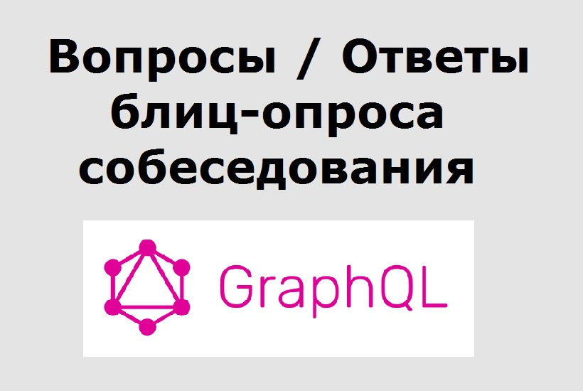

# GraphQL Интервью Вопросы и ответы



## 1. Что такое GraphQL
GraphQL - это язык запросов. Он используется для API и включает среду выполнения для выполнения этих запросов.

---

## 2. Какая компания начала разработку GraphQL?
Facebook начал разработку GraphQL в 2012 году. Но он был открыт только в 2015 году.

---

## 3. Назовите несколько компаний, которые используют GraphQL
GraphQL используется во многих крупных организациях, таких как Github, Facebook, Pinterest, Intuit, coursera, shopify, dailymotion, yelp и т. д.

---

## 4. Что такое язык запросов?
Проще говоря, язык запросов использует запросы для извлечения данных из базы данных. GraphQL - это язык запросов, и он использует запросы для API.

---

## 5. Как вы думаете, GraphQL - это технология баз данных?
GraphQL не является технологией баз данных. GraphQL - это язык запросов, используемый для API, это не язык запросов для баз данных. GraphQL можно использовать с любой базой данных или даже без базы данных.

---

## 6. Какой будет тип ответа на запрос GraphQL?
Запросы GraphQL возвращают ответ JSON. Ответ основан на запросе, который мы используем в запросе.

---

## 7. Назовите несколько языков, которые можно использовать для реализации сервера GraphQL.
Сервер GraphQL может быть реализован на многих языках, включая JavaScript, Python, Java, PHP, Haskell, Ruby, C #, Scala, Go, Elixir, Erlang, R и Clojure.

---

## 8. Как GraphQL помогает в процессе загрузки данных?
GraphQL может предоставить минимальный объем данных, который требуется клиенту. Даже если объектная модель содержит много полей, клиент может запросить только обязательные поля. 

---

## 9. Как GraphQL помогает в зонах с низким уровнем сети?
Клиент может запросить только необходимые данные в GraphQL. Это делает размер полезной нагрузки меньше, чем любой другой сетевой запрос. В областях с низким уровнем сети сетевые запросы с небольшой полезной нагрузкой могут выполняться быстрее.

---

## 10. Что такое перегрузка?
Перегрузка означает получение дополнительных данных для запроса API. Перегрузка увеличивает размер полезной нагрузки.

---

## 11. Что такое недостаточная загрузка - ` Underfetching`?
` Underfetching` - Недостаточная загрузка означает недостаточное получение данных. Недостаточная загрузка требует нескольких вызовов API для получения полных данных.

---

## 12. Как GraphQL решает проблемы с поиском и перебором?
С GraphQL мы можем изменить наш запрос, чтобы получать только необходимые значения. Запросы GraphQL могут извлекать все данные за один запрос.

---

## 13. Назовите три преимущества использования GraphQL над REST
a) GraphQL использует только одну конечную точку, но REST имеет несколько конечных точек.

б) REST требует нескольких запросов для извлечения сложного набора данных, но в GraphQL мы можем легко выполнять сложные запросы.

c) Мы можем изменить формат данных запроса в GraphQL, но мы не можем сделать это в REST.

---

## 14. Дайте три отличия GraphQL и REST
a) GraphQL является языком запросов, но REST не является

б) REST использует разные маршруты для разных запросов, но у GraphQL нет маршрутов.

c) GraphQL использует запрос, мутацию и подписку (`query`, `mutation` и `subscription`), но REST использует `GET`, `PUT`, `POST`, `DELETE` и `PATCH`.

---

## 15. GraphQL можно использовать только с React.js. Это правда? Если нет, то почему?
Нет, это неправда. GraphQL и React.js были изначально разработаны Facebook, но GraphQL можно использовать со многими другими языками программирования.

---

## 16. GraphQL можно использовать только с SQL. Это правда?
Это не верно. GraphQL - это язык запросов для API. Мы можем использовать любую базу данных, какую захотим.

---

## 17. Что такое полная форма SDL?
SDL обозначает язык определения схемы.

---

## 18. Какая польза от SDL?
SDL или язык определения схемы используется для написания схем. Это язык, который мы используем для написания схем GraphQL.

---

## 19. Поддерживает ли GraphQL автономное использование?
GraphQL предназначен только для работы в сети. Немногие библиотеки могут предоставить кеш, но какое-либо правильное автономное решение пока не разработано.

---

## 20. Что такое GraphiQL?
GraphiQL - это встроенная в браузер среда разработки для изучения GraphQL. Мы можем протестировать запрос и мутацию GraphQL в браузере, используя [GraphiQL.] (Http://graphiql.It). Он также поддерживает подсвечивание ошибок в реальном времени.

---

## 21. Поддерживает ли GraphQL серверное кэширование?
Нет, GraphQL не поддерживает кэширование на стороне сервера.

---

## 22. Какие операции поддерживает GraphQL?
GraphQL поддерживает запросы, мутации и подписку (`query`, `mutation` и `subscription`). Запросы используются для операции чтения, мутация - для операции записи, а подписка используется для прослушивания любых изменений.

---

## 23. Что такое запрос - `Query`?
Запрос - `Query` используется для чтения данных. Подобно `GET`-запросу API REST, мы можем получать данные с сервера GraphQL с помощью запроса.

---

## 24. Что такое мутация - `mutation`?
Мутация - `mutation` используется для операции записи. Мутация используется для таких операций, как добавление, удаление и редактирование данных (add, delete и edit data).

---

## 25. Что такое подписка - `subscription`?
Подписка - `subscription` используется для прослушивания любых изменений данных. Сервер будет уведомлять клиента о любых изменениях данных, если клиент подписан на это событие.

---

## 26. Можем ли мы использовать запросы для изменения данных?
Мы можем использовать запросы для изменения данных на стороне сервера. Но по соглашению предлагается использовать мутацию для любой операции записи.

---

## 27. Что такое поля - `Fields`?
Поля - `Fields` являются ‘ключами объекта, который мы используем в запросе GraphQL. Например :

```
{
student{
name
age
}
}
```
В этом запросе «`name`» и «`age`» являются полями.

---

## 28. Что такое аргументы - `arguments`?
С помощью запроса или мутации GraphQL мы можем передать один аргумент для запроса конкретных данных на его основе. Например :

```
{
student(id: "100"){
name
age
}
}
```
Здесь мы передаем «`id`» в качестве аргумента. Он вернет «`name`» и «`age`» «`student`» с «`id`», равным «`100`».

---

## 29. Как вы можете использовать переменные - `variables` в запросе?
Вместо того, чтобы записывать аргументы в строке запроса, мы можем использовать переменные - `variables` и передавать любые аргументы в эти запросы напрямую. Например :

```
query studentQuery($id : Int)
{
student(id : $id){
name
}
}
```
В этом примере мы можем каждый раз передавать одну новую переменную.

---

## 30. Что такое переменные по умолчанию?
Мы можем добавить значение по умолчанию к переменной в запросе.

запрос `studentQuery ($ id: Int = 100)`

...

...

Мы можем вызвать запрос, не передавая переменную, если используется переменная по умолчанию.

---

## 