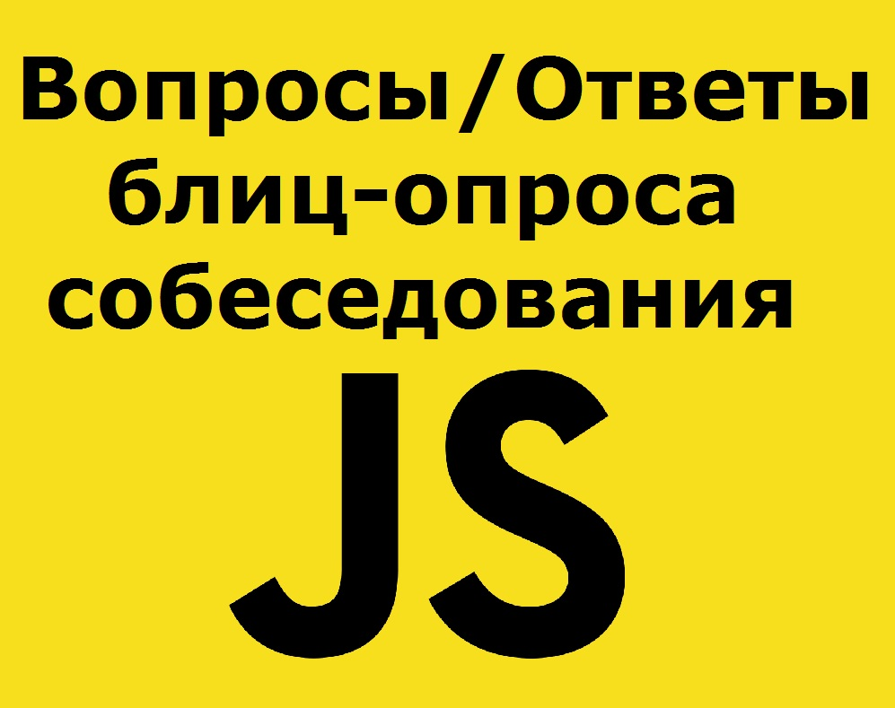

# Часто задаваемые вопросы на интервью по JavaScript | Часть 1



## 1. Что такое JavaScript (JS)?

- JavaScript - это легкий интерпретируемый язык программирования с объектно-ориентированными возможностями, который позволяет встроить интерактивность в статические HTML-страницы.

---

## 2. Каковы основные особенности JavaScript?

- JavaScript - это легкий интерпретируемый язык программирования.
- JavaScript предназначен для создания сетевых приложений.
- JavaScript дополняет и интегрируется с Java.
- JavaScript дополняет и интегрируется с HTML.
- JavaScript открыт и кроссплатформенен.

---

## 3. Каковы преимущества JavaScript?

- Меньше взаимодействия с сервером. Вы можете проверить ввод пользователя перед отправкой страницы на сервер.
- Немедленная обратная связь с посетителями. Им не нужно ждать перезагрузки страницы, чтобы узнать, забыли ли они что-то ввести.
- Повышенная интерактивность. Вы можете создавать интерфейсы, которые реагируют, когда пользователь наводит на них курсор мыши или активирует их с помощью клавиатуры.

---

## 4. Почему javascript называется Richer Interface - (более богатый интерфейс)?

- Вы можете использовать JavaScript, чтобы включать такие элементы, как компоненты перетаскивания и ползунки, чтобы предоставить богатый интерфейс посетителям вашего сайта.

---

## 5. Является ли JavaScript чувствительным к регистру?

- Да, JavaScript - это **регистрозависимый язык**. Это означает, что ключевые слова языка, переменные, имена функций и любые другие идентификаторы всегда должны вводиться с одинаковой заглавной буквой.

---

## 6. Как мы можем создать объект в JS?

Например так:

```js
let object = {
  name: "obj",
  age: 10,
};
```

пустой объект можно создать:

1. синтаксис "конструктор объекта"

```js
let object = new Object();
```

2. синтаксис "литерал объекта"

```js
let obj = {};
```

---

## 7. Как мы можем прочитать свойства объекта в js?

- Можем записать и прочитать свойства объекта, используя точку (`.`).
- Для свойств, имена которых состоят из нескольких слов, доступ к значению «через точку» не работает. Для этого нужно использовать квадратные скобки `[name prop]`

```js
obj["big user"] = true;
```

или так:

```js
let key = "big user";
obj[key] = true;
```

Квадратные скобки в литеральной нотации можно использовать для создания _ввычисляемого свойства_.

```js
let car = prompt("Which car to buy?", "BMW");

let purchases = {
  [car]: 1, // имя свойства будет взято из переменной car
};

alert(purchases.BMW); // 1, если car="BMW"
```

Это точно тоже, как записать так:

```js
let car = prompt("Which car to buy?", "BMW");
let purchases = {};

// имя свойства будет взято из переменной car
purchases[car] = 1;
```

Первая фотрма записи более лаконична, понятна и предпочтительна!

---

## 8. Как создать массив в js и как читать элементы массива?

Мы можем определить пустые массивы с помощью литерала массива и конструктор следующим образом.

- `let x = [];`
- `let y = new Array;`

Можно объявить массив и так:

```js
let array = [1, "car", true, 55, NaN, { name: "Yaroslav" }];
```

Элемент массива можно получить указав в квадратных скобках его номер в массиве.

```js
console.log(array[1]); // car
```

Отсчет начинается с ноля!

Массив имеет свойство длины, которое полезно для итерации. Мы можем прочитать элементы массива следующим образом.

Самый старый цикл `for`

```js
for (var i = 0; i < x.length; i++)
```

Другой вариант цикла - `for..of`
Без доступа к ключам, но это бывает не так и важно.

```js
let cars = ["Mersedes", "Jaguar", "BMW", "Volvo"];
for (let car of cars) {
  console.log(car);
}
```

Так как массив является объектом, то можно и циклом `for..in`
Самый плохой подход использовать этот метод. Он затратный, медленный и переберет все что похоже на массив (псевдомасивы браузера и пр.)

```js
let cars = ["Mersedes", "Jaguar", "BMW", "Volvo"];
for (let key in cars) {
  console.log(cars[key]);
}
```

## 9. Сколько типов функций поддерживает JS?

- Функция в JavaScript может быть как именованной, так и анонимной. Может быть создана конструктором только в глобальной области видимости. Каждая функция JavaScript на самом деле является объектом функции.

```js
const sum = new Function("a", "b", "return a + b");
```

---

## 10. Как определить анонимную функцию?

- Анонимная функция может быть определена так же, как и обычная функция, но у нее не будет никакого имени.

---

## 11. Какой встроенный метод вызывает функцию для каждого элемента в массиве?

- Метод `forEach` вызывает функцию для каждого элемента в массиве.

```js
const array1 = ["a", "b", "c"];

array1.forEach((element) => console.log(element));
```

---

## 12. Какой тип переменной объявленной глобально или локально имеет приоритет над другими, если их имена совпадают?

- Локальная переменная имеет приоритет над глобальной переменной с тем же именем.

---

## 13. Разница между «`var`» и «`let`» ключевыми словами?

- `var` был в JS с самого начала, а `let` был представлен в ES2015 / ES6.`let` имеет область действия блока ограниченного скобками `{}`, а `var` имеет область действия функции.

---

## 14. Разница между «`==`» и «`===`»?

- «`==`» сравнивает только значения «`===`» сравнивает и значения, и типы.

---

## 15. Разница между «`undefined`» и «`null`» ключевыми словами?

- Когда вы определяете переменную, но не присваиваете ей никакого значения. `typeof (undefine) => undefine`
- Null- изночально присвоенное пустое значение переменной. `typeof(null)=> object`

---

## 16. Что такое прототипное наследование?

- Каждый объект имеет свойство, называемое прототипом, в которое мы можем добавлять методы, и когда вы создаете другой объект из него, то вновь созданный объект автоматически наследует свойство своего родителя.

---

## 17. Какой встроенный метод сортирует элементы массива?

- Метод сортировки - `sort()` сортирует элементы массива.

---

## 18. Какой встроенный метод меняет порядок элементов массива?

- Меняет порядок элементов массива - `reverse()`метод. Первый элемент становится последним, а последний становится первым элементом массива.

---

## 19. Что такое `SetTimeout()`?

- Когда вы устанавливаете время задержки выполнения функции, то она становится асинхронной, и ей приходится ждать в стеке, чтобы завершить выполнение.

---

## 20. Как добавить один новый элемент в конце массива в JavaScript?

- Метод `push()` добавляет один или несколько элементов в конец массива и возвращает новую длину массива.

---

## 21. Что такое замыкание и как вы его используете?

- Когда функция возвращает другую функцию, возвращающая функция сохраняет свою среду, и это называется замыканием.

Самый простой пример - счетчик:

```js
function makeCounter() {
  let count = 0;
  return function () {
    return count++;
  };
}

let counter1 = makeCounter();
let counter2 = makeCounter();

alert(counter1()); // 0
alert(counter1()); // 1
```

Внутренняя функция изменяет переменную во внешней функции, доступ к которой извне получить нельзя (сбросить счетчик извне).

---

## 22. Что выведит на страницу приведенный ниже код?

```html
<script>
  document.write({});
</script>
```

- `[object Object]`

---

## 23. Как вы можете перевести элемент в нижнем регистре в верхний регистр?

- Метод `toUpperCase()` возвращает значение вызывающей строки, преобразованное в верхний регистр.

---

## 24. Почему вызов `а()` проходит успешно, а вызов `b()` выдает ошибку?

```javascript
a(); //OK
b(); //error

var b = function () {
  alert("function b");
};

function a() {
  alert("function a");
}
```

- Функция `а()` инициализируется на этапе загрузки скрипта, она как бы "вслывает вверх", а функция `b()` инициализируется когда объявляется переменная `b`

---

## 25. Вывести алертом сообщение через три секунды после загрузки скрипта

- Два варианта:

```javascript
//---<<< 1 >>>
setTimeout(alert("Message", 3000));
// ---<<< 2 >>>
setTimeout(function () {
  alert("Message");
}, 3000);
```

---

---

# Часто задаваемые вопросы на интервью по JavaScript | Часть 2

## 26. Каковы все циклические структуры в JavaScript?

- Цикл `while`: Цикл `while` - это оператор потока управления, который позволяет повторно выполнять код в зависимости от заданного логического условия. Цикл `while` можно рассматривать как повторяющийся оператор if.

- цикл `for`: цикл `for` обеспечивает краткий способ записи структуры цикла. В отличие от цикла `while`, оператор `for` предоставляет инициализацию, условие и приращение / уменьшение в одной строке, обеспечивая тем самым более короткую и простую в отладке структуру цикла.

- `do while`: цикл `do-while` похож на цикл `while` с той лишь разницей, что он проверяет условие **после** выполнения операторов и, следовательно, является примером цикла управления выходом - Exit Control Loop.

- Метка (`label`) : Метка представляет собой оператор с индентификатором, который позволяет вам ссылаться на какое-то место в вашей программе. Например, вы можете использовать метку, чтобы обозначить цикл, а затем использовать операторы `break` или `continue`, чтобы указать, должна ли программа прерывать цикл или продолжать его выполнение.
  Синтаксис метки следующий:

```js
метка: оператор;

// =====
markLoop: while (theMark == true) {
  doSomething();
}
```

- `break` : Используйте оператор break, чтобы прерывать цикл, переключать управление или в сочетании с оператором метка.

Когда вы используете `break` без метки, он прерывает циклы `while`, `do-while` и `for` или сразу переключает управление к следующему выражению.
Когда вы используете `break` с меткой, он прерывает специально отмеченное выражение.
Синтаксис оператора может быть таким:

1. break;

Пример:

```js
for (i = 0; i < a.length; i++) {
  if (a[i] == theValue) {
    break;
  }
}
```

2. break Метка;
   Пример:

```js
var x = 0;
var z = 0;
labelCancelLoops: while (true) {
  console.log("Внешний цикл: " + x);
  x += 1;
  z = 1;
  while (true) {
    console.log("Внутренний цикл: " + z);
    z += 1;
    if (z === 10 && x === 10) {
      break labelCancelLoops;
    } else if (z === 10) {
      break;
    }
  }
}
```

- `continue` Оператор `continue` используется, чтобы шагнуть на шаг вперёд в циклах `while`, `do-while`, `for` или перейти к метке.

  Когда вы используете `continue` без метки, он прерывает текущую итерацию циклов `while`, `do-while` и `for` и продолжает выполнение цикла со следующей итерации. В отличие от `break`, `continue` не прерывает выполнение цикла полностью. В цикле `while` он прыгает к условию. А в `for` увеличивает шаг.
  Когда вы используете `continue` с меткой, он применяется к циклу с этой меткой.
  Синтаксис `continue` может выглядеть так:

1. continue;

```js
var i = 0;
var n = 0;
while (i < 5) {
  i++;
  if (i == 3) {
    continue;
  }
  n += i;
}
```

2. continue Метка;

```js
checkiandj: while (i < 4) {
  console.log(i);
  i += 1;
  checkj: while (j > 4) {
    console.log(j);
    j -= 1;
    if (j % 2 != 0) {
      continue checkj;
    }
    console.log(j + " чётное.");
  }
  console.log("i = " + i);
  console.log("j = " + j);
}
```

- `for...in` .Оператор `for...in` проходит по всем перечислимым свойствам объекта. JavaScript выполнит указанные выражения для каждого отдельного свойства. Цикл `for...in` выглядит так:

Пример:

```js
let arr = ["AUDI A8", "2019", "brown"];
arr.cost = "$100.000";

for (key in arr) {
  console.log(`${key} = ${arr[key]}`);
}

// 0 = AUDI A8
// 1 = 2019
// 2 = brown
// cost = $100.000
```

- `for...of` Оператор `for...of` создаёт цикл, проходящий по перечислимым объектам (включая `Array`, `Map`, `Set`, объект `arguments` и так далее), вызывая на каждой итерации функцию с выражениями, которые надо выполнить для получения значения каждого отдельного свойства.

Пример:

```js
let arr = [3, 5, 7];
arr.foo = "hello";

for (let i in arr) {
  console.log(i); // выводит "0", "1", "2", "foo"
}

for (let i of arr) {
  console.log(i); // выводит "3", "5", "7"
}
```

---

## 27. Как изменить стиль / класс элемента?

Изменить стиль / класс элемента можно двумя способами.

- `document.getElementById("myText").style.fontSize = "16px;`

- `document.getElementById("myText").className = "class";`

---

## 28. Объясните, как читать и писать файл с помощью JavaScript?

- Функции [readFile()](https://ru.code-maven.com/reading-a-file-with-nodejs) используются для операции чтения.

```js
readFile(Path, Options, Callback);
```

Развернутое объяснение:

### Чтение файла с Node.js - блокирующее и неблокирующее

Node предоставляет библиотеку `fs` для работы с файловой системой. К примеру, для чтения файлов.

#### Асинхронное чтение файла (неблокирующее)

"Нормальный" способ чтения файлов в Node.js это чтение асинхронным способом. Это значит, что вы вызываете команду чтения файла и передаете callback, который будет вызван при завершении чтения. Это позволяет работать с несколькими запросами чтения параллельно.

Для этого мы можем использовать метод [readFile](https://nodejs.org/api/fs.html#fs_fs_readfile_path_options_callback) из класса `fs`.

Пример:

```js
var fs = require("fs");

fs.readFile("DATA", "utf8", function (err, contents) {
  console.log(contents);
});

console.log("after calling readFile");
```

Для начала мы загружаем класс `fs` с помощью команды `require`. Затем вызываем метод `readFile`, который получает 3 параметра: имя файла ('DATA' в нашем случае), кодировку файла ('utf8' в примере) и функцию. Эта функция будет вызывана, когда завершится операция чтения файла. Функция получит два параметра. Первый - информация о каких-либо ошибках, второй - содержимое файла.

Как только программа будет запущена, Node начнет читать файл в фоновом режиме, но продолжит выполнение. Таким образом, сначала будет выполнен вызов `console.log('after calling readFile');`, который выведет этот текст в консоль. Затем, когда содержимое файла будет загружено в память, Node вызовет функцию, которую мы передали в метод `readFile`, и она выведет в консоль содержимое файла.

#### Синхронное чтение файла (блокирующее)

Люди, пришедшие из других языков программирования (из большинства), считают синхронное чтение файлов более очевидным. Я не знаю в какой ситуации вы захотите использовать синхронные операции в Node.js, но я вижу, что много асинхронных функций имеют синхронный вариант, наверное, этим кто-то пользуется.

Для чтения файлов вы можете использовать метод [readFileSync](https://nodejs.org/api/fs.html#fs_fs_readfilesync_path_options) из класса `fs`:

```js
var fs = require("fs");

var contents = fs.readFileSync("DATA", "utf8");
console.log(contents);
```

- Функции `writeFile()` используются для операции записи.

```js
writeFile(Path, Data, Callback);
```

Подробно:
Для записи файла в синхронном варианте используется функция `fs.writeFileSync()`, которая в качестве параметра принимает путь к файлу и записываемые данные:

```js
fs.writeFileSync("hello.txt", "Текст для записи в файл");
```

Также для записи файла можно использовать асинхронную функцию `fs.writeFile()`, которая принимает те же параметры:

```js
fs.writeFile("hello.txt", "Текст для записи в файл");
```

В качестве вспомогательного параметра в функцию может передаваться функция обратного вызова, которая выполняется после завершения записи:

```js
const fs = require("fs");

fs.writeFile("hello.txt", "Hello мир!", function (error) {
  if (error) throw error; // если возникла ошибка
  console.log("Асинхронная запись файла завершена. Содержимое файла:");
  let data = fs.readFileSync("hello.txt", "utf8");
  console.log(data); // выводим считанные данные
});
```

Следует отметить, что эти методы полностью перезаписывают файл. Если надо дозаписать файл, то применяются методы `fs.appendFile()/fs.appendFileSync()`:

```js
const fs = require("fs");

fs.appendFileSync("hello.txt", "Текст для записи в файл");

fs.appendFile("hello.txt", "Привет МИР!", function (error) {
  if (error) throw error; // если возникла ошибка

  console.log("Запись файла завершена. Содержимое файла:");
  let data = fs.readFileSync("hello.txt", "utf8");
  console.log(data); // выводим считанные данные
});
```

---

## 29. Что называется типизацией переменных в JavaScript?

- Возможность хранения в одной переменной разных типов данных.

```js
Geeks = 42;
Geeks = "GeeksforGeeks";
```

---

## 30. Как преобразовать строку любого формата в целое число в JavaScript?

- В JavaScript функция [parseInt()](https://developer.mozilla.org/ru/docs/Web/JavaScript/Reference/Global_Objects/parseInt) используется для преобразования строки в целое число. Эта функция возвращает целое число base, которое указано во втором аргументе функции `parseInt()`. Функция `parseInt()` возвращает `NaN` (не число), если строка не содержит число.

```js
console.log(parseInt("6", 10)); // 6
```

```js
console.log(parseInt("es6", 10)); //NaN
```

---

## 31. Объясните, как обнаружить операционную систему на клиентском компьютере?

- Чтобы обнаружить операционную систему на клиентском компьютере, можно просто использовать свойство `navigator.appVersion` или `navigator.userAgent`. Свойство `Navigator.appVersion` является свойством только для чтения и возвращает строку, представляющую информацию о версии браузера.

---

## 32. Какие типы всплывающих окон доступны в JavaScript?

- Существует три типа всплывающих окон, доступных в JavaScript.

1. Alert
2. Confirm
3. Prompt

---

## 33. В чем разница между окном предупреждения - `alert` и окном подтверждения - `confirmation`?

- В окне предупреждения - `alert` будет отображаться только одна кнопка, которая является кнопкой ОК. Он используется для информирования пользователя о соглашении, которое необходимо согласовать. Но в окне подтверждения - `confirmation` отображаются две кнопки «ОК» и «Отмена», где пользователь может принять решение, соглашаться или нет.

---

## 34. В чем недостаток использования `innerHTML` в JavaScript?

- Использование `innerHTML` в JavaScript имеет много недостатков, поскольку контент будет заменять везде. Если вы используете `+= like “innerHTML = innerHTML + ‘html'”`, все равно старый контент заменяется HTML. Он сохраняет обработчики событий, прикрепленные к любым элементам DOM.

---

## 35. Какая польза от `void(0)`?

- [Void(0)](https://developer.mozilla.org/ru/docs/Web/JavaScript/Reference/Operators/void) используется для вызова другого метода без обновления страницы во время передачи параметра времени «ноль».

> Этот оператор позволяет вставлять выражения, которые производят дополнительные действия, в места, где ожидается undefined.

> Оператор void часто используется для получения примитивного значения undefined, используя "void(0)" (что эквивалентно "void 0"). В подобных случаях можно просто использовать глобальную переменную undefined (предполагая, что её значение по умолчанию не было изменено).

Когда браузер переходит по `javascript: URI`, он вычисляет код в URI и заменяет содержание страницы возвращенным значением, если оно не равно `undefined`. Можно воспользоваться оператором `void` для возврата `undefined`. Например:

```html
<a href="javascript:void(0);">
  Click here to do nothing
</a>

<a href="javascript:void(document.body.style.backgroundColor='green');">
  Click here for green background
</a>
```

Однако заметим, что не рекомендуется использовать псевдо-протокол `javascript:`. Лучше прибегнуть к другим альтернативам, таким, как обработчики событий.

---

## 36. Что такое JavaScript Cookies?

- Файлы cookie - это небольшие файлы, которые хранятся на компьютере пользователя. Они используются для хранения скромного объема данных, специфичных для конкретного клиента и веб-сайта, и могут быть доступны как веб-сервером, так и клиентским компьютером. Когда были изобретены файлы cookie, это были небольшие документы, содержащие информацию о вас и ваших предпочтениях. Например, когда вы выбираете язык, на котором вы хотите просматривать свой веб-сайт, веб-сайт будет сохранять информацию в документе, называемом cookie, на вашем компьютере, и в следующий раз, когда вы посетите веб-сайт, он сможет прочитать cookie сохраненные ранее.

---

## 37. Как создать cookie с помощью JavaScript?

- Чтобы создать cookie с помощью JavaScript, вам просто нужно присвоить строковое значение объекту `document.cookie`.

```js
document.cookie = "key1 = value1; key2 = value2; expires = date";
```

---

## 38. Как читать куки с помощью JavaScript?

- Значение `document.cookie` используется для создания файла `cookie`. Всякий раз, когда вы хотите получить доступ к cookie, вы можете использовать строку. Строка `document.cookie` содержит список пар **имя = значение**, разделенных точками с запятой, где **имя** - это имя файла cookie, а **значение** - его строковое значение.

---

## 39. Как удалить куки с помощью JavaScript?

- Удалить cookie гораздо проще, чем создать или прочитать cookie, вам просто нужно установить значение expires = «прошлое время» - `expires = “past time”` и убедиться, что определен правильный путь к cookie, только это не позволяет вам удалить cookie. :-)

---

## 40. Что такое escape-символы - `escape characters` и escape-функция - `escape() function`?

- Escape-символ `escape characters`: этот символ необходим, если вы хотите работать с некоторыми специальными символами, такими как одинарные и двойные кавычки, апострофы и амперсанды. Все специальные символы играют важную роль в JavaScript, чтобы проигнорировать это или напечатать этот специальный символ, вы можете использовать обратную косую черту escape-символа «`\`».

```javascript
// Need escape character
document.write("GeeksforGeeks: A Computer Science Portal "for Geeks" ")
document.write("GeeksforGeeks: A Computer Science Portal \"for Geeks\" ")
```

- Функция escape() - `escape() function`: функция escape () принимает строку в качестве параметра и кодирует ее, чтобы ее можно было передать на любой компьютер в любой сети, поддерживающей символы ASCII.

---

## 41. Имеет ли JavaScript область действия концептуального уровня - `concept level scope`?

- JavaScript не имеет области действия концептуального уровня, его объявленная переменная внутри любой функции имеет область действия внутри функции.

---

## 42. Как общие объекты могут быть созданы в JavaScript?

Для создания универсального объекта в JavaScript используйте:

```js
var I = new object();
```

---

## 43. Какие ключевые слова используются для обработки исключений?

- При выполнении кода JavaScript ошибки почти наверняка возникнут. Эти ошибки могут возникать из-за ошибки со стороны программиста из-за неправильного ввода или даже если есть проблемы с логикой программы. Но все ошибки могут быть решены с помощью приведенных ниже команд.

1. Оператор `try` позволяет вам протестировать блок кода на наличие ошибок.
2. Оператор `catch` позволяет вам обработать ошибку, если она есть.
3. Оператор `throw` позволяет вам сщздавать свои собственные ошибки.

---

## 44. Какая польза от `blur function`?

`blur function` используется для удаления фокуса с выбранного элемента. Этот метод запускает событие размытия - `blur event` или к нему можно прикрепить функцию, запускаемую при возникновении `blur event` - события размытия.

---

## 45. Что такое метод `unshift` в JavaScript?

Он используется для вставки элементов в начало массива. Это как метод `push`, но он вставляет элементы в начало массива.

---

## 46. В чем заключается разница между классовым и прототипным наследованием?

- **Классовое наследование**: экземпляры наследуются от классов, создаются подклассовые отношения (иерархическая систематизация классов). Экземпляры реализуются через конструктор функции, через дескриптор new. Экземпляр класса может не содержать дескриптор `class` начиная с ES6.

- **Прототипное наследование**: экземпляры наследуются напрямую от других объектов, реализуются через фабрики или `Object.create()` и экземпляры могут быть составлены из множества различных объектов для упрощения выборочного наследования. Прототипное наследование более простое и гибкое, нежели классовое.

---

## 47. Что такое двусторонняя связь данных и однонаправленный поток данных и в чем разница между ними?

- Двусторонняя связь данных подразумевает, что поля интерфейса связаны с моделью данных динамически, то есть при изменении полей интерфейса меняется модель, и наоборот.

- Однонаправленный поток данных означает, что только модель – источник истины. Изменения в интерфейсе запускают сообщения, которые сигнализируют пользователю о намерении модели (или "`store`" в терминах React). Смысл в том, что данные всегда идут в одном направлении, что облегчает понимание.

- Односторонние потоки данных детерминированы, тогда как двусторонняя привязка может вызывать нежелательные эффекты, которые труднее отследить и понять.

---

## 48. Каковы плюсы и минусы функционального и объектно-ориентированного программирования?

- Плюсы ООП: простая для понимания концепция объектов и методов вызова. ООП стремится использовать императивный стиль, нежели декларативный, который читается как прямой набор машинных инструкций.

- Минусы ООП: как правило, присутствует зависимость от общих состояний. Объекты и их поведение связаны одной сущностью, к которой случайно может быть получен доступ любым количеством функций в неопределенном порядке, что может привести к непредсказуемому поведению, например, состоянию гонки.

- Плюсы ФП: используется функциональная парадигма, позволяющая избежать общих состояний и нежелательных эффектов, исключаются ошибки, возможные из-за конкурирования функций. Благодаря таким фичам, как неявное программирование, функции, как правило, радикально упрощаются и легко перестраиваются для более легкого, по сравнению с ООП, повторного использования кода.

- Вычисления, использующие чистые функции легко масштабируются на несколько процессоров или распределенных вычислительных кластеров без опасения возникновения борьбы за ресурсы.

- Минусы ФП: чрезмерная эксплуатация функциональных подходов, вроде неявного программирования, может привести к снижению читабельности кода, так как конечный код получается более абстрактным, кратким и менее конкретным.

- Чаще люди больше знакомы с ООП и императивным подходом, так что некоторые общие идиомы функционального программирования могут вызывать трудности у новичков.

- Функциональное программирование имеет более крутую кривую обучения, нежели ООП, имеющего большую популярность и более понятного для изучения. Концепции ФП часто описываются идиомами и обозначениями из лямбда-исчислений, алгебры и теории категорий, требующих знаний основ в этих областях для понимания.

---

## 49. Когда классовое наследование – подходящий выбор?

- Вопрос с подвохом. Правильный ответ – никогда. Композиция – более простой и гибкий подход, чем наследование классов.

---

## 50 Что значит "композиция объектов лучше, чем наследование классов"?

- Это цитата из книги “Design Patterns: Elements of Reusable Object-Oriented Software”. Повторное использование кода должно достигаться за счет сборки малых единиц функциональности в новый объект, а не наследованием классов и созданием иерархий.

---

---
