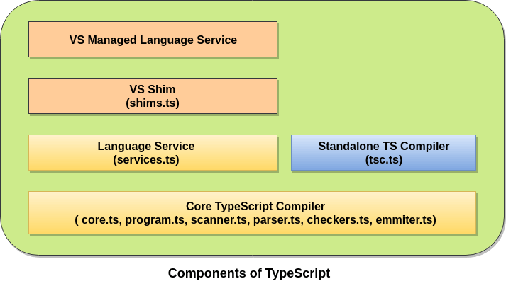
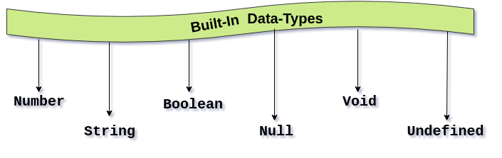

# Type Script Интервью Вопросы и ответы


## 1.Что такое Typescript?
TypeScript - это бесплатный язык программирования с открытым исходным кодом, разработанный и поддерживаемый Microsoft. Это строго типизированный расширенный набор JavaScript, который компилируется в простой JavaScript. Это язык для разработки приложений на уровне JavaScript. TypeScript довольно прост в освоении и использовании для разработчиков, знакомых с C#, Java и всеми строго типизированными языками.

TypeScript может быть выполнен в любом браузере, любом хосте и любой операционной системе. TypeScript не запускается напрямую в браузере. Для компиляции и генерации в файле JavaScript необходим компилятор. TypeScript - это версия JavaScript для ES6 с некоторыми дополнительными функциями.

---

## 2. Чем TypeScript отличается от JavaScript?
TypeScript отличается от JavaScript следующим образом:

| № | JavaScript | TypeScript |
|:--| :----------| :----------|
| 1 | Он был разработан Netscape в 1995 году. | Он был разработан Андерсом Хейлсбергом в 2012 году. |
| 2 | Исходный файл JavaScript имеет расширение "`.js`". | Исходный файл TypeScript имеет расширение "`.ts`". |
| 3 | JavaScript не поддерживает ES6. | TypeScript поддерживает ES6. |
| 4 | Он не поддерживает строго типизированную или статическую типизацию. | Он поддерживает функцию строго типизированной или статической типизации. |
| 5 | Это просто язык сценариев. | Он поддерживает концепцию объектно-ориентированного программирования, такую как классы, интерфейсы, наследование, обобщения и т. д. |
| 6 | В JavaScript нет опциональных параметров. | TypeScript имеет необязательную функцию параметров. |
| 7 | Это интерпретируемый язык, поэтому он выделил ошибки во время выполнения. | Он компилирует код и выделяет ошибки во время разработки. |
| 8 | JavaScript не поддерживает модули. | TypeScript предоставляет поддержку для модулей.|
| 9 | Здесь число, строка - это объекты. | В этом число, строка являются интерфейсом. |
| 10 | JavaScript не поддерживает дженерики (generics). | TypeScript поддерживает дженерики (generics). |

---

## 3. Зачем нам нужен TypeScript?
Нам нужен TypeScript:

* TypeScript - это быстрый, простой и, самое главное, легкий в освоении.
* TypeScript поддерживает функции объектно-ориентированного программирования, такие как классы, интерфейсы, наследование, обобщения и т. Д.
* TypeScript предоставляет функцию проверки ошибок во время компиляции. Он скомпилирует код и, если обнаружится какая-либо ошибка, выделит ошибки до запуска сценария.
* TypeScript поддерживает все библиотеки JavaScript, потому что это расширенный набор JavaScript.
* TypeScript поддерживает повторное использование с использованием наследования.
* TypeScript делает разработку приложений быстрой и легкой, насколько это возможно, а поддержка инструментов TypeScript дает нам автозаполнение, проверку типов и исходную документацию.
* TypeScript поддерживает новейшие функции JavaScript, включая ECMAScript 2015.
* TypeScript дает все преимущества ES6 плюс большую производительность.
* TypeScript поддерживает статическую типизацию, `Strongly type`, модули, необязательные параметры  `Optional Parameters` и т. д.

---

## 4. Перечислите некоторые особенности Typescript?
1. Объектно-ориентированный язык.

2. Поддержка JavaScript библиотек.

3. JavaScript - это TypeScript.

4. TypeScript - портативный.

5. Манипуляции с DOM.

6. TypeScript это просто JavaScript.

---

## 5. Перечислите некоторые преимущества использования Typescript?
TypeScript имеет следующие преимущества.

* Typescript обеспечивает преимущества дополнительной статической типизации. Он предоставляет типы, которые можно добавлять в переменные, функции, свойства и т. д.
* Typescript можно компилировать до версии JavaScript, которая работает во всех браузерах.
* TypeScript всегда выделяет ошибки во время компиляции во время разработки, тогда как JavaScript указывает на ошибки во время выполнения.
* TypeScript поддерживает строго типизированную или статическую типизацию, тогда как в JavaScript это не так.
* Typescript помогает в структурировании кода.
* Typescript использует объектно-ориентированное программирование на основе классов.
* Он обеспечивает отличную поддержку инструментов с IntelliSense, который предоставляет активные подсказки при добавлении кода.
* Он имеет концепцию пространства имен, определяя модуль.

---

## 6. Каковы недостатки TypeScript?
TypeScript имеет следующие недостатки:

* TypeScript занимает много времени для компиляции кода.
* TypeScript не поддерживает абстрактные классы.
* Если мы запустим приложение TypeScript в браузере, потребуется шаг компиляции, чтобы преобразовать TypeScript в JavaScript.
* Веб-разработчики используют JavaScript десятилетиями, а TypeScript ничего нового не приносит.
* Чтобы использовать любую стороннюю библиотеку, должен быть файл определения - `definition file`. И не все сторонние библиотеки имеют доступ к `definition file`.
* Качество типов `definition files` является проблемой, поскольку вы можете быть уверены, что определения (definition) верны?

---

## 7. Каковы различные компоненты TypeScript?
TypeScript состоит в основном из трех компонентов.

<p align="center">

<span> Компоненты TypeScript</span>
</p>

**Language**

Язык включает в себя такие элементы, как новый синтаксис, ключевые слова, аннотации типов и позволяет нам писать TypeScript.

**Compiler**

Компилятор TypeScript с открытым исходным кодом, кроссплатформенный, и написан на TypeScript. Он преобразует код, написанный на TypeScript, в эквивалентный коду JavaScript. Он выполняет разбор, проверку типа нашего кода TypeScript для кода JavaScript. Это также может помочь в объединении различных файлов в один выходной файл и в создании исходных карт.

**Language Service**

`Language Service` - Языковая служба предоставляет информацию, которая помогает редакторам и другим инструментам предоставлять лучшие вспомогательные функции, такие как автоматический рефакторинг и `IntelliSense`.

---

## 8. Кто разработал Typescript и какова текущая стабильная версия Typescript?
Typescript был разработан Андерсом Хейлсбергом (Anders Hejlsberg), который также является одним из основных членов команды разработчиков языка C#. Typescript был впервые выпущен 1 октября 2012 года и имел маркировку версии `0.8`. Он разработан и поддерживается Microsoft под лицензией Apache 2. Он был разработан для разработки большого приложения.

Текущая стабильная версия `TypeScript - 3.7.2`, выпущенная 6 ноября 2019. Typescript компилируется в простой код JavaScript, который работает в любом браузере, поддерживающем инфраструктуру ECMAScript 2015. Он предлагает поддержку новейших и развивающихся функций JavaScript.

---

## 9. Назовите минимальные требования для установки Typescript. Или как мы можем получить TypeScript и установить его?
TypeScript можно установить и управлять им с помощью node.js через npm (менеджер пакетов Node.js). Чтобы установить TypeScript, сначала убедитесь, что npm установлен правильно, а затем выполните следующую команду, которая устанавливает TypeScript глобально в систему.

```
$ npm install -g typescript  
```
Эта команда устанавливает код командной строки "tsc", который в дальнейшем будет использоваться для компиляции нашего кода Typescript. Убедитесь, что мы проверили версию Typescript, установленную в системе.

Для установки TypeScript выполняются следующие шаги:

* Загрузите и запустите `.msi installer` для Node.js.
* Введите команду "`node -v`", чтобы проверить, была ли установка успешной.
* Введите следующую команду в окне терминала для установки Typescript: `$ npm install -g typescript`

---

## 10. Перечислите встроенные типы в Typescript.
Встроенные типы данных также известны как примитивные типы данных в Typescript. Они приведены ниже.

<p align="center">

<span>Built-in types in Typescript</span>
</p>

**Number type**: используется для представления значений числового типа. Все числа в TypeScript сохраняются как значения с плавающей точкой.

Синтаксис: `let identifier: number = value;`

**String type**: представляет последовательность символов, хранящуюся в кодировке Unicode UTF-16. Мы включаем строковые литералы в наши скрипты, заключая их в одинарные или двойные кавычки.

Синтаксис: `let identifier: string = "";`

**Boolean type**: используется для представления логического значения. Когда мы используем Boolean type, мы получаем вывод только  `true` или `false`. Логическое значение - это значение истинности, которое указывает, является ли условие истинным или нет.

Синтаксис: `let identifier: bool = логическое значение`;

**Тип Null**: Null представляет переменную, значение которой не определено. Невозможно напрямую ссылаться на само значение нулевого типа. Пустой тип бесполезен, потому что мы можем присвоить ему только нулевое значение.

Синтаксис: `let num: number = null;`

**Undefined type**: это тип неопределенного литерала. Неопределенный тип обозначает все неинициализированные переменные. Это бесполезно, потому что мы можем назначить ему только неопределенное значение. Этот тип встроенного типа является подтипом всех типов.

Синтаксис: `let num: number = undefined;`

**Void type**: void - это тип возврата функций, которые не возвращают значения любого типа. Используется там, где тип данных недоступен.

Синтаксис: `let unsable: void = undefined;`

---

## 11.