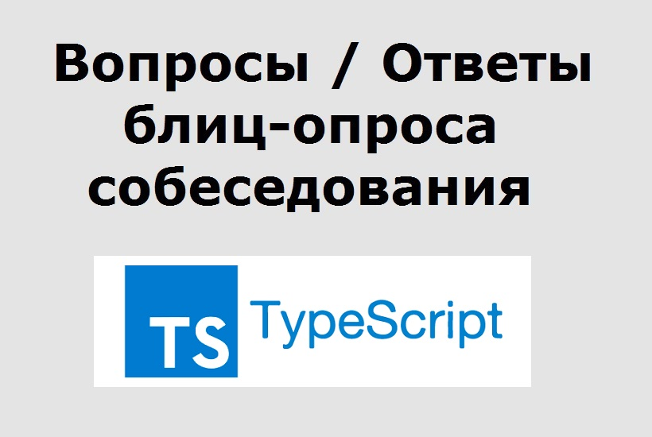

# Type Script Интервью Вопросы и ответы

## 1.Что такое Typescript?
TypeScript - это бесплатный язык программирования с открытым исходным кодом, разработанный и поддерживаемый Microsoft. Это строго типизированный расширенный набор JavaScript, который компилируется в простой JavaScript. Это язык для разработки приложений на уровне JavaScript. TypeScript довольно прост в освоении и использовании для разработчиков, знакомых с C#, Java и всеми строго типизированными языками.

TypeScript может быть выполнен в любом браузере, любом хосте и любой операционной системе. TypeScript не запускается напрямую в браузере. Для компиляции и генерации в файле JavaScript необходим компилятор. TypeScript - это версия JavaScript для ES6 с некоторыми дополнительными функциями.

---

## 2.